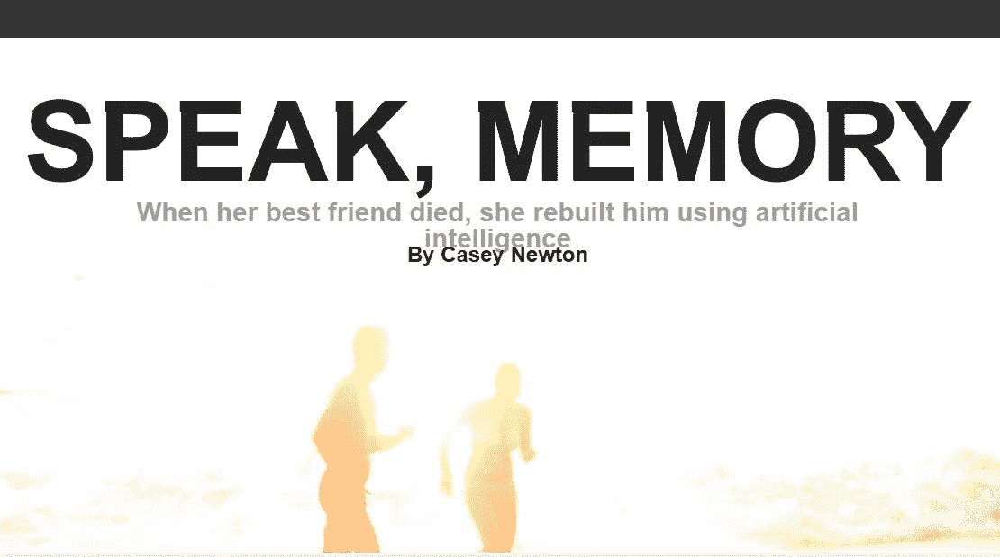
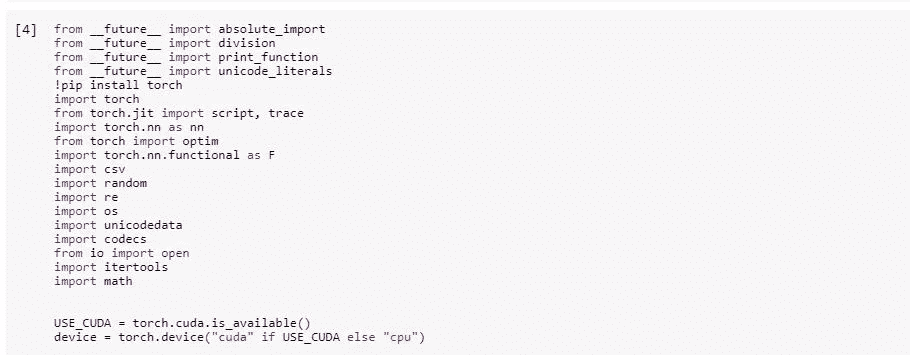
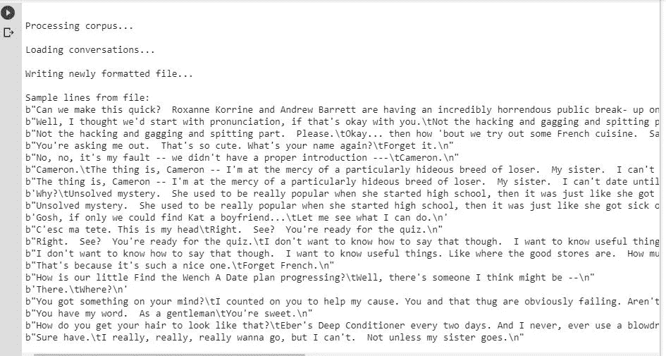
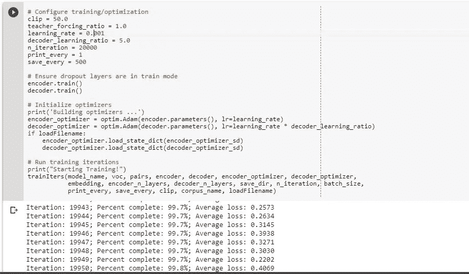
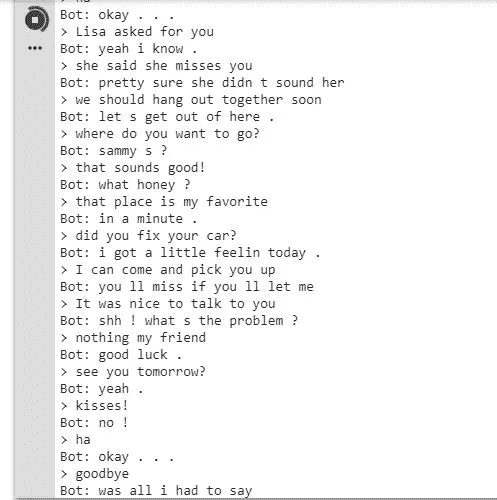
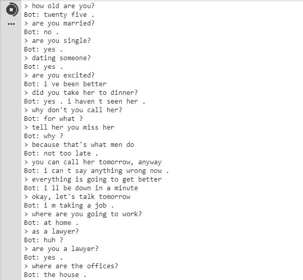

# 我们能给人工智能聊天机器人添加个性吗？

> 原文：<https://medium.datadriveninvestor.com/can-we-add-personality-to-an-artificial-intelligence-chatbot-2c5a98dbc822?source=collection_archive---------1----------------------->

从脸书和 Udacity 获得 Pytorch 奖学金是一个很好的机会来展示我学习新事物的热情。自从我开始这个挑战以来，我一直非常热衷于学习人工智能和深度学习。这是一个月来获得新技能，学习算法和我从未想象过要编码的东西。从训练一个神经网络来重新创建一个新的文本，从另一个文本学习，到通过风格转移，使用旧画的风格来创造艺术。

我可以说，我最喜欢的深度学习领域是计算机视觉，这是一种用于创建对象检测和图像识别应用程序的技术，它应用于自动驾驶汽车。但是另一个让我惊讶的领域，是自然语言处理，

自然语言处理，也称为 NLP，是计算机科学和人工智能的一个领域，涉及计算机和人类(自然)语言之间的相互作用，特别是如何给计算机编程以有效地处理大量自然语言数据

自然语言处理(NLP)关注的是技术如何有意义地解释人类语言输入并对其采取行动。NLP 允许亚马逊的 Alexa 等技术理解你在说什么以及如何对它做出反应。没有 NLP，需要语言输入的 AI 相对没用。

我是黑镜的超级粉丝，如果你喜欢人工智能和未来世界，你会爱上它的。这部科幻选集系列探索了一个扭曲的、高科技的未来，在那里人类最伟大的创新和最黑暗的本能发生碰撞。每次，我看一集，我可以看到故事并没有远离我们的现实。每一集都讲述了一个涉及科技以及人类如何应对科技的故事。我特别记得有一集叫《马上回来》。这一集讲述了一对年轻夫妇玛莎和阿什的故事，他们搬到了一个偏僻的小屋里；阿什第二天就被杀了；在他的葬礼上，玛莎的朋友莎拉告诉她一项新的服务，让人们与死者保持联系。

如果你看过完整的一集，你就能明白“新服务”只是一个模仿她已故伴侣个性的聊天机器人。这个应用程序是由 Ash 的聊天记录提供的，所以她实际上感觉是在和他聊天。这是一个令人毛骨悚然的插曲，我知道！

回到我的奖学金，我一直在阅读关于深度学习和递归神经网络的研究论文和文章，并发现有人已经建立了一个像这一集所示的应用程序。更恐怖了！

我说的是 Kuyda 打造的应用“Luka”。当她最好的朋友罗曼·马祖伦科去世后，她用人工智能重建了他。在他死后，她致力于开发一个她称之为“Replika”的机器人。她花时间收集他的旧短信，将那些感觉太私人的短信放在一边，并将其余的信息输入神经网络，这是由她的人工智能初创公司开发人员建立的。她开始构建“Luka”，其第一个产品是一个用于与机器人交互的 messenger 应用程序。但当她密友的朋友去世后，在阅读了他的旧短信后，她有了开发一种不同类型的机器人的想法:一种使用神经网络模仿个人说话模式的机器人。

模拟人脑学习能力的人工神经网络极大地改善了软件识别图像、音频、文本和其他数据形式的方式。改进的算法加上更强大的计算机增加了神经网络的深度，增加了它们可以处理的抽象层，其结果可以在当今一些最具创新性的产品中看到。亚马逊的 Alexa 或苹果的 Siri 背后的语音识别，或者为谷歌照片提供动力的图像识别，都将它们的能力归功于这种所谓的深度学习。

最近，Kuyda 一直在指导 Luka 开发“Replika”，这是一本日记和一个个人助理的混合体，它会问关于你的问题，并最终学会模仿你的短信风格。Kuyda 设想这可以发展成为一个数字化身，执行各种各样的工作。最终，这个机器人会像你一样，创造出一个活生生的你的见证。很有趣，不是吗？

您可以在 GooglePlay 或 AppStore 上获得 Replika:

 [## 雷普利卡

### 无论你感到不知所措、焦虑，还是需要找人倾诉，Replika 都可以帮助你。获得您自己的…

replika.ai](https://replika.ai/) 

我创建了一个帐户来检查这个应用程序！令人难以置信的是，他们是如何给这个聊天机器人添加个性的。不是冷冰冰的谈话，表现出同理心。它实际上谈论你问它的一切，甚至更多！如果你喜欢人工智能，就去试试吧。

于是，看了黑镜那集，看了关于 Replika 的故事，我决定开发自己的人工智能聊天机器人！

首先，我阅读了关于序列对序列模型的研究论文，并寻找用 Pytorch 而不是 Tensorflow 开发的作品，因为这是我现在正在研究的框架，我很高兴看到 Pytorch 官方网站有资源开始开发自己的机器人，使用递归神经网络和康奈尔大学的康奈尔电影对话语料库数据集。

让我们来谈谈康奈尔数据集！语料库包含从原始电影剧本中提取的对话集。它包含了从 617 部电影中提取的超过 10，000 个电影角色之间的 200，000 次对话交流。

我的目标是创建一个聊天机器人，基于递归序列到序列模型，使用两个递归神经网络，一个充当**编码器**，它将可变长度的输入序列编码为固定长度的上下文向量，另一个充当**解码器**，它接受输入单词和上下文向量，并返回对序列中下一个单词的猜测和隐藏状态，以便在下一次迭代中使用。最后，使用来自**康乃尔电影对话语料库的电影脚本训练模型。**

我按照教程，改变了一些超参数，以获得更高的精度。调整了学习率、训练模型的迭代次数，并更改了 dropout 和 batch_size。

这是结果:

Some requirements to install

Cleaning the data.

Training the model!

我计划在一个数据集中工作，从我的社交媒体的旧对话中收集聊天记录，为应用程序添加一些个性。你可以在我的 GitHub 个人资料上看到这个项目！

 [## viritaro Mero/Chatbot-用 Pytorch 创建的序列对序列模型

### 用 Pytorch 和序列对序列模型创建的 AI 聊天机器人。使用两个 RNN 和康奈尔训练模型…

github.com](https://github.com/viritaromero/Chatbot-created-with-Pytorch-and-Sequence-To-Sequence-model) 

可以在 Pytorch 官网找到教程:

 [## 聊天机器人教程— PyTorch 教程 1.0.0.dev20181207 文档

### 对话模型是人工智能研究的一个热点。聊天机器人可以在各种…

pytorch.org](https://pytorch.org/tutorials/beginner/chatbot_tutorial.html) 

训练模型的数据集在这里:[https://www . cs . Cornell . edu/~ cristian/Cornell _ Movie-Dialogs _ corpus . html](https://www.cs.cornell.edu/~cristian/Cornell_Movie-Dialogs_Corpus.html)。