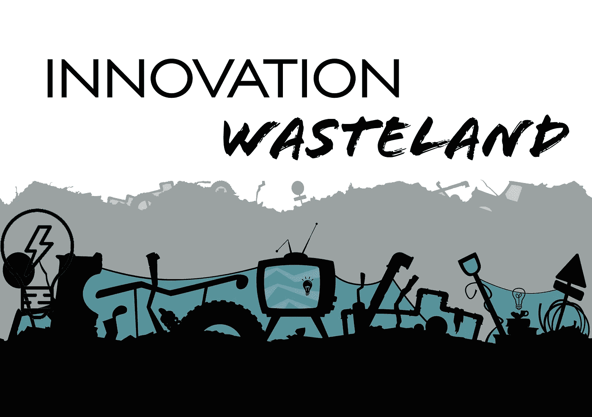

# 我们能通过获取和交易知识、洞察力和想法来解决创新荒地吗？

> 原文：<https://medium.datadriveninvestor.com/can-we-address-the-innovation-wasteland-by-capturing-trading-knowledge-insight-ideas-bac6938295a?source=collection_archive---------41----------------------->

> 我们生活在一个充满无限不可思议想法的世界里，这些想法受到一系列限制其潜力的结构和习得行为的约束。

*(随意分享智慧的金块)。*

很少有不可思议的想法会产生重大而有意义的影响(财务或社会)。**为什么？**犯错，技能和资源错配，更多时候是时机不对。

尽管世界各地在 buzztag #innovation 下花费了数十亿美元，但我们真正投资的是“创新荒地”——数十亿个不起作用的伟大想法失去的价值真空。

就个人而言，我是一个回收和再利用的女孩，渴望解决一些这种浪费。

**孵化器的局限&加速器**

我不相信这个问题可以通过参与孵化器或加速器来解决，因为我发现它们非常有限。

1.  他们的价值仅限于与所述孵化器/加速器相关的个人导师、顾问或投资者的能力。
2.  在这些孵化器或加速器期间所犯错误的“学习”的价值仅限于个人愿意分享它们——准确地说是*(错误不断重复，知识提取和回收很差)。*
3.  *无论他们有多少酷豆袋或乒乓球桌，孵化器和加速器往往受限于他们所容纳的物理“空间”，这排除了更多的想法或对话，因为个人受到时间、位置和身体能力的限制。*
4.  *他们受到资金来源的限制(因此他们不太倾向于诚实地说出资助或支持项目的组织的价值。*

***硬碰硬派***

*从个人经验来看，我认为我在商业上犯的错误是比我的商学学位更大的投资。我很自豪地说，我失败了，我被骗了，但所有的胜利和失败的最终结果是我比以前更有见识，我有更好的人际网络去了解 X 和 Y，以及不惜一切代价避开谁。非常有价值的东西，我很乐意分享，但是给谁呢？*

*一对一的指导，甚至是一对一的面对面交谈，都不能为我(或其他人)的时间提供我想要的投资回报。如果我把我所有非常有价值的智慧都留下来，并记录下来与他人分享，那会很好——但是对谁，在什么情况下呢？*

*我喜欢一个在线平台，在这里我可以传授知识，分享文章或者回答由#标签串起来的更广泛的社区的问题*

*我喜欢捕捉和分享一个社区的错误的价值，这种方式是免费的，可访问的，但也是有质量控制的。*

*知识有可能以一种不减损或分散我们日常生活的方式进行交流，而是丰富我们的日常生活吗？*

*我们可以用区块链吗？#爱区块链*

*它能被分散化，由大众资助和控制吗？*

*分散式知识库可能会产生什么样的社会影响？*

*为了探索这个想法，这个想法是由 Ritchie Campbell 在 Linkedin 上激发的，我在 Slack 上建立了一个 beta-test 概念，并邀请了 5 个我认识的在社会影响领域工作的人加入，并邀请一个朋友一起来。*

*我建立了一些基本的渠道，比如# funding # governance # reading list，里面有一些基本的发布规则(大多数人都忽略了，但我很酷……)，来测试这是否可能。*

*接受它是自由的，它是否会工作完全取决于早期“板上”的兴趣和参与程度[如果你想加入他们，给我发消息！]*

*今天我和我最喜欢的墨尔本人之一保罗·费尔柴尔德聊天，他建议用[道区块链](https://medium.com/@charliecaruso/how-blockchain-could-cure-cancer-e8afc0f173ef)可能会有用，我真的很想进一步探索这个想法【自我提醒，从现在开始记录与保罗的所有通话，以便将来分发】。*

*这是大约两个星期的懈怠，我已经可以认识到，UX 烂。*

*想象一下，如果集体组能够为知识库和成员指南“寻找”UX 解决方案，那该有多好？*

*例如，我喜欢投票支持有价值的想法。也许我收到的支持票的数量可能会添加到我的个人资料中，这样我就可以被认为是一个有意义的“影响者”。*

*Paul 建议我们每周(根据个人喜好更改)自动发送一封电子邮件，总结我们最感兴趣的#标签，以确保我们不会错过#知识金块。*

*如果在不久的将来，我们集体决定(通过投票)会员资格每年花费 100 美元，找到一个区块链黑客来收钱，集体花钱购买 Slack 的替代品，然后集体“思考”替代品，会怎么样？*

*多么惊人的发现！！*

*有人愿意试试吗？*