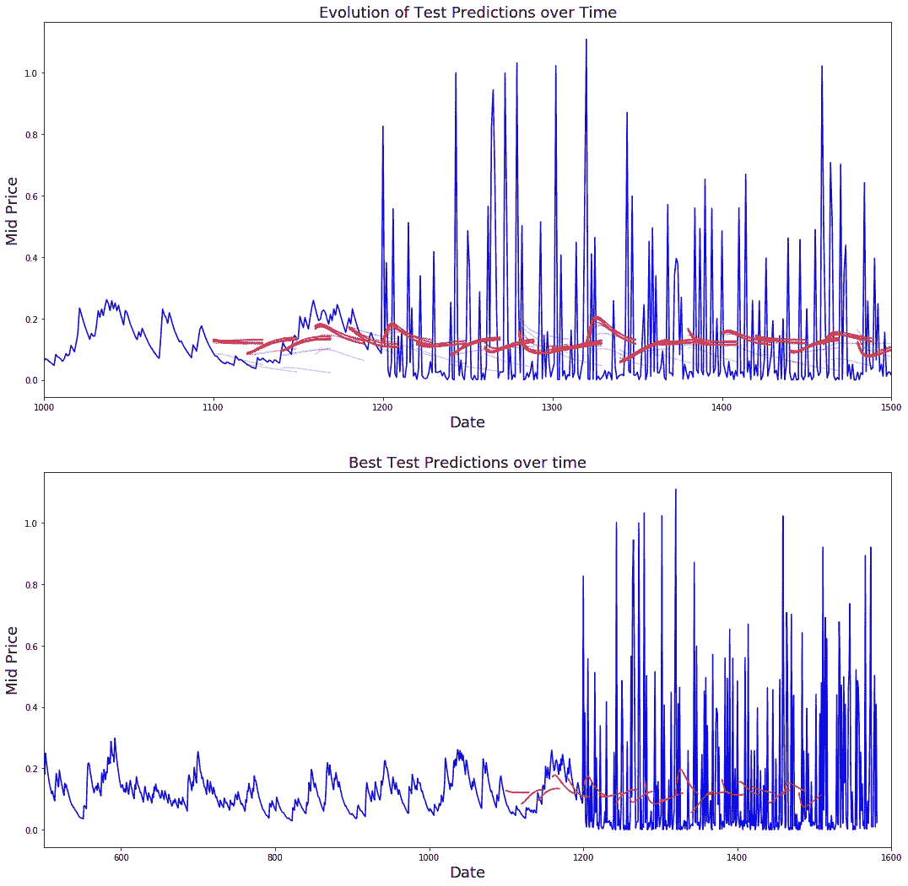

# 我们能预测加密货币吗？

> 原文：<https://medium.datadriveninvestor.com/can-we-forecast-cryptocurrencies-c360eeff09b0?source=collection_archive---------1----------------------->


对于任何在市场上交易的人(股票/密码/外汇等。)你知道，在决定是否投资某只股票或在这种情况下投资加密货币时，信息可以而且通常是王道。我不会展示所有代码(因为它在我的 GitHub 上)，但我认为在预测加密货币时，看看机器学习能为我们做什么是很重要的。在这个例子中，我将展示比特币(BTC)的情况，因为它是拥有最多可用数据的硬币。

这其中的第一个纠结就是数据。即使是股票也是高度不可预测和波动的。对于加密货币来说，情况甚至更糟，尤其是在比特币风靡全球的过去 3 年里。在这样一个动荡的空间，预测比特币的这种结果将是困难的。我们还必须考虑某些硬币已经发行的时间长度。以比特币为例，我们有大约 4 年的每日数据。

另一个考虑是加密货币仍然年轻。即使试图预测比特币的价格也很难，因为数据只能追溯到 2014 年(直到几年前，比特币的价格基本上处于停滞状态)。这就是为什么最好使用某种类型的学习网络或神经网络，如 LSTM(长短期记忆)来描述这些发现。

LSTM 是 RNN(递归神经网络)的单元。LSTM 网络的特别之处在于，它们擅长分类和处理时间序列数据，因为数据中可能存在“滞后”或通常未知的事件(尤其是比特币)。对数据长度的完全不敏感是 LSTM 网络优于 RNN 网络的主要优势。像谷歌这样的公司用 LSTM 的网络进行谷歌翻译，苹果公司也用这种网络在 iPhone 上实现“Quicktype”功能。我们也不能忘记 LSTM 弥补了今天的 Alexa。

# 获取数据

使用 Alphavision API 获取数据实际上是一个非常简单的过程。你将不得不获得你自己的 API 密匙(它是免费的)，但是在你获得数据之后，最好把文件保存在本地以备将来使用，就像我们下面对熊猫所做的那样。

```
 data_source = ‘alphavantage’
# For future data IF statement for API 
if data_source == ‘alphavantage’:

 api_key = config.api_key

 symbol = ‘BTC’
 market = ‘USD’

 url_string = “[https://www.alphavantage.co/query?function=DIGITAL_CURRENCY_DAILY&symbol=%s&market=USD&apikey=%s](https://www.alphavantage.co/query?function=DIGITAL_CURRENCY_DAILY&symbol=%s&market=USD&apikey=%s)"%(symbol,api_key)

 file_to_save = ‘currency_daily_BTC-%s.csv’%symbol
 #If file for csv does not exist it will turn it into pandas dataframe and save
 if not os.path.exists(file_to_save):
 with urllib.request.urlopen(url_string) as url:
 data = json.loads(url.read().decode())
 #extract data
 data = data[‘Time Series (Digital Currency Daily)’]
 df = pd.DataFrame(columns = [‘Date’, ‘Open’, ‘High’, ‘Low’, ‘Close’, ‘Volume’, ‘Market Cap(USD)’])
 for k,v in data.items():
 date = dt.datetime.strptime(k, ‘%Y-%m-%d’)
 data_row = [date.date(), float(v[‘1a. open (USD)’]), float(v[‘2a. high (USD)’]),
 float(v[‘3a. low (USD)’]), float(v[‘4a. close (USD)’]), float(v[‘5\. volume’]), float(v[‘6\. market cap (USD)’])]
 df.loc[-1,:] = data_row
 df.index = df.index + 1
 print(‘Data saved to : %s’%file_to_save)
 df.to_csv(file_to_save)

 #if data is already there load it from CSV
 else:
 print(‘File already exists. Loading data from CSV’)
 df = pd.read_csv(file_to_save)
#df = panda dataframe for local use
df = pd.read_csv(‘currency_daily_BTC-BTC.csv’) 
df = df.sort_values(‘Date’)
```

在从比特币中抓取所有每日高点和低点后，数据集减少到约 1500 行数据。当我开始这个项目的时候，这是我第一个关心的问题，因为没有太多的数据。如果我们在预测中加入市值和交易量，可能会有更准确的预测，但我们必须找到数据高点和低点之间的相关性，然后希望它能给我们一个更好的预测。

尽管如此，我们仍然对我们的数据进行特征化、规模化和标准化，以帮助我们进行预测。

```
#Setting high/low and mid prices for data
high_prices = df.loc[:,'High'].as_matrix()
low_prices = df.loc[:,'Low'].as_matrix()
mid_prices = (high_prices+low_prices)/2.0
#split 
from sklearn.model_selection import train_test_split
train_data, test_data = train_test_split(mid_prices, test_size=0.2)##Now we Scale the data to be between 0 and 1 
scaler = MinMaxScaler()
train_data = train_data.reshape(-1,1)
test_data = test_data.reshape(-1,1)#Train the scaler with training data and smooth data
smooth_window_size = 300
for di in range(0, 1200, smooth_window_size):
    scaler.fit(train_data[di:di+smooth_window_size,:])
    train_data[di:di+smooth_window_size,:] = scaler.transform(train_data[di:di+smooth_window_size,:])

#Normalize the last of the remaining data
scaler.fit(train_data[di+smooth_window_size:,:])
train_data[di+smooth_window_size:,:] = scaler.transform(train_data[di+smooth_window_size:,:])#Reshape train and test data to the shape of data size
train_data = train_data.reshape(-1)
test_data = scaler.transform(test_data).reshape(-1)
```

# 实施 LSTM

我发现使用 LSTM 的最好最快的方法是使用 tensorflow 的 RNN API，它实现了 LSTM 模块。一旦你设置了你的连续测试点，通过训练数据运行一个循环，验证每一个预测，然后你所要做的就是更新那个预测并可视化它。

```
#points to start test predictions from
seq_test_points = np.arange(1100, 1500, 20).tolist()for ep in range(epochs):
    # ==========================Training==========================

    for step in range(train_seq_value//batch_size):

        u_data, u_labels = data_gen.unroll_batches()

        feed_dict = {}
        for ui,(dat,lbl) in enumerate(zip(u_data, u_labels)):
            feed_dict[train_inputs[ui]] = dat.reshape(-1,1)
            feed_dict[train_outputs[ui]] = lbl.reshape(-1,1)

        feed_dict.update({tf_learning_rate: 0.0001, tf_min_learning_rate: 0.00001})
        one = 1
        _, one = session.run(([optimizer, loss]), feed_dict=feed_dict)

        average_loss += 1

#===============================VALIDATION========================================

    if (ep + 1) % valid_summary == 0:

        average_loss = average_loss/(valid_summary*(train_seq_value//batch_size))

        if (ep+1)%valid_summary == 0:
            print('Average loss at step %d: %f' % (ep + 1, average_loss))

        train_mse_ot.append(average_loss)

        average_loss = 0 #reset

        seq_predictions = []

        test_mse_loss_seq = []

        #====================== Updating State and Making Predictions ===========================

        for w_ix in seq_test_points:
            mse_test_loss = 0.0
            predictions = []

            if (ep + 1)-valid_summary==0:
                #calculate x_axis values in first valid epoch
                x_axis = []

            #Feed past values of stock prices to make predictions from there
            for re_i in range(w_ix-num_unrolling+1,w_ix-1):
                now_price = all_mid_data[re_i]
                feed_dict[sample_inputs] = np.array(now_price).reshape(1,1)
                _ = session.run(sample_prediction, feed_dict = feed_dict)

            feed_dict = {}

            now_price = all_mid_data[w_ix]

            feed_dict[sample_inputs] = np.array(now_price).reshape(1,1)

            #Making predictions for x steps each one uses previous as it's input

            for pred_ix in range(n_predict_once):

                pred = session.run(sample_prediction, feed_dict=feed_dict)

                predictions.append(np.asscalar(pred))

                feed_dict[sample_inputs] = np.asarray(pred).reshape(-1,1)

                if (ep+1) - valid_summary == 0:
                    #only calculate x_axis values in first epoch validation
                    x_axis.append(w_ix+pred_ix)

                mse_test_loss += 0.5*(pred-all_mid_data[w_ix+pred_ix])**2

            session.run(sample_state_reset)

            seq_predictions.append(np.array(predictions))

            mse_test_loss /= n_predict_once
            test_mse_loss_seq.append(mse_test_loss)

            if (ep + 1) - valid_summary == 0:
                x_axis_seq.append(x_axis)

        current_mse_test = np.mean(test_mse_loss_seq)

        #logic for learning rate decay 

        if len(test_mse_ot) > 0 and current_mse_test > min(test_mse_ot):
            loss_nondecrease_count += 1
        else:
            loss_nondecrease_count = 0

        if loss_nondecrease_count > loss_nondecrease_threshold :
            session.run(inc_glstep)
            loss_nondecrease_count = 0
            print('\t Decreasing learning rate by 0.5')

        test_mse_ot.append(current_mse_test)
        print('\tTest MSE %.5f'% np.mean(test_mse_loss_seq))
        predictions_over_time.append(seq_predictions)
        print('\t Finished Prediction')
```

虽然这不是我的全部代码，但它可以在我的 Github 上获得[。最后，在绘制了进化和最佳测试预测之后，我们得到了一个好看的图表！](https://github.com/officialbrenner/CryptoForcast)



LSTM network vs Bitcoin

# 结论

> "预测是一门艺术，它先说会发生什么，然后解释为什么没有发生！"——**匿名**

通过图表来看最终产品，我们可以看到 LSTM 网络在很大程度上捕捉到了时间的起伏。我们可以做更多的事情来让这看起来更好，但正如你所见，网络忽略了比特币创下历史新高的数据中的巨大峰值。

我期待着继续致力于这个项目，并使它更加准确。随着时间的推移，这可能是一个活的应用程序，这是我在这个 Lambda 项目周之后努力的方向。