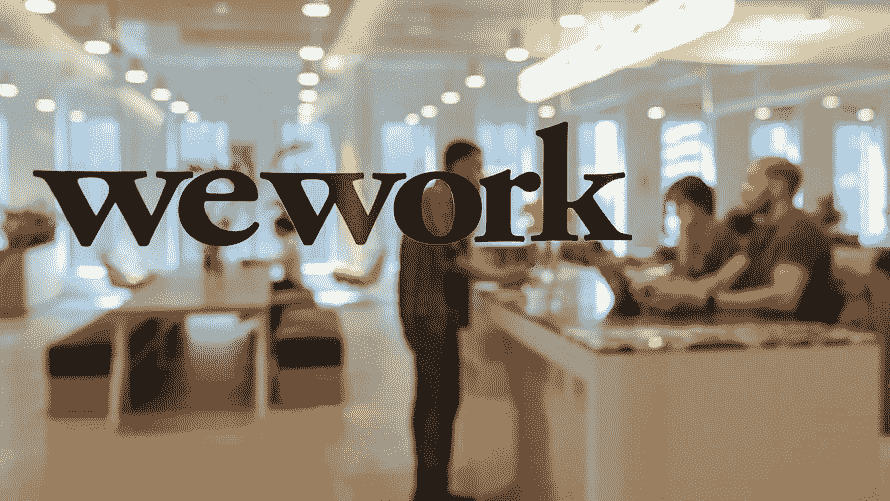
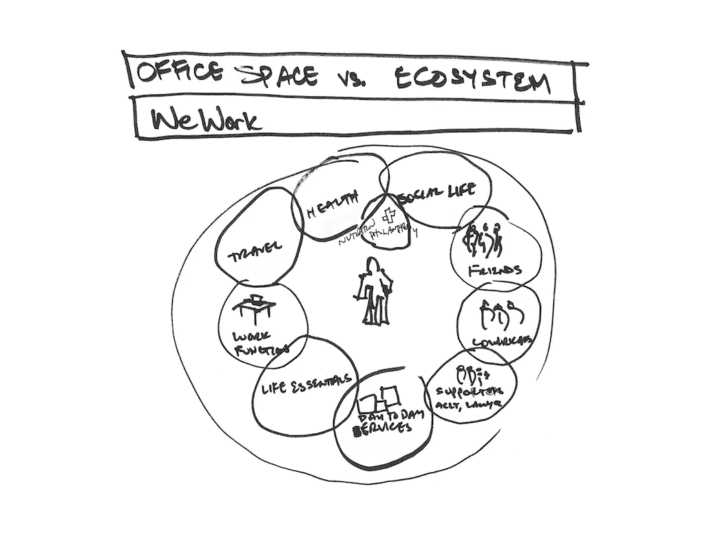

# 我们可以……..工作？

> 原文：<https://medium.datadriveninvestor.com/can-we-work-748dfbcb8e65?source=collection_archive---------12----------------------->

## 软银对“是”加倍下注

WeWork offices in Manhattan

WeWork 的创始人亚当·诺伊曼将以 17 亿美元现金、信用额度和“咨询费”从他联合创立的公司中收购。软银宣布，除了计划投资的[15 亿美元](https://www.cnn.com/2019/10/22/tech/softbank-wework-adam-neumann/index.html)之外，还将向 We 公司投资[50 亿美元](https://www.cnn.com/2019/10/22/tech/softbank-wework-adam-neumann/index.html)。此外，软银还提出从现有投资者和股东手中购买价值高达 30 亿美元的股票。事情还没有结束，软银已经向 WeWork 投资了大约 90 亿美元。总而言之，软银将向一家估值约为 80 亿美元的公司投资约 200 亿美元，但仍只拥有该公司 80%的股份。这场赌注最终会有回报吗？

股票市场的直接反应并不是积极的信号。在提议宣布的第二天，软银的股价下跌了 2.5%，第二天又下跌了 2.8%。然而，软银毫不留情。它已经宣布了裁员 4000 人的计划。它还计划优先考虑三个市场(美国、欧洲和日本),而不是中国、印度和拉丁美洲。除此之外，公司还决定专注于主营业务[,而不是试图拓展业务并收购其他公司。](https://news.crunchbase.com/news/weworks-layoffs-come-into-sharper-focus/)

 [## 动荡迫使暴风雨中的平静|数据驱动的投资者

### 自然界中很少有东西是直线行进的，尤其是经济。当投资者和消费者希望平静时…

www.datadriveninvestor.com](https://www.datadriveninvestor.com/2019/03/25/volatility-compels-calm-amid-the-storm/) 

这些是过去几天公开的变化。然而，我们公司的未来似乎很不确定。我们应该从以下两个方面着手扭转局面:

[https://www.wework.com/newsroom/posts/wecompany](https://www.wework.com/newsroom/posts/wecompany)

1.  定义公司:在亚当·纽曼的领导下，We 公司将自己定义为一个为人民服务的“社区”。他是这样介绍公司的:“WeWork 的使命是创造一个世界，让人们工作是为了生活，而不仅仅是谋生。“这导致了 WeWork Labs(孵化器)、WeLive(生活空间)、WeGrow(学校)和 Rise by We(健身房)的产生。现在，随着公司烧钱，它必须重新定义公司的目的是什么。它必须专注于成为一家办公空间公司，并扩大其提供的服务，而不是创造新的空间(如学校和健身房)，这些空间吸收投资，是资本密集型的，并遵循不同的商业模式。
2.  了解竞争对手:在目前的情况下，WeWork 有一个巨大的公关(公共关系)问题。在英国，WeWork 的租赁承诺约为[472 亿美元](https://www.ft.com/content/83decf7a-c04d-11e9-b350-db00d509634e)。如果 WeWork 违约，它可以简单地申请破产，因为它已经建立了子公司，以在这种情况下合法地保护自己。这将影响其签署未来租约的前景。它必须做的一件事是研究它的两个主要竞争对手。首先，IWG(前雷格斯)是一家盈利的办公空间公司，价值 35 亿 T4。第二，Knotel 是另一家价值 13 亿美元的办公空间公司。这些实力相当的竞争对手拥有与 WeWork 不同的商业模式。IWG 做特许经营，而 Knotel 只和公司客户打交道。

办公空间的想法，显然有相当多的需求。一家能够提供技术和集成(自动化)办公助手的公司可以蓬勃发展。WeWork 的错误是由理想主义和过于自信的前首席执行官亚当·诺伊曼造成的。它试图扩展自己，创造和收购新的业务，以便围绕“我们”的概念为客户创造生活。为了成功和实现盈利，我们公司必须集中资源，在现有的商业模式内进行创新。明年将会看到投资翻倍的软银是否有机会赚回钱。如果不是，我们会听到更多关于 IWG 和 Knotel 这样的公司。