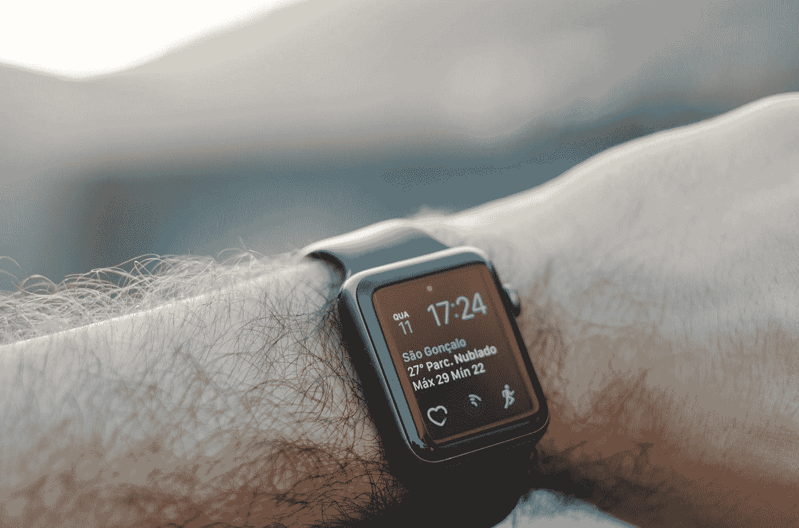

# 可穿戴设备能给零售员工带来推动优质客户服务的必要资源吗？

> 原文：<https://medium.datadriveninvestor.com/can-wearables-give-retail-staff-the-wherewithal-to-drive-superior-customer-service-38487f64bb76?source=collection_archive---------26----------------------->

“person wearing black smartwatch with black band” by [Alexander Ruiz](https://unsplash.com/@rivailruiz?utm_source=medium&utm_medium=referral) on [Unsplash](https://unsplash.com?utm_source=medium&utm_medium=referral)

说到底，零售商有两个关键资源来推动收入和经营一个成功的企业:他们采购或已经为他们制造的产品，以及组成他们的劳动力的人。

产品创新是一个持续的过程，因为组织希望跟上趋势，改变消费者习惯，并在拥挤的市场中脱颖而出，但只是在最近，业内人士才不得不改变他们的工作方式。

在电子商务扮演着越来越重要角色的零售世界，随着娱乐、休闲和购物之间的界限不断模糊，商店员工需要提供的不仅仅是货架补货和进行交易。他们越来越多地在那里提供服务——这可以通过从个人购物和产品推荐到技术知识的各种方式表现出来——在某些情况下，他们必须娱乐并成为品牌大使。

消费者的期望值很高。他们去商店通常是为了寻找灵感和信息，如果他们是来买东西的，上帝会帮助那些不能满足需求的零售商。

简而言之，当你考虑这种环境时，零售助理的角色对于确保正面的品牌声誉和帮助顾客实现他们第一次决定去商店时的目标至关重要。正如 RSR 研究公司的 Brian Kilcourse 最近所说的那样，今天市场上的零售赢家并不像 Amazon Go 倡导者宣传的那样，将商店视为类似于自动售货机的东西，“而是一个一部分是购物，一部分是娱乐，一部分是社交的地方”。

**授权零售员工按要求工作**

客户希望员工有知识、灵活并了解他们的需求，因此员工需要参与其中并获得工具来更好地完成工作。

关键绩效指标(KPI)在大多数业务环境中都很重要，但就其本身而言，它们只是仪表板或报告上的一个数字。秘诀是确保关键绩效指标是有意义的、合理的和可实现的。根据前 Waitrose 董事总经理马克·普莱斯新成立的 Engaging Works organisation 的研究，这在目前存在快乐和激励水平问题的零售业尤其如此。

员工的 KPI 通常是销售目标，有时是转换率。当目标与薪酬一致时，这个循环就完成了，这意味着如果他们实现了目标，店员的口袋里会有更多的钱。

对于一名员工来说，要了解他们的个人目标是什么，他们需要更好地了解更广泛的公司战略，以及他们的工作如何影响他们所在的整体商店或部门。当所有这些都岌岌可危时，员工实现目标的进度清晰是至关重要的——在零售业，有许多新方法可以确保这一点。

**数据科学和可穿戴技术**

使用现代、动态的预测方法，结合明确的交叉销售建议(可以基于一天中的时间、天气或日历事件),将创造出更高效的销售环境。这种使用数据科学的开放性可以帮助零售商更好地吸引员工，从而取得更好的结果。

随着消费市场对可穿戴设备的需求增长，随着三星 Gear 和 Galaxy、AppleWatch、Fitbit 以及 Garmin 等其他制造商受到欢迎，为什么不在零售环境中使用这种技术来帮助充分利用数据科学呢？

通过使用这种可穿戴技术，零售员工可以动态、轻松地监控目标进展，并访问他们认为可以帮助他们实现目标的公司信息。这种与商业智能的联系是使 KPI 变得有形的关键。

随着英国越来越多的人将健身设备用作社区工具，与同龄人比较自行车、跑步和步行的表现，并努力做得更好，这表明预测、KPI 和可穿戴设备对商店产生类似影响的背景是正确的。

谁赢了？我怎样才能超车？我还要走多远才能拿到奖金？如果这种游戏化让销售助理的工作变得更有趣，那么生产率和零售成功水平也很有可能会提高。

查看更多:【www.inovretail.com 