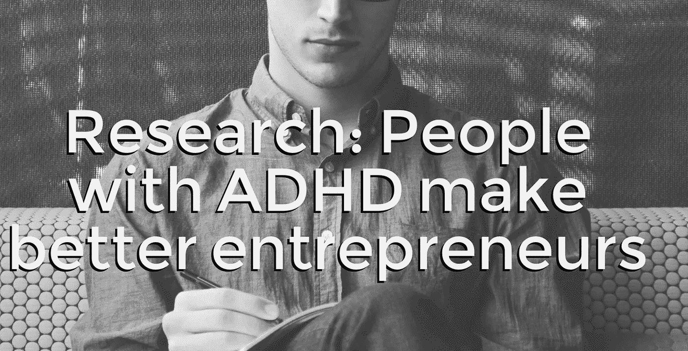

# 一个人能学会成为企业家吗？

> 原文：<https://medium.datadriveninvestor.com/can-you-learn-to-be-an-entrepreneur-6256c36797d2?source=collection_archive---------11----------------------->

Entrepreneurship — a combination of innate abilities and experience?

这是我每天都会被问到的问题，而不是来自任何特定的人群。

在我多年的商业顾问、教练、培训师和演讲者生涯中，我可以告诉你一个简单的答案——在我看来，是两者的结合。

但是答案实际上比这个要复杂一点。你看，当大多数人谈论成为企业家时，他们指的是大多数企业家拥有的内在品质，如冒险精神、优秀的沟通者、领导者、激励者、激励能力、快速思考的能力以及对看似冲动但实际上是凭直觉做出决定的能力，就像一个拥有出色形势意识的猎人或团队中的最佳射手。

你看，伟大的企业家有伟大的直觉，天生才华横溢——即使没有受过正规教育。从我 20 多年来收集的数据来看，我发现天生的企业家不同于有抱负的企业家(他们的知识基础是教育)，因为这些人往往有更多的实践经验、动力、激情、能干的态度、信心、战略思维、自我激励，能够当场思考，非常有目标导向，并且非常顽强。这些人可以在多次失败后爬起来，继续前进，直到成功。当进展顺利时，他们已经在计划下一个项目了。他们就像猎人——总是在寻找新的猎物或新的交易。

我可以教导、培训、指导和训练某人成为企业家，我甚至可以做同样的事情来改善一个人的创业心态和技能——但是天生的企业家的软技能被大大提升，并且与那些需要接受教育的人不同。天生的企业家经常通过试错、通过实践和体验，甚至通过在过程中失败并从中吸取教训来学习。这是一种“撞墙球”的方法，有点无所畏惧，但同时在计算风险方面非常迅速，并愿意在这个过程中失败，作为他们作为企业家的成长和职业发展的一部分。

成功企业家的一些技能是通过试验、错误和经验获得的。你还必须考虑其他几项关键技能，比如——拥有良好的人际交往或领导技能，这些都是后天培养的先天特质。如果你仔细观察成功的企业家，你会发现导致他们成功的因素是多种因素的结合，例如但不限于努力工作、运气/好时机，以及在某种程度上使这些人非常适合成为领导者、首席执行官、创始人和企业家的先天特质。他们的成功确实伴随着大量的努力、风险和大量的失败。事实上，我在女王大学 EMBA 项目上的一位教授曾经告诉全班，“如果你没有 80%的失败，那你还不够努力”。这是关于企业家精神的话题。

有很多研究表明，成功的企业家在成为成功企业家的过程中也积累了(随着时间的推移)许多不同的成就，如他们的教育、职业道德和个人性格特征，但你会注意到一些关键的发现，这些发现将真正成功的企业家与众不同。这些特质通常一次不止一个，并且因人而异，例如天生具有创新思维和对颠覆的偏好，在创业的头几年对公司的投入和专注，对业务的高度和持续热情，吸引和激励合适的人才为公司工作， 他们还具有灵活或敏捷的思维方式，能够利用/利用新技术等资产，他们还倾向于在学习过程中早期采用创新技术，并往往走在潮流的前面。 他们也往往是天生的、经过深思熟虑的冒险者，总是愿意灵活变通，倾听他人的意见，并且知道何时止损，不至于掉进兔子洞。

我发现非常有趣的是，绝大多数成功的企业家往往患有多动症(注意力缺陷或注意力缺陷多动障碍)。你看，多动症患者往往是天生的企业家，因为他们往往更喜欢领导而不是跟随，更重要的是，他们高度专注、精力过剩、敢于冒险、一心多用、创造性思维和跳出框框的能力是巨大的优势——几乎是超能力。因此，对于企业家来说，多动症似乎是一个优势，而不是一个问题，你甚至可以举出一些著名的例子，如 Sir。锡拉丘兹大学惠特曼管理学院的创业学教授理查德·布兰森、查尔斯·施瓦布、英格瓦·康普拉德、大卫·尼尔曼、保罗·奥法里和约翰·维克伦德博士认为，多动症患者成为成功的企业家“是因为他们的多动症”，根据他的研究，他们往往比其他人更容易“直觉地”被创业吸引。

ADD/ADHD individuals tend to be natural entrepreneurs

在 Wiklund 博士的研究中，他发现 ADHD 个体的两个关键特征特别有帮助，这就是多动和冲动。多动症有其积极的一面，因为它转化为高于平均水平的工作能力。这与高度专注于“个人喜欢的事情”的能力相结合，赋予了这位多动症企业家极高的生产力。另一个优势是冲动，在这种情况下，这意味着多动症患者倾向于更多地生活在现在，而不是未来，并经常通过快速做出“直觉”决定来利用机会——这是一个成功企业家所需的技能。这绝不意味着所有的多动症患者都应该成为企业家，但那些成为企业家的人，往往会自然而然地被企业家精神所吸引。

所以在一天结束的时候，一个人可以学会像企业家一样思考，但与能够将事情拼凑起来让事情发生相关的自然行为和软技能——这不是可以教会的——而是与生俱来的。出于这些原因以及更多的原因，我认为一个真正的企业家会学习并成为一个伟大的企业家，不管有人教育他们，因为他们会以自己的方式自己去做。因此，如果你希望成为一名企业家，并想知道你是否能成为一名伟大的企业家，那么想想成为一名企业家的想法，或者如果你是一名企业家，但缺乏开始像一名企业家那样行事的动力。

我告诉你，如果你厌恶风险，很可能你不是天生的企业家，如果你没有充沛的精力和天生的动力，这也不太可能，但谁知道呢——也许所有“你”需要的只是一个好的教练或导师，为你提供成为企业家的指导，然后你就像教孩子骑自行车一样出发了。

我是 Avy-Loren，我为全球不同行业的公司提供战略业务咨询和执行顾问服务。我与初创公司和创始人一起工作，与上市公司的首席执行官一起工作，当我们一起克服障碍时，我帮助公司和高管带着尊重和自豪实现他们的个人和职业目标。在过去的 10 年里，我共同创立了三家公司，目前是一家科技公司的联合创始人和首席运营官/首席市场官，作为天使投资人投资了一些早期初创公司，担任了一家美国风险投资公司的顾问，并指导了数百名个人和初创公司。欲了解更多信息，请访问[www.avylorencohen.com](http://www.avylorencohen.com)

***我也鼓励你把这篇文章分享给你认为能从中受益的每一个人，因为它可能会对很多人非常有用。***

Please clap and share this article

请关注我:

推特[https://twitter.com/AvyLorenCohen](https://twitter.com/AvyLorenCohen)

https://www.facebook.com/AvyLorenCohen[脸书](https://www.facebook.com/AvyLorenCohen)

领英[https://www.linkedin.com/in/avyloren-cohen/](https://www.linkedin.com/in/avyloren-cohen/)