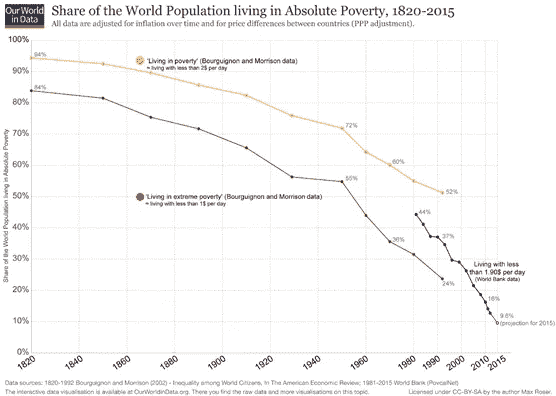
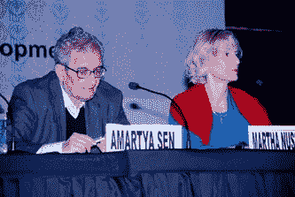
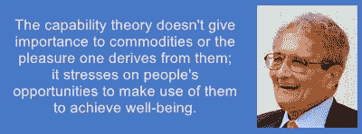
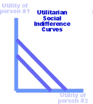
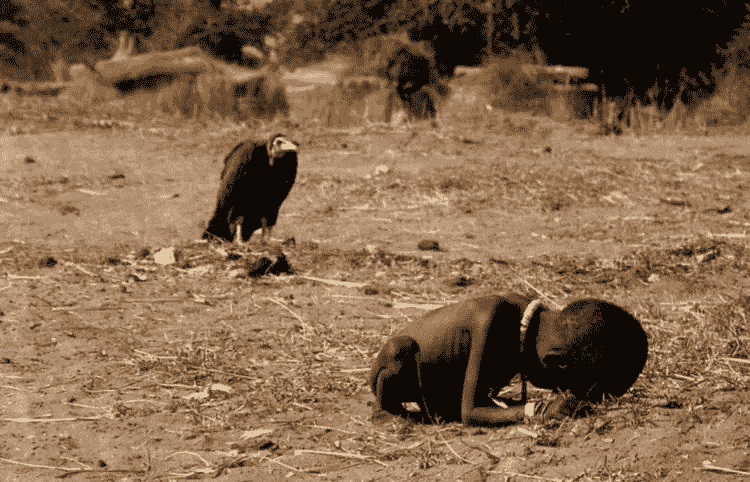

# 买不到我的爱:哪些经济政策让我的幸福出错了。

> 原文：<https://medium.datadriveninvestor.com/cant-buy-me-love-what-economic-policies-get-wrong-about-my-happiness-f1e252e2e9fe?source=collection_archive---------11----------------------->

值得注意的是，这里转载的文章是一个关于 Amartya Sen 的人类福祉能力方法的基础项目。在未来，我将更深入地探讨经济和社会公正的更微妙的方面，以及更深入地研究能力方法。

那么，关于幸福，经济政策有哪些错误呢？简单地说，他们完全无视它。正如库兹涅茨自己所说，现代社会的 GDP 和经济增长概念实际上并不指向社会发展，社会发展取决于幸福和选择自由的概念。

 [## 为什么包容性财富指数比 GDP 更能衡量社会进步？|数据驱动…

### 你不需要成为一个经济奇才或金融大师就能知道 GDP 的定义。即使你从未拿过 ECON 奖…

www.datadriveninvestor.com](https://www.datadriveninvestor.com/2019/03/08/why-inclusive-wealth-index-is-a-better-measure-of-societal-progress-than-gdp/) 

我希望展示为什么主流新古典主义政策方法是无意中不公正的，以及为什么边沁、沃斯通克拉夫特、孔多塞、米尔斯、娜斯鲍姆和森所主张的社会实现方法在解决不公正问题上要有用得多。

# 全球贫困和不平等问题

2012 年，联合国大会通过了一项关于他们希望的未来的决议，指出“消除全球贫困是当今世界面临的最大挑战”。

根据世界银行的数据，最近对全球贫困的估计是，世界上 8.6%的人，即 7.36 亿 T2 人生活在极端贫困中，每天的生活费不超过 1.90 美元。

在像印度和美国这样的国家，国民收入和 GDP 的大部分掌握在收入最高的 1%的个人手中。

这些事实和统计数据的目的不是造成痛苦或批评人类的成就。在我们开始这项研究之前，重要的是要认识到经济发展正处于前所未有的高度，在我们存在的几千年里，我们已经取得了令人难以置信的进步。

但我们必须认识到，我们的经济、政治和金融机构对贫困、不平等和发展的描述存在根本性错误。

# 最近关于不平等的辩论

The declining curve we observe in the graph above is not completely indicative of the nature of poverty.

法国经济学家托马斯·皮凯蒂在其著作《21 世纪的 T4 资本》中认为，收入不平等问题是人类面临的最大威胁之一。

但与表明全球贫困和收入不平等正在稳步下降的报告和经济文件相反，皮凯蒂认为，人力资本的基本性质意味着收入不平等将在未来危险地上升。

皮凯蒂认为，财产形式的资本、继承的财富和其他独立于收入的收益是不平等的主要原因之一。他说，如果没有大量的资本税，资本在全球收入中的份额可能会上升到惊人的 40%。

令人惊讶的是，在过去 25 年中，大多数经合组织国家以基尼系数表示的经济不平等一直在上升。

经济不平等研究中的一个分野是专门关注收入和财富不平等的研究和探索更广泛层面的不平等的研究。如果分析采用后一种方法，第二个区别是将多个维度纳入分析的方式。

一种方法是关注广泛的经济不平等对个人和整个社会的影响。经济学家约瑟夫·斯蒂格利茨(Joseph Stiglitz)认为，与极端不平等相关的垄断行为和富人对政治的掌控正在损害经济增长，而穷人则首当其冲。根据对 23 个富裕国家跨国数据的分析，威尔金森和皮克特认为，越是不平等的社会，健康和社会问题的发生率越高。

显而易见，迫切需要从健康、社会问题和各种其他措施的角度来评估贫困。考虑到人的身体、精神和生物能力在经济活动中的作用，我们在研究贫困和发展时必须考虑这些因素。

# 这项研究的目的

我们今天发现的贫困和不平等问题是，这些问题的解决方案是基于简单的“经济增长”和“GDP 增长”的衡量标准。贫困和不平等仅仅从缺乏经济资源的角度来衡量。

GDP 和基尼系数等用于衡量国民收入和收入不平等的概念存在根本性缺陷，原因有四:

1.他们认为人是经济活动的手段，而不是经济活动的目的。

2.它们没有充分反映收入的分配，并假设每个人都以同样的方式使用同样数量的资源。

3.他们认为一个国家的自然资源是无限的。

4.他们没有考虑到不同的人需要不同的收入，这取决于他们的社会经济背景。

5.最重要的是，GDP 和基尼系数等概念将收入和经济增长视为衡量福祉的唯一相关指标。

使用经济理论的能力方法，我们将确定为什么在得出任何解决方案之前，福祉和繁荣需要考虑上述 5 点。我们需要能够以不同的方式量化增长和发展。

能力方法侧重于人的特征和能力，我们的目标是展示其与未来所有反贫困研究的统计和个体相关性。

在本研究中，我们将首先了解能力方法及其原理，以及它与新古典福利经济理论的对比。然后，我们将探讨各种衡量幸福的方法，并探讨教育的作用和能力理论的货币方法。我们将探索该理论的各种措施，并分析它是否真的是确保发展的最佳途径。

# 什么是能力理论？

在我们定义能力方法之前，描述当今开发的特征是非常重要的。发展的概念被传统的经济学家曲解为“经济发展”，而“经济发展”仅仅是指经济在 GDP 增长方面的扩张。

这基本上是一种以生产/消费为导向的模式——生产更多，消费更多。人们消费越多，就应该越“发达”。一切都是在商品和资源消费的背景下看待的；这是一种输入驱动的意识形态。

认识到经济福祉取决于各种非物质的东西，如我们的身体能力，以及我们的心理、情感和精神健康，这对我们来说极其重要。

此外，这种发展方法没有充分揭示贫困和不平等的真实性质，贫困和不平等也可以被描述为由于生活水平低而丧失同样的身体、心理和情感健康。

从本质上讲，能力理论试图改变“生活水平”的定义，并从根本上以人的方式理解经济发展。

能力方法是 20 世纪 80 年代作为对福利经济结构快速涌入的回应而构想的一种经济理论。它强调每个人的能力，即个人能够做什么，以便得出任何经济结论。

能力理论试图消除消费和满意度驱动的经济的一般概念，并强调个人的能力和基本自由，以客观地评估经济增长。

The theory was primarily developed by Amartya Sen, a prominent Indian economist, and Martha Nussbaum, a political philosopher, as a response to the flaws of mainstream developmental economics.

# 功能、能力和主体:能力方法的要素

森和娜斯鲍姆认为，所有人不仅仅是经济主体，而是社会主体，具有某些功能和能力，这决定了他们的福祉衡量。

1.功能:功能最简单的形式是指“存在和做”。它是指人类在日常生活中进行的身体、情感和精神活动。它专门处理个人实际做的事情，而不是他们有潜力做的事情。对功能的理解与对能力的理解有着内在的联系。

功能是该方法中所指的能力的主体:我们有能力、想要有能力、或者应该有能力成为和/或做什么。

总的来说，这些行为和存在——实现的功能——赋予生命价值。功能可能包括营养良好、有住所、能够工作、休息；或者有文化或者健康；作为社区或团体的一部分；被尊重，等等。

2.功能:功能是可供选择的功能组合，人们可以自由选择。基本上，能力是指人类做的或有自由/选择做的所有活动。

能力有两个基本要素:功能本身，以及完成其他活动的自由。

能力高度重视经济自由。能力方法认为，不同的人有能力做不同的事情，也就是说，他们有做事情的自由，而不是把所有的人都视为做同样的事情。

比如，让我们理解禁食和挨饿的区别。虽然挨饿是你没有食物吃，无法获得必要的营养的情况，但禁食是自愿的，你有自由决定要不要吃东西。换句话说，你有能力吃东西。

3.代理:代理是指一个人作为社会的一个功能性成员的能力，具有实现个人全部目标的愿望。代理人的目标不一定是他们自己的幸福。代理人获得他们的经济、社会和财务目标，只要他们不经历经济、社会、教育、种族、宗教或财务障碍。

The essence of capability theory, as postulated by Amartya Sen.

最初，森认为评估能力有五个组成部分:

1.真正的自由在评估一个人的优势时的重要性

2.将资源转化为有价值活动的能力的个体差异

3.导致幸福的活动的多变量性质

4.评估人类福利时物质和非物质因素的平衡

5.关注社会内部的机会分配

我们将在研究接近尾声时分析这些组成部分/目标是否已经实现。

# 娜斯鲍姆的核心能力清单与森的理论

娜斯鲍姆列出了所有人满足基本生活标准所必须具备的 10 项核心经济能力。它们是基于对人类尊严的考虑。

1.寿命:活到合理年龄的能力，预期寿命高于平均水平。

2.身体健康:过相对健康生活的能力，没有致命或威胁生命的健康问题/疾病。

3.身体完整性:不成为性侵犯和暴力等身体犯罪受害者的生活能力。

4.感觉、想象和思考:创造性地表达、思考和实践个人愿望的信念和意识形态的能力。

5.情绪:在做出经济和非经济决策时运用情绪和价值判断的能力。

6.实践理性:能够运用理性和逻辑来确定自己的行动路线。

7.从属关系:在一个社会中与其他个体共存的能力

8.其他物种:与这个星球上的其他物种共存的能力。

9.玩耍:享受娱乐活动的能力。

10.对环境的控制:通过财产、政治参与、土地和劳动力等对自己的经济和政治环境享有有效控制的能力。

然而，娜斯鲍姆的能力清单受到了一些经济学家的大量批评。

第一个批评是，娜斯鲍姆的能力提出了一个“简化的生活标准”，她的整个清单包括基本的原始必需品，而不是高级别的舒适和经济进步。换句话说，对最低限度体面生活的关注减少了，而不是整体发展。

森自己提出了一个不同的理论，他说不可能有一个能力列表归属于每一个人，因为每一个人都有一套不同的能力来实现他们的目标。例如，一个残疾人比一个健全人需要更多的经济资源和标准来实现同样的目标。

# 与新古典经济理论和福利经济学的对比

能力理论越来越远离新古典经济理论，因为它依赖于个人能力，而不是利用人来实现经济增长。

能力理论越来越行为化，并作为对微观经济消费者理论的回应，后者依赖消费和效用作为经济判断的基础。

即使在总需求的宏观经济理论中，对消费的强调也越来越不利于理解收入分配，从而导致大规模的不平等。

与新古典经济理论有三个核心对比。

# 基于原则的对比

福利经济学有两个基本定理。

第一个原则指出，竞争性市场会产生帕累托有效的结果。

这一原则重申了亚当·斯密在《道德情操论》中提出的“看不见的手”的概念。看不见的手指出，当人们按照自己的利益行事时，市场作为一个整体变得有竞争力，并有利于整体经济增长。

维尔弗雷多·帕累托提出的帕累托效率(Pareto-efficiency)认为，我们可以达到一种完美的资源配置状态，即配置效率最大化。

然而，这些观点与能力方法形成了鲜明的对比。虽然竞争市场的自由性质确实会增加利润并导致“经济增长”，但这种增长的具体性质是有问题的。

这种经济增长不是分配性的，即利润积累在少数人手中。此外，看不见的手的概念实际上并不涉及个人的能力。虽然某些社交社区和群体可能最适合并有能力获利，但许多社交社区没有能力这样做。这导致了国家和社区之间的贫困和不平等

帕累托有效的资源配置是一种乌托邦式的可能性。大多数个人没有能力利用自由市场为自己谋利。这意味着这是一种只对少数特权阶层的帕累托有效的资源配置。

# 反贫困措施中的功利主义问题

微观经济理论强调效用(快乐、幸福)是人类活动的根本目的。它将基于资源消耗的效用获取视为人类的首要本性。

哲学家杰里米·边沁发展了功利主义的概念，即所有活动都必须通过权衡从每个行动中获得的效用来进行。它指出，只有当我们的活动为最大多数人带来最大利益时，即当效用最大化时，才能实现集体增长。

功利主义福利函数(也称为 [Benthamite](https://en.wikipedia.org/wiki/Jeremy_Bentham) 福利函数)将每个个体的效用相加，以获得社会的整体福利。所有人都被同等对待，不管他们最初的效用水平如何。对一个饥饿的人来说，多一个单位的效用并不比对一个百万富翁来说多一个单位的效用更有价值。

森指出了能力方法和功利主义之间的主要冲突，我将在下面进行分析。

1.分配无差别:虽然效用计算和衍生的效用函数显示了什么导致了最大的效用总和，但它忽略了这种快乐的分配。效用的总和可能有利于富人，他们有能力收获这种效用的好处，但它可能不利于穷人，他们可能没有足够的机会或能力使用这种快乐。

因此，我们观察到巨大的分配差异，延长了贫困和不平等的循环。

2.没有涉及个人权利和自由:森认为，功利主义的方法不会给个人的权利增加任何内在价值，他们可能会独立于他们的效用而重视这些权利。

换句话说，功利主义意味着我们的权利和自由的唯一目的是最大化效用和经济繁荣，而不承认权利本身的价值。这种对权利的消极对待会加剧犯罪，并使我们忘记我们对彼此的亏欠。

3.适应和心理调节:我认同功利主义的根本问题是这个。人们必须有能力改变他们的心态和期望，以应对压迫性的情况。他们在精神上使自己适应较低的标准，功利主义的方法允许他们执行这些较低的效用标准，因为个人对效用的期望已经改变。

在能力方法中，不考虑个人的精神状态，而是考虑他们能够实现什么。它让我们恰当地认识到低于自己能力的生活水平，从而帮助我们恰当地解决福祉问题。

The curve shown above indicates the relative social indifference of a utilitarian approach.

# 货币资源与收入差距

当今经济理论和政策的一个主要问题是越来越强调收入和资源。

发展的主要目的被认为是增加我们的金融财富和导致更大的经济增长，而不是发展我们的能力。

除了我们将在后面讨论的 GDP 问题，能力方法没有考虑个体差异和异质性。例如，残疾人需要更多的收入才能达到同样的幸福水平。

弱势和少数群体社区的人没有能力获得或使用与特权社区成员相同的资源，因此他们在获得收入和财富方面处于非常不利的地位。

此外，收入的产生实际上并不会带来更大的增长。导致更大增长的是利用收入来增强自己的能力，活得更长久、更幸福。

能力方法认识到，在判断福祉时，这些并不是唯一要考虑的事情，将重点从实现美好生活的手段转向实现生活实际改善的自由，人们有理由重视这一点。

除了基于收入的激励措施之外，能力方法还特别考虑了个人和社区的能力。

# 能力测量

能力方法导致了人类发展指数的发展，该指数考虑了福利的社会因素，如预期寿命、营养、出生率等。在确定人类发展时也考虑收入。

人类发展指数采取的方法使我们能够纠正福利经济理论的问题，根据社区和个人的能力，根据他们的地区和社会经济地位对他们进行评估，而不是将他们视为可以量化的数字来提高 GDP 数字。

除了国内生产总值的增长，人类发展指数还提供了衡量人类进步的另一种方式，并在推进发展和福利的替代理念方面发挥了关键作用。人类发展指数涵盖了物质福利、健康和教育等方面。

源自能力方法的其他措施包括:

1.与性别相关的发展指数

2.妇女权力指数

3.性别不平等指数

4.多维贫困指数

能力方法也用于医疗经济学的成本效益分析。

# 为什么基于产出的方法不是衡量幸福的合适方法

就连 GDP 和 GNP 的开发者西蒙·库兹涅茨(Simon Kuznets)也反对使用 GDP 和基于产出的方法来衡量福祉。

需要在经济增长和福祉之间形成鲜明对比，这是能力方法的主要目标之一。

从印度各邦的发展状况可以明显看出，人均国内生产总值与人民的福祉没有直接关系。喀拉拉邦是印度独一无二的邦；它只有中等发达的经济，但已经实现了显著的减贫。这是通过扩大基础教育、医疗设施和公平的土地分配实现的。相比之下，人均 GDP 高得多的旁遮普省也有更高的贫困率。因此，人民的福祉与经济增长没有直接关系。

> 在他的书《作为自由的发展》中，森谈到了提高人们能力(或减少贫困)所需的各种自由，并将发展定义为增加这些自由。一个人的自由被理解为选择自己所珍视的东西的能力(或机会)。
> 
> 森认为，以资源为中心的方法不区分手段和目的。可用资源如何转化为最终用途取决于个人因素以及人们生活的社会和政治条件。例如，残疾人比正常人需要更多的资源来完成一项任务，比如搬家。另一个例子是社会中存在种族偏见或制度中存在极端官僚主义；这些东西对不同的人有不同程度的影响。这种非物质因素的影响很少在国家发展的 GDP 模型中表现出来。
> 
> —[https://socialissuseindia . WordPress . com/2013/09/06/what-is-Amartya-sens-capability-approach-to-development/](https://socialissuesindia.wordpress.com/2013/09/06/what-is-amartya-sens-capability-approach-to-development/)

# 调查结果:能力方法能否解决全球贫困和不平等问题？

# 面向社会群体

为了解决这些问题，解决各种社会群体的利益是极其重要的。社会团体面临着各种与经济增长的正常 GDP 方法的中心冲突。

1.女权主义者的解决方案:女权主义者和特殊利益团体表示，国内生产总值和国民生产总值的增长不足以解决在经济增长的情况下，妇女与男子相比能力下降和面临的独特劣势。

妇女从事的家务劳动是国内生产总值的一部分，这一问题长期得不到解决。妇女从事大量的家务劳动，培养未来的个人，但在 GDP 体系中她们实际上是失业的。

然而，能力方法使用基于人类发展指数的标准以及对妇女潜在能力的理解，从而赋予这些家政工人在经济中的附加值。

因此，能力方法增强了妇女的作用并重视她们的工作。

2.环境解决方案:GDP 总是考虑所有增加经济增长的活动，如工厂和建筑排放的污染物，而不考虑相关的环境成本。因此，忽视环境能力和我们作为个人的责任的正常宏观经济方法会受到大量不利影响。

# 教育在能力方法中的作用

在现代经济中，对教育的处理存在一个巨大的问题。经济遵循马克思主义的人力资本理论，即教育的目的是培养能够从事经济活动的人，从而增加经济。人力资本理论认为人是经济活动的手段，教育本质上是对工人的培训。

这种教育成本收益分析对整体经济是不利的。它导致大量的不满，并允许政府和既得利益者在教育质量上妥协。

根据效率对教育进行评估，这种评估的结果是将教育确立为一项法律权利。虽然从表面上看，这似乎不是一件坏事，但它导致了各种制度体系中的教育自满。当教育被确定为一项法律权利时，它是在没有意识到各社区之间在识字和教育方面的长期差距的情况下进行的。

此外，将教育确立为法律权利而非道德权利意味着政府有权实施不合标准的教育政策。在这里可以观察到明显的执行失败。

> 能力方法提供了一个有用的框架和规范性工具，用以阐明教育的学习过程和社会价值。如前所述，这种方法是对只衡量结果或基于效用的满意度的评估的局限性的回应。
> 
> 根据人力资本理论，评估采取考试成绩或能力测试的形式，因为目标是获得提高生产力和就业能力的技能。在能力方法的情况下，无论教育期望实现什么，论述都促进了教育的内在价值。如果不考虑个人的具体能力，分配资源和授予权利是不够的。
> 
> —[https://journals.openedition.org/lisa/8913?lang=en](https://journals.openedition.org/lisa/8913?lang=en)

教育的能力方法超越了这两种理论，不仅评估结果，还评估能力和功能之间的联系。因此，提出的问题探讨了人们的愿望和他们面临的机会以及他们作出的选择。

当个人获得基于潜在能力而不是未来经济效率的基于权利的教育时，他们能够作为个人取得进步，避免贫困和不平等的情况。每个人都可以在能力系统中茁壮成长。

# 收入贫困与能力贫困的比较

Poverty at its worst. Photojournalist Kevin Carter took his life on account of public backlash for this image.

芝加哥大学的经济学家森迪尔·穆莱纳森在他的书《T2 的稀缺》中指出，除了贫困的一般经济困难，贫困还有巨大的认知层面。贫困具有巨大的社会经济和心理影响和后果，不能通过简单地抽取诸如效用或产出等量化数字来纠正或适当解决。

例如，如果失业仅仅是一个缺乏收入的问题，可以通过政府发放失业津贴来解决。但是失业对一个人的精神状态有不利影响，因此影响他们作为个人的未来能力。

此外，还会出现这样的情况:收入是可以获得的，但它可能没有适当地转化为能力。例如，在印度的农村，大量工人和雇佣劳动者将收入用于酗酒和其他恶习，而不是用于自己和家人的成长。缺乏向能力的转化是我们经济中的核心问题之一，传统的新古典主义方法很少强调这一点。

这一点表明，除非收入转化为适当的能力，否则收入并不总是能消除贫困或促进发展。

家长制家庭和东正教社会中的性别不平等也阻碍了妇女发挥她们的能力。她们的成功可能会因为家庭中男人的经济进步而被扼杀。这种机会成本只在能力方法中考虑。

# 变革的经济推动者，而不是被动的接受者

能力方法与任何其他经济政策的一个核心对比是，它强调个人是自身变化的积极执行者。

人类不再只是政府政策的被动接受者，而是拥有实现自身改变所需的力量和理性能力。这强化了发展的核心概念:允许人们利用他们的自由和能力来创造变革，而不仅仅是提供经济和金钱利益。

人类福祉就是一个例证，从长远来看，当个人能够最大限度地发挥自己的能力时，贫困就会减少。

# 分配增长:用正义赋予民主经济价值

分配增长问题是本研究开始时讨论的一个中心问题。对于来自所有种族、宗教和社会经济背景的个人来说，恰当地收获经济资源是极其重要的。

我们已经使用能力方法剖析了新古典福利经济学的缺点，并且我们已经有效地证明了为什么从长期来看它是经济发展的最佳方法。

我们回到 Sen 的五个组成部分来评估能力:

1.真正的自由在评估一个人的优势时的重要性

2.将资源转化为有价值活动的能力的个体差异

3.导致幸福的活动的多变量性质

4.评估人类福利时物质和非物质因素的平衡

5.关注社会内部的机会分配

能力方法通过解决这些原则中的每一个，成为经济正义力量的基本证明。

能力理论利用其对民主本质(用森的话来说，讨论式政府)以及公平和分配正义理论的坚定信念，最终强化了我们经济的基础:人类自身。

_____________________________________________