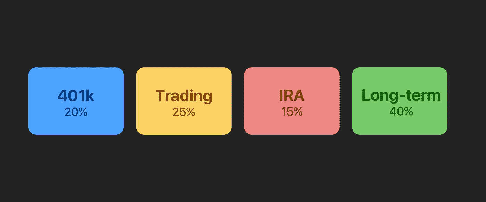
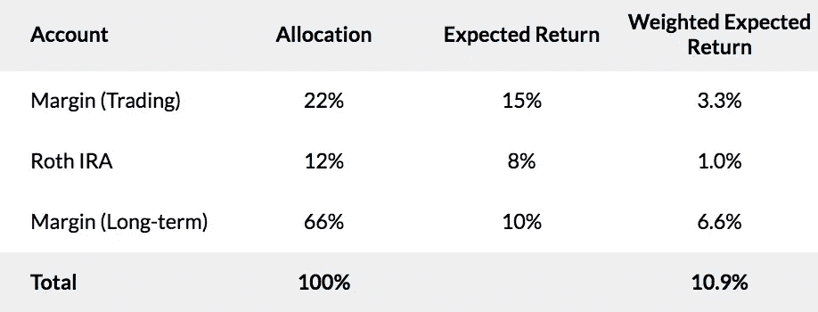
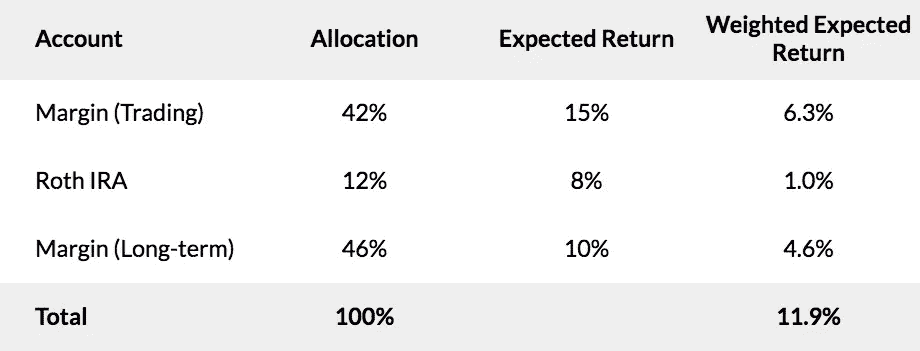

# 跨账户的资本分配

> 原文：<https://medium.datadriveninvestor.com/capital-allocation-across-accounts-f8fd84f111f7?source=collection_archive---------4----------------------->

## 多个账户的风险、加权回报和市场方法。

我希望人们更多地谈论两件事:

1.  账户规模相对于净值的背景，以及
2.  跨多个账户的投资方法。

以下是我尝试引发的对话，并把我的想法写在纸上，至少让另外一个人受益。

## 相对于净值的账户规模决定了风险承受能力

第一个话题是账户规模相对于净值的比例，以及当评估你或其他交易者的风险时，这是一个需要考虑的要点。

我将陈述显而易见的事实，因为有时事实并非如此:

> 你的交易账户相对于你的净值越小，你就越能放心地承担风险。

如果你只积极交易 10%的流动资产，那么完全爆仓的前景比 80%的情况要少得多。仅这一点就严重影响了交易风格和方法(尤其是名义杠杆风险容忍度)。当你观察别人的交易时，请记住这一点。

例如，在一个收益率为 10%的账户中，我可以以 3 倍名义价格卖出裸期权，也可以尝试卖出股票或期货，等等。，而在 80%的账户中，我会坚持持有股息股票，并以接近 1 倍的杠杆(现金担保)出售保守的裸期权。回报预期的差异如下…

## 跨多个账户投资

假设你没有交易 100%的可投资资产，你可能有几个账户，比如保证金(交易)、个人退休账户、401k 和保证金(长期投资)。

我将这一切视为加权回报的叠加。要得到所有账户的加权预期回报，用该账户代表的资产百分比乘以该账户的预期回报。

**分配示例:**

Across all 3 accounts, this is expecting a 10.9% total return.

预期回报是一种基于合理预期的感觉，这对股票账户来说很容易，但对期权账户来说就比较难了。[我之前的文章](https://medium.com/datadriveninvestor/what-annual-return-should-i-expect-efbeb19c478f)讨论了如何得出期权交易的预期回报。

一旦你有了这个计划，当你修改账户之间的分配或任何给定账户的风险水平(以及预期回报)时，你就很容易知道你的整体预期回报是如何变化的。在上面的例子中，当你把 20%的资金从长期账户转移到交易账户时会发生什么:

Total expected returns goes up 1% to 11.9%, but of course the risk increases too.

意识到这一点似乎有助于围绕你的总投资情况形成合理的预期，并根据你的目标做出相应的调整。

## 通过市场方式实现多样化

知道你的“加权预期回报”很酷，但这只是理论上的，还有另一个重要的相关部分。我们经常听到期权交易范围内的策略多样化。我想完全通过市场方式将这种多元化提升到一个更高的水平。

我认为什么是市场方法？可能是股息投资、溢价销售、指数投资、活跃股票交易、期货交易、看涨、看跌等。

通过拥有不同的账户、配置和相对风险容忍度，你可以设计不同的市场策略，希望其中至少有一个在任何时候为你服务。

也许这意味着你的长期大账户正在进行股息投资，而你的交易账户正在积极交易看跌期权和股票，以部分抵消你更大的账户敞口。这 100%取决于你的思考，因为没有正确的答案。

对我来说，我的长期保证金账户中主要是股息股，我的罗斯个人退休账户中有大量 REITs/MRE it 以获得高免税收益率，我的交易账户中有一些科技股和卖出期权。当然，它们之间有一些相关性，但也有足够的差异来获得一些体面的多样化。

1.  在与他人讨论或观察交易时，使用相对于净资产百分比的风险背景。
2.  **考虑加权基础上的账户回报。**
3.  **考虑通过市场方式实现多元化(更高层次的战略)。**

**本文到此为止。希望它能引发一些思考。**

*一如既往，你可以通过*[*Twitter*](https://twitter.com/benlatz)*公开/DM 或者* [*邮箱*](mailto:ben@wingmantracker.com) *联系我。问题、反馈、讨论——我随时恭候。*