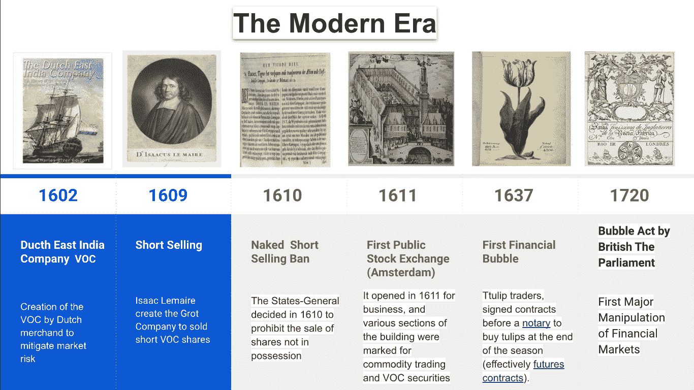

# 资本市场的演变 1602-1720

> 原文：<https://medium.datadriveninvestor.com/capital-market-evolution-1602-1720-25716f8ec948?source=collection_archive---------7----------------------->

“资本市场进化”系列由 [Teamo“团队合作至关重要”](https://www.teamo.world/)赞助，参见[开放集体](https://opencollective.com/teamo1)，是项目[股权分配智能“主”合同](https://www.teamo.world/project/from-zero-to-hero-with-cms)的一部分，我们真诚地相信，我们应该了解我们的过去，以更明智地建设我们的经济未来。

The Modern Era

现代意义上的公司起源于 1602 年荷兰东印度公司的成立(荷兰语:Vereenigde Oostindische Compagnie；作为一家合股的皇家特许公司，它将创建一个强大的企业集团，在政府的指导下，将几家竞争的荷兰贸易公司合并，以控制东印度群岛的海上贸易。在建立 VOC 之前，航行到西印度群岛的珍贵资源是有风险的。海盗、疾病、不幸、海难和各种宏观经济因素的威胁增加了风险系数，从而使旅行变得非常昂贵，租船的净收益是将风险分散到许多航次。

 [## 2019 年成为主流的 7 大区块链挑战及更多...-数据驱动型投资者

### Faisal 在加拿大工作，拥有金融/经济和计算机方面的背景。他一直积极从事外汇交易…

www.datadriveninvestor.com](https://www.datadriveninvestor.com/2019/03/25/top-7-blockchain-challenges-to-go-mainstream-in-2019-more/) 

将近 10 年后，VOC 建立了世界上第一个重要的股票交易所——阿姆斯特丹的一个无屋顶的庭院——为商人建造船只提供了更多的流动性，以便在东印度群岛进行进一步的探索，进行利润丰厚的香料贸易。荷兰人在远期合约、保险、衍生品和卖空方面不断创新(Isaac Lemaire 的故事很吸引人，这个人值得拍一部电影)，随后的 ban 为第一个资本市场提供了监管的一瞥。在巅峰时期，VOC 被评估为 7.9 万亿美元，这确实是有史以来最有价值的企业。

当许多股份公司如南海公司和密西西比 T2 公司在 1720 年泡沫破灭时，欧洲特许股份公司的发展戛然而止。历史上最具讽刺意味的时刻之一是制定了[泡沫法案 1720](https://en.wikipedia.org/wiki/Bubble_Act) (6 Geo I，c 18)，该法案禁止在没有皇家特许的情况下创建合股公司，并在南海公司倒闭前由该公司自己推动。

**最重要的条款是:**所有企业…假定作为法人团体…筹集…可转让的股票…转让…这种股票中的股份…无论是根据议会法案还是根据国王的任何特许状，…以及根据任何特许状…为筹集股本而采取的行动…不是根据这种特许状采取的行动…以及根据任何过时的特许状…采取的所有行动…将永远被视为非法和无效。

根据该法案的条款，皇家外汇保险公司和伦敦保险公司获得了承保海上保险的特许

回顾我们的过去，看看与今天世界的相似之处，VOC 有点像现代亚马逊，那时 VOC 在世界各地为商船建造港口，今天亚马逊在世界各地为网络商人建造数据中心，企业的政治游戏在某种程度上几乎保持不变。最令人着迷的事情之一是，制图员是开源运动的先驱，绘制世界地图是一项减少海难风险的协同努力。

关于[郁金香狂热](https://en.wikipedia.org/wiki/Tulip_mania)，可以从比特币及其随后的技术演变中找到一些相似之处，当时[期货合约](https://www.investopedia.com/terms/f/futurescontract.asp)是热门的新事物，利益相关者可以在纸质证书上标记他们的交易时间，并在未来某个日期拥有基础商品。

Tulipomania

**这里列出了所有共同的相似性:**

*   交易有时间标记(期货合约与智能合约)
*   你可以把比特币分成许多不同的种类，就像你可以生产许多不同的郁金香一样
*   两者都见证了巨大的市场投机泡沫
*   作为一种真正的实用工具
*   两者都没有超越自我观察的内在价值

> 南海公司和 ICO 世界的相似之处不仅仅令人着迷，历史正被一章一章地改写。

**这里列出了所有常见的相似性:**

*   两者都是基于未来业务的承诺进行销售，而没有实际的业务带来可以满足市场预期的现金流
*   两人都做了可疑的转向，因为 SSC 就是奴隶贸易
*   内幕交易猖獗([抽水和倾销](https://en.wikipedia.org/wiki/Pump_and_dump))，其他可疑活动如[洗盘](https://en.wikipedia.org/wiki/Wash_trade)和[市场欺骗](https://en.wikipedia.org/wiki/Spoofing_(finance))
*   风险资本家确实扮演了与英国贵族在 SSC 泡沫中扮演的角色相同的角色
*   至于监管，我们现在正采取观望的态度，我们希望不要看到类似于 1720 年《泡沫法案》的可怕事件，该法案使首次公开募股从 1720 年到 1844 年中断了 100 多年

没有人能预测未来，就个人而言，我希望 ICO 作为一种新的资产类别受到监管，如果它们满足一定数量的要求，ICO 世界远非完美，但在 ICO 繁荣之前，OSS 的激励机制也远非完美。

> 如果万恶之母是投机，父亲是通货紧缩，如果他们结成夫妇并有了孩子，他们将处于抑郁期。