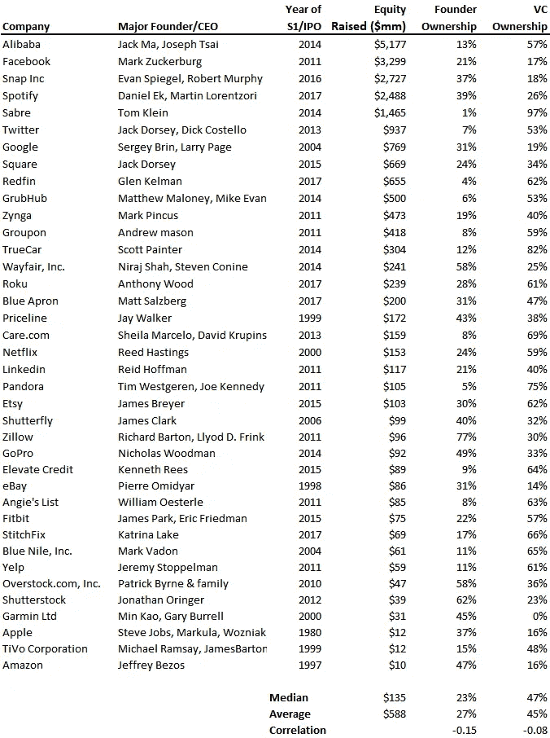

# 筹集的资本与创始人稀释关系不大

> 原文：<https://medium.datadriveninvestor.com/capital-raised-has-less-to-do-with-founder-dilution-b18f452d218d?source=collection_archive---------3----------------------->

这似乎有悖直觉，但如果一家企业需要大量股本才能成长，并不一定意味着创始人会稀释他们的所有权。我们最近分析了 38 家上市科技公司的创始人持股比例。这些数据让我们感到惊讶，因为创始人所有权和筹集的资金之间没有明显的关系。我们认为筹集的股本越多，创始人的所有权就会越低，但事实并非如此。数据如下图所示。

为了让图表更具可读性，我们剔除了阿里巴巴、脸书、Snap、Spotify 和 Sabre 的异常值。即使我们剔除了这些比同行筹集了更多股权的公司，我们仍然可以在图表的左侧看到一个强大的集群(图表中的公司平均筹集了 2.17 亿美元)，但股权所有权无处不在(图表的平均值为 27%)。原始数据在下面，包括图表排除的异常值(因此平均值与上面不同)。

进一步分析，我们研究了融资额和创始人股本之间的相关性，结果只有-0.15。回想一下，如果相关性是-1，那就意味着筹集的股本越多，创始人的所有权就越低。或者，相关性为 0 意味着筹集的资本和创始人股权之间没有任何关系。在-0.15 时，这种关系最弱，几乎不存在。

那么创始人股权和筹集的资本怎么可能没有关系呢？这是否意味着你应该筹集尽可能多的资金？不。在 solo 中查看数据有些误导:如果你筹集了资金，你就被稀释了。这是事实。但是，估值很重要，所以如果你能以非常高的估值融资，你的股权更有可能得到保护，而如果你的估值很低，大规模的融资将会严重侵蚀创始人的股权。

这些数据让我们得出结论，在确定融资对创始人所有权的影响时，估值比融资更重要。

萨米在 Blossom Street Ventures 工作。直接在 sammy@blossomstreetventures.com 给他发一份 A/B 系列广告