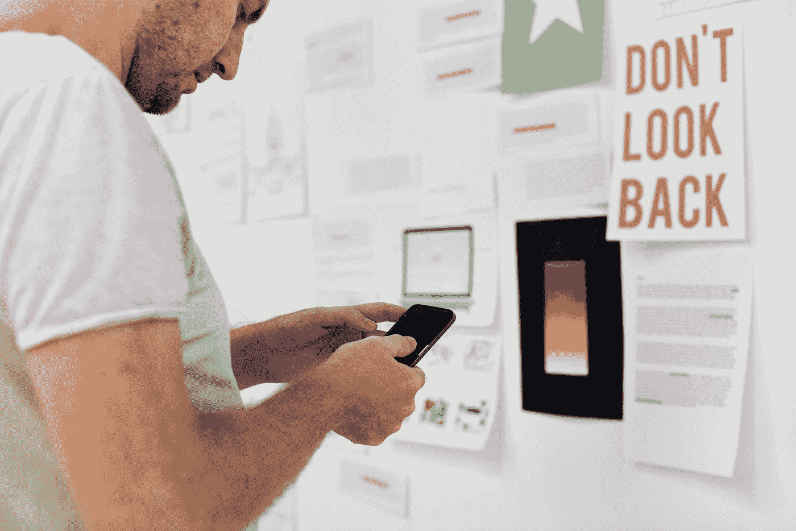

# 用人工智能夺取广告界最高荣誉

> 原文：<https://medium.datadriveninvestor.com/capturing-advertising-worlds-highest-honor-with-artificial-intelligence-2f83338ef3cb?source=collection_archive---------5----------------------->

**如何利用人工智能构思下一个活动**

“A man with a smartphone in front of document printouts and posters on a wall” by [rawpixel.com](https://unsplash.com/@rawpixel?utm_source=medium&utm_medium=referral) on [Unsplash](https://unsplash.com?utm_source=medium&utm_medium=referral)

你现在应该知道该怎么做了。创意简报在你桌上。客户需要三个创意概念来开展活动，让新客户眼花缭乱，让老客户有更多理由花掉他们的血汗钱。它充满了像“突破”和“表演停止”这样的浮华词汇简报指出，客户想要最新最好的，而不是通常的走秀。

你的创意伙伴点外卖，而你从冰箱里拿啤酒。明天开会，所以这将是一个漫长的夜晚。你在不同的概念间跳跃，玩文字游戏，看最新的现代艺术品，看一些短片。什么都没粘住。作为最后的努力，你在谷歌上搜索创意平台，发现了一些有趣的东西——人工智能。

**机器人革命**

人工智能将在不久的将来占据中心位置。据[企业家杂志](https://www.entrepreneur.com/article/306162)报道，许多行业已经很好地利用了信息技术的数据处理和推理能力。许多文章概述了人工智能在移动设备上处理数据的能力。然而，人工智能的创造潜力并没有得到太多的关注。

你和你的伙伴研究得越多，你就越意识到人工智能可能成为新活动的中心。一个做真正不同的事情的机会。现在，是时候动笔告诉客户为什么他们在下一次活动中需要 AI 了。这是你能想到的。

“A group of office workers conducting a meeting.” by [rawpixel.com](https://unsplash.com/@rawpixel?utm_source=medium&utm_medium=referral) on [Unsplash](https://unsplash.com?utm_source=medium&utm_medium=referral)

概念 1:读心术

一个互动博物馆，顾客戴上可以读取他们思想的头盔。头盔显示与产品相关的图像。也许博物馆的游客被运送到奥林匹克跑道上参加跑鞋运动，青草的味道和欢呼的球迷就在他们面前。

人工智能将被使用的另一个原因是让它在手机上变得生动。根据人工智能软件公司 WorkFusion 的说法，运行移动设备需要非常复杂的算法。然而，越来越多的客户将他们的手机作为主要电脑。WorkFusion 的产品允许移动战役执行复杂的操作。这就是为什么客户不仅会被创意所吸引，还会被投资回报率所吸引。

**概念二:逻辑游戏**

接下来你的客户演示将是概念二。这是给营销经理的，他们喜欢数字和任何他们可以跟踪和测量的东西。

在活动启动日，当最有价值的目标客户走出家门时，他们会受到户外广告牌的欢迎，这些广告牌显示他们最大的愿望得到了满足。一些简单但有影响力的东西，如广告牌和购物者广告，展示客户的产品解决了客户当天早上遇到的问题！

由于使用机器学习的产品，这在目前是可能的。机器从堆积如山的客户数据中学习。顾客将得到的是实际应用于他们生活的广告。

**概念 3:数字广告**

最后，同样重要的是，由客户自己打造的产品。这个想法并不新鲜；韦伯·山德维克总理在瑞典创建了[点击之家](https://vimeo.com/141663270)。但是，通过使用 AI 来分析客户数据，您的客户端将创建客户以前没有见过的东西。也许这将是一种他们不知道自己想要的产品，或者是现有客户产品的附加物。

为了做到这一点，我们将转向人工智能来分析消费者数据，提取最令人兴奋的部分。为了让事情更上一层楼，你还将要求一台无人监管的人工智能机器根据数据设计新产品，使这成为一场 360 度人工智能运动。

这些概念大纲似乎还很遥远，但人工智能已经在数据科学领域做出了令人兴奋的事情。广告创意者有一种天赋，能够将枯燥的信息变得精彩。无论是获得特定的消费者数据，发现新的见解还是创造体验——人工智能在下一场伟大的广告活动中都有一席之地。