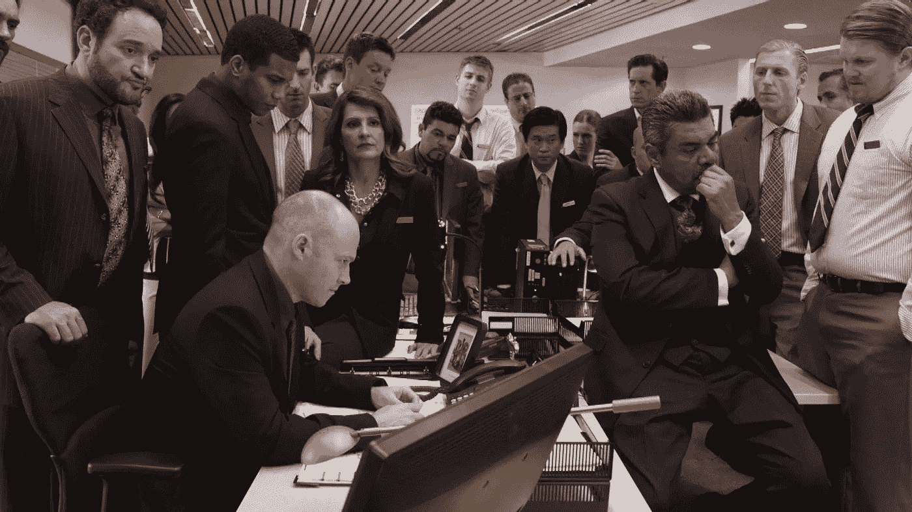

# 车商 BDC 车型-破？

> 原文：<https://medium.datadriveninvestor.com/car-dealers-bdc-model-broken-c9f0df5ea683?source=collection_archive---------29----------------------->

image by [https://www.phoenixnewtimes.com/arts/car-dogs-movie-george-lopez-asu-9159414](https://www.phoenixnewtimes.com/arts/car-dogs-movie-george-lopez-asu-9159414)

BDC/互联网主管

我个人一直很尊重这个职位。让我着迷的是，还有多少经销商还没有转到这种模式。如果 90%的客户在去经销商处之前都在网上购物，为什么你的管理团队看起来像这样:

*   一名商业发展中心/互联网主任
*   2-5 名前台经理和楼层经理

模型坏了！为什么你会让一个经理关注你的大部分客户？理想情况下，你的所有管理人员都应该帮助将所有客户转化为销售人员。当你让整个管理团队专注于所有流量的转化时，不可思议的事情发生了——你卖出了更多的车。我明白你希望最好的经理出现在展厅的客户面前，但让我们诚实地说:除了从周六开始的[时间，你的整个团队应该专注于寻找汽车交易。](http://x-apple-data-detectors//4)

怎样才算一个好的 BDC 总监/互联网总监？

能够帮助车队进行改装，销售更多汽车。

蔻驰和每日列车:

*   听来电——所有人都来听听。你的整个管理团队应该在这方面提供帮助。
*   确保遵循电话服务指南来转换电话 ups。
*   让团队对互联网销售线索转化负责。
*   确保通过电子邮件、电话、文本对网络销售线索的适当回应时间，最好使用视频电子邮件和视频文本回应

我曾经和我的 BDC/互联网主管和经理做过一次练习，猜猜发生了什么？它从未失败过。我会随机挑选一个销售人员，十有八九会是这样。“为什么线索一进来，小约翰尼就不打电话或发短信给客户？”让我着迷的是，当网络主管进来时，销售人员拒绝拿起电话打给网络主管，或者不知何故设法认为停止时钟并发送一些伪造的电子邮件比发送一封会引起客户截击的电子邮件更重要。

想象一下，如果你让你的整个管理团队帮助你的销售人员更有效地转化。

如果经销商平均关闭 10%的网络销售线索，那么你就浪费了 90%的机会。最好的经销商关闭 18-22%的网络销售线索。帮助您的团队达到这些数字，神奇的事情就会发生——您猜对了——您卖出了更多的汽车！

如果你想在汽车游戏中赢得更多的胜利，让你的所有管理人员都专注于帮助你的所有客户转变观念。现在去找一些汽车交易。

*如果您想了解 BDC 部门使用人工智能进行服务或销售的最新技术，请前往 sales@cardoneautomotiveresources.com 观看演示，或前往旧金山 NADA 展位#6609W* 查看我们的产品

*原发布:*[*https://www . LinkedIn . com/pulse/car-dealers-BDC-model-broken-Chris-Martinez/*](https://www.linkedin.com/pulse/car-dealers-bdc-model-broken-chris-martinez/)