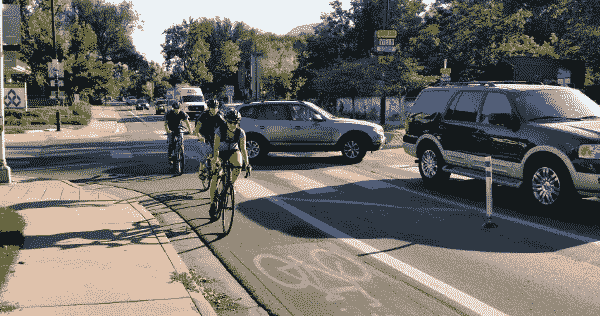
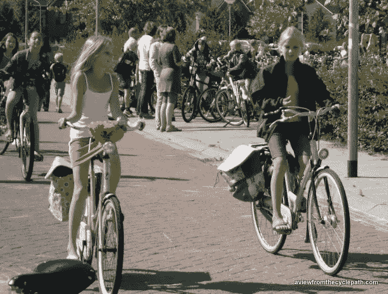
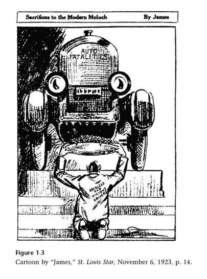
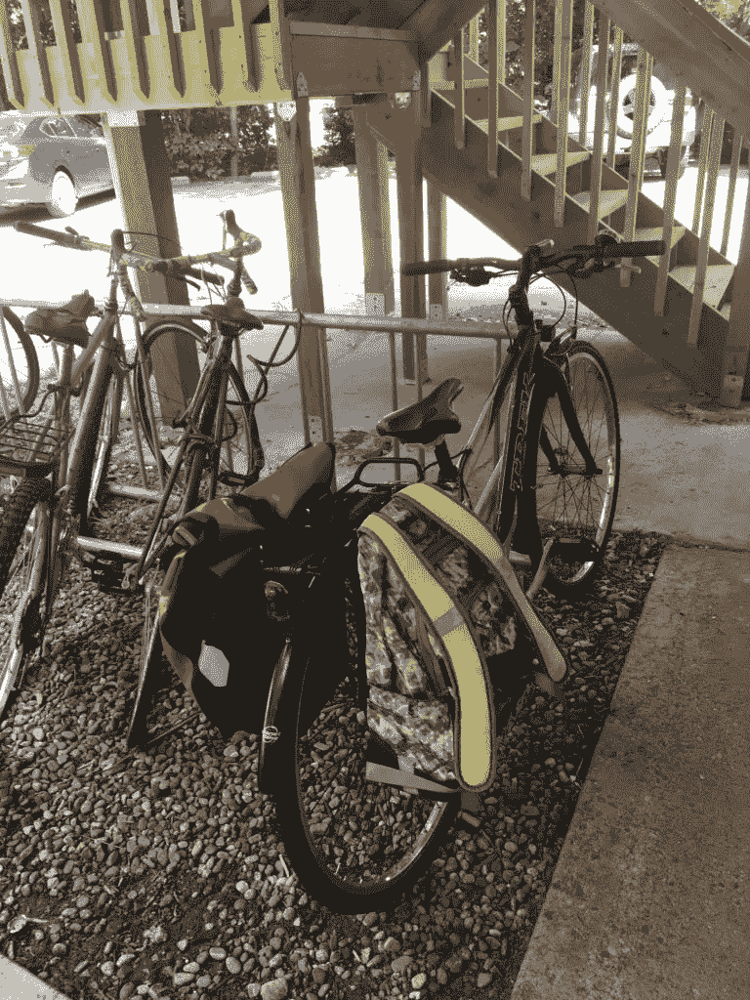

# 无车还是车灯？运输的常识性方法

> 原文：<https://medium.datadriveninvestor.com/car-free-or-car-light-a-common-sense-approach-to-transportation-941272de5085?source=collection_archive---------3----------------------->

## 大多数荷兰人都拥有汽车。他们也骑自行车。

Drivers and bike riders [coexist](https://peopleforbikes.org/blog/as-other-cities-build-protected-bike-lanes-boulder-plans-a-rollback/) on Folsom Street in Boulder. Photo credit: Eric Budd

我正在读一本不可思议的书，名为[建设自行车城市:荷兰城市活力蓝图](https://amzn.to/2REI9xQ)。这是关于一个加拿大家庭——brunt letts——他们决定开始少开车。每次他们只有几英里的路程，他们就骑自行车。过了一段时间，Bruntletts 夫妇意识到他们非常喜欢步行和骑自行车，所以他们也可以扔掉他们的车。

作为一个自称“无车”的人，有一点让我印象深刻，那就是布伦特莱特夫妇并不认为自己是无车的。他们称他们的方法为常识。

## **荷兰人能开车的时候为什么还要骑自行车？**

在游览了荷兰之后，布伦特兰一家去掉了“无车”的标签——荷兰是西方的自行车骑行圣地，也是世界上唯一一个自行车比人多的国家。

作为美国人，我们喜欢想象荷兰人因为高税收根本买不起车，也许这就是为什么这么多人骑自行车。

事实根本不是这样。 [70%的荷兰家庭拥有汽车](https://www.iamexpat.nl/lifestyle/lifestyle-news/30-percent-dutch-households-do-not-own-car)。因此，大多数荷兰人拥有汽车，大多数荷兰人骑自行车。那里的骑手(阅读:几乎每个人)都是普通人:祖父母、孕妇、5 岁以上的孩子。他们不骑花哨的自行车，也不穿任何特殊的衣服。他们只是运用常识:快速开车去商店买牛奶不需要 2 吨重的电动轮椅——除非你打算买 650 磅的牛奶。(像本田雅阁这样的小型轿车，设计承载 [850 磅](https://www.consumerreports.org/cro/news/2013/09/the-heavy-reality-of-car-weight-limits-and-weight-capacity/index.htm)。)

## **为什么荷兰修建自行车道，而美国却追求以汽车为中心的街道？**

简单的回答是，他们没有。第二次世界大战后，荷兰和世界其他国家一样渴望“现代化”。像鹿特丹这样被炸毁的城市是以汽车为前沿重建的。

但是在 20 世纪 60 年代，随着越来越多的孩子在街上玩耍被汽车撞死，一场运动兴起了。妇女首当其冲，因为数百万辆汽车接管了她们的城市街道，数千人失去了孩子。仅在 1971 年，就有 450 名荷兰儿童被汽车撞倒。

记者 Vic Langenhoff 在他自己的孩子在一次交通事故中丧生后写了一篇文章，标题是“停止儿童谋杀”。停止德 Kindermoord 成为蓬勃发展的运动的名称。

这个想法是通过增加骑车人和行人(例如儿童)的空间来使街道更加安全。它将为汽车留出空间，同时将最优先考虑的事项转变为更安全的交通方式。

Dutch children begin learning to ride their bikes in pre-school. At age 5, many begin riding their bikes to school. Independent travel is a large part of what makes [Dutch children](http://www.aviewfromthecyclepath.com/search/label/dutch%20children) so [happy](http://www.aviewfromthecyclepath.com/search/label/unicef%20child%20well-being%20index). Note that riding is usually social and [side-by-side](http://www.aviewfromthecyclepath.com/search/label/side-by-side). Image credit: [A View From the Cycle Path](http://www.aviewfromthecyclepath.com/2013/09/the-school-run-in-assen.html)

与此同时，在美国，汽车对儿童造成了类似的伤害。在荷兰报告 3000 人死亡的同一年(1971 年)，美国有[**53907 起汽车死亡事故**](https://www.fhwa.dot.gov/policyinformation/statistics/2007/pdf/fi200.pdf) 。我们已经在脑海中把它正常化了。事实上，我们认为儿童交通死亡现在司空见惯。

但并不总是这样。当汽车在 20 世纪 20 年代变得司空见惯时，我们震惊了——就像荷兰人一样。孩子们已经习惯了在他们的街道上玩耍——那时还没有操场——然而突然之间，他们发现自己置身于一个片刻的遗忘就会导致死亡的世界。在 20 世纪 20 年代，60%的汽车死亡事故是 9 岁以下的儿童。

1923 political cartoon: Car drivers sacrifice their fellow citizens to the god Moloch, an ancient god infamous for requiring child sacrifice.

但是这种愤怒并没有影响汽车的采用。

(令人遗憾的是，尽管车祸仍然是青少年死亡的主要原因(三分之一的死亡)，国家健康研究所所谓的解决方案并不是“少开车”这是更多的警察和更多的海报。我们是认真的吗？)

## **今日美国:如何确定“常识”标记**

在美国，超过四分之一的行程是 1 英里或不到 1 英里，即 5 分钟的自行车行程。事实上，在美国，超过一半的行程是 4 英里或更短。

让骑自行车很好的心态的一部分是人们是否愿意住在离工作地点近的地方。大多数美国人声称住在工作地点附近太贵了。他们选择了长时间通勤的栅栏式郊区生活方式。事实上，截至 2017 年，普通美国人每天上下班花费 [52 分钟](https://www.washingtonpost.com/news/wonk/wp/2017/02/22/the-american-commute-is-worse-today-than-its-ever-been/?utm_term=.9a970e3fef01)。

我曾经同意，但是经过一些简单的计算，我意识到大多数美国人并没有意识到通勤生活方式到底有多昂贵。住在城里几乎总是更便宜:

假设每年行驶 15，000 英里，拥有汽车的平均成本为[每年 9，000 美元](https://newsroom.aaa.com/tag/driving-cost-per-mile/)。看看你能存多少钱，把它分散到… 10 年？30 年？:钱:这意味着你每卖掉一辆车，你就能获得至少 10 万美元的股本，用于住房等其他支出。

## **我在那里勉强买了一辆车。算是吧。**

9 年来，我一直认为自己不开车，我意识到步行和骑自行车并不总是有意义的，尤其是在一个有意不鼓励骑自行车和步行而支持全能汽车的国家。尽管我位于市中心，但有时我需要开一个小时的车去一个没有公共汽车服务的偏远地区。有时我需要从旧货店拖一件家具回家。

上个月，我不情愿地屈服了，买了一辆车。严格来说，我不拥有它，它也没有停在我家。但是通过 [car2go](https://www.car2go.com/US/en/denver/) 汽车共享(类似 zipcar)，我可以走 2 个街区，想什么时候上我的车就什么时候上。我想去哪就去哪，想去多久就去多久。

如果我不使用 car2go，它每个月什么也不用花:没有保险，没有停车费，没有折旧。没有换油。没有检查。到目前为止，我只交了 25 美元的申请费。

我一直在想，只要有意义，我会在某个时候使用我的 car2go 汽车。当然，自从我 8 个月前搬到这里，它就没有意义了，但是谁知道呢。它的时代将会到来。

## **两个轮子上的生活:常识遇上乐趣**

在我的最后一个城市(布鲁克林)和我的新家乡科罗拉多州的博尔德，这两个城市一直被评为美国十大自行车城市，我很惊讶我经常是唯一一个不骑车的人。

My bike after a major grocery run

我在这里的大部分行程(工作、看医生、在镇上跑腿)都是 1-3 英里，骑自行车最有意义。我很少带很多东西。我最多的一次是在每周的杂货店——半英里的路程，带些牛奶、豆子和农产品。为了完成同样的任务，我必须发动一辆能载 5 个成年人的燃气汽车。

当我踏上小路时，汽车从我身边呼啸而过，以创纪录的速度奔向它们的下一个目的地。每个人都比我走得快，但我觉得自己是世界上最幸运的人。

本周从豆芽杂货店飞回家，我骑在我家附近的秋天枫树下。树枝延伸到街道上方，在我上方形成了一系列拱门，同时给道路铺上了金色的地毯。

周四，在我从乔氏商店回家的路上，我看着落基山脉的落日余晖。

从 Goodwill 走回家时，我看着毛茸茸的小鸭子在博尔德溪的漩涡中上下摆动。

在昏暗的黄昏灯光下，只有我、几只松鼠和自行车蹦蹦跳跳的嗡嗡声。

吉纳在节俭风筝博客[www.frugalkite.com](http://www.frugalkite.com)上写了关于节俭生活和两个轮子上的生活的文章。