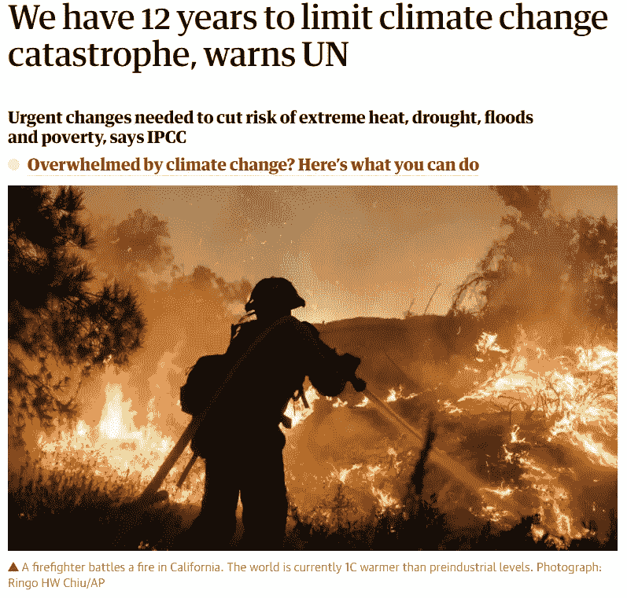
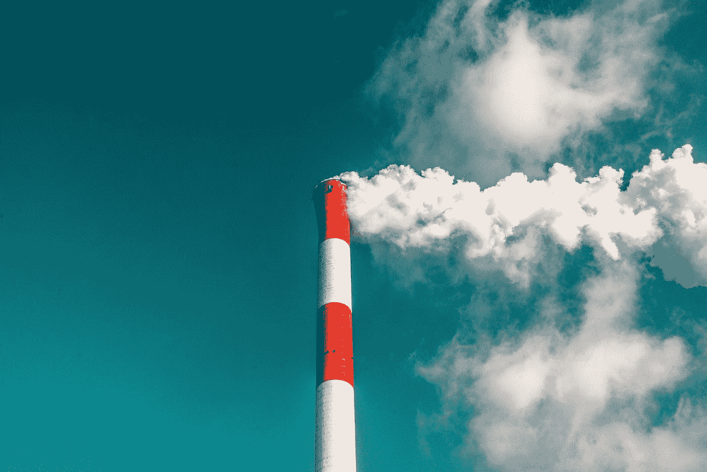
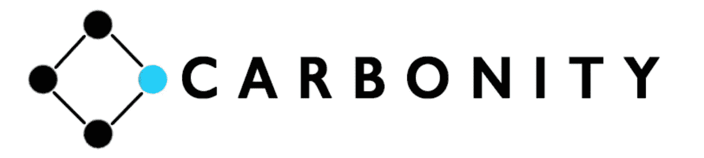
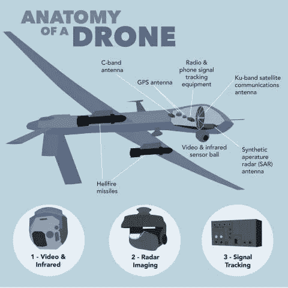
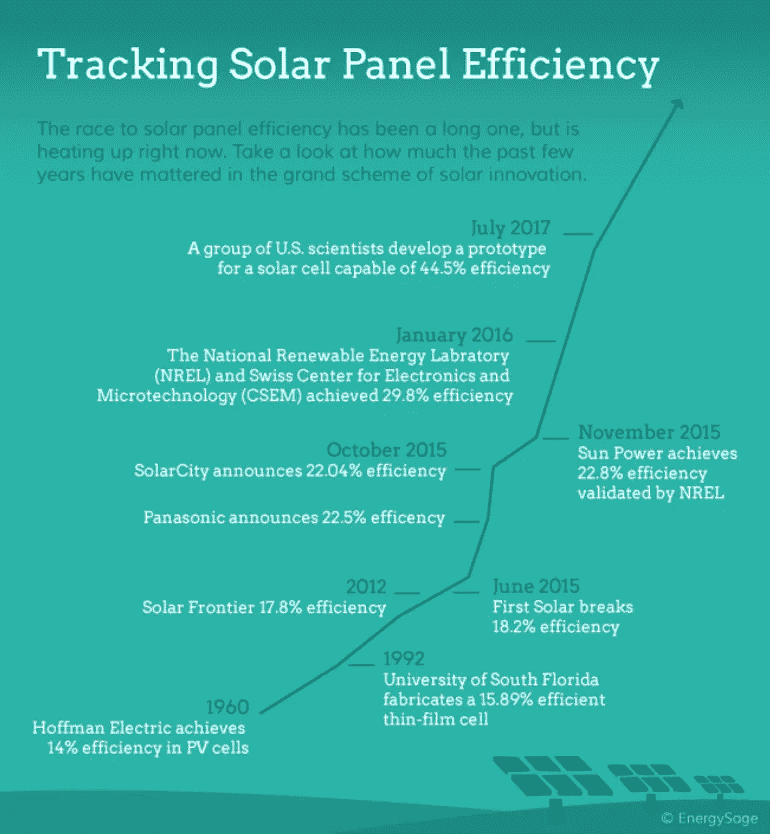
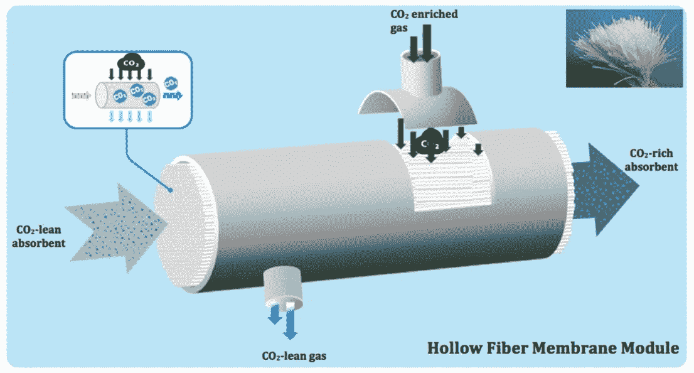
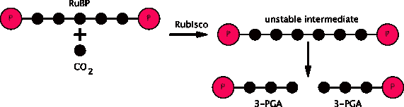
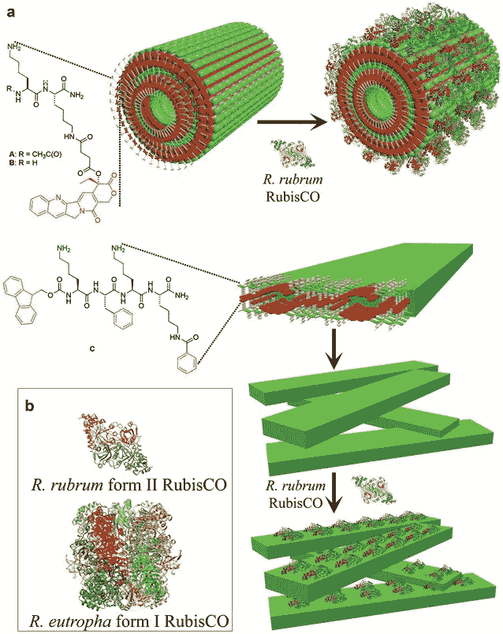
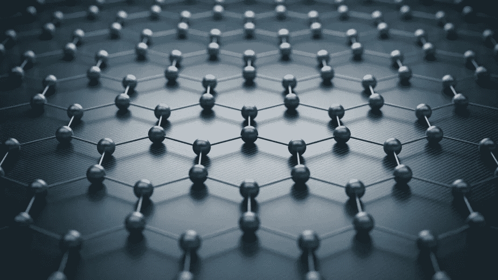

# 将碳转化为资本。解决气候危机。

> 原文：<https://medium.datadriveninvestor.com/carbonity-turning-carbon-into-capital-to-solve-the-climate-crisis-727ca77f5997?source=collection_archive---------2----------------------->

Photo by [NASA](https://unsplash.com/@nasa?utm_source=medium&utm_medium=referral) on [Unsplash](https://unsplash.com?utm_source=medium&utm_medium=referral)

## Carbonity 将如何使用无人驾驶飞机和生物技术来清洁大气和启动未来

派特·布朗。不可能的食物。他们正在建造一种完全基于植物材料的无肉汉堡，以减少对养牛的需求。康焦耳。他们正在开发一个点对点的网络，让人们可以通过区块链交易太阳能。埃隆·马斯克——也许你听说过他？—他正在用特斯拉打造一个不依赖化石燃料汽车的更清洁未来的愿景。

我认为这些人是目前世界上最聪明的人，他们正在从事一些最重要的项目。

 [## 气候变化、ESG 和对更好数据的追求——数据驱动的投资者

### 在地球上许多地方经历了另一个令人难以置信的炎热夏季后，来自 S&P 的最新发现…

www.datadriveninvestor.com](https://www.datadriveninvestor.com/2018/08/24/climate-change-esg-and-the-quest-for-better-data/) 

不幸的是，这些公司在 11 年后都不再重要。

The Guardian, 2018

2018 年，联合国发布了一份报告，称在全球气候达到我们无法恢复的地步，气候灾难接管之前，世界还有 12 年的时间。那就是 2019 年 11 年。在 11 年内，没有办法转向电动汽车、太阳能或植物性肉类来改变这一点。

我们在世界上看到的几乎所有关于气候变化的问题——自然灾害、海平面上升、气候难民——都可以追溯到一件事:大气中的温室气体排放增加了我们全球恒温器的温度。

目前应对气候变化的方法主要是试图减少我们的碳排放，无论是完全素食肉类替代品还是电动汽车。有道理，对吧？二氧化碳是我们产生的最普遍的温室气体之一。

然而，这个策略有一个很大的问题:即使我们把二氧化碳排放量减少到零，**大气中仍然有碳。**如果是二氧化碳，现在我们应该把问题从“我们如何减少地球上的碳排放？”收件人:

> "我们如何清除大气中的二氧化碳？"

我们希望用 Carbonity 来回答这个问题，carbon ity 是一家致力于开创气候和材料技术新时代的下一代公司。

# 我们目前的努力是有缺陷的

我们现在处理这个问题有两个大问题:

1.  碳封存，或称碳捕获，只存在于地球层面。我们所能做的就是将其转化为其他类型的燃料或储存起来。这看起来不像是浪费吗？
2.  二氧化碳转换方法效率非常低，而且大部分都涉及到将二氧化碳转换成其他形式的有机燃料的 T2。不要让“有机”欺骗了你，它仍然被烧掉了，这意味着**碳排放的净变化基本上是 0。**

大气碳捕获是一个多年的想法，最近科学家说这可能是我们防止气候灾难的唯一方法。唯一的问题是:

1.  我们如何让它在经济和环境上可持续发展？
2.  我们如何让它在全球范围内扩展？

这就是我们的切入点。

# 我们如何做得更好

为了解决这些问题，我们需要一个**容易复制的项目**，它使用一个**可扩展的、环保的机制将二氧化碳转化为**一种可销售的、有价值的产品，可以产生收入**来维持自身。**

我们希望通过以下方式实现这一目标:

## 这个项目:无人机

Carbonity 打算发射一个特殊装备的太阳能自主无人机舰队，用于巡逻大气二氧化碳浓度高的地区，如制造设施、城市等。这些无人机携带碳捕获和转换机制，并将定期返回地面卸载。由人工智能运行，他们将能够自主导航，避免障碍，优化路线。

## 过程:酶过滤

固定化 Rubisco(地球上最常见的酶)以及其他酶的过滤器将成为帮助捕获和分解碳的机制。Rubisco 是一种在植物中发现的酶，可以帮助植物进行光合作用。最近的研究表明，当悬浮并与其他纳米结构自组装时，我们可以用它来人工重建卡尔文循环，这是光合作用的一部分。

## 产品:碳

rubis co-纳米结构过滤器复合体将允许我们捕获纯碳。当无人机返回地球时，碳将被收集并出售给石墨烯制造商。随着大气中碳的大量存在以及对碳作为建筑工具的需求，Carbonity 有可能成为硅时代和碳时代之间有利可图的中介:利用过去的错误来建造未来的材料。

你可以把 Carbonity 想象成一家试图开发飞行森林的公司。毕竟，植物已经这样做了几千年——我们只是把它带到了天空。

现在我们已经有了一个总结，让我们深入研究使这成为可能的科学:

# 这个项目是:自主太阳能无人机

**利用人工智能扩大和复制无人机系统**

大气中的大部分二氧化碳集中在对流层，即大约 11 公里高的地方。(对我们的美国朋友来说是 36000 英尺多一点！)目前，世界上飞得最高的无人机在大约 65，000 英尺的高空飞行，所以高度不是问题。

如今市场上最大的障碍不是生产无人机的成本——2010 年，建造美国空军通用原子公司的 MQ-1 捕食者花费了大约 400 万美元，自 2012 年以来，风险投资公司在无人机技术上投资的 15 亿美元无疑降低了成本——而是持续运营无人机的成本。

无人机飞行员、技术人员、分析师——他们都增加了操作无人机的成本。飞行期间每小时的费用从【2,500 美元到**15000 美元不等。**然而，随着**人工智能驾驶的无人机的引入，这一成本可以得到缓解。**

Instead of “Hellfire missiles” we’d rather add our carbon conversion filters.

使用机器学习来分析大气中的碳浓度模式，Carbonity 无人机将能够在不需要任何人工干预的情况下自动驾驶和导航。

最重要的是，随着无人机收集大气数据，人工智能可以确定无人机应该去哪里，**基于机器学习见解自动执行任务。**

作为顶部的樱桃，太阳能无人机很少需要降落到地面充电，这意味着项目设施可以小得多。从 2015 年到 2017 年，太阳能电池板的效率翻了一番，所以我们毫不怀疑我们将拥有太阳能电池板技术，能够在更长的时间内为远程、高空无人机供电。

## 关键外卖？太阳能自主无人机有很多好处:

*   自主飞行和导航降低了维护成本
*   机器学习洞察使任务执行与人类订单
*   太阳能意味着很少回到陆地充电

我们打算与通用原子航空系统公司和洛克希德·马丁公司等无人机开发公司合作，为我们的碳转换解决方案制造船只。总之，这是一个经济高效且可扩展的实施计划。

程序？☑️

# **工艺:Rubisco-Enabled 碳捕获和转换过滤器**

**利用生物工程和纳米技术以环保和可持续的方式分解碳**

Rubisco，或 1，5-二磷酸核酮糖羧化酶/加氧酶，是地球上最丰富的酶之一，也是最重要的酶之一。

酶是帮助催化(或促成)非常特定的化学反应的蛋白质。Rubisco 是一种在植物叶绿体基质中发现的酶，叶绿体是光合作用所需的细胞部分。

光合作用描述了植物利用二氧化碳和水形成有机化合物(如葡萄糖)和废物氧气的过程。自然，科学家和初创企业对这一过程很感兴趣，因为它似乎有可能清洁我们的大气层，对吗？

实际上，事情要比这复杂得多。常见的误解是植物将二氧化碳转化为氧气，但氧气实际上来自水。Rubisco 使 CO2“固定”，这是一个描述它附着到另一种化合物上的过程，因为它变成了像葡萄糖这样的有机化合物——中间有一些步骤——所以碳实际上从未被分离出来。

这确实意味着你可以制造生物燃料，但只会烧掉这些燃料，再次污染大气。从事这项工作的大多数人可能愿意满足于碳中和——但不是我们。

我们的计划是通过确保催化它的酶不存在，在这个过程中拦截化合物。然后，吸收剂溶液将通过含有该分子的容器，作为富含碳的溶液离开，并准备去磷和脱氧。这到底是什么意思？我们将向您展示:

## 技术细分:

这种二氧化碳转换机制可以被描述为一种碳洗涤器。这里有一个由 EnerCarbon 制造的使用多孔微纤维的例子:

目前，碳洗涤器(通过直接捕获空气来净化空气中的二氧化碳的设备)大多位于地面上——汽车排气管、烟囱等。在那里，它们很容易暴露在大量的二氧化碳中。然而，在对流层中，这样一种持续强劲的 CO2 供应可能更难获得——这就是为什么我们需要 Rubisco 来为我们做这一部分。

当二氧化碳进入植物细胞时，Rubisco 帮助它与一种叫做**核酮糖-1，5-二磷酸**的分子发生反应。发生这种情况后，它们形成的化合物几乎立即分裂成两个分子**3-磷酸甘油酸、**或 **3-PGA。**

我们计划在这里拦截分子，并开始使用其他酶将其分解为更简单的成分。

**Rubisco** 可以固定在**预组装纳米结构**中，其他酶如**磷酸酶**和**脱氢酶**和**氧化酶**也可以固定。所有这些物质一起可以形成不同的模块，这些模块可以有意地排列在一个容器中，以产生某种产品——在我们的例子中，是碳。

As seen in a, the Rubisco proteins suspend themselves on the outside of the nanostructure scaffold.

打个比方，我们机制的内部过滤器组件有点像装配线:每个模块生产不同的东西，只有某个其他模块可以对其进行操作，因此它们都必须以特定的顺序执行其功能。

Rubisco 特异于 RuBP 和 CO2，并将它们转化为 2 个 3-PGA。然后，磷酸酶——比如说 3-PGA 特有的磷酸酶——会进一步分解它。这种情况一直持续到过滤器将底物分离成几乎纯的碳。在这一点上，吸收剂溶液将通过过滤器，随后可以卖给购买者。

## 关键外卖？我们可以使用 Rubisco 和其他酶来制造碳洗涤器:

*   Rubisco 和其他酶可以在过滤器中固定和组织在多个纳米结构中，以产生某些化合物——碳单体
*   我们可以在过滤器中使用这些纳米结构来代替微纤维
*   碳专用吸收剂溶液将去除任何多余的分子

过程？☑️

# 产品:碳销售和制造

**向制造商出售碳以生产高质量的原始石墨烯，并服务于各种市场**

碳封存面临的一大挑战是弄清楚如何处理它。一些人尝试将其转化为燃料，另一些人只是储存起来。通过我们的工艺，我们可以获得几乎纯的碳——为什么不直接使用它呢？

我们坚信，世界正处于两种未来之间的转折点:我们可以选择被动反应，用今天的技术解决明天的问题，或者我们可以积极主动，将今天的问题作为解决未来问题的机会。

纳米技术和材料科学的进步让我们确信，我们即将进入碳时代:石墨烯、碳纤维、碳纳米管。轻质、耐用、坚固的碳材料有一系列的用途，对建设一个更美好的世界至关重要。在 Carbonity，我们希望成为那个世界和这个世界之间的桥梁。

不幸的是，目前，原始碳石墨烯的价格高达每克 1000 美元。

我们认为这很荒谬。

通过向 Elcora Advanced Materials 和 Grafoid 等制造商大量出售碳，我们希望帮助他们降低生产碳产品的价格，提高该行业的盈利能力，鼓励该行业的新进入和创新。

从这一流程中获得的收入将用于维持 Carbonity 并将其发展到全球规模。

嘣。善用有害的大气碳。

## 关键外卖？出售我们收集的碳是一个好计划:

*   提供收入以维持业务
*   压低碳材料制造价格
*   激励行业创新

产品？☑️

# 我们现在处于最后阶段…让我们为它做计划

Carbonity 是一个大项目，这就是为什么我们计划分三个阶段推出它:

## 第一阶段:开始—第 1-3 年

在这里，我们希望完成几件事:

*   批量生产 Rubisco
*   开发和测试我们的碳转换过滤器原型。
*   飞机在对流层飞行，我们计划将来在那里部署我们的无人机。在此之前，我们计划与航空公司合作，将我们的过滤器安装在他们的飞机上，以测试我们的过滤器。

## 阶段 2:发展——第 4-7 年

在从第 1 阶段获得一些收入和资金后，我们计划添加我们解决方案的下一个重要部分:

*   与无人机制造商合作开发太阳能自主无人机
*   开发我们的碳转换机制作为无人机附件
*   在目标区域部署一队无人驾驶飞机来收集碳

在这一阶段，“目标区域”是指直接大气中 CO2 浓度高的位置。政府将达成协议，以确保执行是合法和安全的。

## 第三阶段:扩张——第 8-10 年

这是 Carbonity 的长期目标，也是我们希望能够维持健康氛围的地方:

*   将大气中的二氧化碳浓度降低到百万分之 350
*   在全球范围内扩展到多个国家
*   开始努力修改更有效的 Rubsico 版本
*   自主研发无人机

# 时间不多了

飞行森林。这听起来很疯狂，因为确实如此。这也是必要的。Y Combinator 最近呼吁创业公司以创新的方式应对气候危机——这个领域正在加速发展。

这是我们拯救地球所需要的行业，如果这需要一些疯狂的想法来实现，我们会尽全力去做。因为碳化不是什么登月计划。

这是我们唯一的机会。

我们希望我们的信息和使命能引起您的共鸣！我们一直在寻找可以学习的人，并希望您能为我们公司提供任何指导和建议。如果你想告诉你的朋友 Carbonity，把这篇文章发给他们，或者告诉他们看看我们的网站， [carbonity.ca](http://carbonity.ca) ,他们可以在那里下载我们的一页纸。

同样，请随时在 LinkedIn 上联系我们团队的任何成员，我们很乐意与您聊天！

[穆尔托希拉利](https://www.linkedin.com/in/murto-hilali-7a6068136)，[伊斯兰教](https://www.linkedin.com/in/ariful-islam-b75900168)，[胡姆扎霍哈尔](https://www.linkedin.com/in/humza-khokhar)