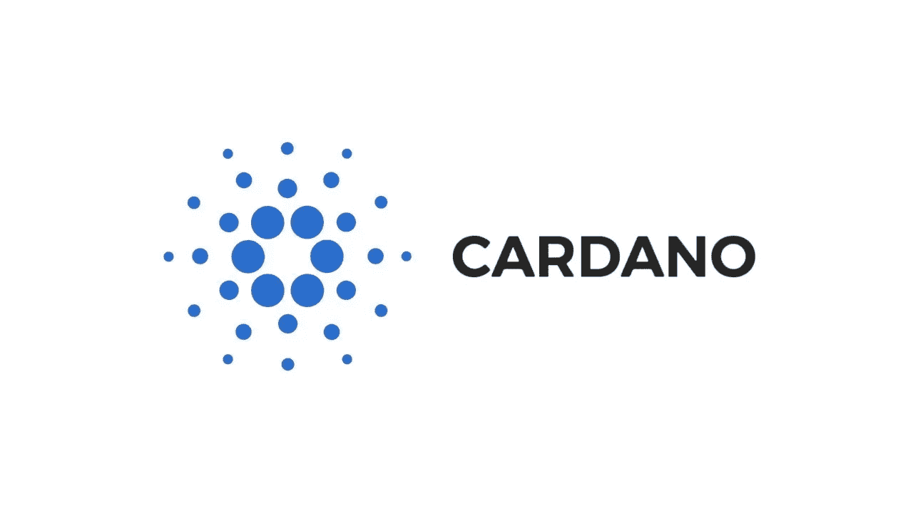

# 卡尔达诺|解释道

> 原文：<https://medium.datadriveninvestor.com/cardano-explained-a949d93b7cb3?source=collection_archive---------9----------------------->

Cardano Logo

# **卡尔达诺概述**

Cardano 是一个去中心化的公共区块链和加密货币项目，它是完全开源的，并为一种叫做 Ada 的加密货币运行区块链。该平台基于安全的利害关系证明算法(名为 Ouroboros)，该算法消除了对耗能协议的需求，从而部分解决了可扩展性问题。

Cardano 的目标是成为一个先进的智能合约平台。Cardano 是一个去中心化的公共区块链和加密货币项目，它是完全开源的，并运行着名为 Ada 的加密货币区块链。该平台基于安全的利害关系证明算法(名为 Ouroboros)，该算法消除了对耗能的工作证明协议的需要，这部分解决了可扩展性问题。Cardano 的目标是成为一个先进的智能合约平台。

# **卡尔达诺的创始人**

Cardano 由区块链开发公司 IOHK (Input Output Hong Kong)成立，由现任首席执行官 Charles Hoskinson 领导，他是以太坊和 BitShares 的联合创始人。杰里米·伍德也是该项目的联合创始人，他和查尔斯在离开 Etherium 基金会后在 IOHK 开始了这个项目。

# **解决方案**

Cardano 正试图解决早期区块链的一个问题，并创建一个智能合约平台，该平台试图提供比以前开发的任何协议都更先进的功能。它的目标是运行智能合同和去中心化的应用程序。IOHK 是 projected 的一个技术部门，根据网站声明，它致力于使用*“点对点创新，为没有金融服务的 30 亿人提供金融服务”*。

# **优点**

与其他智能合约平台(例如以太坊)相比，Cardano 的优势包括 Cardano 的可扩展性和强大的学术基础。它是第一个从科学哲学演变而来的区块链平台之一，非常受研究驱动，并有一个庞大的全球 R&D 团队，专门处理 Cardano 的研究，即团队成员进行学术研究，发表学术文章，访问会议并与其他独立的学术界成员合作，然后才为 Cardano 提供投入和工作。

Cardano 不仅是一种加密货币，还是一个可能运行金融应用的平台。因此，在购买 ADA 时，投资者可以从项目的两个不同方面获利:首先，ADA 是一种技术强大的加密货币，其次，Cardano 系统的项目价值是所有将使用 Cardano 平台的项目总和的函数。

# **缺点**

Cardano 的一个主要缺点是缺乏有形产出，这可能会在当前的 2018 年或下一个 2019 年财政期间产生即时现金流。目前还处于早期，没有运行平台。基本上，该项目是关于从零开始创建一个世界级的区块链加上一个先进的智能合约平台，而这两者仍然不存在。

另一个潜在的缺点是一个巨大的、极其雄心勃勃的路线图，加上一些延迟。

与以太坊相比，Cardano 的采用率更低，合作伙伴更少，开发者社区也更小。

Cardano | ADA

# **募集资金**

根据 [Ada 分配审计](https://www.cardano.org/en/ada-distribution-audit/)的数据，Cardano 在 5 个资金阶段期间筹集了 ***BTC108k*** ，按当前价格计算大约为*7.04 亿美元，但确切的法定金额取决于出售 BTC 的加权平均价格。*

*目前开发者团队的总支出约为每年 1000 万至 1500 万美元，与筹集的资金相比相对较少，这意味着 Cardano 可以以目前的资产和烧钱速度运营数年，如果不是数十年的话。*

*根据 [CoinMarketCap](https://coinmarketcap.com/currencies/cardano/) 数据库，Cardano 的市值约为 20 亿美元，根据其市值，Cardano 是世界第九大加密货币。这约占所有加密货币总市值的 1%，约为 2090 亿美元(截至 2018 年 10 月 22 日)。*

# ***价格影响***

*卡尔达诺价格在 2018 年 1 月至 2018 年 10 月处于中期平稳下跌趋势。短期价格横向移动，这意味着目前供需力量几乎相等。当前价格 0.075627 美元表明，我们可能会在 0.0831 美元的阻力位上方出现反转突破，可能会在 0.09 美元至 0.095 美元的下一个阻力位出现。下一个支撑位在 0.07 美元上方。*

*对于 HODL 的长期投资者来说，这枚硬币可能会显得相对有趣。风险回报比——每冒险一美元，你的潜在回报是多少——可能非常有利可图。*

# ***比赛***

****Cardano 的主要直接竞争对手是 Etherium*** ，作为开发者平台。的确，想法是相似的，但 Etherium 已经开发出了一个工作平台，而 Cardano 还没有创造出有形的产出。*

*EOS 和 NEO 也可以被认为是竞争对手。*

*EOS 是一个用于分散应用程序(DApps)的开发平台，它看起来非常像操作系统，因为它模拟了一台真实的计算机:硬件(CPU + GPU)用于处理，内存(local/RAM/HDD)用于存储和软件，平均分布在 EOS 持有者之间。EOS 是一个区块链协议，旨在运营一个面向去中心化应用的智能合约开发平台(DApps)，优点是快速=高可伸缩性(每秒百万次交易)和几乎免费(对用户来说几乎是零交易成本和费用)。*

*NEO 也被称为*“中国以太网”*，包括区块链和加密货币，旨在创造“智能经济”。*

*NEO 将“智能经济”定义为:*

*   *数字资产(以二进制格式存在并拥有使用权的任何东西)；*
*   *数字身份(计算机系统用来代表外部代理的实体信息)；*
*   *智能合约(=自动合约=自动执行，代码中写有特定指令，在特定条件下执行)。*

# ***卡尔达诺替代品***

*考虑投资 Cardano 的投资者可能会密切关注 Etherium，以及 EOS 和 NEO，但关注程度稍低。*

*Etherium 的估值更高，潜在的上行和可扩展性问题更少，但 Etherium 的优势在于:已经可以工作的平台、庞大的社区和潜在的下行波动性/风险更小。*

****EOS 强方:*** 前进中实实在在的进步(现在肯定在卡尔达诺前面)，修复问题的速度/效率。*

****NEO 强势的一面*** 还在于它与本土市场有非常好的联系，包括监管，这在中国是极其重要的。*

*最后，Cardano 有一个更雄心勃勃的路线图和相对更高的风险/潜力，以及最终更长的持有期/投资期限。*