# 用 Python 进行心血管疾病分析

> 原文：<https://medium.datadriveninvestor.com/cardiovascular-diseases-analysis-with-python-6a15ced96ac0?source=collection_archive---------1----------------------->

[](http://www.track.datadriveninvestor.com/1B9E)

## 探索性数据分析


## 内容

## 1.介绍

## 2.分析的目标

## 3.数据的一般视图

## 4.数据清理

## 5.探索数据

## 6.特征工程

## 7.结果

## 8.结论和进一步研究

[](https://www.datadriveninvestor.com/2019/02/07/8-skills-you-need-to-become-a-data-scientist/) [## 成为数据科学家所需的 8 项技能——数据驱动型投资者

### 数字吓不倒你？没有什么比一张漂亮的 excel 表更令人满意的了？你会说几种语言…

www.datadriveninvestor.com](https://www.datadriveninvestor.com/2019/02/07/8-skills-you-need-to-become-a-data-scientist/) 

## 1.介绍

心血管疾病是当今世界上最常见的死亡原因。在这方面已经做了许多研究，其中许多正在进行中。像许多其他人一样，现在的研究更多地集中在数据分析和机器学习模型上。问题是，是什么导致了心脏病，我们如何预防它？在我们的数据集中，我们有一个小规模的观察来拟合预测模型的输出，但我们已经进行了简单的探索性数据分析，以获得更全面的信息。我们已经找到了一个答案，哪些变量对心脏病诊断有更大的影响。

## 2.分析的目标

我们试图在这种探索性数据分析中实现的主要目标是更清楚地看到哪种属性可能是即将到来的心脏病的更有意义的信号。我们不会深究，但毫无疑问，我们会对数据有更好的理解。

## 3.数据的一般视图

## 变量:

1.  年龄:以年为单位的人员年龄
2.  性别:人的性别(1 =男性，0 =女性)
3.  cp:经历的胸痛(值 1:典型心绞痛，值 2:非典型心绞痛，值 3:非心绞痛性疼痛，值 4:无症状)
4.  trestbps:患者的静息血压(入院时为毫米汞柱)
5.  胆固醇:人体的胆固醇含量，单位为毫克/分升
6.  fbs:人的空腹血糖(> 120 mg/dl，1 =真；0 =假)
7.  restecg:静息心电图测量(0 =正常，1 =波异常，2 =根据 Estes 标准显示可能或明确的左心室肥大)
8.  thalach:人达到的最大心率
9.  exang:运动诱发的心绞痛(1 =是；0 =否)
10.  oldpeak:运动相对于休息诱发的 st 段压低(“ST”与心电图图上的位置有关。点击此处查看更多)
11.  斜率:峰值运动 ST 段的斜率(值 1:上坡，值 2:平，值 3:下坡)
12.  ca:主要血管的数量(0-3)
13.  地中海贫血:一种称为地中海贫血的血液疾病(3 =正常；6 =修复缺陷；7 =可逆缺陷)
14.  目标:心脏病(0 =否，1 =是)

上面我们看到了哪些变量是数值型和连续型的，哪些变量是分类型的。在原始数据集中，数据有 76 个属性，但所有发表的实验都只提到使用其中的 14 个。我们得到的版本也有 14 个属性。

*欲了解更多信息，请访问页面*[*【https://archive.ics.uci.edu/ml/datasets/Heart+Disease】*](https://archive.ics.uci.edu/ml/datasets/Heart+Disease)

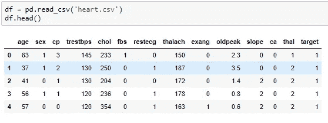

Figure 1: Data Frame

数据框有 14 列和 303 个观测值。未检测到缺失值。1 个特征是 float 类型，其余的是 int 类型。这意味着所有的特征都是数字的。

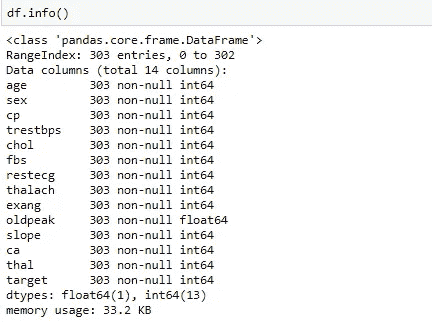

Figure 2: Data Types

## 4.数据清理

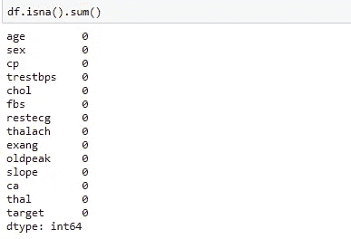

Figure 3: Missing Values

我们看上面，没有缺失值。那很好。

## 极端值

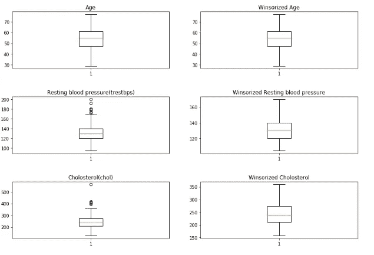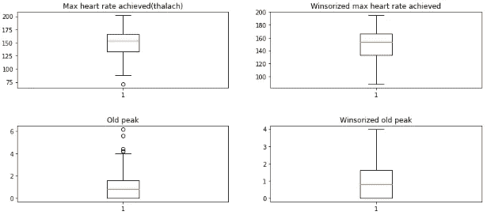

Figure 4: Outliers With Boxplot

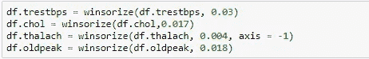

Figure 5: Outliers Winsorized

## 5.探索数据

## 分类变量:

*   性
*   空腹血糖
*   静息心电图结果
*   运动诱发性心绞痛
*   thal
*   目标
*   胸痛分布

## 连续变量:

*   年龄
*   胆固醇血清
*   达到的最大心率(thalach)
*   旧峰
*   倾斜
*   主要船舶数量(ca)
*   trestbps

## 让我们来看看有多少人被诊断患有心脏病

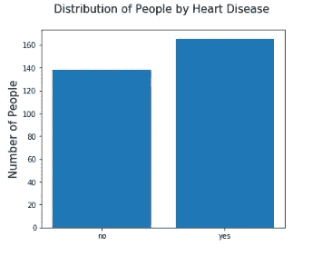

Figure 6: Distribution of People by Heart Disease

## 让我们来看看被诊断人的分类变量的分布:

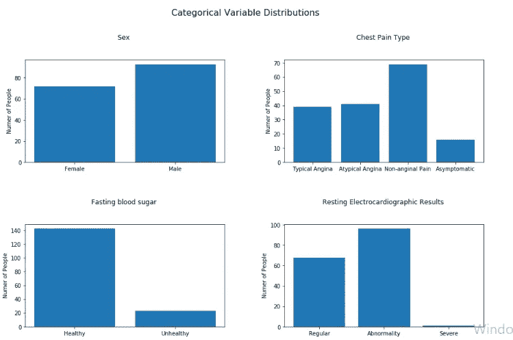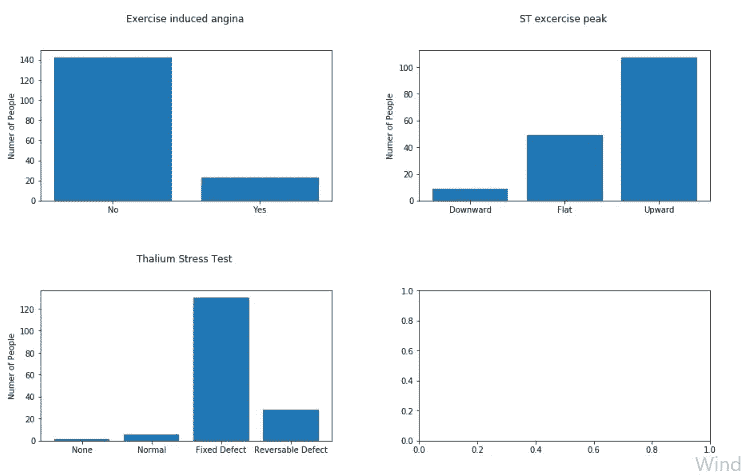

Figure 7: Categorical Variables Distributions

## 胸痛分布

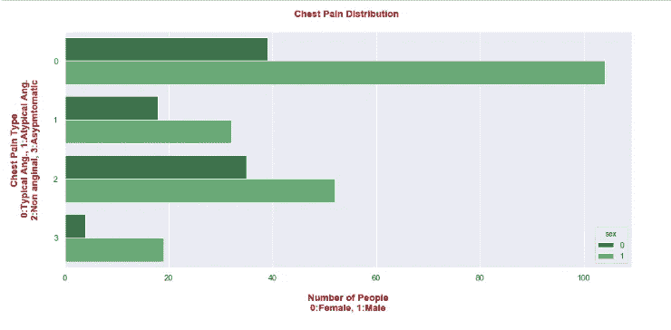

Figure 8: Chest Pain Distributions

## 被诊断者变量的相关性:

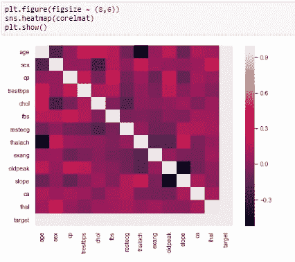

Figure 9: Correlations

## 6.特征工程

## 目标变量是“目标”，它询问“患者是否被诊断？”

我们的“目标变量”是诊断变量。它在数据框中被称为“目标”。它有两个值，0 和 1。“0”表示此人没有患心脏病的风险。“1”表示该人被诊断为心脏病患者。在这一部分，我们将试图找到可能对心血管疾病有影响的因素。

## 快速观察老化效应:

```
Mean age of people 54.366336633663366
Mean age of risky people 52.4969696969697
Mean age of not risky people 56.60144927536232Patients over 54 diagnosis ratio: 40.88 %
Patients under 54 diagnosis ratio: 69.44 %Ttest_indResult(statistic=4.014560975148874, pvalue=7.524801303442373e-05)
```

正如我们从“低 p 值”中看到的，年龄变量也对我们的目标变量有影响。

```
For Sex: Ttest_indResult(statistic=5.078601298959069, pvalue=6.678692115314158e-07)
For Fasting blood sugar: Ttest_indResult(statistic=0.48676722971222014, pvalue=0.6267775474340544)
For Exercise induced angina: Ttest_indResult(statistic=8.42332702774835, pvalue=1.5208138383314295e-15)
```

很容易看出，如果我们假设显著性水平为 0.005，“性别”和“运动诱发的心绞痛”具有统计学显著性。

## 胸痛类型的风险比:

```
Heart disease risk for Typical Angina is 27.3 %
Heart disease risk for Atypical Angina is 82.0 %
Heart disease risk for Non-anginal Pain is 79.3 %
Heart disease risk for Asymptomatic is 69.6 %
```

正如我们所见，最常见的类型是典型的心绞痛，但与其他类型相比，其风险率较低。

## 确诊人群的主要血管分布:

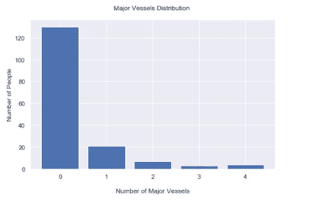

Figure 10: Major Vessels Distributions

正如我们上面看到的，大多数被诊断的人没有大血管。

## 运动 ST 段峰值的斜率:

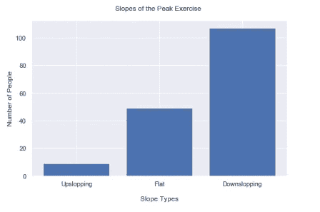

Figure 11: Slopes of The Peak Exercise

大多数被诊断的人的坡度类型是“下坡”和“平坡”型。

## 通过增加年龄值绘制连续变量:

下面，我们将看到多个情节。左手边显示的是被诊断的高危人群。右手边显示了没有风险的人的阴谋。t-检验结果是由目标 0 或 1 分隔的每个变量之间的结果。意思是不冒险或者冒险。

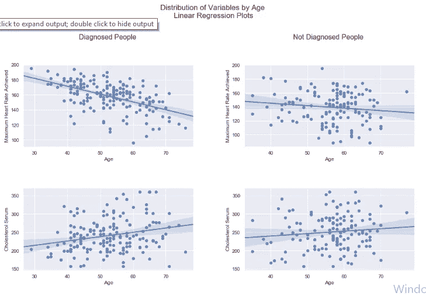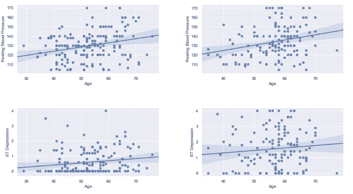

Figure 12: Distributions of Variables by Age

这里，我们获得了 4 个连续变量的 T 检验结果。达到的最大心率(thalach)、胆固醇血清(chol)、静息血压(trestbps)、运动相对于静息诱发的 ST 段压低(oldpeak)。然后我们绘制了年龄回归图。

```
For Max heart rate achieved: Ttest_indResult(statistic=8.081413505135504, pvalue=1.5685961884291452e-14)
For Cholosterol: Ttest_indResult(statistic=-1.8450949469288447, pvalue=0.06600591944411106)
For Resting blood pleasure: Ttest_indResult(statistic=-2.384497019636299, pvalue=0.01772166556165761)
For ST depression: Ttest_indResult(statistic=-8.4214886230112, pvalue=1.5402537989685674e-15)
```

除了“胆固醇”之外，所有属性都具有统计学意义。

## 主成分分析

我们已经进行了主成分分析，以了解较少的变量共享多少方差。这对于将数据实现到机器学习模型是很重要的，我们不打算在此分析中处理。

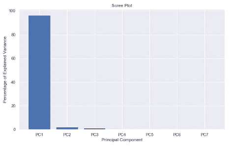

Figure 13: PCA Scree Plot

好成绩。第一个主成分占方差的 96.1%。这意味着，可能不需要使用所有五个变量。

## 7.结果

现在，我们完成了我们的分析。我们理解数据，对变量进行分类，绘制图表，进行一些测试，并试图实现对我们的目标变量有影响的东西。我们已经取得了一些成果；

1.我们的目标变量由确诊或未确诊的人数来平衡。

2.对心脏病诊断有重大影响的变量:

年龄

性；男性更容易被诊断出来

运动诱发性心绞痛

达到的最大心率(thalach)

静息血压

圣抑郁症(旧峰)

3.无统计学意义的变量:

胆固醇血清

空腹血压

4.指向重要性的变量:

胸痛分布；所有类型的人患心脏病的风险大小不同。

典型的心绞痛没有其他的那么危险。

斜坡类型；下坡型和平地型是最常见的。上坡很少见。

主要船只；我们知道血管直径对心血管疾病很重要。在这里，大多数被诊断的人没有大血管，这绝对是一个重要的信号。

5。主要成分:

使用 python 中的 pca 模块，我们发现第一个主成分代表了最大的方差，为 96.3 %。

## 8.结论和进一步研究

我的假设是，一些变量可能是即将发生或已经存在的心脏病的迹象。对于一个强大而精确的预测模型，我们需要更大规模的数据，更多的变量，更多的观察等等。在这个分析中，我们有一个小规模的数据，不包括足够的属性数来精确地说话。但是，简单的数据也可以说明一些关于我们的目标的重要信息。我们有什么？统计学上，显著性值用 t 检验显示。我们已经看到了哪些属性可能会对心脏病产生影响，如结果部分所解释的那样。

## 对未来工作的建议:

有哪些地方可以做得更好？在我看来，我们需要更多的属性和更多的观察值来高精度地分析数据。例如，包括社会日常生活、生活方式、身体属性、饮食、酒精和吸烟习惯、锻炼频率、锻炼类型等的数据。可能对预测非常有效。当观察数量增加时，非目标变量之间的关系可以进一步研究。