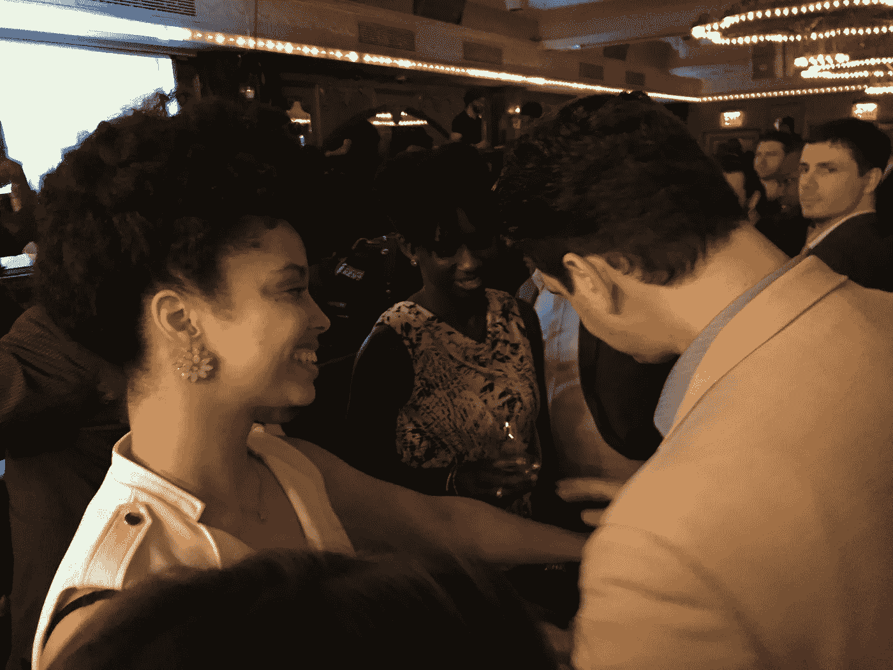

# 你可以从魔术师身上学到的职业经验

> 原文：<https://medium.datadriveninvestor.com/career-lessons-you-can-take-from-magicians-5d2ac6833fdc?source=collection_archive---------19----------------------->

## 这是一个艰难的工作场所，每个人都必须有自己的 USP。

The author, performing for [America Needs You](https://www.americaneedsyou.org/).

很久以前，我在拉斯维加斯参加了一次演讲，一个魔术师问了一个简单的问题。“当你有心脏病的时候，你会去看什么样的医生？一个专家，还是一个适合所有场合的*医生*？

我认识的大多数魔术师都是专家。我认识擅长贸易展览、婚礼、儿童表演、降神会的魔术师。老实说，可能有魔术师只做葬礼。值得注意的是，成为这些领域的专家不仅仅是在你的网站上放一个专业。

如果你是一名魔术师，或者任何类型的表演者，你必须拥有你所熟知的东西。一些演员以他们的喜剧天赋而闻名，而另一些则以他们融入角色的技巧而闻名。一些音乐家演奏爵士乐或摇滚乐。

魔术师一般不会靠做舞台剧或者电视特辑来谋生。大多数魔术师靠在受雇的活动中表演来谋生。成为一名专业魔术师不仅仅是成为一名“通灵者”或“纸牌高手”，这是文体上的专长。这是关于成为儿童聚会、贸易展览或餐馆的专家。这是关于比你的客户期望的更了解他们的需求。

## 魔术艺术的专业

任何人都认为艺术是自我表达，只是“做你自己的事情”如果你有信托基金，这是真的，但对大多数艺术家来说，生活就是做商业上可行的工作。

很容易想象这对插图画家、电影制作人或作家意味着什么。由于魔术师不被大多数人理解(通过设计)，很少有普通人理解我们的专业是什么。甚至很多专业魔术师认为他们表演是因为他们必须让自己开心，仅此而已。这与事实相去甚远。

在我们继续之前，先想象一下你是一个专业的魔术师。你知道很多很棒的效果，而且你有着人们喜欢的闪亮的个性。你会如何在鸡尾酒会上工作？你会冒着打断谈话的风险走向任何人吗？你愿意只为那些无事可做的壁花表演吗？当每个人都试图相互交谈时，你会要求他们注意吗？要考虑的事情很多。

专业魔术师对他们的专业领域非常了解。当我开始时，带我参加第一次职业演出(一个乡村俱乐部的聚会)的朋友告诉我，我的工作是打破僵局。从最基本的层面来说，这是派对魔术师的核心工作。告诉我更多的信息会让我不堪重负。即便如此，这也是一个非常专业的想法。

我很快就发现，专门从事成人派对的意义远不止是运送一艘破冰船。是关于处理社交场合的。你看，人们经常不知道为什么他们对事物的感觉是这样的。这就是为什么专家受雇于艺术界，更确切地说，是活动策划人。

我如何在我的职业中解决这个问题？我问自己，“我的客户需要什么？"

## 计划不周的派对有什么危险？

人们并不总是知道为什么他们在聚会上时好时坏。当你问客人为什么他们在某个环节过得不好，但原因实际上是他们不知道或不理解的事情时，他们仍然会提出正当理由。

你自己可能也这样做过。你喜欢这部电影吗？不，因为座位坏了，但是因为你不是室内设计师或木匠，所以你对此不敏感，你只是决定表演不好。这就是*一切*运作的方式。

这些理由将永远影响派对宾客对该事件的记忆，以及他们对同一个人举办的未来活动的看法。确认偏见占了上风。很快，客人们会根据他们想象的第一次聚会的失败来判断食物、公司或环境。

一旦评估了客户的需求，如何解决这些需求呢？

## 我的 USP

U nique 卖点。这就是你需要的。为了确定你的工作是什么，你需要了解你的工作到底是什么。让我们倒回去一点。为什么一个人首先要为聚会雇佣一个魔术师*？为什么不是弦乐四重奏，或者脱衣舞娘？因为你和/或你的客人喜欢魔术，但为什么要在派对上雇一个专家呢？为了保持相对简单，让我们坚持以鸡尾酒会为例，因为它们适合许多类型的活动。*

无论你是要举办公司圣诞派对，还是要举办正式晚宴，你都不可能无处不在。魔术师被雇来“让派对变得更好”，但这到底是什么意思？

第一:魔术师是做什么的？他们娱乐和吸引人们。与演员或音乐家不同，魔术师可以做到这一点，而不会用声音压倒聚会或迫使所有对话停止。在鸡尾酒会的背景下，魔法可以在不改变基本动态的情况下发生。

这一点，加上“魔术师是什么”的概念，给了魔术师没有主人也没有其他艺人拥有的工具。我们在正常的班级结构之外工作。

一个政党的社会动态可能是一个雷区。美国的这个问题比我去过的任何地方都严重。对社会动态的后果视而不见会导致尴尬，这是一个好政党的敌人。

层级是这样的:主人、贵宾、客人、员工。主人的态度和行为是贵宾和客人行为举止的指南。如果主人是一个亲密交谈的拥抱者，客人会陷入这种行为。如果主人给每个人很多私人空间，举止优雅，其他人都会回应。不必深究，这就是礼仪的全部:避免尴尬。礼仪不是为了礼仪而礼仪。这就是它的用途。

工作人员在那里听从主人的明确命令。他们得到了报酬。他们会因为每个笑话而发笑，就好像它很有趣一样，他们会宠爱每个客人，因为这是他们的工作。不要利用他们。也许最重要的是，工作人员是主人唯一可以直接交谈而不会产生社交后果的人。艺人，包括魔术师，都是工作人员。与大多数其他工作人员不同，魔术师获得了其他人没有的社会资本，甚至主持人也没有；我们有魅力。

主人认识客人，客人也认识主人。主人向客人提出的任何问题都承载着语境和社会意义。魔术师就不一样了，他被当成了小名人。

假设情况:假设当客人开始到达时，主人还在厨房工作。客人很可能会被主人吸引，这意味着他们会挤进厨房。

主持人忙得没空说话。客人们最终都会打包进厨房，既靠近主人，又感觉自己被忽视了，因为他们确实被忽视了！主持人忙！

在某种程度上，客人会觉得他们只是在闲逛；而不是在正式的聚会上，他们会开始打破社交规则，冒尴尬的风险。

一旦厨房里挤满了足够多的客人，溢出的人就会在厨房门口附近徘徊。会变得拥挤和不舒服。它会阻止管理党的人四处走动，把事情做好。它毁了聚会。

结果:主持人不能真正做食物准备工作，也不能做介绍。如果客人真的不擅长参加派对(是的，社交是一项技能)，派对就会很快变得乏味。

稍微不同的场景:假设主人有员工，他们在厨房工作，在主聚会空间为客人服务。一些客人会在厨房附近徘徊，希望第一个吃到那些培根包裹的无花果。现在，客人挡住了工作人员的路，他们无法面对他们的行为。为什么？社会等级制度。

我们说在美国没有课，但至少在聚会上，我们有。帮工是食物链的最底层，不能跟任何人顶嘴。这和为什么勾引家政人员很没品味是一个道理:他们不能表达自己(提示:他们不感兴趣)而不担心失去工作。不管怎样，那些客人不应该在那里。

主人认为他们认识每一个人，所以他们可以让他们离开。如果到了那一步，事情就真的失控了。先不说餐饮服务商不能这么做，如果主人因为主人很忙或员工需要工作空间而要求一群客人离开厨房，这可能会激怒一些人。由于社会等级关系，客人不会对主人说什么，但可能会感到委屈。这就是他们对派对的记忆。

与此同时，主人在派对上修复尴尬的每一刻，都没有花时间来策划介绍或享受他们为自己举办的派对制定的计划。是毒药。

魔术师出场了。魔术师不是一个要求客人做正常事情的正常人，所以魔术师不会要求他们离开员工或不要在他们碍事的地方闲逛。

如果一个魔术师让这些客人跟着他去另一个房间“看一些真正酷的东西”，那么这些客人会被娱乐，而不是被冒犯。当其他客人听到其他房间的每个人都玩得很开心时，客人就会远离厨房，从而缓解压力。这并不是说主人不能要求他们移动，或者这样做会出格，但魔术师会以一种不会改变客人对主人或聚会的感觉的方式来做。

同样的原则也适用于有技术问题的乐队，或迟到的贵宾，或让壁花去见酷人。魔术师可以在无形中做到这一切；我不是让人们走开，或者安静下来，或者无视那个把酒洒了一地的客人，我是让他们开心。

## “你是怎么做到的？”

为了有效地做这些事情，魔术师必须知道聚会是如何进行的。像我这样的专家必须与活动策划人交谈，与拥有场地的人、门卫、酒保、剧院导演、音乐家、宴会承办人、赌博服务提供者、派对舞者、滑稽演员交谈，与任何以举办派对为生的人交谈。这些人中的每一个人都有一张图片，每张图片都包含一些有用的东西。

这里有一个具体的例子来说明这种专业知识的回报:

我的一个神奇客户雇我开派对。它计划得非常好，有一个乐队、一个滑稽舞者、一个杂耍演员、赌桌和一个导演。这是史诗。

大约晚上 9 点，主宾的一个朋友喝醉了，在酒后说了一些非常无礼的话。每个人都听到了他的声音，乐队在那一刻安静了下来。它直接出自《T2》中的《宋飞正传》。

这一刻对于主人和客人来说都非常尴尬。我请主人(主宾的女朋友)为醉汉叫一辆出租车，告诉出租车公司醉汉的地址，提前付钱，告诉出租车司机我会把醉汉送到他那里，出租车到楼下时给我一个高信号。值得一提的是，这远在优步之前，必须通过打电话给人们来完成。

我走到醉汉身边，把他逼到角落里，用一些魔术逗他开心，让他退出了社交圈子。这意味着没人需要和他打交道。

当我拿到高牌时，我告诉他穿上外套，然后带他下楼“给他表演一个很酷的魔术”我让他想一张扑克牌。然后我走向驾驶室，在后座的窗户上喷了一副纸牌。醉汉看着窗户，没有看到任何异常，这当然是我所期望的。我告诉他打开车门，看看驾驶室的另一边。他做到了。我在他身后关上门，出租车送他回家。任务完成。

另一件要记住的事情是，你不是为自己而存在。你在那里是为了客人。聚会有办法突出客人之间的差异(因此有着装要求)。如果有人更穷，更不善于社交，或者是残疾人，一个聚会真的可以让他们与众不同，如果不是为了其他客人的话。

作为一名魔术师，我为任何有残疾的客人准备了材料，这是非常重要的，这样他们就可以得到一些不负面的特别的东西，因为即使没有人对他们不好，如果他们不能跳舞，或听不到音乐，他们可能会为此感到难过，而我不能有这种感觉。

事实是，由于大多数在派对上表演的魔术师在派对过程中只表演大约 20 分钟的内容(你为不同的观众做了很多相同的东西，很少有人想看到超过 5 分钟或 10 分钟的内容)，但实际上知道几个小时的内容，所以很容易为最欣赏善意和关注的客人留出一些特别的东西。

## 外卖食品

如果你想与众不同，那就成为专家。这是一个独特的卖点。这是雇用你的理由，而不是其他任何人，或任何其他职业。

这是我可以谈论我的专业的细节层次，这也是我从事许多工作的原因之一。无论你的职业是什么，你都需要根据潜在客户的真实需求给自己打上专业的烙印，并学会谈论你如何在这个特定而狭窄的专业领域增加价值。

当然，你不会成为所有工作都被雇佣的人，但是如果你的专长满足了客户的需求，那么你将成为你所在领域的关键人物。你将会更经常地被求助，你将能够收取更多的费用。所以，走出去，找到让你与众不同的地方，并擅长于此。

## 这是我的[推特](https://twitter.com/MrLichtenstein)，和我的[网站](http://magician.nyc)。对彼此好。