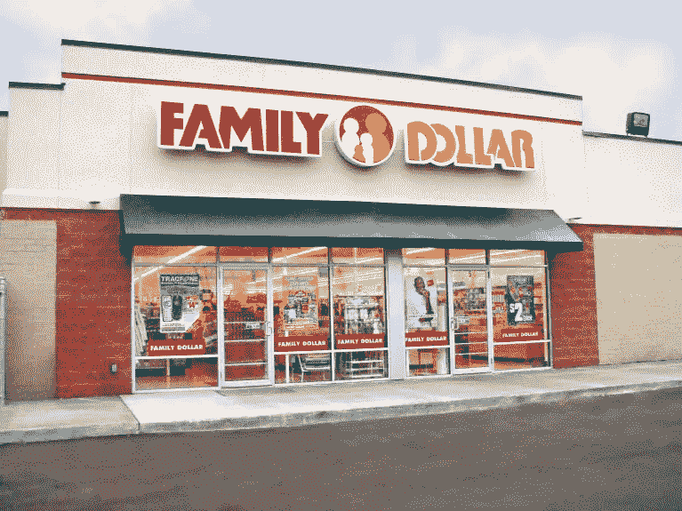

# 卡尔·伊坎去一元店购物

> 原文：<https://medium.datadriveninvestor.com/carl-icahn-goes-shopping-at-the-dollar-store-f3c48773be69?source=collection_archive---------9----------------------->

一元店可能不像是 M&A 感兴趣的目标，但该行业最近的困境让华尔街的交易撮合者蠢蠢欲动。

在过去的二十年里，这个行业有了显著的发展，尤其是最近的经济衰退吸引了更多寻找廉价商品的家庭。

 [## 算法交易的机器学习-数据驱动的投资者

### 当你的一个朋友在脸书上传你的新海滩照，平台建议给你的脸加上标签，这是…

www.datadriveninvestor.com](https://www.datadriveninvestor.com/2019/01/30/machine-learning-for-stock-market-investing/) 

事实上，三家最大的连锁店——Dollar General、Family Dollar 和 Dollar Tree——已经将其商店总数从 1994 年的大约 5000 家增加到今天的大约 24000 家。

但在进攻的时候，即使是最好的防守也没有多大用处，由于经济复苏和削减最贫困顾客使用的食品券计划，商店最近失去了顾客。

今年 4 月，Family Dollar 报告称，其第二财季净销售额下滑 6.1%，可比同店销售额连续第三个季度下降，该公司已关闭 370 家门店。

几乎像时钟一样，投资者卡尔·伊坎宣布他已经获得了该公司 9.4%的股份。伊坎说，这些股票被低估了，他打算讨论可以提高股东价值的策略。

媒体猜测，这可能意味着与美元通用的合并。

华尔街也是如此。就其本身而言，瑞士瑞信银行认为这样的交易是有意义的，尽管 Family Dollar 在 6 月 9 日采取的毒丸计划表明他们正在准备战斗。