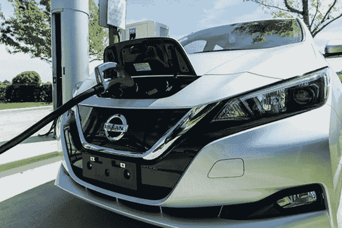

# 汽车制造商希望让他们的电动汽车听起来“很酷”

> 原文：<https://medium.datadriveninvestor.com/carmakers-want-to-make-their-electric-vehicles-sound-cool-361e72f95fbe?source=collection_archive---------22----------------------->

## 不就是这样吗？加速引擎，宝贝！

传统上，我们基于感官来看待对汽车的兴奋:视觉、听觉、触觉，甚至*嗅觉*(希望不是味觉)。从一开始，它总是关于当我们转动钥匙时，我们最终从引擎中听到什么，让我们知道旅程准备好了。但是由于电动汽车技术的出现，这在今天还不完全可能。

# 然而，事实证明，汽车制造商正在构思一些非常邪恶的想法:比如为未来的声音提示编程

毕竟，你需要知道你的车已经启动了，对吗？有道理。这是后石油时代的真正交易，在这个时代，电动汽车零排放，由于燃油喷射，甚至不需要听到发动机启动的声音。内燃机不再是必要的了，因为当你驾驶它们时，它们会发出呜呜声。

但是我们错过了启动汽车的快乐。对吗？你不会相信第 89 届日内瓦国际车展上发生了什么，奥迪推出了**“Q4 e-Tron 概念车”**，这款车每次启动时都有一个独特的身份。

宝马(BMW)和大众(Volkswagen)也加入了这股潮流，推出了他们自己的概念，用一些**低音**来支持软引擎，认为它必须更“未来”

 [## 在自动驾驶汽车发生事故的情况下，谁应该承担法律责任？-数据驱动型投资者

### 我仍然认为自动驾驶汽车是一种奢侈品，而不是必需品…

www.datadriveninvestor.com](https://www.datadriveninvestor.com/2018/11/02/who-is-legally-accountable-in-the-case-of-an-autonomous-vehicle-accident/) 

不要笑。这些是汽车行业高层正在进行的真实讨论。从某种角度来看，这确实很有意义——这些汽车确实有自己的身份。作为人类，我们个人认同他们。我们已经这样做了几十年。我们的汽车就像我们的孩子——有些人甚至会把他们的汽车视为配偶！

在所有条件相同的情况下，当你将自己的个性与你驾驶的汽车联系在一起时，从营销的角度来看，汽车制造商希望保持这种联系是有道理的，但更重要的是注重功能:例如，梅赛德斯-奔驰(Mercedes-Benz)开发了一种人工噪音，在行人靠近时发出警告。

尽管如此，其他汽车制造商仍希望完全发挥创造力，利用摇滚乐队 Linkin Park 的力量，采用一种似乎更前沿、更原始的声音，就像梅赛德斯-AMG 的产品一样。当然，这最终会告诉你什么才是真正重要的:

# 事实是电动汽车没有这种“声音”

没有。这实际上必须是发明出来的东西，而不是作为成长文化的一部分被采纳。内燃机的声音是不可避免的，但它成了我们成长、社会和欲望的一部分。现在我们没有了。*还没完*！现在，我们或许很快就会从汽车制造商那里看到这一点。

你对汽车制造商今天推出的产品有什么看法？ [**注册一个免费的 VIGYAA 账号，开始写下你的一些想法吧！**](https://vigyaa.com/accounts/login/) 另外， [**查看数据驱动投资者了解更多技术洞察**](http://datadriveninvestor.com) **！**