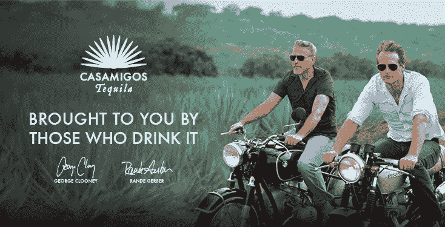

# Casamigos，Honest Co，Dollar Shave Club:积极的意识形态如何创造独角兽

> 原文：<https://medium.datadriveninvestor.com/casamigos-honest-co-dollar-shave-club-how-positive-ideology-creates-unicorns-e75b2e17c25e?source=collection_archive---------3----------------------->

## 我们能从获得独角兽地位的实体初创企业身上学到什么

在关于帝亚吉欧和卡萨米戈斯的新闻之前，我是以消费者的身份看待这些品牌的，认为它们都“非常酷”，因为我没有太多地考虑它们。当 Casamigos 一个月前被以 10 亿美元收购时，我开始想得更多，一些事情发生了。

## 好人，好的估价

HONEST(公司)，Dollar Shave CLUB，HOUSE of FRIENDS (Casamigos 龙舌兰酒)，INNOCENT(酒水)。所有这些都是快速消费品领域的初创公司，在早期阶段被大型工业集团以巨额价格收购或锁定。

无辜或诚实的人把自己定位为“道德的”，对使用者和地球都有好处。Dollar Shave Club 和 Casamigos 明确表示属于一个社区或部落。他们都有一个积极的意识形态作为立国原则。

对于相对年轻的小品牌，它们的估值也很高。

2016 年 7 月，联合利华宣布将以 10 亿美元收购 Dollar Shave Club，超过该公司收入的 5 倍。

几个月后，同一家大型快速消费品公司正在谈判以同样的价格，或 4 倍于公司收入的价格收购亏损的 Honest Co。这笔交易最终告吹，联合利华选择以更低的价格收购竞争对手品牌第七代。

2017 年 6 月，饮料巨头帝亚吉欧(Diageo)以 10 亿美元(约为其收入的 30 倍)收购了龙舌兰酒品牌 Casamigos。

从正统的金融观点来看，以收入的倍数估值(更别说 30 倍了)实际上没有意义。

当 Innocent 被可口可乐以区区 3 . 2 亿英镑收购时，它的规模要大得多。但那是在 2013 年…也许他们应该再等几年。

# 当估值无法用数字来解释时

所有这些公司都精通数字技术，但他们都以传统方式销售产品。你不能把它们与为数字接口而战的公司相提并论，在那里你可以梦想十亿用户和天文数字的增长。

我职业生涯的最初几年是在 M&A 度过的，我对那段经历记忆犹新，知道用倍数、贴现现金流或任何传统金融模型来解释这些估值(尤其是 Casamigos)几乎是不可能的。

会不会是企业巨头忘记了他们的数学？毕竟有创业狂潮。还是他们对名人神魂颠倒？卡萨米戈斯的创始人之一是乔治·克鲁尼，诚实的创始人是杰西卡·阿尔芭。

明星云集的公司当然有巨大的公关价值。卡萨米戈斯/克鲁尼已经为帝亚吉欧创造了比他们自己更多的头条新闻。那些头条价值数百万，但不是数十亿。

Dollar Shave 的首席执行官绝不是名人，但他是 YouTube 上的红人，也是一名相当不错的演员。关于他们的订阅模式和保留率[已经说了很多，包括在这篇关于 Medium](https://medium.com/@nbt/the-secret-behind-dollar-shave-clubs-billion-dollar-success-in-one-graph-f02fba883635) 的文章中。

所有这些都有很大的价值，但是……仍然不够。

你不能只看数字。

# 独角兽的 DNA

所有提到的公司都有一个共同点，那就是他们的故事是多么清晰、简单和可信。

当杰西卡·阿尔芭成为一名母亲后，她创办了 Honest，因为她找不到她想要给孩子的好产品。

克鲁尼和他的朋友们想做出最好的龙舌兰酒，供放荡的朋友们饮用。

美元剃须是为那些买得起最贵的吉列刀片，但也是嘲笑传统的名人代言营销的“圈内人”准备的。

这些故事被品牌以各种方式在公关和他们自己的传播中小心翼翼地重复。

就克鲁尼而言，是他的百万富翁身份和活泼好动的名声强化了这个故事，而不是他的名气。我们大多数人都是带着财务上的希望或者至少是为了实现个人抱负而创业的。但是克鲁尼先生还想要什么呢？很容易相信他的龙舌兰酒品牌是偶然出现的，而他纯粹是在追求享乐，寻找最好的龙舌兰酒。

这些故事变得与跨国品牌特别相关，因为它们与功能或情感利益无关。他们不会被更好的产品或更好的广告打败。它们也不能被复制，因为如果这个故事是由一个企业集团讲的，没有人会相信。

# 文化品牌和讲故事的公平性

对于帝亚吉欧、联合利华或可口可乐来说，时间会证明这项投资是否会有回报。然而，最新的收购只能用来自[文化品牌](http://culturalbranding.org)的潜力和这些创业公司的创立故事来解释。

对于克鲁尼的粉丝来说，迫切的问题是:既然好莱坞的薪水将少于他现金的利息，他还会费心回去演戏吗？他很可能会专注于龙舌兰酒和双胞胎。

