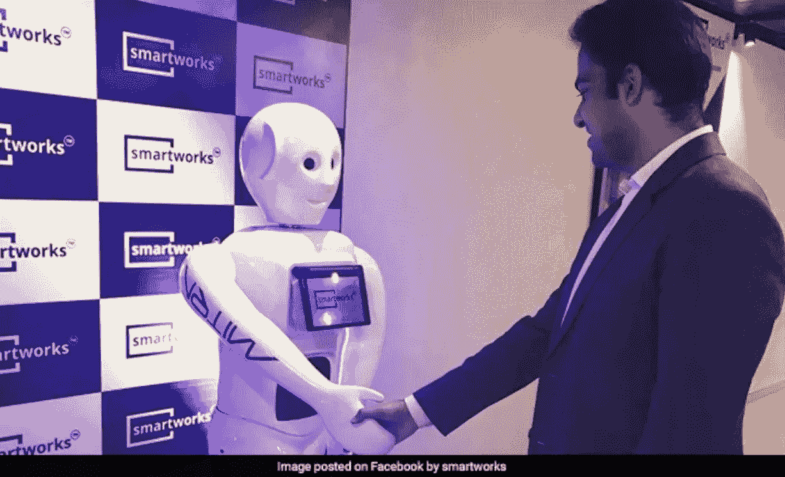

# 案例:一个商店的启动变成了机器人的巨大成功

> 原文：<https://medium.datadriveninvestor.com/case-story-a-store-launch-turned-into-a-massive-success-with-robots-b9c5f658f317?source=collection_archive---------5----------------------->

# 营销是关于创造力的。独特做事的品牌赢得品牌竞赛。

几个例子可以进一步说明这一事实。运行快闪族，公路和公共场所的古怪海报，电视上令人难忘的广告活动，以及社交媒体活动都很好地达到了吸引眼球的目的。

然而，当我们在一个禁止直接促销或广告的场所计划一个低调的商店发布会时，我们脑海中弹出的选项很少。

想出一个主意很有挑战性。

我们的一个客户在偶然发现 Mitra Robot 的网站之前也有类似的情况。这个想法是用机器人来传播信息！

莱克哈女士是一家专注于健康饮食的初创企业的创始人，她想出了一个绝妙的主意，让我们的人形机器人在一家企业自助餐厅宣传她的商店。

Lekha 夫人使用 Mitra 成功吸引了眼球，她在这家科技公司的自助餐厅区逛了一整天，回答了一些基本问题，并在午餐和茶歇时间与兴奋的员工握手。

关于 DietLabs 的消息最终传开了，因为他们试图知道是谁带来了这个机器人。最终，在坚持“无广告”政策的同时，商店开业的第一天就获得了所有必要的关注。

这也是一次奇特的营销成功。

机器人在美洲、欧洲和印度正成为一种蓬勃发展的趋势，尤其是在大流行后的世界。此外，语音识别和计算机视觉的进步正在使(各种)机器人的体验变得美好而难忘，以同样的效率吸引着孩子和成人。

*原载于 2018 年 7 月 16 日*[*【mitrarobot.com】*](http://mitrarobot.com/case-story-a-store-launch-turned-into-a-massive-success-with-robots/)*。*