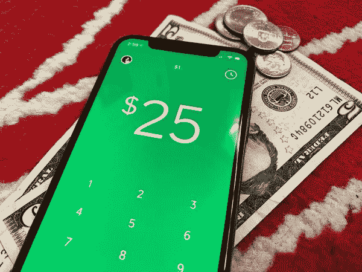
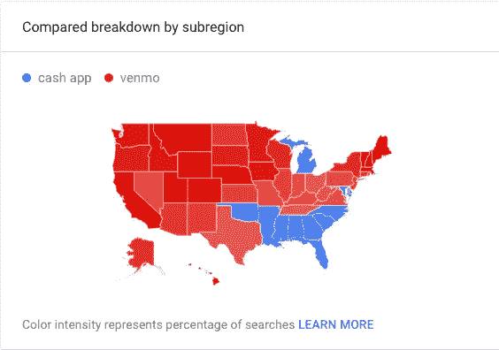
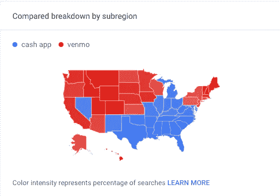
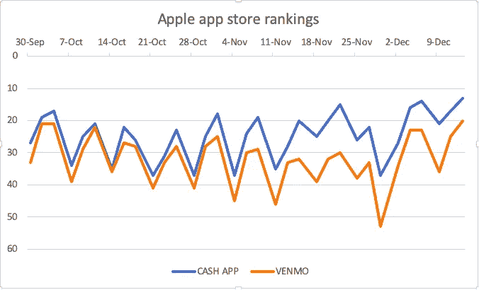
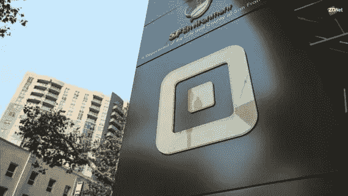

# 现金 App 可以改造 Square 及其估值

> 原文：<https://medium.datadriveninvestor.com/cash-app-can-transform-square-and-its-valuation-f0c521fcb772?source=collection_archive---------6----------------------->

就在几年前，Cash App 的季度收入还不到 100 万美元，截至今年 11 月，Square 披露 Cash App 的季度收入为 1.59 亿美元。不应忽视的一个因素是令人印象深刻的强劲增长率，在过去一年中，每个季度的环比增长率约为 20%。随着现金应用程序占 Square 调整后总收入的 30%左右，利润率接近 80%，并且还在不断提高，可以肯定地说，它现在是业务的重要组成部分，在大约两年多的时间里，它甚至可能占据 Square 的大部分收入。

 [## 分散金融的出现|数据驱动的投资者

### 当前的全球金融体系为拥有资源、知识和财富的人创造了巨大的财富

www.datadriveninvestor.com](https://www.datadriveninvestor.com/2019/03/14/the-emergence-of-decentralized-finance/) 

如今，Cash App 的收入主要分为即时存款费(每笔即时存款收取 1.5%的费用)和借记卡每次刷卡的交易费。这两者之间的构成被认为是大约 85%的即时存款对 10%的卡交易和 5%的其他交易，但随着 Cash App 开始向为其用户提供全面服务的银行转变，这种情况似乎正在发生变化，有利于卡交易。随着越来越多的用户开始存储资金，并利用现金应用程序作为他们的主要银行，收入来源应该转变为主要来自卡费以及总存储余额的利息，类似于传统银行。截至第三季度，Cash App 拥有 6.6 亿美元的存储资金，同比增长近 150%，其增长速度实际上还在加快。用户似乎越来越习惯将现金应用作为主要银行。凭借该应用程序提供的实用工具，这似乎并不令人惊讶。除了显而易见的 P2P 资金转移之外，一个主要的诱惑是提供折扣或“促销”,给某些产品 10-20%的折扣，以及每杯咖啡整整一美元的折扣。用户甚至可以买卖比特币，最近还可以买卖股票。随着不断的创新，Cash App 已经将 Venmo 甩在了身后，他们所能做的就是继续复制功能。

Cash App vs Venmo search breakdown — over last 5 years (left) vs today (right)

在理解 Cash App 潜力的重要性时，我们必须首先了解其前景和发展轨迹。在美国，P2P 领域正在迅猛发展，主要由 Cash App 和 Venmo 组成，Zelle、Apple Pay 和 Google Pay 等其他公司也贡献了一小部分份额。数据显示，超过 80%的 P2P 应用来自 Cash App 和 Venmo，这一数字每个季度都在增长。如今，Cash 应用程序以超过 2500 万的月活跃用户遥遥领先，而 Venmo 据信拥有约 1500 万至 2000 万的月活跃用户。平均而言，Cash App 的月下载量约为 200 万至 250 万次，今年 12 月将成为 Cash App 有史以来下载量最多的月份，与 Venmo 之间的差距最大，因为它在刚刚过去的这个周末甚至成功进入了 IOS 商店前 10 名，排名第 6。

随着应用程序的增长升温，考虑到它与甚至不提供 P2P 交易的传统银行相比所带来的效用，我们可能会看到现金应用程序在未来几年成为主流。一些人认为 Apple Pay 这样的对手是值得害怕的，但鉴于其已经有近 3000 万用户，它甚至无法在 P2P 领域取得进展，数据显示不到 5%的 P2P 流量来自 Apple Pay 平台。它似乎只是一个“移动钱包”,可以把你的卡放在一个地方。Apple Pay 目前对 Cash App 甚至 Venmo 几乎没有影响，当考虑到 Apple Pay 本身时，它在更大程度上的采用还有许多障碍，包括其固有的只对苹果用户开放的封闭环境问题，这表明它的存在对 Cash App 来说没有什么可怕的。如果 Cash App 不会受到 Apple Pay 或谷歌或脸书 Pay 等较弱对手的威胁，并且 Zelle 继续排在前 100 名应用之外，那么 Cash App 和 Venmo 建立自己的沙堡的市场已经成熟，现在，Cash App 正处于领先地位，因为它几乎是 Venmo 年收入增长率的两倍。

现在我们可以讨论对其估价的影响。如今的 Square 正处于 250-300 亿美元估值的中间，现金应用占其调整后收入的 30%，毛利率也令人难以置信地接近 80%，并且还在继续增长。与此同时，他们在 3.3 亿人口中每月有 2500 万活跃用户。收入的增长与其活跃用户群的增长类似，但增长率更高，这非常有希望，特别是考虑到仅在美国就有多大的市场。其月活跃用户从 2017 年 12 月的 700 万增加到 2018 年 12 月的 1500 万，今年 12 月预计将超过 2500 万。这种增长很大一部分来自用户的网络效应，在很大程度上，这可能会导致 Cash App 的增长持续下去，甚至有可能在人们对该应用更加熟悉后加速增长。

猜测这样一款应用的增长可能非常困难，有时看起来很随意，但最重要的两个因素如下:用户总市场，超过 3 亿人，以及该领域的竞争对手，这只是真正的 Venmo，随着 Cash App 在千禧一代中产生更多共鸣，它们似乎正在慢慢消退。

现金应用的激增首先来自于它所承载并继续带来的效用。随着一些用户现在将该应用作为主要银行使用，以及潜在的进一步产品，如信用卡或账户利息，最重要的问题出现了——是什么阻止了 Cash App 成为 1000 万至 2000 万或 5000 万用户的银行？Cash App 有望在短短两年内达到 5000 万的月活跃人数，但是什么阻止了它达到 100 或更多呢？即使只是 1000 万用户的主要银行，现金应用本身也将成为超过 500 亿美元的业务。我知道有一件事是肯定的，如果 Cash App 想从存储余额的利息中拿走一部分利润，就像他们对 boosts 所做的那样，并提供 1%的利润给我，让我把钱存在他们那里，而不是我的本地银行，我永远不会拒绝。

让这个故事更容易展开的是，当你有明星谈论，甚至有人歌唱 Cash 应用程序时。随着网络效应如此强大，其用户群增长如此迅速，Square 看起来将成为金融科技领域的真正赢家。如果有一只股票和一个故事，你可能希望在它起飞前被抛在后面，那就是 Square。