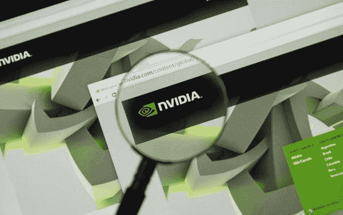
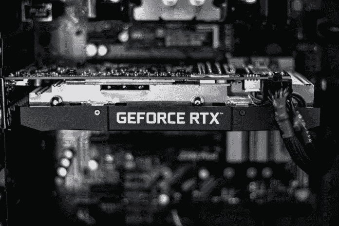

# 利用 NVIDIA 从视频游戏中获利——数据驱动型投资者

> 原文：<https://medium.datadriveninvestor.com/cash-in-on-video-games-with-nvidia-data-driven-investor-6e0b4b9360fa?source=collection_archive---------8----------------------->

价值投资者可以通过英伟达公司(纳斯达克股票代码:NVDA)的视频游戏获利。事实上，NVIDIA 允许游戏玩家利用经典的价值投资策略。策略是收购那些制造业务运作和增长所需的组件或基础设施的公司。NVIDIA 是一项价值投资，因为它生产显卡，图形处理器单元(GPU)游戏在其上运行。

因此，无论什么游戏热门，英伟达的投资者都能赚钱。因此，如果*顶点传说*比*堡垒之夜*吸引更多的玩家也没关系。解释一下，*堡垒之夜*和 *Apex 传奇*玩家都需要一台游戏机或电脑来玩游戏。

 [## 在自动驾驶汽车发生事故的情况下，谁应该承担法律责任？-数据驱动型投资者

### 我仍然认为自动驾驶汽车是一种奢侈品，而不是必需品…

www.datadriveninvestor.com](https://www.datadriveninvestor.com/2018/11/02/who-is-legally-accountable-in-the-case-of-an-autonomous-vehicle-accident/) 

NVIDIA 既生产游戏处理器，也生产显卡游戏，比如堡垒之夜。毫不奇怪，NVIDIA 正在将自己定位于从多人游戏热潮中获利。例如，据 PCWorld [报道](https://www.nvidia.com/en-us/geforce/graphics-cards/rtx-2060/)，英伟达正在将其 G-Sync 兼容显示器产品线扩大 41%。此外，英伟达还销售广受欢迎的 [GeoForce RTX 2060](https://www.nvidia.com/en-us/geforce/graphics-cards/rtx-2060/) 图灵架构显卡。

# **堡垒之夜*如何提升英伟达***

因此，每当像*堡垒之夜*这样的流行游戏困扰玩家时，NIVIDIA 就能赚钱。此外，每当一款大受欢迎的游戏风靡全球时，NVIDIA 的潜在市场就会扩大。

比如 2019 年 3 月全球有 2.5 亿*堡垒之夜*玩家，*游戏 Rada*r预估。此外，2019 年 3 月有 5000 万人在玩 *Apex 传奇*。因此，仅仅两个游戏就有 3 亿玩家。

令人惊讶的是， [*顶点传说*](https://marketmadhouse.com/is-electronic-arts-making-money/) 在 2019 年 2 月才首播，*堡垒之夜*才两岁。因此，视频游戏市场能够突然增长和瞬间瓦解。

在这种情况下，像电子艺界(NASDAQ: EA) 这样的游戏制造商是不稳定的，潜在的不可靠。然而，NVIDIA 是一家稳定可靠的公司，生产游戏玩家需要的关键组件。

# **英伟达是可靠的股息股**

不像电艺；*Apex Legends’*创造者，NVIDIA 股票分红。此外，英伟达的股息在过去六年中一直在增长。

事实上，英伟达的股息在六年间翻了一倍多。Dividend.com 报道，英伟达在 2012 年 12 月开始支付 7.5₵股息。

此外，自 2012 年以来，英伟达的股息每年增长约 1₵。例如，英伟达股票于 2019 年 3 月 22 日支付了 16₵股息，高于 2018 年 9 月 21 日的 15₵股息。

在这些情况下，英伟达在 2019 年 4 月 18 日提供了 0.34%的股息率，64₵的年化派息率和 9%的派息率。因此，英伟达是一只从视频游戏中获利的不断增长的股息股。

# NVIDIA 赚了多少钱？

目前，英伟达正在从其业务中产生大量现金。例如，英伟达报告 2019 年第一季度的运营现金流为 8.98 亿美元，投资现金流为 4000 万美元。

此外，英伟达在 2019 年第一季度记录了 6.95 亿美元的自由现金流。令人印象深刻的是，英伟达的自由现金流从 2018 年第四季度的 3.37 亿美元增长到 2019 年第一季度的 6.95 亿美元。此外，英伟达的运营现金流从 2018 年第四季度的 4.87 亿美元增长到四个月后的 8.98 亿美元。

因此，英伟达在 2019 年 1 月 27 日拥有 66.4 亿美元的短期投资和 7.82 亿美元的现金和等价物。因此，英伟达在 2019 年 1 月 27 日拥有 74.22 亿美元的现金和短期投资。

因此，英伟达有很多钱来支付股息。然而，英伟达既是一只成长股，也是一只股息股。

# **英伟达是成长股**

此外，**英伟达(纳斯达克股票代码:NVDA)** 在过去几年里经历了令人难以置信的增长。

例如，英伟达的股价在 2015 年 4 月 17 日为 22.20 美元，在 2019 年 4 月 18 日为 187.29 美元。因此，NVIDIA 的股票价值在短短四年内增长了近八倍。

然而，英伟达的股价在过去一年达到了 292.76 美元的高点。因此，NVIDIA 是一只支付股息的价格波动的股票。因此，你可以做空英伟达，或者将其作为股息股。

归根结底，英伟达可能是最通用的股票之一。它也是现存增长最快的股票之一。

# **NVIDIA 远不止游戏**

重要的是， [NVIDIA](https://www.nvidia.com/en-us/) 制造的远不止游戏和图形处理器。独特的是，英伟达处于[人工智能](https://www.datadriveninvestor.com/glossary/artificial-intelligence/)的前沿。

比如英伟达目前的产品线包括；[自主机器](https://blogs.nvidia.com/?s=Autonomous+Machines)、数据中心、[深度学习](https://blogs.nvidia.com/blog/category/deep-learning/) & [人工智能](https://www.datadriveninvestor.com/glossary/artificial-intelligence/) ( [AI](https://www.datadriveninvestor.com/glossary/artificial-intelligence/) )、设计和专业可视化、医疗保健、高性能计算、自驾卡、游戏&娱乐。因此，游戏只是英伟达业务的一小部分。

此外，我认为英伟达在自主机器上的工作可能比游戏更有利可图。例如，自主机器包括具有英伟达 [Isaac SDK](https://developer.nvidia.com/isaac-sdk) (软件开发工具包)的机器人 AI。Isaac SDK 是机器人高速应用的工具箱。

# **英伟达如何在自主机器上赚钱**

Isaac SDK 是 NVIDIA 用于机器人操作和自主机器的 Jetson 平台的核心。

值得注意的是，Jetson 平台在许多领域有许多潜在的用途。例如，美国大型杂货商**Kroger**和**Ocado Group PLC(LON:OCDO)**正在[建造](https://marketmadhouse.com/kroger-kr-and-ocado-plan-robotic-warehouse-in-ohio/)履行中心，数百个机器人在这里搬运和包装食品。

这些机器人都需要一个操作系统和一个处理器，英伟达可以提供这些。而且，英伟达正在研发一款名为 Carter 的自主送货和物流机器人。NVIDIA 的 Jetson AGX Xavier 机器人平台为 Isaac SDK 和 Jetson 运营的卡特机器人提供支持。此外，NVIDIA 还提供了一款更便宜、更小的机器人，名为 Kaya。

有趣的是，Kaya 可以成为其他机器人[的基础，比如部署在其履行中心的机器人](https://blogs.nvidia.com/blog/2019/03/26/jetbot-diy-autonomous-robot/) [Ocado](https://www.ocadotechnology.com/blog/2019/1/14/experimenting-with-robots-for-grocery-picking-and-packing) 。事实上，NVIDIA 出售一款售价 99 美元的机器人开发套件，称之为 Jetson Nano。

# **未来几年，对自主机器人的需求可能会激增**

NVIDIA 驱动的机器人和自主机器的用途远远超出了履行中心。例如，据《丹佛邮报》报道，机器人正在取代美国人称之为钻工的油田工人。

事实上，机器人在两年内取代了美国石油钻井平台上七分之五的钻工。具体来说，2015 年有 700 名钻工在 195 个美国石油钻井平台上工作。然而，在 2017 年，只有 177 名钻工在 192 个钻机上工作。

因此，自主机器的新用途；像杰特森纳米，可以很快出现，扰乱整个行业。因此，未来几年对 NVIDIA 自主机器的需求可能会激增。

# **NVIDIA 的又一次机会**

例如，美国公司 [Aitheon](https://www.aitheon.com/) 正试图建立一个数字生态系统，这将使自主机器的广泛使用变得容易。

独特的是，Aitheon 已经展示了自动驾驶汽车、机器人和机器人酒保，人类和人工智能可以通过远程控制进行操作。此外，Aitheon 正在计划人类可以远距离操作的自动商店和工业机器人。

如果成功，Aitheon 的系统将通过允许公司在没有人类直接监督的情况下部署机器人和自主机器来增加对机器人和自主机器的需求。取而代之的是，人类操作员或人工智能将使用[区块链](https://www.datadriveninvestor.com/glossary/blockchain/)通过遥控操作机器人。

例如，俄亥俄州的一个人可以在夏威夷的一个仓库或北极的一个矿井里操作一个[杰特森纳米机器人](https://blogs.nvidia.com/blog/2019/03/26/guardian-required-sarcos-industrial-robot-jetson-tx2-gtc-2019/)。具体来说，人类操作员将使用 Aitheon 的生态系统连接到机器人并操作它。

该操作将类似于人类军事人员如何操作美军部署在战场上的无人机。解释一下，内华达州的人类操作员控制中东、非洲和阿富汗的无人机。重要的是，Aitheon 正试图建立一个区块链市场，让自主机器操作员可以出售他们的服务。

# **英伟达和自动驾驶汽车**

此外，英伟达凭借其 NVIDIA DRIVE 操作系统成为自动驾驶车辆的领导者。重要的是，像捷豹和路虎的所有者**塔塔汽车(纽约证券交易所代码:TTM)** 和**丰田(纽约证券交易所代码:这样的大型汽车制造商正在使用 NVIDIA DRIVE。**

因此，NVIDIA 对于自动驾驶汽车来说是一项伟大的投资，因为它没有制造或部署汽车的风险。相反，像塔塔、特斯拉和丰田这样的公司制造和部署汽车。英伟达通过出售车辆运行所需的大脑来赚钱。

因此，无论英伟达在未来的业务中占据主导地位，它都可以从自动驾驶汽车中赚钱。值得注意的是，自动驾驶汽车已经有了市场。例如， **Alphabet (NASDAQ: GOOG)** 补贴 way mo[从**菲亚特-克莱斯勒(NYSE: FCAU)** 购买](https://marketmadhouse.com/fiat-chrysler-has-more-value-than-you-think/) 62，000 辆小型货车，用于其拼车实验。

因此，任何试验自动驾驶汽车的汽车制造商或公司都是英伟达的潜在客户。像 DRIVE 这样的解决方案的潜在市场将会增长，因为公司只是触及了自动驾驶汽车市场的皮毛。

显然，自主和遥控重型设备将很快成为英伟达的一个大市场。事实上，我认为自动拖拉机、建筑机械、挖掘机、叉车、起重机、[采矿](https://www.datadriveninvestor.com/glossary/mining/)机械和其他重型设备很快就会有很大的需求。NVIDIA 可以通过为重型设备改装驱动程序来在这个市场上赚钱。

# **英伟达惊人的增长潜力**

独特的是，我在这里提到的应用程序只是 NVIDIA 正在开发的硬件解决方案的一小部分。

除了自主机器，我认为 NVIDIA 的[深度学习](https://www.datadriveninvestor.com/glossary/deep-learning/)，专业图形和医疗保健解决方案也将有巨大的市场。例如，科学家们正在使用英伟达的深度学习，从减少餐馆垃圾到在星星上寻找外星生命。

与此同时，建筑师、游戏开发商、电影制作人、医生、科学家、电视制作人、城市规划者、军事战略家、发明家、[艺术家](https://blogs.nvidia.com/blog/2019/04/08/creators-imagine-future-nvidia-metropia-challenge/)和工程师使用 NVIDIA 专业显卡。为了解释这一点，工程师们使用与开发人员制作游戏相同的 NVIDIA 技术来设计新机器。

归根结底，英伟达的技术几乎在任何行业都有潜在的应用。因此，NVIDIA 是 21 世纪增长、分红和价值最佳的股票之一。

**丹尼尔·g·詹宁斯**作为一名职业作家已经有二十多年了。他撰写了大量关于商业、技术、经济、金融、金融技术、银行、投资、市场、股票市场、政治、哲学、历史和其他主题的文章。詹宁斯最喜欢的科目包括；零售、加密货币、加密资产、区块链、股票市场、国际政治、历史和美国政治。此外，Jennings 还为各种各样的客户撰写了数百篇自由撰稿人的文章和博客。詹宁斯目前为他维护的 Market Mad House 博客撰写大部分内容。詹宁斯拥有历史学学士学位和工商管理硕士学位。詹宁斯生活和工作在美国科罗拉多州。除了写作，詹宁斯还做过记者、编辑、应付账款专业人员和许多兼职工作。

*原载于 2019 年 4 月 23 日*[*https://www.datadriveninvestor.com*](https://www.datadriveninvestor.com/2019/04/23/cash-in-on-video-games-with-nvidia/)*。*