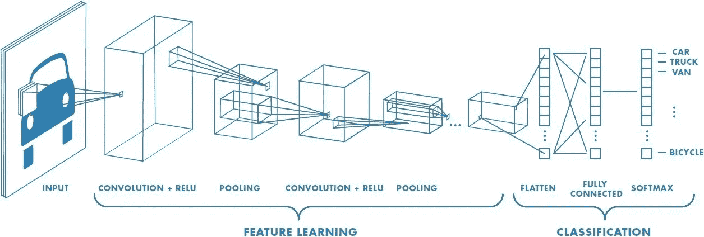

# 使用人工智能的猫 vs 狗

> 原文：<https://medium.datadriveninvestor.com/cats-vs-dogs-using-ai-a0a6db734f1d?source=collection_archive---------3----------------------->

Who’ll win? ;) (just kidding, this isn’t a competition)

你听过“下着倾盆大雨！”？如果是这样，你可能已经接受了这个事实，它只是一个短语，仅此而已。外面泼的是水，不是可爱的动物。

然而，如果它不仅仅是一个短语呢？我相信你会(或者至少我会)跑到窗前，看看各种各样的动物。波斯猫、牛头犬、金色拉布拉多、芒奇金猫(没错那是真名，别冲我来)、美国卷毛等等。

让我们现实一点。有时候你分不清哪只猫或哪只狗是哪只，但这并不意味着你不爱它们。

**但是……你猜怎么着？** 你知道电脑吗，那些让我们的生活轻松一千倍的很酷的东西？计算机无法区分 CATS 和 DOGS，更不用说区分它们的类型了。他们无法自然地将它们区分开来，至少。

 [## 用 7 个步骤解释深度学习——数据驱动投资者

### 在深度学习的帮助下，自动驾驶汽车、Alexa、医学成像-小工具正在我们周围变得超级智能…

www.datadriveninvestor.com](https://www.datadriveninvestor.com/2019/01/23/deep-learning-explained-in-7-steps/) 

**然而..也许我们可以帮助他们。我知道我们能帮他们什么(你可能也知道)！很微妙的暗示:就在标题里。**

现在，什么是人工智能？人工智能(AI)是计算机系统的理论和发展，能够执行通常需要人类智能的任务，如视觉感知、语音识别、决策和语言之间的翻译。这是一个发展非常迅速的行业。

但是让我们来关注一个特定的部分。**卷积神经网络。**

# 卷积神经网络

[**卷积神经网络**](https://blog.goodaudience.com/how-to-get-our-tech-to-tell-objects-apart-d4a0a5f84081) **或者 CNN 的本质上是对图像进行分类。**完美，对吧？这一次我不会拒绝。

好吧，这有点含糊。让我更深入地解释一下。

卷积网络是一种神经网络。他们通过“训练”对图像进行分类。下面这张图展示了它们是如何工作的！

首先，是输入层。这是真实的图像。然后，我们让它通过卷积层，然后让它通过最大池层。卷积层是他们“扫描”成批图像并简化它们的地方。

最大池层是机器将图像分成四个正方形并在每个正方形中保留最大值，从而简化图像。然后我们再重复一次。在这之后，这些层被展平和分类。

这听起来很酷，对吗？但是我相信你们大多数人都想知道如何编码。我不会在这里复制[的精确教程](https://pythonprogramming.net/convolutional-neural-network-kats-vs-dogs-machine-learning-tutorial/)，因为已经有一个了，而且在我看来，如果已经有一个了，那就没有意义了。

如果你计划跟随它，链接在上面，当你点击“精确教程”时它将被打开。PSA:这个的[数据集在 Kaggle 上。不要为了找到它而折磨自己。](https://www.kaggle.com/c/dogs-vs-cats-redux-kernels-edition/data)

# 算法(步骤)

**我要说的是算法！**(是的，拖放编码除了折磨无辜的孩子，确实有某种用途。)哈哈，听懂我的笑话了吗？没有吗？没关系。

首先，我从定义所有的值开始。当我这样做时，我引入并定义了图像大小、测试和训练模型以及机器的学习速率。我还导入了我将要使用的技术(tqdm)和我需要的特性。

第二，我做了一个函数，这样当经过训练的图像经过时，计算机就知道哪个是哪个，并把它们分开。

接下来，我构建了一些函数来处理用于训练的图像。这是为了确保当图像通过时，它们不会只是停留在那里，而是会被处理。

之后，我创建了一个函数来处理测试数据。这是我用来测试 CNN 准确性的数据！

之后，我运行培训来测试我的机器。旁注:如果你有 TQDM，这真的很有帮助。你可以看到有多远的训练，你不必盲目等待。(不，我没有得到赞助(我希望)！)

好了，这只是介绍和预处理的东西。现在让我们进入真实的东西(开玩笑，那东西也是真实的)。

**现在，我们正在构建和训练实际的神经网络。**

首先，我创建了一个 2 层卷积神经网络。这是不言自明的，但是有输入和输出层(yay)。

接下来，您创建一个 if 语句，它允许您在培训会话完成后自动保存模型，因为我们不想丢失数据和结果。

在这之后，就很容易了。你基本上只是训练你的模型无数次，直到它的准确性更高，然后你可以用它不知道真实身份的值来测试它。很酷，对吧？

# 引人入胜的应用

如你所见，这有点复杂。**幸运的是，它有这么多很酷的应用**(否则我不会提起它或把它说得这么高)。

你可能很快就会看到我写的一篇关于区分衰老细胞和其他细胞的文章。引用[我上一篇 AI 文章](https://medium.com/datadriveninvestor/digit-recognition-a04de96b3407)，

“这是一个巨大的问题。衰老细胞是漫游在你体内的“僵尸”细胞(更好地描述为处于死亡和活着之间状态的细胞)。它们对衰老也有很大的影响，并且没有任何特定的生物标志物。

根据谷歌(我们永恒的救世主)的说法，生物标记是:生物体中可测量的物质，它的存在表明了一些现象，如疾病、感染或环境暴露。衰老的细胞会停止生长并扩大(有时会扩大一倍)。"

我们可以使用卷积神经网络来分析它们的特征，并将衰老细胞与其他细胞区分开来。

**我们可以用 CNN 做的另一件事是自然语言处理。他们可以做很多事情，比如情感分析。他们分析文本及其情感和意图，然后用未标记的数据测试他们的模型。**

**我们可以用 CNN 和人工智能做很多很酷的事情**，关注很酷的发展(无人驾驶汽车，有人吗？).

# 关键要点

*   使用 CNN 的，我们可以对图像进行分类。
*   为了验证这一点，我遵循了一个教程，并对猫和狗进行了分类。
*   这是一些非常酷的事情的第一步。AI 有这么多迷人的应用，太疯狂了！

谢谢你看我的文章！如果你喜欢它，看看我的其他文章！