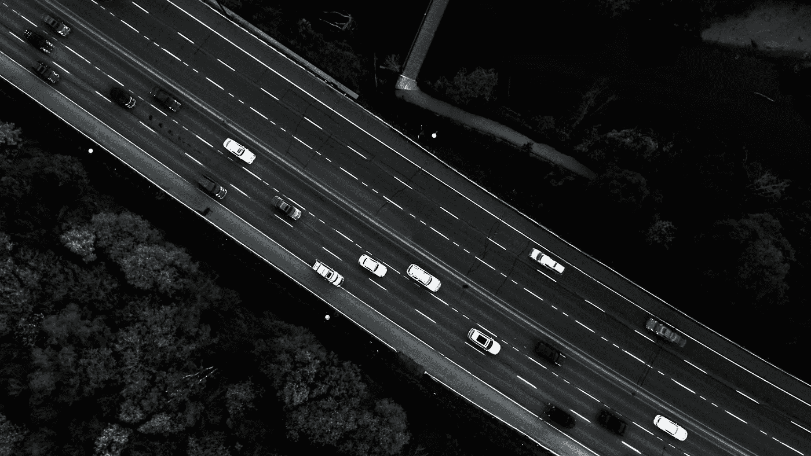

# 因为你提供的能量…令人兴奋！

> 原文：<https://medium.datadriveninvestor.com/cause-the-power-you-re-supplying-it-s-electrifying-b901de52db10?source=collection_archive---------5----------------------->

## 《油脂》的歌词在汽车行业变得真实；电动汽车正在颠覆传统的。

> 我们相信柴油车在燃油效率方面更方便，并且需要更少的维护和修理，是的，这些都是真的。但另一方面，直到现在，我们都相信它们都是环保的……但事实并非如此。

20 世纪 90 年代初，柴油车的市场最初面向卡车司机和商业司机，如出租车和公共汽车，销量稳步增长，1992 年达到 17.3%，随后在欧洲增长到 70%。这意味着在欧洲城市的交通中，每 10 辆汽车中就有 7 辆装有柴油发动机。直到今天，我们都在享受我们的柴油车，认为我们通过节省汽油的钱来削减我们家庭的预算，因为柴油车比汽油车节省 20%的燃料，在英国，这意味着一个家庭每年节省 300 到 400 英镑。你猜怎么着？柴油排放的二氧化碳比汽油少，所以我们也继承了环保的方法，购买了柴油，我们认为这只是右上角的甜樱桃？很明显，不是。

*但是为什么柴油变成了豆芽，我们小时候都喝得烂醉的传奇蔬菜？*

因为柴油车只是产生了更多的氮氧化物，而排放了更少的二氧化碳，这对人和环境都是有害的。这些排放物被认为导致英国每年约 40 000 人和德国每年约 6 000 人过早死亡。此外，根据国际清洁交通委员会欧盟常务董事 Peter Mock 的说法，如果只关注二氧化碳排放，而不是燃料消耗，柴油车就不再比汽油车有这么大的优势。他说。“如果你看看现代汽油车，它们的二氧化碳排放量差不多，在某些情况下甚至比柴油车还要低。”因此，各国开始计划禁止柴油车进入市中心；哥本哈根市长希望尽快采取行动，从明年开始禁止新的柴油车进入市中心。紧随其后的是巴黎、马德里、墨西哥城和雅典，它们决定禁令应该在 2025 年生效，而法国和英国已经表示，它们将在 2040 年前禁止新的汽油和柴油汽车。等等，混乱就要来了！正如你所猜测的…

*……嗯，你好电动车！*

在英国、美国和日本，电动汽车已经成为比汽油或柴油汽车更便宜的选择，目前这部分是因为政府的支持，因为政府现在每天都在努力变得更加环保，但电动汽车预计将在几年内成为最便宜的选择，无需补贴。此外，纯电动汽车的燃料成本低得多，因为电力比汽油或柴油便宜，因为发动机更简单，有助于制动汽车，节省刹车片。根据最新研究，在英国，每年的费用比汽油或柴油汽车低 10%左右。

看了这些事实之后，如果我们认为这是一种相当新的情况，那我们就是在欺骗自己。当然不是！该行业的一些领先品牌已经推出了他们的电动模型，它们在市场上，随时可以购买；除去政府的 4 500 英镑补贴，日产的四门车型 Leaf 是最便宜的选择，售价为 21 500 英镑，已售出 22 250 辆。如果我们考虑一个更高级的选择，特斯拉 model S 售价 65 000 英镑，已经有 6 283 人在驾驶这款车。

传统汽车制造商和车主有点担心，这种转变会蚕食传统汽车的销售，而传统汽车在大多数国家都是最畅销的。但正如美国商人、电影制片人和电影融资人瑞恩·卡瓦劳格所说:“关键是尽早接受颠覆和变革。不要几十年后再去反应。你不能打击创新。”所以我猜制造商必须在“游戏结束”之前决定他们是否参与这场游戏。