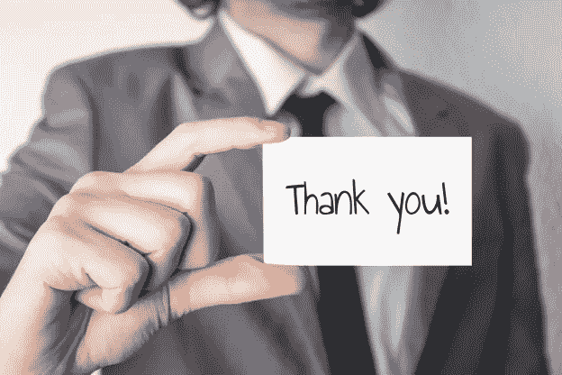

# 为大家庆祝！

> 原文：<https://medium.datadriveninvestor.com/celebrate-everyone-33b66656ec4c?source=collection_archive---------46----------------------->

在《持续成功*这本书里，作者解释说“从长远来看，成功与其说是为企业找到最好的想法、组织结构或商业模式，不如说是发现对我们个人来说重要的东西……在很大程度上，**非凡的人、团队和组织只是做着对他们来说重要的非凡事情的普通人”**。*

*哇！经商多年后，我想不出更好的方式来总结这样一个事实:不管你从事什么行业，有一件事是肯定的。一切都是为了人民。没有建立在优秀人才基础上的组织是不会长久的。事实上，我曾经为一家公司工作，该公司的口号是“人、产品和绩效”。可悲的是，该公司不相信自己的口号。人只不过是一个大轮子中可替换的齿轮。事实上，我们这些在那里工作的人开始称这个地方为“摧毁灵魂”。当然，最终。我们都离开了，这家企业最终以低价被收购。如今，该公司已没有多少东西幸存下来。*

*百胜集团前首席执行官大卫·诺瓦克。Brands 说，“当你考虑你需要在你的公司做什么的时候，你知道你不能自己完成它。没有人和你一起，你不可能完成任何事情。”这是一种很有趣的说法，说明你的人需要放在第一位。许多人口头上支持这个概念，但像诺瓦克这样的人实际上言行一致。他们真的明白，无论我们中的任何一个人多么有才华，我们都需要他人的支持和知识。*

*诺瓦克还认为，认可是真正普遍的，每个人，无论在哪里，都喜欢因为自己的身份和擅长的事情而被认可。这一切都始于我们还是孩子的时候，参加体育、音乐、戏剧和其他活动。我们希望自己的努力得到认可。有些人比其他人更有天赋，所以不是每个人都会赢得蓝带。但是我们的努力和进步还是会得到认可的。即使在团队运动中，明星球员没有支持者也无法赢得比赛。做生意也是这样，我的专业是销售。一个强大的团队总是会战胜一个明星。这么想吧。即使是迈克尔·乔丹也需要有人给他传球！当他投篮不中时，他也需要有人抢篮板，他需要队友来防守对方。尽管乔丹很伟大，但如果没有他的队友，他不可能赢得一个冠军。*

*无论是在个人层面还是在组织层面，认可都应该在每个人的日常生活中占有一席之地。积极主动地承认那些对我们的个人生活和职业生活都有积极影响的人，真的能提高每个人的生活质量，无论性别和年龄。像许多孩子一样，我总是寻求父亲的认可。但是，即使我已经是一个有自己孩子的成年人了，我还是喜欢得到父亲的认可。对我们许多人来说，我们也有过渴望得到认可的上司。当我们的努力得到我们尊敬的人的认可时，这只会激励我们更加努力地工作。事实上，我们大多数人会为了得到认可而比为了钱更加努力。*

***“人员、想法和硬件——按此顺序”！美国空军上校约翰·伯伊德***

*就像在体育界一样，很少有人能在没有他人支持的情况下取得商业成功。总会有像史蒂夫·乔布斯、比尔·盖茨、拉里·埃里森和杰克·韦尔奇这样伟大的想法。但是如果没有强大的演员阵容，他们永远不会成功。事实上，通常是支持团队确定营销、销售、实施或改进最初想法的最佳方式。*

*在我的职业生涯和生活中，我从自己作为高管、丈夫、父亲和朋友的经历中了解到，认可作为商业及其他领域的一个关键成功因素，往往被忽视。*

***员工认可和员工满意度之间有很强的相关性。***

*那么，员工认可想法的完美公式是什么呢？嗯，我认为你需要使它个人化，相关，及时。你们公司是如何认可团队的努力和良好品格的？请在下面的评论中与我们分享。*

**