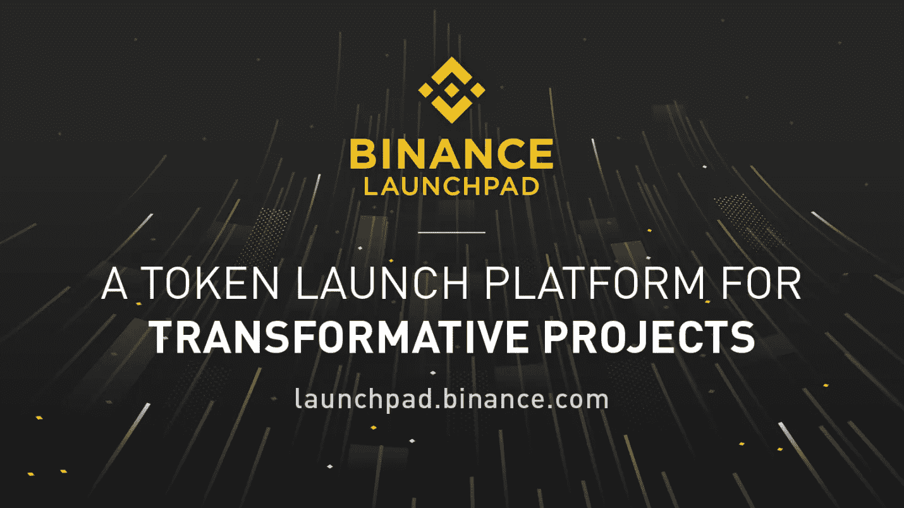

# Celer Vs. TOP Network IEO 性能:发布进展如何？

> 原文：<https://medium.datadriveninvestor.com/celer-vs-top-network-ieo-performance-how-did-the-launch-go-4c36461c5c82?source=collection_archive---------10----------------------->

看看火币 Prime 和币安 Launchpad 的首日抢购狂潮

DPO/IEO 的[J1]是新的时尚。这不是一个新概念，而是目前市场上的热门趋势。除了一个关键方面之外，它们几乎与 ICO 模型相似。在 ICO 的，你带的令牌会被各自的项目发到你的钱包里。但在新的 DPO/IEO 模式中，代币将由交易所出售，所有代币都将分发到您的交易所钱包中。这意味着投资者直接在交易所购买代币。

提供商模式的主要优势是多方面的。在 ICO 模型中，永远无法保证交易所何时上市。几乎 80–90%的 ICO 项目也没有设法在交易所上市。这导致投资者信心以及投资回报方面的巨大损失。

 [## 正在改变行业的 5 个真实世界区块链应用——数据驱动的投资者

### 除非你一直生活在岩石下，否则我相信你现在已经听说过区块链了。而区块链…

www.datadriveninvestor.com](https://www.datadriveninvestor.com/2019/02/13/5-real-world-blockchain-applications/) 

一旦在交易所完成销售，代币就可以立即在该交易所进行交易(几天后)，帮助投资者获得更高的投资回报率和更高的投资安全性。此外，DPO/ IEO 公司给了这个项目一个更值得信赖的声誉。没有一家交易所敢将一个有不良背景的项目上市，因为这也会损害交易所的声誉。这有助于保护普通客户免受可疑 ICO 的抢劫，就像过去发生的那样。

# 火币擎天柱 Vs 币安发射台

Houbi prime 是 Huobi stable 的最新创新产品。与其他交易所不同，Huobi Prime 将采用 DPO(直接溢价发行)模式，而不是常规的 IEO(初始交易所发行模式)。在 Huobi Prime 上市的硬币将有三轮发行过程。每一轮，硬币将以折扣价出售，下一轮价格会继续上涨。在 DPO 期间购买的所有代币将在购买后立即可用于交易。根本不用等代币。

第二个 Prime 交易项目计划于 4 月 16 日(GMT+8)启动。由于兴趣浓厚，引入了 HT 持有要求。根据新规则，在下一次发布之前的 30 天内(3 月 17 日 00:00:00 至 4 月 15 日 23:59:59 ),日均持有量必须达到 500HT，才有资格参与下一次销售。

[币安发射台](https://launchpad.binance.com/?lang=en)是数字资产交易巨头币安的独家代币发射平台，旨在帮助区块链项目筹集资金，并为他们提供更广泛的支持者网络。与火币不同，币安的用户将只有一次购买机会。只有一个回合。

和火币 Prime 还有一个区别就是上市流程。在霍比，IEO 一结束就可以使用代币进行交易，而在币安，这可能需要几天时间。

# 销售情况如何

最近火币 Prime 结束了他们的第一次 DPO 销售的顶级网络。我发现比较火币 Prime 和币安 Launchpad 上一次上市的 Celer Network 很有意思。

先说火币吧。火币 Prime 销售经历了三轮限价(0.000708 HT，0.000852 HT，0.001020 HT)，每一轮都在不到几秒(7 秒，5 秒，7 秒)内结束。据估计，全世界有 13 万人参加，3764 人成功。

Huobi Prime 成功售出总计 1，500，000，000 个顶级代币，正好是该项目的代币供应总量的 7.5%。它通过 Prime platform 总共筹集了 340 万美元的资金。

另一方面，币安在 17 分钟多一点的时间里卖出了 597，014，925 枚 CELR 代币。筹集的资金总额为 400 万美元。据估计，有 39，003 人试图购买，3129 人幸运。

# 令牌列表进行得如何

Celer Network 上市后，其市值在几分钟内就下跌了 80%。CELR 代币的价格从挂牌价 0.0024 BNB 跌至 0.001330 BNB 的低点。

目前，CELR 代币的交易价格为 0.001076 BNB，几乎是 2.75 倍(挂牌价格为 0.00043 BNB)。一个令人担忧的部分是价格的迅速下跌。每天，CELR·托肯都要损失 10%左右，而且还在疯狂下跌。以这种速度，它将下降到低于上市价格，这将是该项目的厄运

目前，CELR 代币的交易价为 0.000971 BNB，几乎是 2.75 倍(挂牌价格为 0.00043 BNB)。一个令人担忧的部分是价格的迅速下跌。每天都有。CELR·托肯损失了大约 10%,而且还在疯狂下跌。按照这种速度，它将跌破项目[【J1](#_msocom_1))的挂牌价。

这些价格下降可以归因于关于 CELER 的各种谣言。据说 CELER 团队没有公开令牌销售流程。另一个传言是，币安在销售期间带来了大部分 CELR 代币，并正在抛售这些代币，从而压低了价格。

TOP 的交易在销售结束后立即开始。最高价格上涨到 505.8% ( 0.02 HT)，回落到 0.005 HT 的范围内。目前 TOP 的交易价格为 0.0056 HT，为投资者提供了 5.58 倍的投资回报率(3 轮交易的平均售价为 0.00086 HT)[【J2](#_msocom_2)。

在出售后，HT 的价格有所下降，但立即恢复，并在 Huobi 宣布下一次上市的最低平均 500 HT 持股要求时飙升。

# **未来销售:**

第二个 Prime 交易项目计划于 4 月 16 日(GMT+8)启动。由于兴趣浓厚，引入了 HT 持有要求。还引入了三个主要变化。

500 HT 要求将生效

较短的交易周期

将有一个特殊的第三轮。

你可以在这里阅读更多关于[的变化](https://blog.hbg.com/3-exciting-changes-on-the-way-for-huobi-prime/)

币安 Launchpad 还宣布 Matic Network 将成为下一个 IEO。这一次，币安引入了新的抽签系统来选择参与者。

这里可以阅读更多[。](https://support.binance.com/hc/en-us/articles/360026114611)

# **结论:**

总而言之，币安和霍比似乎是来给 ICOs 第二次机会的。我们将看到这两家交易所巨头采取更多行动。我们希望这些新的创新的 DPO/IEO[[J1]](#_msocom_1)方法可以为垂死的 ICO 市场注入更多的生命，甚至可能引发下一轮牛市