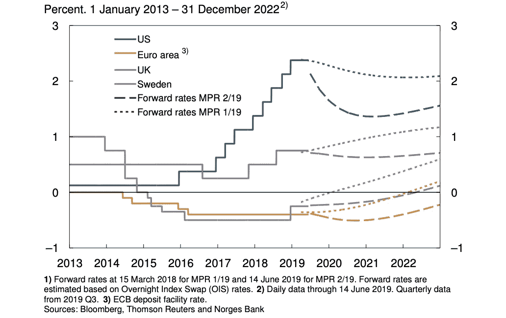
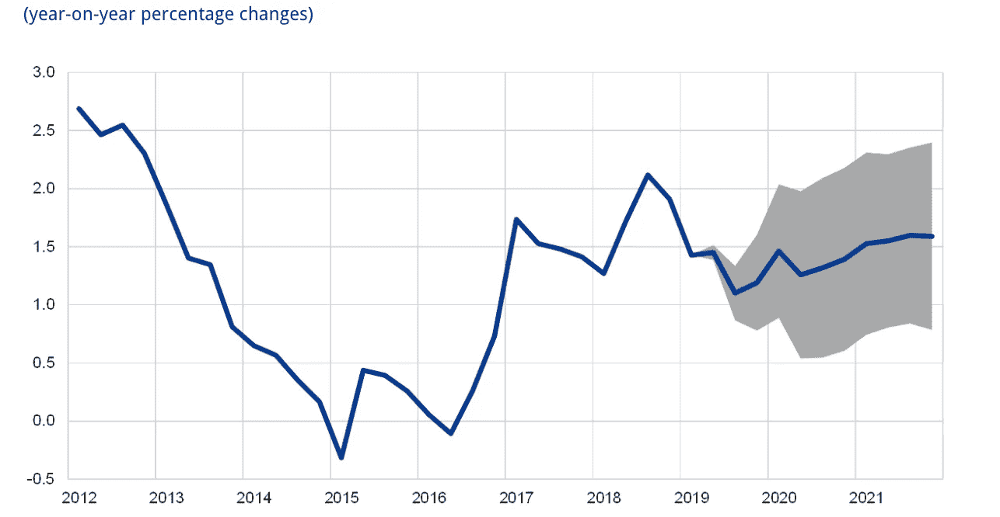
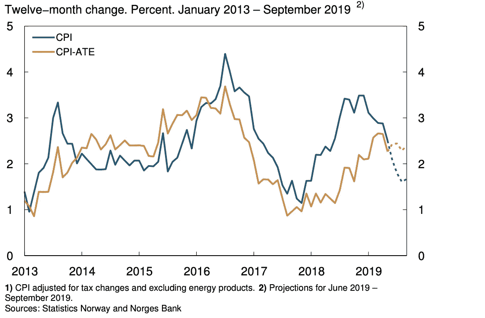

# 各国央行还没有趋同！

> 原文：<https://medium.datadriveninvestor.com/central-banks-are-not-converging-just-yet-566ff62b4e49?source=collection_archive---------3----------------------->

概要:*乍一看，全球金融状况似乎正在缓解。然而，仔细观察会发现一幅不同的画面。尽管存在全球贸易不确定性、可能的供应面冲击(商业投资和油价推迟)和地缘政治不确定性，但并非所有央行都在趋同。而美联储已经表示可能在 2019 年底前减产；欧洲央行虽然变得越来越温和，但仍将维持政策利率不变，直至 2020 年年中。相反，英格兰银行还远未降息，北欧国家正在继续货币正常化，原因是通胀接近目标，产能利用率高于正常水平，经济活动强劲。因此，随着利差进一步缩小，美元可能会贬值，如果经济结果继续分化，情况更是如此*

尽管美联储在最近一次会议上发出了未来几个月降息的信号，听起来更加温和，但全球央行不太可能会跟进。尽管如此，预计未来几年全球利率将会降低(图 1)。英国退出欧盟、美中贸易争端和制裁等政治不确定性对伊朗原油的影响因国家而异。众所周知，在 2018 年的周期性上涨之后，全球经济正在以更加渐进的速度增长。尽管美国顺周期财政刺激的效果逐渐消失，但全球经济仍有望扩张，尽管步伐更加缓慢。

 [## 为什么包容性财富指数比 GDP 更能衡量社会进步？|数据驱动…

### 你不需要成为一个经济奇才或金融大师就能知道 GDP 的定义。即使你从未拿过 ECON 奖…

www.datadriveninvestor.com](https://www.datadriveninvestor.com/2019/03/08/why-inclusive-wealth-index-is-a-better-measure-of-societal-progress-than-gdp/) 

**FOMC 和经济信号**

FOMC 的任务是最大限度的就业和价格稳定；美国劳动力市场仍然强劲，6 月份非农就业人数出人意料地从 5 月份向下修正的 72，000 人上升至 224，000 人。然而，失业率从上个月的 3.6%小幅上升至 3.7%。这表明财政刺激的影响正在消退，贸易紧张局势可能正在影响美国劳动力市场。即便如此，以历史标准衡量，略高的失业率仍处于低位。

尽管家庭需求贡献强劲，但商业投资有所放缓，亚特兰大联邦储备银行预计 2019 年 Q2 季度 GDP 增长 1.3%，远低于上一季度的 3.1%。美国与中国的关税战可能会给经济带来冲击，这解释了 FOMC 的鸽派倾向。此外，由供应链与中国密切相关的公司组成的美国股票指数可能解释了股价的波动。FOMC 在必要时调整政策的决定表明，逐步退出刺激措施不太可能以 2018 年的速度进行。这并不令人惊讶，但现在就推断出央行温和的全球趋势可能还为时过早。

绝不是说，我建议继续鹰派，但贸易战对发达市场和新兴市场的影响似乎有些不同。因此，未来几个月将显示全球中央银行的趋同程度，如英格兰银行(BoE)、欧洲中央银行(ECB)、挪威央行和瑞典央行等。

欧洲央行建议恢复温和态度。

继年通胀率显著下降(5 月为 1.2%对 1.7%)后，欧洲央行表示，如果经济数据继续恶化，它愿意调整政策利率。现在预计利率将保持不变，直到 2020 年年中，银行将继续进行再投资，从到期债券中全额支付本金。然而，更令人担忧的是，服务价格通胀率从此前的 1.9%显著降至 1.1%，表明潜在通胀压力有所缓解。然而，由于劳动力市场仍然强劲，现在就假设下降趋势还为时过早。然而，在最近的 20 国集团会议上，美国和中国之间对全球经济的担忧似乎有所缓和。

尽管欧洲央行被认为是温和的，但预测描绘了一幅不那么黯淡的画面。不可否认的是，预计 2019 年和 2020 年不含食品和能源的 HICP 经济增长率将分别升至 1.1%和 1.4%。这明显高于 2018 年 1.0%的结果，表明潜在的通胀压力并未减弱。同时，单位劳动力成本预计将在整个预测期内缓慢下降，由于雇主面临较低的管理费用，劳动力需求增加的可能性增加。宏观经济形势表明经济正在逐步复苏

**欧洲央行有多温和？**

区分欧洲央行的鸽派和 FOMC 的鸽派很重要。如果经济数据继续恶化，通胀压力进一步加大，欧洲央行无疑将调整其政策立场。目前，它似乎更有可能维持其观望态度，这种态度在大部分复苏中引导了欧元区经济。英国央行设定定向长期再融资操作(TLTRO III)水平的决定没有之前希望的那么温和，但为未来的操作提供了一些政策空间。目前还不太可能完全衡量它的有效性，但如果未来需要进一步的货币刺激，它可能会变得至关重要。因此，虽然 FOMC 对政策利率的调整很可能是向下的，但认为欧洲央行降息还为时过早。此外，近几个月来，油价下跌对通胀结果的支撑作用甚微，自今年初以来，油价一直在稳步下跌。油价的回升——在石油输出国组织的产量限制延长至 2020 年 3 月之后——将可能支撑整体通胀；油价波动给扩张性货币政策带来重大挑战，因为油价下跌抵消了需求压力。

挪威银行、瑞典央行和英国央行还没有走到一起！

随着英国退出欧盟日期的临近，英国今年上半年的平均通胀率为 1.9%，经济环比增长 0.5%。尽管英国退出欧盟存在不确定性，但总督表示，未来的政策举措取决于谈判结果。如果达成协议且需求压力持续，上述条件支持加息。在不达成交易的情况下，情况可能会相反。

与此同时，北欧央行还没有跳上鸽派列车。瑞典经济增长略高于潜力，劳动力市场强劲，尽管匹配困难，货币政策继续先发制人。该行在最近的会议上暗示，除了 2015 年以来的 3190 亿瑞典克朗外，还将继续购买资产，总额为 450 亿瑞典克朗。此外，作为一个小型开放经济体，人民币特别容易受到全球经济发展的影响；全球贸易和政策不确定性导致的人民币贬值抵消了油价下跌的影响。尽管通胀率接近目标，但英国央行不是简单地表示温和，而是恢复资产购买，以在一定程度上影响远期利率，并确保债券市场的流动性。

继 2018 年 3 月和 2019 年 6 月加息 25 个基点至 1.25%后，挪威央行(Norges Bank)没有停止加息的计划。上升趋势仍在继续，失业率很低，工资和通货膨胀都在继续上升。此外，挪威克朗对油价下跌的反应往往比强劲的经济更大——正如我在这里所说的那样——这最有可能在最近几个月支撑通胀结果。然而，随着利差进一步扩大，货币可能会与经济基本面重新联系起来，如强劲的经济和更高的产能利用率。几乎没有理由预计未来几个月通胀会下降，因为这表明与更温和的美联储和欧洲央行的分歧将继续存在

**市场影响:**

随着挪威央行和英国央行之间的利差进一步收紧，这两种货币对美元都可能升值。这可能会支持 FOMC 在未来几个月降低联邦基金利率的任何决定。