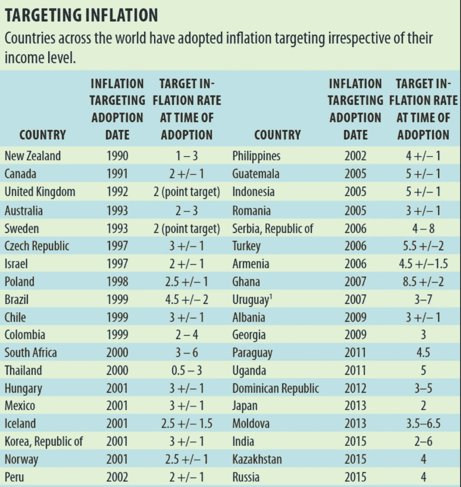

# 央行:货币政策需要一些反思

> 原文：<https://medium.datadriveninvestor.com/central-banks-monetary-policy-faces-new-challenges-1d78d46a4693?source=collection_archive---------3----------------------->

Central Banks in Balance?

提要:在货币挂钩和货币供应目标未能稳定物价后，各国央行现在将通胀目标定为 2.0%。2008 年金融危机后，尽管失业率创下历史新低，但政策制定者一直在努力实现他们的使命。因此，通过提高工资来重新点燃需求压力，是实现通胀目标和通过降低资本金要求来降低金融稳定风险的一种更可信的方式。此外，目标范围将为必须应对全球贸易和地缘政治不确定性的异质影响的央行提供更大的灵活性。

大多数人都知道央行对经济不可或缺，但大多数普通人都不知道通胀目标和金融稳定风险等词。自 20 世纪 80 年代以来，当价格上涨受到剧烈波动的影响时，投资者和消费者并不总是知道分别投资或购买什么以及何时投资或购买。

 [## 为什么包容性财富指数比 GDP 更能衡量社会进步？|数据驱动…

### 你不需要成为一个经济奇才或金融大师就能知道 GDP 的定义。即使你从未拿过 ECON 奖…

www.datadriveninvestor.com](https://www.datadriveninvestor.com/2019/03/08/why-inclusive-wealth-index-is-a-better-measure-of-societal-progress-than-gdp/) 

# ***央行的发现委托:***

在决定 2.0%的目标之前，央行尝试了货币挂钩和目标货币供应。前者难以实施，因为 A 国的货币在很大程度上是由 b 国的通货膨胀和货币行为驱动的。与此同时，货币主义者对货币供应感到兴奋，只是因为它作为货币政策目标的有效性受到质疑。金融创新改善了资本配置，但随之而来的是货币市场投机，这使得央行控制货币供应的挑战越来越大。尤其是因为金融创新受到了放松管制的影响，放松管制促进了跨境金融流动。

在盯住汇率和货币供应目标之后，央行必须决定一个明确的目标，让家庭和投资者能够进行规划。在美国第一次和第二次世界大战以及 20 世纪 70 年代的石油价格冲击之后，通货膨胀出现大幅波动，这一点尤其如此。在尝试了所有其他方法后，芬兰等国采用了通胀目标制，他们迅速压低了价格，并将 2.0%定为经济的名义锚。其逻辑是，价格的逐步小幅上涨，即 2.0%，可以使消费者计划购买汽车和房屋，投资者可以放心地投资于保质期长的项目。低而稳定的价格上涨意味着投资回报不太可能受到过高通胀的影响。

Source: Hammond 2011, Roger 2010 & IMF staff calculations

继 GFC 之后，通胀率缓慢回升至 2.0%的目标水平。这让央行的资产负债表付出了巨大的代价(占 GDP 的%)，尽管通胀率仍然低得令人担忧。即使货币政策进入未知领域，通胀目标也几乎没有变化。从长远来看，这可能会适得其反，原因有二。

1.  根据最近的经验，人们对央行实现通胀目标能力的信心可能会受到很大限制。从危机后的货币政策行为中吸取的教训是，孤立的供给侧动态不太可能让通胀持续回到 2.0%的目标。在通胀讨论中没有得到充分体现的需求压力，可能是再次实现通胀目标的答案。
2.  此外，企业和公共部门负债越来越多，因为创纪录的低利率导致私人和公共部门借贷更多。鉴于金融稳定面临的风险，通胀目标制能成为央行的唯一目标吗？大概不会。

尽管宏观审慎框架有所改善——得到了银行部门定期压力测试的支持——但即使金融稳定风险增加，持续的货币刺激也不太可能实现通胀目标。这一论断得到了大多数央行预测的支持，这些预测认为未来几年通胀率将略有下降，或者就欧洲央行而言，远低于 2.0%。一些人质疑央行是否准备好在通胀结果偏离 2.0%的预测时立即干预。

# *一个目标范围能否增加金融稳定性*

*鉴于当通胀率低于 2.0%的目标时不愿意提高政策利率，如果通胀率略低于目标，央行也许不太愿意增加货币刺激。毕竟，价格不可能年复一年持续增长 2.0%。因此，为什么不解决货币政策和央行的反应功能，以符合这一现实。如果各国央行担心沟通不畅，那么在通胀日益受到油价等外部因素以及对伊朗和其它产油国的制裁等供应面冲击推动的环境下，目标区间可能是一种约束性较小的政策实施方式。a 如上图所示，联合王国和瑞典等一些国家采用了点目标，挪威、加纳和加拿大采用了带有容许范围的点目标。这使得各国央行在平衡外部压力——美国——中国的贸易和技术战争、与伊朗的地缘政治不确定性以及对全球经济增长放缓的担忧——实现其使命并降低金融稳定风险时，具有亟需的灵活性。*

# ****现实的通胀压力****

*除非央行和决策者直面因工资增长乏力而导致需求面压力下降的现实，否则实现通胀目标将在未来十年难以实现。这一点在一些发达经济体创纪录的低失业率中显而易见，然而，这些经济体正在努力应对不稳定的通胀结果。美国是一个最好的例子，失业率为 3.6%，5 月份实际收入增长了 1.6%。与此同时，尽管 6 月份失业率保持在 3.8%，为 1974 年 10 月至 12 月以来的最低水平，但英国的实际收入增长了 1.2%。正如我在本文中所论述的那样，旨在确保工资与通胀率相匹配的中央工资谈判可能会形成一种自我强化的趋势。除了其他原因，这也解释了为什么北欧的潜在通货膨胀恢复得更快。*

*一些人质疑菲利普曲线(失业率和通货膨胀率之间的反比关系)的普遍性，但是菲利普曲线从未消失。在大多数发达经济体中，失业和通胀之间的关系仍然存在，但由于实际收入增长仍低于央行 2.0%的目标，这种关系已经明显减弱。无论向经济注入多少刺激，在没有供应冲击的情况下，通胀都不太可能持续上升至 2.0%的目标。*

****在低利率环境下，金融稳定变得更加重要****

*这证明了在这种情况下金融稳定应该优先考虑的观点。政策制定者不应对一次性统计数据以及对全球增长和政治不确定性的担忧做出反应，而应考虑对金融稳定的长期影响，以及持续的货币刺激不仅会增加未来货币政策的成本，还会降低政策实现其目标的有效性和能力。*

*各国央行对下一场危机准备得如何？*

*这一趋势在大多数发达经济体已经很普遍；在经济低迷的情况下，央行几乎没有降息的空间，正如我们所见，大规模的资产购买只会导致又一次不温不火的复苏。一些央行将不得不购买股票以进一步刺激经济，这是一个危险的提议，因为金融市场和央行之间的进一步纠缠无助于恢复对公共机构的信任和信心。*

****降低资本要求可能会增加金融不稳定的风险****

*央行可以降低资本金要求，让银行能够发放更多贷款，但这本身就可能对金融稳定构成重大风险。这一方针可能会适得其反，因为降低资本要求将为金融稳定风险的扩散创造更好的条件。几乎是通过解决下一个危机来开始一个危机。当全球利率处于创纪录低点，损害银行利润时，在复苏后简单提高资本要求的想法尚未得到验证。另一个限制来自当前的资本要求，累计仍低于 10%，因此严重的冲击可能会考验旨在管理系统性风险的全球框架(如果有的话)的弹性。*