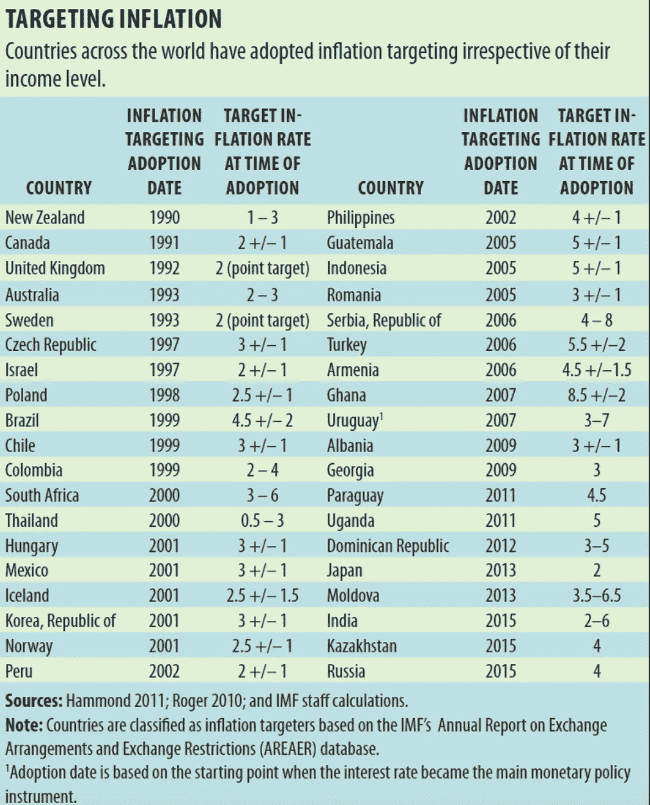
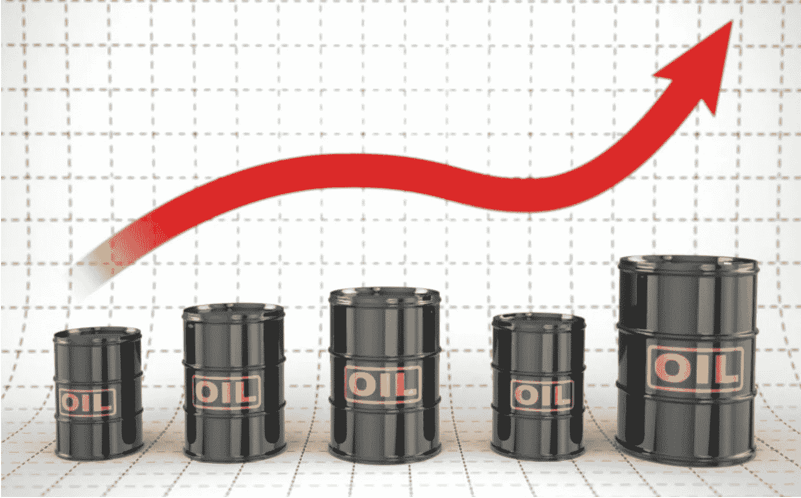
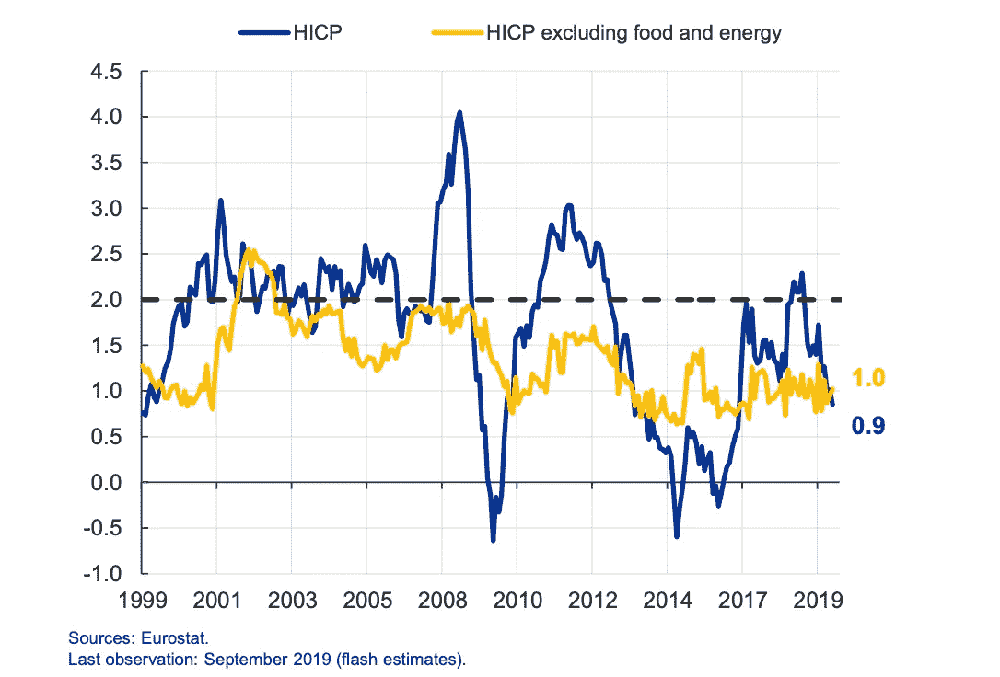
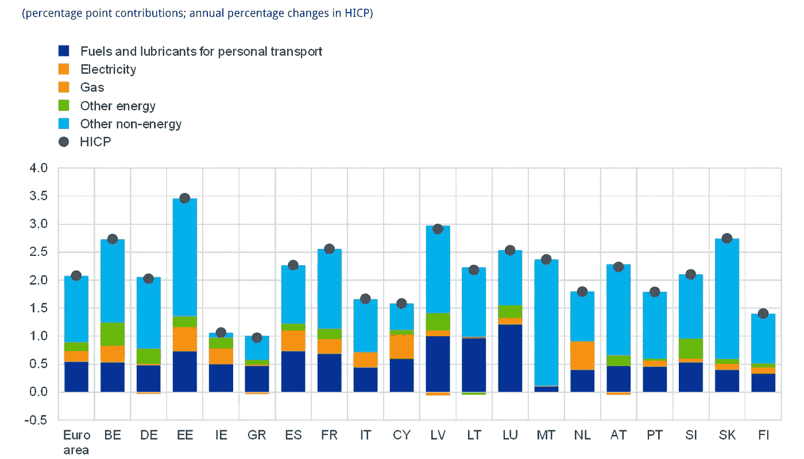
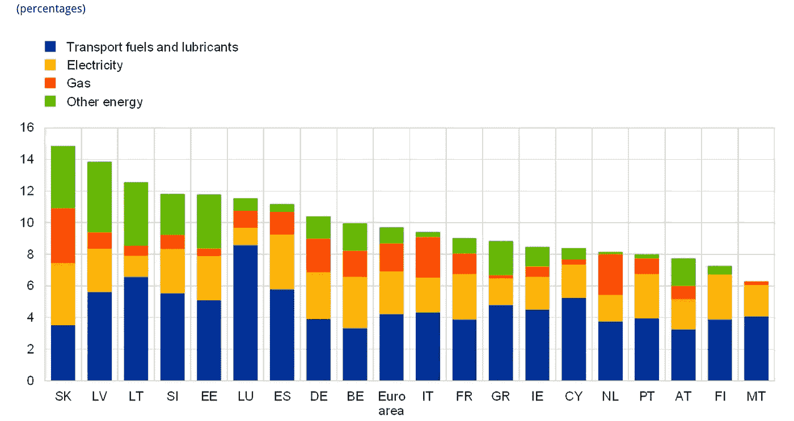
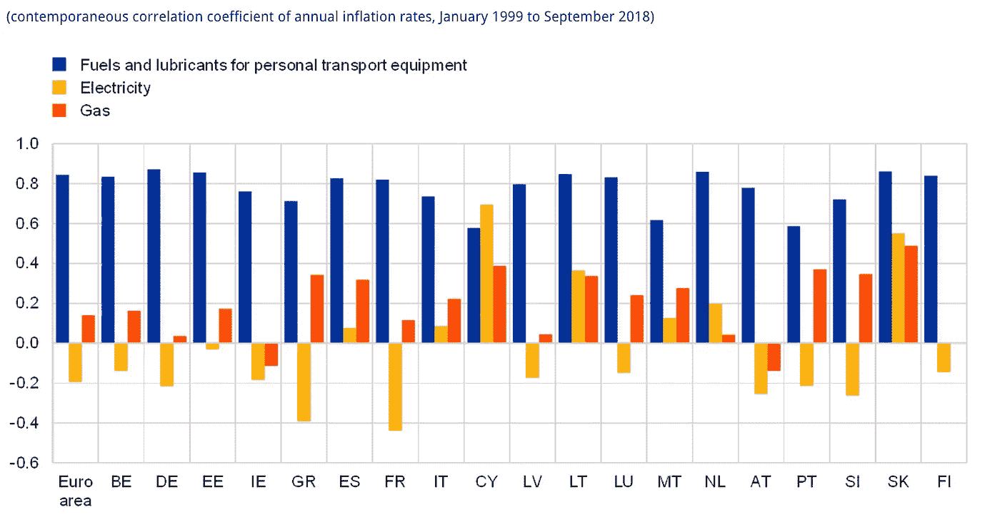

# 中央银行应该重新考虑他们的通胀目标，减少对石油的依赖！数据驱动的投资者

> 原文：<https://medium.datadriveninvestor.com/central-banks-should-rethink-their-inflation-targets-and-lessen-dependence-on-oil-52e0873d5f90?source=collection_archive---------15----------------------->

金融危机考验了中央银行的决心，宽松的货币政策(即负利率和大规模债券购买)对确保通货膨胀持续向 2.0%的目标靠拢几乎没有作用。顽固的低通胀可以归因于几个因素，如日益全球化的市场所带来的竞争，对油价的过度依赖——正如我在这里所论述的那样——以及劳动力市场对价格压力的传导减弱。

***央行通胀目标总是取决于外部因素！***

大多数央行都有追求价格稳定的使命。这采取了不同的形式，欧洲央行追求 2.0%或略低于 2.0%的通胀率，美联储明确目标为 2.0%的通胀率和最大就业，英国央行目标为对称的 2.0%通胀率。如下表所示，新西兰在经历了多年过高的通货膨胀后，开始了通货膨胀目标制的趋势。自 1990 年代采用以来，一些国家采用了目标范围，即加拿大(2% +/-1)、澳大利亚(2%–3%)、巴西(4.25 +/-2 — [更新](https://www.reuters.com/article/brazil-economy-inflation/brazil-sets-2022-inflation-target-at-35-idUSL9N23A00N))、冰岛(2.5% +/-1.5)和挪威(2% +/-1)。与此同时，点目标是英国(2.0%)和美国(2.0%)货币政策的锚。

目标范围有助于实现通胀目标，因为偏差更容易解释，也反映了更现实的结果。尽管各国央行尽了最大努力，但它们不太可能可持续地实现通胀目标，因为逆风、地缘政治和政治不确定性可能会导致暂时偏离央行的通胀目标。例如，一个目标区间将允许欧洲央行暂停利率，让美国——中国——的预期降级得以持续。然而，暂停是不可能的，因为向市场参与者传达观望战略与实现通胀目标是不一致的。

然而，这种方法是合理的，因为货币政策会更有效，通过更紧张的劳动力市场、更高的实际收入增长和缓慢但逐渐向银行通胀目标趋同的通胀，更容易感受到向实体经济的传导。重要的是要相信央行的通胀目标和价格稳定。它降低了家庭可支配收入的周期性，而家庭可支配收入此前受到商品和服务价格上涨的影响。

如上所述，通货膨胀目标制为通货膨胀降至可控水平奠定了基础，并允许在这方面采取更有针对性的货币政策(见下图)。欧元区通胀往往围绕央行 2.0%的通胀目标波动，但在 2008 年 GFC 之后，长期偏离目标的情况变得越来越明显。

***是时候重新思考通胀目标了吗？***

市场、媒体和公民已经开始信任通胀目标，为央行的通胀目标提供了进一步的合法性，但随着通胀越来越多地由外部因素驱动，结果低于 2.0%，可能是时候反思通胀目标了。这绝不会降低央行的通胀目标凭证，而是提高货币政策实现通胀目标的能力。此外，它们不需要降低通胀目标本身，而是引入一个目标区间，作为偏离明确目标的容许范围。

***通货膨胀越来越受到油价的推动！***

在最近的一篇论文中，我认为通货膨胀越来越受油价等外部因素的驱动。欧洲央行最近的一份报告证实了这一论断，指出总体通胀率目前主要受油价的影响(见图表)。能源价格对 HICP 通胀的贡献为 0.9%，几乎是银行 2.0%目标的一半。然而，这种贡献在欧元区成员国之间存在差异，取决于消费者支出以及油价对能源价格的传递。能源在 HICP 的权重并不能解释各国之间的差异，因为能源价格对整体通胀的贡献高于权重所隐含的价值( [ECB，2019](https://www.ecb.europa.eu/pub/economic-bulletin/focus/2018/html/ecb.ebbox201807_05.en.html) )。

Source: [ECB](https://www.ecb.europa.eu/pub/economic-bulletin/focus/2018/html/ecb.ebbox201807_05.en.html)

运输燃料占所有国家能源权重的一半，因为它们比其他能源成分更密切地跟随原油的变化(见下图)。因此，成员国之间燃料价格通胀的差异可以用其他因素来解释。2018 年 HICP 能源及其主要分项的权重如上图所示。

消费税的变化会对燃料价格产生影响，而更高的价格会抵消油价上涨带来的影响。增值税税率的差异解释了消费者的价格变化，但不能解释转嫁的程度或比率。各国汽油价格的总份额各不相同，从卢森堡、马耳他和西班牙的 50%左右到荷兰、意大利和希腊的 60%以上，这在一定程度上解释了燃油价格最终水平的差异以及原油价格变化对燃油价格的传递。技术和缓冲价格的差异导致原油价格对燃料价格的传递率不同。然而，短期内不能完全忽视这一点。

与此同时，随着越来越多的电力来自各种来源(风能、太阳能、核能、生物燃料)，石油价格对天然气价格的传导不那么明显。如上图所示，用于个人运输设备的燃料和润滑油与大多数欧元区国家密切相关，在塞浦路斯，天然气的通过率高于燃料和润滑油。与此同时，斯洛伐克、葡萄牙、塞浦路斯和希腊的天然气渗透率最高。

此外，天然气和电力价格受到部分或全部监管，限制了石油价格的传递程度。欧元区国家已经看到石油价格对 HICP 通货膨胀的贡献增加，尽管存在差异，但石油价格向燃料价格的传导持续存在(见说明相关性的图表)。这种关系在未来可能会有所减弱，因为油价下跌，其传递减少。对央行通胀目标的重新评估将改善货币政策的效果，保持通胀预期稳定，并减轻央行资产负债表的压力。在其他方面，可能需要谨慎沟通，以防止市场动荡及其对家庭资产负债表的相关影响，但对通胀目标的反思是必要的。

参考列表。

1.  Ieva Rubene(欧洲央行)，能源价格在近期通胀结果中的作用:跨国视角。2018 年 11 月

***相关文章*** :

 [## 另一场精心策划的全球经济危机正在逼近？如果我们的数据经济可以帮助它|数据驱动…

### 我们的 DApp 的开发，称为 DECENTR，目前正与我们的 R&D 同步进行，作为我们即将到来的…

www.datadriveninvestor.com](https://www.datadriveninvestor.com/2019/03/06/another-engineered-global-economic-crisis-looming-not-if-our-data-economy-can-help-it/)