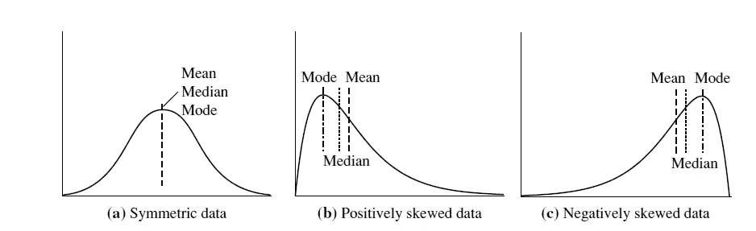

# 集中趋势分析

> 原文：<https://medium.datadriveninvestor.com/central-tendency-analysis-fdcaddf8c99b?source=collection_archive---------1----------------------->

当处理数据时，最好对数据有一个全面的了解。这有助于了解给定数据集中的值是如何分布的。一种流行的方法是使用统计方法找到数据的中心趋势。

Photo by [Heidi Sandstrom.](https://unsplash.com/@bravelyventure?utm_source=medium&utm_medium=referral) on [Unsplash](https://unsplash.com?utm_source=medium&utm_medium=referral)

Mean 是给定数据集的平均值。这种方法可以很容易地用任何编程语言实现，并且有大量的库能够得到平均值。

由于平均值对异常值非常敏感，因此单独使用平均值可能会给出错误的数据解释。因此，为了避免这个问题，我们可以使用修剪平均，我们从数据中修剪离群值，并获得平均值。这种修整可以通过使用聚类或者仅仅通过对数据集中的值进行排序并修整数据的数据年龄的预定义部分来完成。例如，我们可以对数据集中的数据进行排序，并从顶部和底部修剪 1%的数据。平均值不是衡量有偏差数据的一个很好的方法。

对于有偏差的数据，中位数是一个很好的选择。中位数是一组有序数据值的中点
的值。这种方法的主要缺点是需要很高的计算能力来获得无序数据集的中值。

除了以上两种方法以外，模式也是一种很好的看中央的趋势。众数是数据集中出现频率最高的值。

如果你是一个 python 爱好者，pandas 已经预定义了以上三个函数的实现。

正如我前面提到的，了解数据的分布是有好处的。数据集的数据分布可以是:

*对称
*偏斜
* *负偏斜。
* *正向偏斜。

“Yellow and orange shipping containers stacked on top of each other” by [frank mckenna](https://unsplash.com/@frankiefoto?utm_source=medium&utm_medium=referral) on [Unsplash](https://unsplash.com?utm_source=medium&utm_medium=referral)

下图显示了上述三种类型的示例。

Types of data distributions that can occur

找到数据偏斜度的最简单方法是将数据可视化，并根据感知做出决定。但是有一种更好的方法是使用上面给出的测量来识别偏斜度。

如果数据对称分布:

均值=中位数=众数

如果数据是正分布的

众数

如果数据是负分布的

平均值

