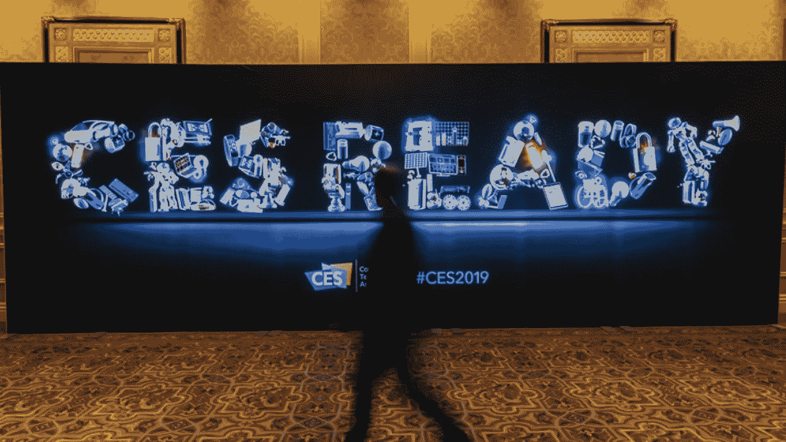
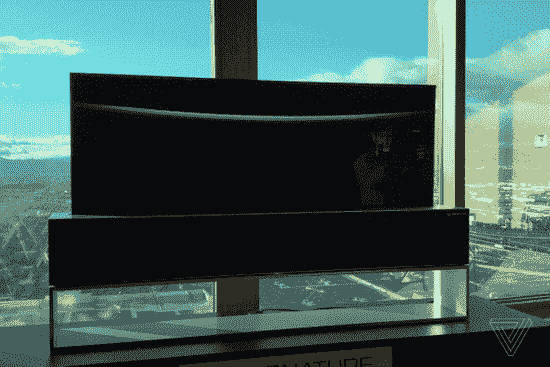
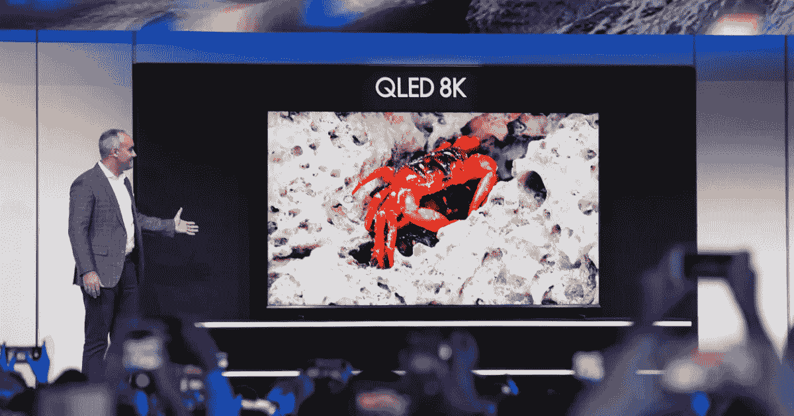
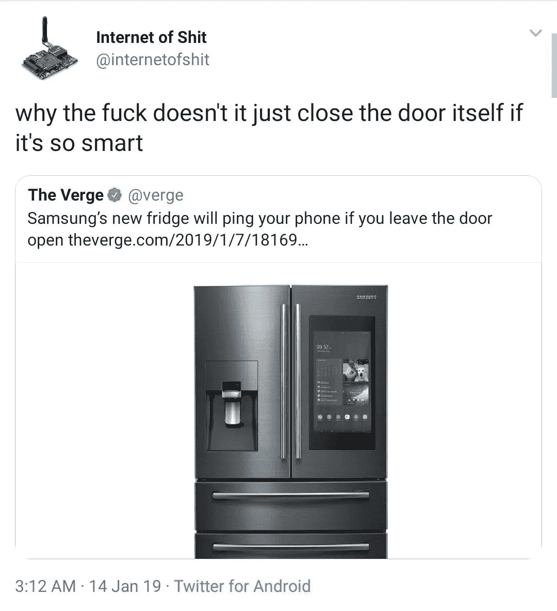
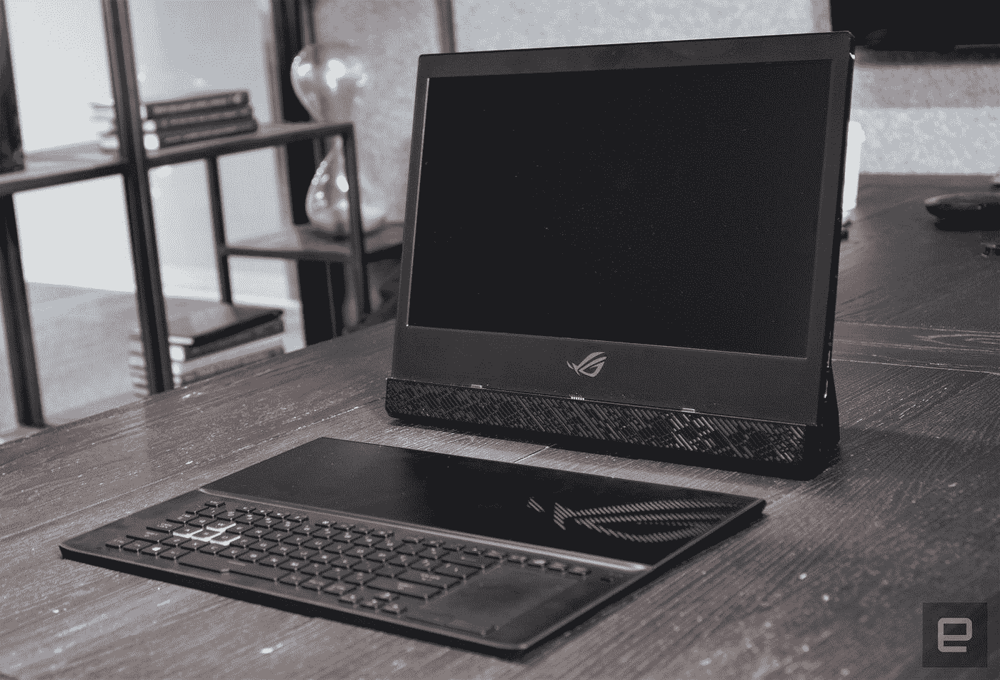
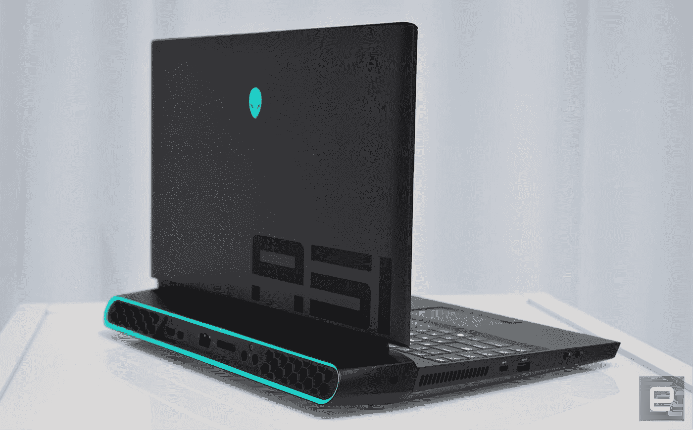
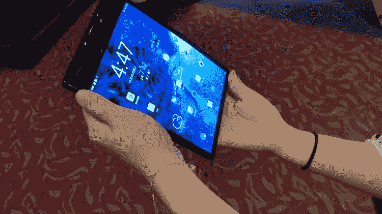

# CES 2019:少数热门产品中的大量失误

> 原文：<https://medium.datadriveninvestor.com/ces-2019-a-lot-of-misses-among-a-few-hits-bc4ee4e241eb?source=collection_archive---------40----------------------->

现在是 2019 年！作为千禧一代，我们更接近 2038 年，而不是 1999 年。想想看，每次我们提到 30 年前，我们想到的是 70 年代，而不是 90 年代！该死，这个世界正在奔向未来。在过去十年左右的时间里，我们已经看到未来科技冲击市场，人们实际上可以购买。配有 6.5 英寸 4k 显示屏和四摄像头之类的智能手机。但在我们透露未来之前，让我们做一点时间旅行，好吗？那是我的最后一年(2012 年)，我的一个大学同学给自己买了一部黑莓 Playbook。那台 7 英寸的平板电脑风靡了我们所有人！应用程序之间的平稳过渡要感谢“手势”(他们在苹果之前就做到了！)、扬声器和 500 万像素摄像头——一切都棒极了。我们曾经轮流在那个迷人的戴着玻璃框的坏男孩身上玩沥青 6！但是现在，当你谈论平板电脑时，只有苹果的名字伴随着 iPad 的荣耀出现在我们的脑海中。

那时候，手机还没有这么智能，在 3.2 英寸的触摸屏手机上看非法电影还是可以的！但是在过去的 6 年里发生了很多事情！从触摸屏手机到智能手机的旅程为用户和制造商带来了丰富的选择！但在 2019 年，我们看到技术变形人正处于十字路口。是制造价格更高、保质期更长的设备，还是制造便宜的设备。在今年的 CES 2019 上，这种情况非常普遍。

没有多少智能手机成为新闻，制造一些噪音的是第一代电阻式触摸屏智能手机。Flex Pai 可折叠手机成为新闻，但老实说，它似乎是 2022 年 CES 的智能手机，而不是 2019 年。但在列出 2019 年 CES 的失误之前，让我们看看是什么让这个消费电子展如此单调！

# **电视机**

2019 年年度技术奖的得主必须是 LGs 可卷曲电视。去年还是一个概念的东西，将在买得起的消费者的客厅里变成现实。有报道称，LG 将在今年的某个时候推出这款手机。65 英寸的可滚动 4K HDR 电视从一个光滑的橱柜上下滚动。这款电视有三种模式——完全模式，可以像普通电视一样使用；直线模式，电视停在特定高度，可以用来显示天气、照片等信息；第三种模式是零视图模式，没有电视，只有 100 瓦的纯功率扬声器。这才是 2019 年要提防的事情！

CES 2019 的电视的流行语是 8K！就像 5G 速度一样，它也在 2019 年 CES 的三星展馆首次亮相，电信也将取代 4G LTE。同样，电视领域发生的下一个重大变化是 8K，即。8000 水平像素。世界显示面板的龙头三星也有一些有趣的事情。Q900RA 是三星对 8K 未来的大赌注！这是一个 98 英寸的面板，也将提供各种较小的尺寸。索尼也提供了与 Z9G 类似的选项！可悲的是，没有太多的 8K 内容，事实上，少数 YouTube 频道有少量 8K 内容。#SedLyf

但是三星有一种叫做“墙”的东西——一台 146 英寸的电视，它使用了一种新的微型 led 模块化平板技术。今年，它展示了更“适合家庭”的 75 英寸版本，以及不太适合家庭的 219 英寸版本。

# **家用技术**

大量的技术进步使我们的家变得“智能”。但最大的问题是我们真的需要它吗？CES 2019 有几个答案。有来自一系列新老玩家的智能门铃。智能保险箱、智能锁、智能冰箱，甚至科勒的智能马桶。但是最搞笑的家用技术来自三星。该公司开发了一种“智能”冰箱，它可以在你忘记关冰箱门时通过智能手机向你发出信号。如果这个设备“如此智能”，那么它应该能够自己关门。

# **自动驾驶汽车**

没有人能比 MKBHD 更好地解释自动驾驶汽车。所以这里有一个视频可以让你的事情变得更简单！

 [## 在 CES 2019 上乘坐无人驾驶出租车！

### 从拉斯维加斯一辆完全自动驾驶的无人驾驶出租车的后座上🤯Yandex 项目:https://sdc.yandex.com…

www.youtube.com](https://www.youtube.com/watch?v=gfWjsKsEry0) 

# **笔记本电脑**

同样，就像 CES 上没有什么主要产品是米色的一样——与去年相比没有太多噪音。但仍设法获得公平份额的聚光灯的品牌是华硕。现在，这个品牌通过华硕 ROG 母舰实现了信念的飞跃——的确是一个大胆的设计！这款 17 英寸笔记本电脑的大脑在屏幕后面，屏幕借助支架支撑。键盘从屏幕上脱离。

华硕还保留了世界上最薄的边框笔记本电脑的标签，配有 13.9 英寸的 ZenBook S。它有“世界上最薄的”边框，该公司声称厚度仅为 2.5 毫米，你可以通过英特尔酷睿 i5–8265 u 或更高性能的 i7–8565 u 以及高达 16GB 的 LPDDR3 RAM 来获得它。尽管有这些体面的规格，它的重量只有 2.5 磅。

外星人推出了 Area 51——一款 17 英寸的野兽，具有多功能性，可供用户升级 CPU 和 GPU——但老实说，该公司表示，他们必须等待芯片制造商将其变为现实，这款游戏笔记本电脑的整个模块化能力仍然存疑。

# 现在是失手的时候了！

消费电子展是今年的第一个展会，为今年充满新的和创新的技术展示奠定了基础。但遗憾的是，今年的情况并非如此。来到 royo le Flex Pai——1300 美元的柔性智能手机是一款非常有趣的设备，但现在还为时过早。这肯定会为智能手机的未来打下良好的基础，但今年它仍是一款不切实际的设备。当然，许多应用程序开发人员和外壳制造商会以敏锐的眼光看待它。但这只会帮助他们为更“灵活”的未来做准备。

2019 年，智能手机将专注于所有屏幕打孔显示，而实际的智能手机柔性显示仍然是一个近乎遥远的梦想。去年，Vivo APEX PREDATOR 吸引了很多目光。尽管这只是一个概念设备，但几个月后 Vivo 公开了这款设备。后来，这款名为 Vivo Nex 的设备登陆印度市场，引起了不小的轰动！

技术的未来将会怎样？谁知道呢？但是现在，让我们一起享受这段平静的时光吧！