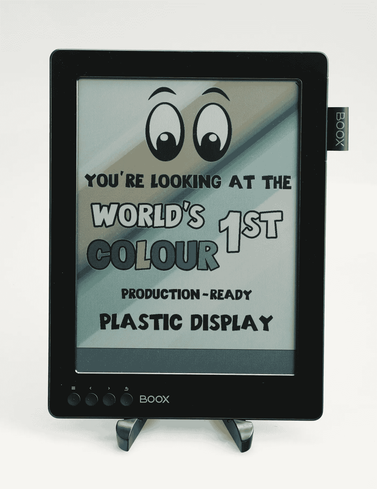
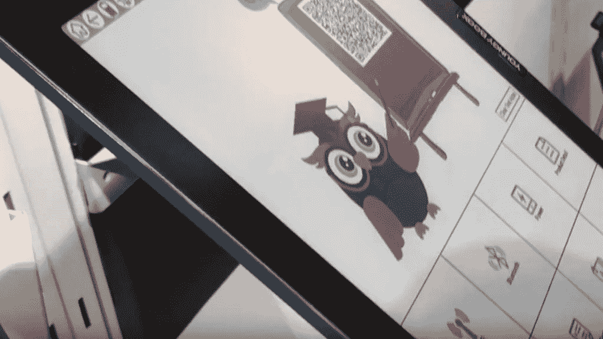

# CES 2019:Boox 如何跟随世界科技趋势

> 原文：<https://medium.datadriveninvestor.com/ces-2019-how-boox-follows-the-tech-trend-of-the-world-5fdfbd81498b?source=collection_archive---------10----------------------->

Onyx Boox 是一家致力于电子墨水产品超过 10 年的国际公司，它参加了 CES 2019 活动，让我们看看今年我们可以看到哪些令人惊叹的产品。

消费电子展(CES，Consumer Electronics Show)是由消费技术协会(CTA)组织的年度贸易展会，于 2019 年 1 月 8 日至 11 日在美国拉斯维加斯举行。该活动通常会展示消费电子行业的新产品和新技术。50 多年来，它一直是创新者和突破性技术的试验场。有趣的是，在 2019 年的活动中，科技股大幅反弹，这意味着技术的发展有力地推动了投资者的信心。国际消费电子展提供了一个观察未来世界的窗口。

[在 CES 2019](http://www.uttarakhandnewstoday.net/story/50768/ces-2019-how-boox-follows-the-tech-trend-of-the-world.html) 中，超过 4，400 家知名消费科技公司，如谷歌、英特尔、LG、三星、索尼、飞利浦、尼康、华为等，参加了此次活动，并展示了他们最新的预期技术。展会期间，随处可见大量令人惊叹的产品和有趣的故事。很明显，物联网、人工智能、5G、智能城市、健康技术和屏幕创新将成为 2019 年的技术趋势。

在 2019 年之前，Boox 已经开始了其顺应趋势的战略。由于电子产品的快速发展，相应的眼部问题近年来持续增加。人们花很长时间在蓝光屏幕上频繁阅读，这绝对会导致严重的眼睛疲劳。为了实现制造用于阅读的无害电子设备的目标，Boox 从 10 年前开始专注于制造电子墨水阅读器。目前，Boox 已经开发了许多型号，在电子阅读器行业赢得了相当大的声誉。电子墨水是世界上最好的环境光反射显示技术。与直接照射到眼睛的 LCD 屏幕光不同，它通过电压驱动微胶囊中的墨滴，在屏幕上形成自然、清晰的图像，由环境中的光而不是背光照明，就像纸上的真实墨水一样。换句话说，电子阅读器绝对是阅读甚至写作的理想设备。

说到电子墨水技术，具有高质量全色反射显示器的高级彩色电子纸(ACeP)肯定是首次亮相后的下一个话题。利用这项技术，电子墨水设备能够以生动的颜色显示内容，人们渴望在电子阅读器上看到彩色的漫画、杂志和教科书。然而，这项技术从未被广泛采用，因为它仍在发展中。Boox 曾展示过一款 10.7 英寸的电子书阅读器 Youngy Boox，它配有彩色电子墨水屏幕，是专门为学校试点项目设计的。这是迈向电子墨水屏幕创新的一大步。

至于智慧交通方面，Boox 在几年前就把视线放在了行车导航上。Boox 的一个项目名为 Carloudy，这是一个 utra-便携式智能平视显示系统，可以将所有有用的信息直接投影到挡风玻璃上。坦率地说，该系统采用了电子墨水技术，因此无论在阳光下还是在晚上，司机都可以阅读导航信息。通过语音命令，司机通过智能手机与 Carloudy 进行互动。

此外，物联网的趋势在 CES 上也似乎势不可挡。互联网和以网络为中心的计算为电子学习奠定了坚实的基础，并通过电子和网络技术将传统的学习方式扩展为新的动态学习方式。Boox 专门为学校和大学开发了一个电子教育系统。该系统将大量不同科目的教科书集成到一个设备中，学生不必每天背着沉重的书包。学生可以通过网络随时随地在设备上更新学习资料、完成作业和阅读。通过该系统，讲师可以以一种快速而简单的方式与学生进行更好的互动。

随着 CES 2019 的蓬勃发展，许多令人印象深刻的产品以极大的创造力展示出来，参观者发现科学技术的强大超出了人们的想象。但很明显，Boox 满怀希望地预测了健康技术、屏幕创新、智能城市和物联网的可能性。从一个明确的角度来看，在数字市场中保持竞争力的关键是用企业战略跟上技术趋势。准备好寻找下一个趋势吧！

有关 Onyx Boox 的更多信息，请查看

官方网站:[www.boox.com/](http://www.boox.com/)

www.facebook.com/boox.fans/[脸书](https://www.facebook.com/boox.fans/)

推特:【twitter.com/onyxboox 

YouTube:[www.youtube.com/c/OnyxBoox](https://www.youtube.com/c/OnyxBoox)

insta gram:【www.instagram.com/onyx_boox/ 