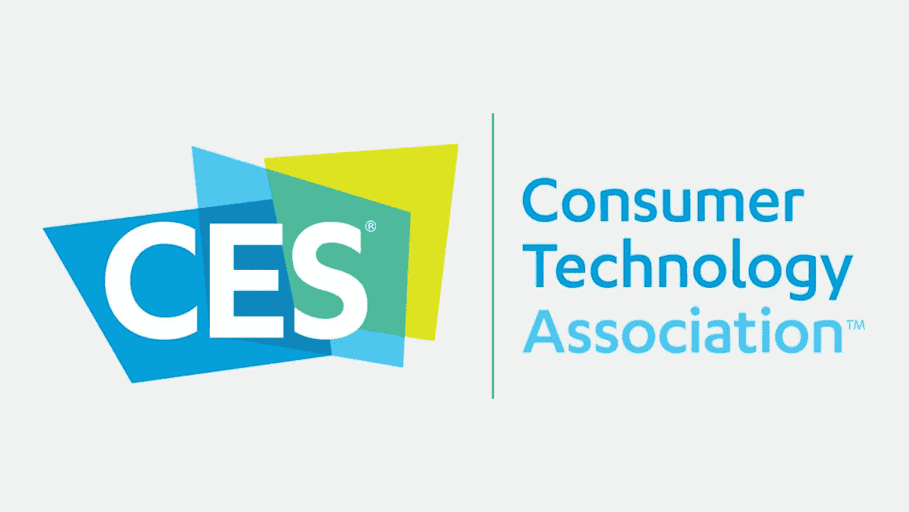
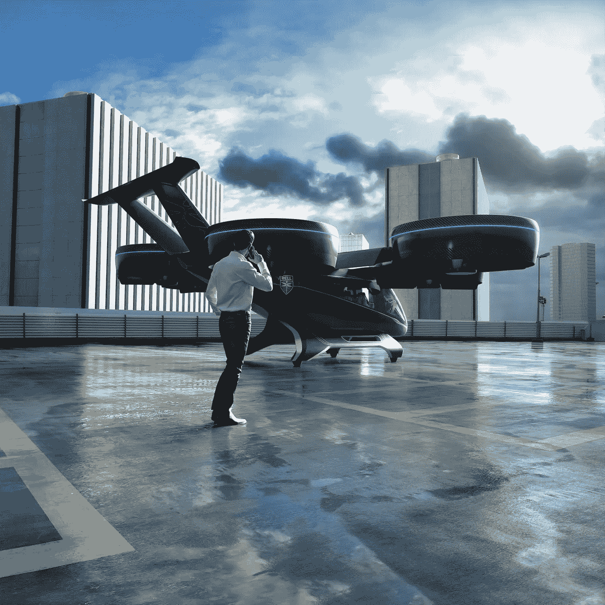
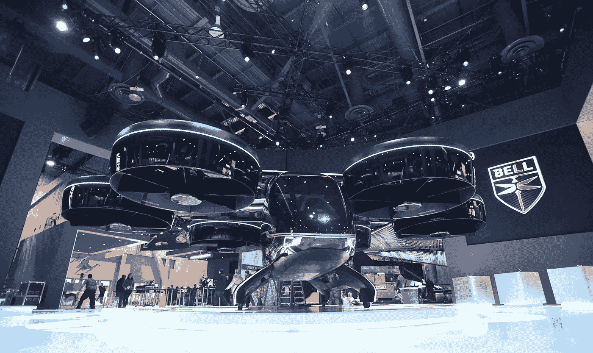
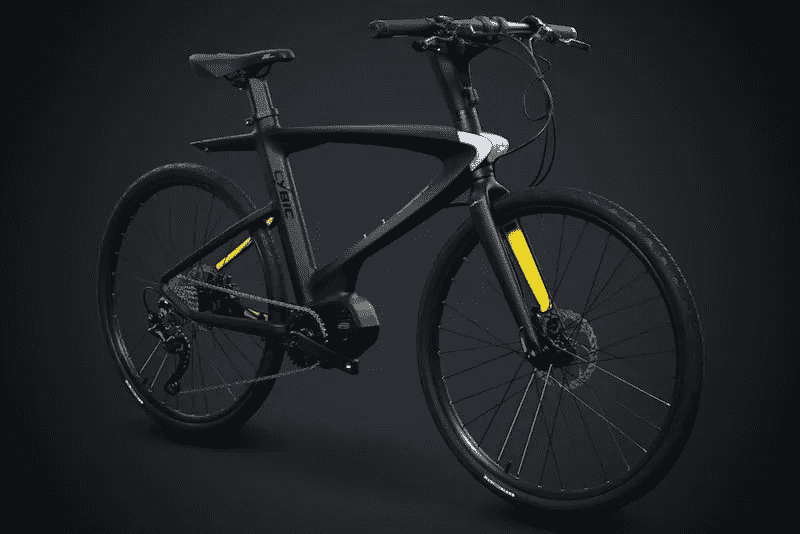
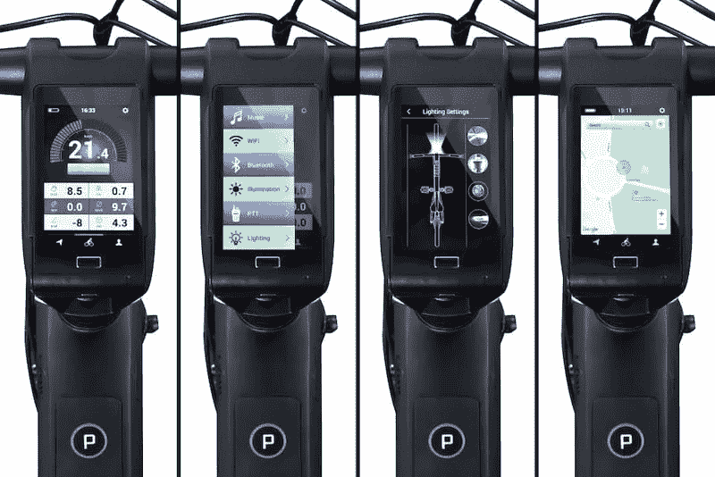
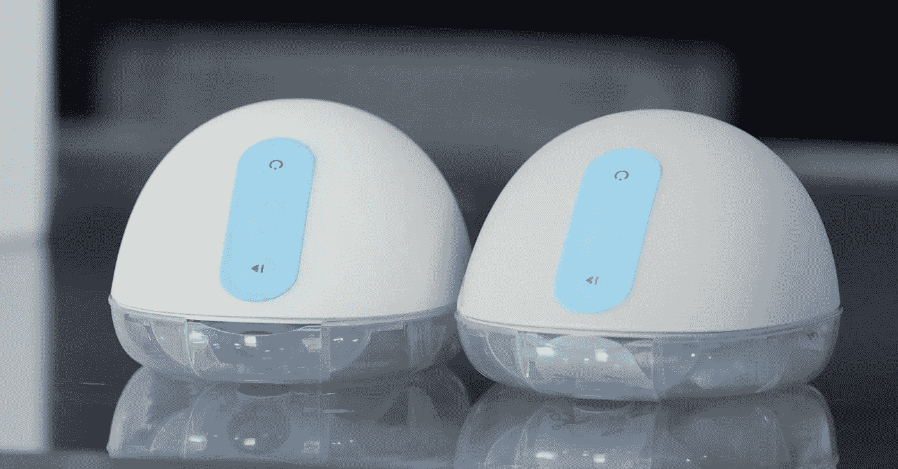

# CES 2019 概述:CES 2019 的最佳选择

> 原文：<https://medium.datadriveninvestor.com/ces-2019-overview-the-top-picks-of-ces-2019-81dd67f04f0e?source=collection_archive---------35----------------------->

在 CES(客户电子展)上总是超负荷。数百家科技公司和数千人。今年在 CES 2019 上，有超过 15，000 种产品可以展示。所有这些来自科技新闻行业的成千上万的人都尽力通过直播 CES 2019 的新闻、图像和视频，让你成为展会的一部分。大多数情况下，有些产品仍处于演示阶段，不准备投入使用。有时候我们觉得那里正在上演一部科幻电影！每年都有数以千计的酷原型被展示。但今年在 CES 2019 上有所不同。今年，那里展示了更多准备进入科技市场的酷产品。

The Bell Nexus. [3D Rendered](https://www.supremesupports.com.au/services/3d-rendering/) futuristic helicopter. *Bellflight.com*

我们今天在这里讨论一些真正酷的和未来变化的产品。

# 为你的优步之旅准备的直升机！

The Bell Nexus. [3D Rendered](https://www.supremesupports.com.au/services/3d-rendering/) futuristic helicopter. *Bellflight.com*

漫画里的直升机，不是吗？去年，一家名为 [Bell](https://www.bellflight.com/company/innovation/nexus) 的直升机公司宣布并展示了他们 Nexus 直升机的比例模型。(其实就像六轴直升机！)众所周知，它将成为优步的下一辆飞行出租车。今年在 CES 2019 上，贝尔展示了他们的 Hexa-Copter 的全尺寸模型。这让我们对蝙蝠侠的多功能汽车有了一个印象。该公司还声称，这款车将在 2020 年的某个时候投入使用。

# 一辆连接到 Alexa 的自行车

Cybric E-Legend bike with Alexa. *digitaltrends.com*

没有人想象过自行车可以有语音助手功能，不仅可以作为助手，还可以作为健身追踪器，方向给予者，速度追踪器，交通指南，提供导航提示等等！但是 Cybic Legend 已经为 CES 2019 建造了一个，并给了我们一个惊喜！印象。Cybric E-Legend 是一款集成了亚马逊 Alexa 的自行车。但不足为奇的是，Alexa 不会划着你跑这辆自行车。

The Cybric E-Legend bike’s dashboard with Alexa. *digitaltrends.com*

Cybic Legend 表示，这款自行车将于今年夏天在英国发布。以下是这辆自行车与 Alexa 合作时可以做的事情列表，

*   健康指标
*   速度指标
*   行驶距离
*   时间
*   实时交通信息
*   导航提示
*   启动自行车的集成照明系统
*   只用骑手的声音打开前后灯
*   音频播放器
*   全球（卫星）定位系统

# 柳树吸奶器有了更新

Willow breast pump-2.0\. *Top News*

去年在 CES 2018 上，我们已经看到了一款适合母乳喂养妈妈的友好设备。去年推出的柳树吸奶器今年有了更新，现在命名为[柳树吸奶器](https://shop.willowpump.com/pages/buy) -2.0。如果你们中的一些人不知道柳树吸奶器是什么，那么这就是它。Willow 吸奶器是一种可穿戴的产品，可以放在女性的胸罩中，为孩子吸取母乳。它悄悄地工作，在你不注意的情况下，在你外出时储存牛奶。牛奶储存在一个特殊的防溢容器里。

今年，该泵有了一些更新，如更好的配合，清晰的法兰，更容易清洁，更简单的组装。

# 索尼的 360°现实音响。超越真实的聆听体验

今年在 CES 2019 上，索尼将其最大的努力和焦点放在了 360°现实音频上。对于索尼来说，立体声已经死了，现在是时候在音频上多两个声道了。据索尼称，他们宣布的 360 Reality Audio 是大约 24 个基于对象的通道，排列在 360 度的声场中。索尼宣布他们的[360°真实音频](https://www.sony.co.uk/electronics/360-reality-audio)面向流媒体服务，其中一些已经获得了发布支持，如 Nugs、Qobuz、Deezer 和 Tidal。

【www.supremesupports.com.au】最初发表于**。**