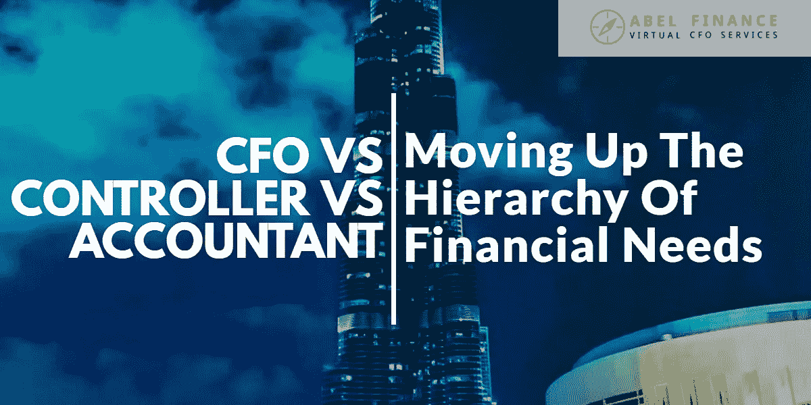
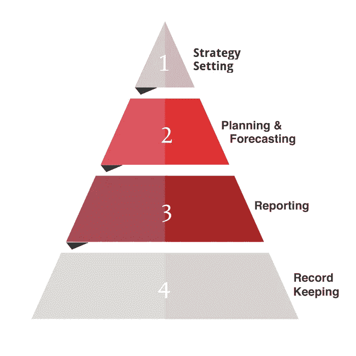

# 首席财务官 vs 财务总监 vs 会计:提升财务需求层次

> 原文：<https://medium.datadriveninvestor.com/cfo-vs-controller-vs-accountant-moving-up-the-hierarchy-of-financial-needs-49bcd4e61349?source=collection_archive---------8----------------------->

无论你经营的是咨询公司、贸易公司还是 SaaS 公司，随着规模的扩大，你都可能会面临类似的挑战:

随着你的公司成长，你开始接受更多的客户，招聘更多的员工，这使得你的业务变得更加复杂。在这里，你可能会发现管理和优化公司的财务变得越来越困难。

在意识到你需要提高对公司财务状况的把握后，下一步就是决定你是否要寻求会计、财务总监和首席财务官的帮助。谁是帮助贵公司提升财务需求层次的最佳人选？你应该找谁来帮你制定计划和战略？

 [## 一个企业在它的肚子上移动:如何顾及直觉-数据驱动的投资者

### 事实证明，直觉不仅仅是一种感觉。科学很清楚:你的直觉比你知道的更多…

www.datadriveninvestor.com](https://www.datadriveninvestor.com/2018/11/09/a-business-moves-on-its-stomach-how-to-make-allowances-for-gut-feelings/) 

在这篇博客文章中，我们将带你了解构成财务需求层次的四个层次，并讨论首席财务官、财务总监和会计之间的区别。继续读下去，根据你的具体需求，了解你需要雇佣什么样的角色。

# 金融需求的层次

把金融需求的层次想象成一个金字塔，金字塔的每一层代表不同层次的需求。

你可能听说过[马斯洛的需求层次](https://en.wikipedia.org/wiki/Maslow%27s_hierarchy_of_needs)；这几乎是一回事，只是它处理的是公司的财务需求，而不是个人的发展需求。在最基本的层面上，有记录保存，这是所有*企业都需要做的事情，包括初创公司和新成立的公司。最高层是报告，接下来是规划和预测。最后，金字塔的顶端是战略制定，管理公司财务的个人与你携手合作，最大限度地实现公司的增长。*

# 财务总监 vs 财务总监 vs 会计:你需要谁？

你是需要首席财务官、财务总监还是会计师，取决于你处于金字塔的哪一级(以及你是否正在向下一级过渡)。

# 记录保持

记录保存是相当自明的；这涉及到跟踪你的业务中的所有交易，包括销售和购买，费用，租金等。大多数团队将这项任务外包给簿记员和/或会计。

# 报告

报告建立在记录的基础上；在这里，您将您的记录转化为经理或企业所有者可以用来微调其流程的信息。

以你的损益表或现金流量表为例。如果你简单地按现状来看这些报告，看起来它们似乎没有什么价值。也就是说，如果您查看这些报告的定制压缩版本，即侧重于特定产品、流程或客户的过去表现的版本，这可以让您发现有用的观察和见解。

请注意，这些报告的价值与制作人员的技能以及他们对您业务中关键流程的理解直接相关。因此，虽然簿记员可以处理基本的报告，但与经验丰富的财务总监或首席财务官合作处理同样的职能会给你带来更好的结果。

# 规划和预测

正如温斯顿·丘吉尔的名言，不做计划的人就是在计划失败。对于动态环境中的企业来说尤其如此，因为客户需求和业务需求是不断变化的。

我们之前讨论的需求水平(记录保存和报告)是回顾性的，但是一旦你开始与你的财务总监或首席财务官一起计划和预测需求，你就在向前看，并把事情掌握在自己手中。通过使用历史信息并将其与关于未来的信息相结合，您可以对下一个时间段做出准确的预测，并确定您当前道路和未来选择的可能结果。

在这个阶段，你需要与一位经验丰富的财务总监或首席财务官合作，他是一位公认的价值创造者。此人将对今天做出的管理决策的未来后果提供洞察力，识别未来可能发生的问题，并就如何解决这些问题提供建议。

# 策略设置

在财务需求层次的最高层，财务将成为你的商业战略和日常运营的一个组成部分。在这里，首席财务官的角色是与每个流程和每个团队合作，以确定:

在更高的层面上，首席财务官支持并推动战略，对您的业务产生持久的影响。这可能包括 M&A 决策、国际扩张和商业模式。

# 什么时候该进入下一个层次了？

当你的企业发展迅速，而你发现自己无法再独自管理财务时，这是一个明确的信号，表明你应该向金字塔的顶端移动。

你接受的新客户越多，从财务部门获得的结构化信息就越多。同理，企业越大、越复杂，财务总监或首席财务官能带来的价值就越多。

另一方面，如果你的业务没有起飞，你需要重新审视你的业务模式，并可能转向，这也需要更多的结构化信息。有了更多的信息和数据，你将能够确定最好的关注领域，并了解如何扭转业务。

# 作为咨询公司、电子商务商店或 SaaS 企业，向金字塔顶端移动

如果你经营一家小型咨询公司，你会发现跟踪公司的财务状况很容易。但是随着你公司的成长，你可能会开始增加新产品和服务，这会使你的商业模式变得复杂。同时，向您的团队添加新成员(其中一些可能是远程工作者，一些可能是自由职业者)会增加您的成本和支出的复杂性。

在某个时候，你会开始发现跟踪你的财务状况很困难，当这种情况发生时，这表明你需要提升财务需求的层次。

电子商务商店也是如此。如果你开始只销售一种产品或一条产品线，这将是相当容易管理的。但是随着时间的推移，你可能会扩大你的产品范围和数量；您还可能与多个供应商合作(他们都有自己的付款计划和条款)，而不是一个供应商。

当这种情况发生时，你会想把你的财务管理外包给一个有经验的首席财务官，这样他们可以帮助你更好地管理你的现金流。最重要的是，这个人还能够提供对盈利能力的见解(例如:你的哪些产品最赚钱？)，预测，等等。

最后，SaaS 的企业主或许能够在第一年左右承担管理公司财务的责任，但随着规模的扩大，他们也会希望在团队中增加一名经验丰富的首席财务官。

企业所有者可能能够独立处理较低层次的活动，如报告(深入了解 CAC、流失、回收期等)。然而，他们可能没有专业知识来参与预测，以帮助他们确定他们添加到产品中的新功能的现金影响。与此同时，他们可能无法适当地分析他们的数据，以便为涉及其业务模式、定价模式和市场扩张的战略决策提供见解。这就是首席财务官的用武之地。

*原载于 2019 年 3 月 28 日*[*【abel-finance.com】*](https://abel-finance.com/cfo-controller-accountant/)*。*