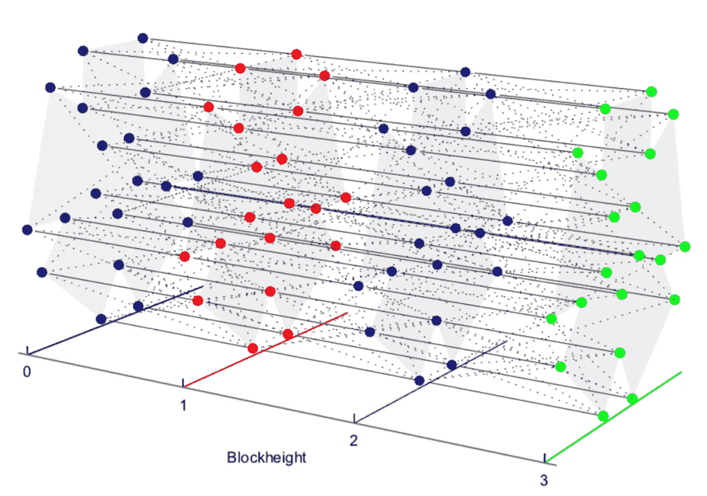

# 链网和可伸缩区块链的艺术第一部分

> 原文：<https://medium.datadriveninvestor.com/chainweb-and-the-art-of-scalable-blockchains-ed0c9ff03ab3?source=collection_archive---------1----------------------->

公共区块链技术的工作证明(PoW)计算模型是过去十年计算机科学的重大突破之一。然而，传统的基于功率的区块链被证明在大规模场景中使用时在吞吐量和性能方面有很大的限制。比特币等大多数区块链每秒只能处理少量交易；与传统的集中支付系统相比，这一统计数字就相形见绌了。为了真正成为一个去中心化的互联网，扩展不可信的、基于 PoW 的计算是当前一代区块链技术面临的最大挑战之一。最近，一家最初由摩根大通[孵化的名为](http://kadena.io/docs/chainweb-v15.pdf) [Kadena](http://kadena.io/#/) 的初创公司发布了一个新的分散协议，这可能是我见过的试图解决 PoW 系统可扩展性问题的最聪明的解决方案之一。

[嘉手纳的 Chainweb](http://kadena.io/docs/chainweb-v15.pdf) 是一种新的分散式协议，它结合了多个区块链，以令人难以置信的高吞吐量实现功率一致性。一些最初的基准测试表明，Chainweb 协议可以在超过 1000 个区块链上运行，每秒处理大约 10，000 个事务，这比其他 PoW 系统领先几英里。理解 Chainweb 相关性的一个好方法可能是理解在现代区块链网络中扩展不可信计算的其他方法。其中，股权证明和闪电网络在区块链社区越来越受欢迎。

# 利害关系证明

利益证明(PoS)协议作为传统电力系统可扩展替代方案出现。本质上，PoS 是验证和确认交易或冻结的替代方式。该方法基于一个验证器(相当于 PoW 中的“miner ”),该验证器根据其持有的赌注(硬币)数量和相应的赌注年龄进行选择。如果一个验钞机的钱包里有 100，000 个 alt 硬币，它会有一个年龄，取决于它有多长时间。这里的 100，000 替代硬币是赌注。在任何交易中，时效都会被重置。这个金额就像保证金，这意味着验证者在 alt-coin 中持有很大的股份，具有良好老化的硬币更受重视，并与许多其他因素相结合，将获得更高的验证块的机会。

PoS 系统是电力协议重要替代方案，但它也有局限性。首先，与 PoW 协议相比，PoS 系统在金融交易操作中的测试要少得多，这使得它们成为风险更高的替代方案。更重要的是，交易中的不同参与者需要投入资金以进行验证，这一事实在金融市场中可能会受到不同的监管控制。

# 闪电网络

流行的闪电网络(Lightning Network)等支付渠道是 PoW 协议的另一个有趣替代方案。支付通道协议的思想是将交易分解为一系列通过通道执行的较小支付。在这种模式中，资金与主网络隔离，用于一组特定行为者之间的一系列小额支付(或承诺)，并有能力在任何时候从主网络中扣除支付。

例如，假设闪电网络中的双方想要进行交易。他们将首先建立 multisig 钱包(需要一个以上的签名才能进行交易)。这个钱包里有一些比特币。钱包地址然后被保存到比特币区块链。这就建立了支付渠道。到那时，双方将能够在不接触存储在区块链上的信息的情况下进行不限次数的交易。在每笔交易中，双方都会签署一份更新的资产负债表，以反映钱包中存储的比特币有多少属于双方。当双方完成交易后，他们关闭通道，产生的余额记录在区块链上。

支付渠道是 PoW 的一种有前途的替代方式，但也给分散交易带来了新的挑战。值得注意的是，必须为一个渠道预先分配资金的事实造成了严重的流动性约束，这限制了除最大的利益相关者或参与复杂多方安排的人之外的所有人的可用性。

# 链式网

Chainweb 背后的新想法是 PoW 协议通过一个称为 Chainweb 的链网络来处理事务，从而达成共识。在 [Chainweb](http://kadena.io/docs/chainweb-v15.pdf) 中，每个链除了验证自己链中的事务之外，还必须验证一些预先指定链的块头，以便产生一个新的块。不同的链将它们的 Merkle 根彼此集成在一起，确保虽然它们每个都充当唯一的区块链，但它们仍然可以共享信息，并在分类帐之间建立共识。

[Chainweb](http://kadena.io/docs/chainweb-v15.pdf) 架构能够以任意复杂的拓扑结构组织不同的区块链，从而适应不同的场景。据我所知， [Chainweb](http://kadena.io/docs/chainweb-v15.pdf) 是唯一一个不需要边信道并且能够在扩展时保持网络安全的 PoW 扩展方案。

对 [Chainweb](http://kadena.io/docs/chainweb-v15.pdf) 感到兴奋？很好！因为，在这篇文章的下一部分，我将深入探讨 Chainweb 架构和协议