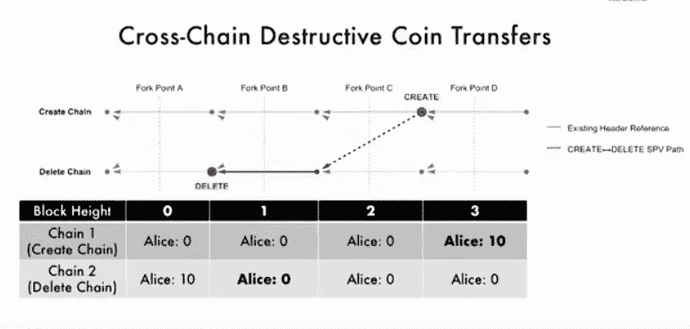
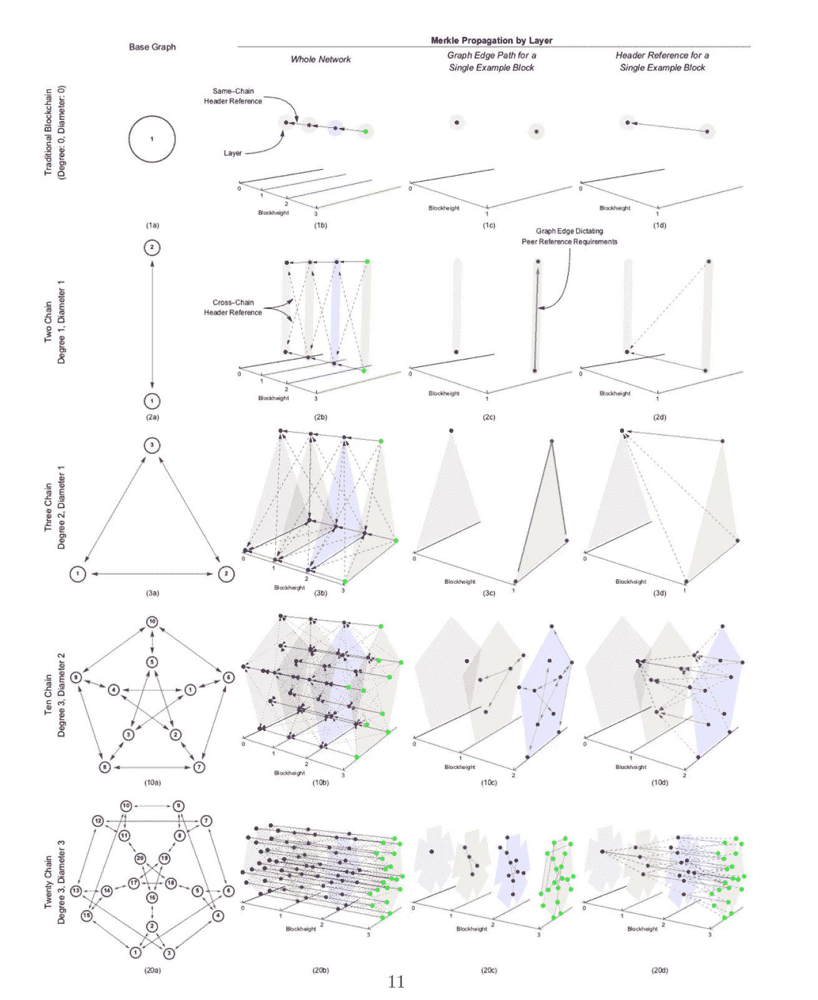

# 链网和可伸缩的区块链艺术第二部分

> 原文：<https://medium.datadriveninvestor.com/chainweb-and-the-art-of-scalable-blockchains-part-ii-90efce48d885?source=collection_archive---------1----------------------->

这是一篇文章的第二部分，该文章探讨了最近发布的 Chainweb 体系结构作为扩展区块链工作验证(PoW)系统的模型。[第一部分](https://medium.com/datadriveninvestor/chainweb-and-the-art-of-scalable-blockchains-ed0c9ff03ab3)探讨了一些技术，如利益证明(PoS)系统或支付渠道，这些技术旨在解决 PoW 架构的性能限制以及这些技术带来的一些挑战。今天，我想深入探讨 Chainweb 背后的一些概念，这些概念使成为扩展 PoW 区块链的一个可行选项。

如前一篇文章所述，Chainweb 背后的新思想是使用不同的网络拓扑来组合多个区块链，这些拓扑可以并行处理事务。从这个角度来看，Chainweb 能够在不需要侧链或支付渠道等链外机制的情况下进行扩展。Chainweb 的架构可以分为两个主要部分:

a)通过链上简单支付验证智能合同进行跨链加密货币转移

b)经由对等链 Merkle 根包含在散列级的并行链绑定。

# SPV 智能合约

Chainweb 从最初的比特币架构中借用了 SPV 的概念，并将其应用于跨区块链交易。SPV 的主要思想是在区块链网络中不运行完整节点的情况下验证交易。Chainweb 在网络中的所有区块链使用一种通用货币，这种货币面临着以不可信的方式跨链移动流动性的挑战。该平台通过启用链间转移协议来实现这一点，该协议能够通过在一个链上的帐户中删除硬币并在另一个链上的帐户中创建硬币来移动硬币。每次发生事务时，链间协议将使用 SPV。一个链上的删除证明被提供给创建链，以由应用层中的内置功能进行验证。

下图说明了在拥有不同区块链账户的两个人之间转移 10 枚硬币的 Chainweb 流程。

# Chainweb 协议

Chainweb 架构的第二个组件是 PoW 协议本身。Chainweb 网络可以使用来自同一种加密货币的不同硬币同时运行数千条链。每个链将其他对等体的 Merkle 根的子集合并到自己的块散列中。这允许给定的链通过定位它自己先前的 Merkle 根来验证它的对等链正在维护一致的分叉。此外，该机制还提供对等 Merkle 根的不可信预言，这是允许应用层转移代码验证所提供的 Merkle 证明以保证跨链资金转移所必需的。

Chainweb 协议最令人印象深刻的能力之一是能够跨非常多样的区块链拓扑工作，这使得它能够适应非常复杂的场景。下图说明了 Chainweb 体系结构中的一些常见拓扑。

# 解决密码猫问题

像 Chainweb 这样保留 PoW 模型以确认区块链中的交易的协议可能是公共区块链的“密码猫问题”的问题。这种挑战通常与这样的场景相关:一个流行的应用程序消耗了区块链网络中大量的矿用电量，从而影响了 ICOs 等其他重要应用程序。在 Chainweb 模型中，一个类似 Cryptokitties 的应用程序可以在它自己的几个链上运行，而一个大规模的(初始硬币发行)可以在网络中的另一个链上发生，它们不会互相拖累。虽然该协议仍然需要一些战斗测试，但它看起来确实是朝着正确方向迈出的一步，将 PoW 区块链扩展到可以支持高性能、关键任务应用的水平。