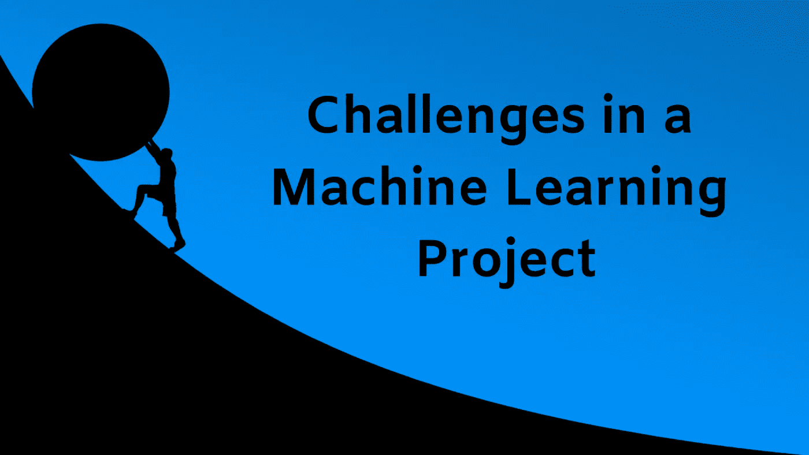

# 机器学习项目中的挑战——做一个项目时会有什么期待？

> 原文：<https://medium.datadriveninvestor.com/challenges-in-a-machine-learning-project-what-to-expect-while-doing-one-8abf43a76817?source=collection_archive---------20----------------------->

*开始一个机器学习项目也可能是非常令人兴奋和具有挑战性的。*如何*？假设，你工作的公司得到一个项目，为一个大型组织设计一个预测模型。该模型应该能够进行预测性的业务分析。作为一名经验丰富的工程师，你要领导团队，马上开始工作，直到你开始面对挑战。*

*那么，任何机器学习工程师在项目期间通常都会面临哪些挑战呢？想知道吗？那么，坚持到最后。*

* [## 金融中的机器学习——数据驱动的投资者

### 在我们讲述一些机器学习金融应用之前，我们先来了解一下什么是机器学习。机器…

www.datadriveninvestor.com](https://www.datadriveninvestor.com/2019/02/08/machine-learning-in-finance/) 

# 数据量

你正试图让一台机器像人类一样学习。所以，它需要被告知什么是什么，就像人类一样。但是人类需要多少次来学习和识别一个新的汽车模型呢？也许有几次。这就是问题所在。机器不能在很少的情况下学习一个新事物。

如果你试图建立一个识别汽车的学习模型，你仍然需要成千上万的数据实例。在预测列表中再增加几个车型，你可能会看到数百万个例子。

这是第一个问题。收集足够的数据。现在，确实有大量的数据正在生成。但是你需要特定学习模式的相关数据。这就引出了第二点。

# 数据的相关性或质量

您可能不希望在训练模型时使用动物示例，同时期望模型能够识别一般的汽车或车辆。

上述场景是大多数机器学习项目的典型场景。如果您收集的数据容易受到大量噪音和异常值的影响，那么模型将更难找到学习模式。

话说回来，这是任何机器学习项目的典型特征。你可以期待大量的时间清理和提取好的数据，减少噪音和离群值。

提取相关数据几乎需要机器学习项目 80%的时间。( [**你可以看这篇文章获取更多的思路**](https://www.forbes.com/sites/gilpress/2016/03/23/data-preparation-most-time-consuming-least-enjoyable-data-science-task-survey-says/#3e06750e6f63) )。

# 特征选择

您不希望模型在不能正确表示数据集的要素上进行训练。因此，特征选择非常重要。

该模型应该总是开始训练对未来归纳具有最高影响的特征。为模型选择好的特征进行训练称为 [**特征工程**](https://en.wikipedia.org/wiki/Feature_engineering) 。特征工程中最重要的两个步骤是:

1.  *特征选择:*在这里您可以选择数据集中已经可用的最相关和最有用的特征。
2.  *特征提取:*在这一步中，你组合可用的特征并创建更多有用的特征。

除了上面提到的步骤，还有一件事可以不变地添加，即收集更多适合于项目的数据，并确保新数据也包含一些新特征，这些新特征可以馈送到系统以进行更好的预测。

# 过度拟合和欠拟合

***过拟合*** 是指模型在训练集上表现很好，但在未来预测中泛化能力很差的情况。

***欠拟合*** 发生在即使对于训练集，模型的精确度也低于预期的时候。

这两个是过拟合和欠拟合的非常宽泛的定义。基于这两点可以写一整篇文章。但是上面的定义也抓住了潜在的含义。

这个帖子到此为止。如果你觉得这篇文章有价值，请评论、分享和点赞。建议总是受欢迎的。你也可以在 [**Twitter**](https://twitter.com/SovitRath5) 上关注我。

标签:[数据科学](https://debuggercafe.com/tag/data-science/)，[机器学习](https://debuggercafe.com/tag/machine-learning/)* 

**原载于 2019 年 3 月 15 日*[*debuggercafe.com*](https://debuggercafe.com/challenges-in-a-machine-learning-project/)*。**