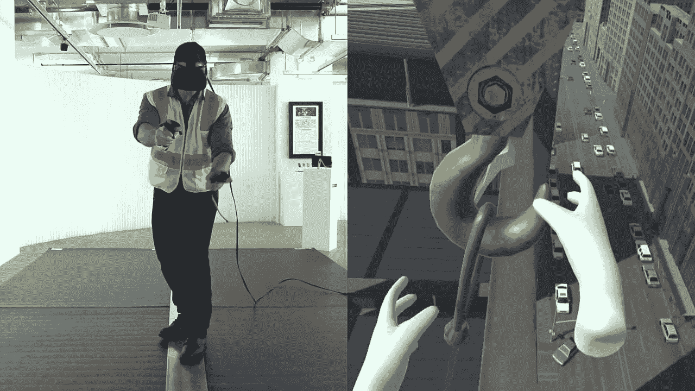
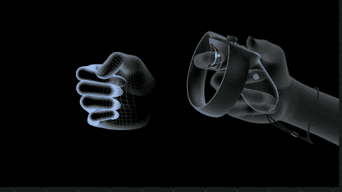
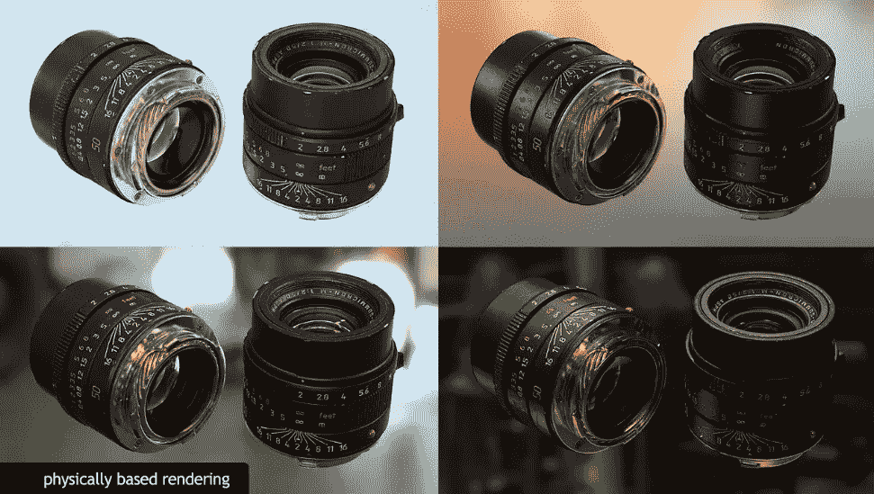
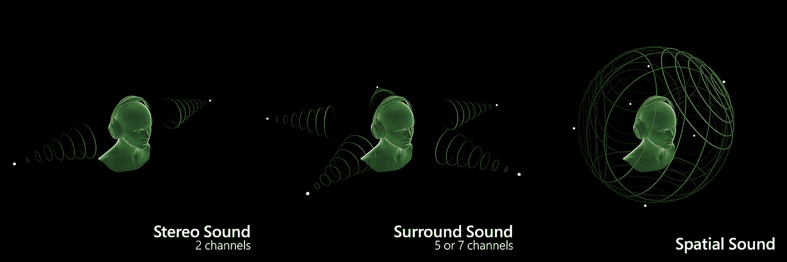

# 使用虚拟现实进行培训的挑战

> 原文：<https://medium.datadriveninvestor.com/challenges-in-using-virtual-reality-for-training-fea4d986faa?source=collection_archive---------3----------------------->

[SurviVR](https://www.youtube.com/watch?v=Ml-e-PyRXes)

随着虚拟现实硬件变得越来越便宜，软件平台变得越来越强大，创造虚拟现实内容和赚钱的动力越来越大。

虽然虚拟现实技术被视为专业人员培训方式的变革者之一，但我预见到学习和发展作为一个垂直行业会带来一些挑战。

## 超越新奇

Technicians required to work on very specific tasks over longer time

人们仍然依赖于媒体的新颖性，而不是学习方面。虽然有研究论文提出了通过观看图像/动画/视频而不是阅读来学习的理论，但可靠的案例研究尚未建立。虚拟现实在不同行业的广泛应用仅始于 5 年前，由于硬件的原因，这种应用也是有限的。目前，这种媒体的令人惊叹的因素是什么吸引了新的用户群，他们拿起它进行培训。然而，应该理解，VR 仍然只是传授训练的媒介。为了更好的教育，教学设计的规则仍然需要遵循，而不会产生负面影响。使用虚拟现实作为训练媒介的真正成功还有待检验和衡量。

## 不仅仅是订婚

根据教学设计理论，当一个学习者被要求一次又一次地完成任务时，学习的速度和量都要大得多。通过 VR 硬件中的可跟踪控制器，用户能够与虚拟空间中的环境和对象进行交互。然而，它们之间的交互是由硬件的能力决定的。这就像用鼠标教画家素描一样。如果那个人是数字艺术家，鼠标作为工具更有意义。

> 虚拟现实作为一种完全沉浸式的有效媒体的投影方式离它的实际实现还有一段距离。可能还需要十年以上的时间。

## 互动模式——自然与映射

> 虚拟现实最好的部分是它是数字化的，让我们能够坐在一个地方，指指点点，或者在一个地方进行活动。

Oculus Rift controller interactions

使用 6 自由度控制器跟踪人手是可能的，使用 Vive 跟踪器我们也可以跟踪不同的关节。这使得在虚拟环境中绘制用户的骨骼成为可能。这最适合虚拟训练，因为全身互动是主要用途。例如在工厂里走动、飞机乘警、运动等。然而，大多数使用虚拟现实训练的地方都有良好的手和手指互动。且当前硬件组不提供这种灵活性。Leap motion 确实具有手指跟踪功能，一些 VR 手套也是如此，但它们仍处于实验阶段，还不能用于实际的工业环境。

我们可以说，由于硬件尚未达到使人类能够像在现实生活中那样自然地与物体互动的状态，我们无法在虚拟现实中提供类似的灵活性。但这并不意味着我们将硬件上的某些按钮和转盘映射为自然交互，然后期望学习者记住实际的交互，而不是控制器上的按钮。

## 照片写实与插图

PBR based photo realistic renders

照片真实感是指渲染图像的质量接近使用相机拍摄的照片。照片中自然存在的光线、阴影、颜色和深度也会出现在照片真实渲染的场景中。训练应用本质上大多是动态的，因此场景也需要实时渲染。目前实现这些的最好方法是 PBR(基于物理的渲染)。在不同的视觉风格中使用说明性渲染来传达场景的本质是可行的。也可以通过 360 视频和照片的创造性运用来完成。

## 音频现实主义

Oculus Sound SDK

声音是使体验身临其境的重要因素之一。为了实现真正的沉浸感，开发人员必须将声音附加到几乎所有相互作用的物理对象上，或者附加到由于其性质(通过运动或风)而影响环境的物理对象上。当前的计算机系统无法处理如此多的音频处理。因此，为了优化处理过程，开发人员通常会将声音剥离出来，只显示环境和那些交互的对象。

Kumar Ahir 是沉浸式技术和设计领域的独立顾问。他一直在通过积极举办关于设计思维、AR 和 VR 设计、混合现实技术原型的研讨会来宣传新的沉浸式技术和设计。他的目标是为沉浸式技术创造一个更好的设计生态系统。到目前为止，他已经联合创立了两家公司。

*在* [*LinkedIn*](https://www.linkedin.com/in/kumarahir) *了解他，在* [*Twitter*](https://twitter.com/kernel_kumar) 关注他