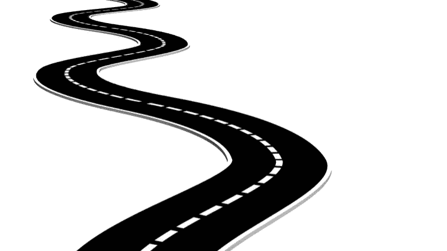

# 改变你的过滤器…改变你的生活

> 原文：<https://medium.datadriveninvestor.com/change-your-filter-change-your-life-a2db4ab37c21?source=collection_archive---------9----------------------->

从你开始…

你的一切，你将成为的一切，都是因为你经历过的。这些经历包罗万象。好的，坏的，和彻头彻尾的丑陋。你如何看待这些经历，现在，今天，将为你的未来定下基调。记住，你可以随时改变你的观点！

改变你的滤镜，改变你的世界。
对我来说，我可以在书中找到每一个借口来保持小打小闹。让自己远离我真正渴望的东西，我已经这样做了，这让我走上了一条不确定、疲惫和精疲力竭的道路。

以下是我学到的。我看待自己和我的生活的狭隘的过滤器是可笑的不公平。事实上，当我退后一步观察这个滤镜——我的窄镜头，完全没有意义。

没有什么阻碍我，没有无形的墙，没有障碍或阻碍，没有人/地方/事物阻止我实现目标…
只有我自己。

当你决定不再责备别人时，你剩下的只有自己的决定。
一头扎进你的梦里。
慢慢来。踮起脚尖，或者呆在岸上。
**但要为自己的决定负责。**

今天，我鼓励你，重新审视你的过滤器，审视你是如何看待自己和周围环境的。回顾那些对塑造你和你今天的生活有帮助的经历。

你所有的经历，所有的事情(我是说所有的事情),花一点时间把它们看作是一种祝福……在这之前你需要采取行动。 ***然后把它们放在一边，跨过那条看不见的线，走进自己的伟大。你迄今为止最大最深远的成功。***

无论这意味着你要为未来的畅销书写第一页，你要给你的梦想客户打电话，或者你只是决定不再玩小游戏，开始构建你梦想的生活…

采取下一步行动。我会在这里为你加油！