# 将 Python 工作转移到云上

> 原文：<https://medium.datadriveninvestor.com/changing-python-work-to-the-cloud-cbba9edf0523?source=collection_archive---------6----------------------->

我的 objectif 正在谷歌云平台上运行我的工作 Jupyter 笔记本。在使用我的机器使用 python 处理深度学习和处理中等数据的一些测试之后，很明显我需要或购买另一台计算机或将我的工作迁移到云。云是我的第一选择，而不是把钱花在新的基于 GPU 的笔记本电脑上，并且可以在 [**谷歌云合作实验室**](https://colab.research.google.com/notebooks/welcome.ipynb) 上免费使用。

Google 有一个非常灵活的平台来开发和运行 Python 笔记本([协同实验室](https://colab.research.google.com/notebooks/welcome.ipynb))。该平台可以连接到你的计算机上读取或写入数据，或者连接到你的驱动器(谷歌驱动器)，这非常好，因为你可以在谷歌云中构建你的所有开发。该平台必须与 Github 连接，让你运行保存在 GitHub 中的 Python 笔记本，或者最终将你的作品副本保存在 GitHub 中。

[Colaboratory](https://colab.research.google.com/notebooks/welcome.ipynb) 是一个免费的 Jupyter 笔记本环境，不需要设置，完全在云中运行。功能:

> > Colaboratory 允许您在浏览器中执行 TensorFlow 代码；

>>协作笔记本提供了从外部源加载和保存数据的方法。

>>提供一个[种子库](https://tools.google.com/seedbank/)；发现交互式机器学习示例的地方；

>>与 GitHub 的连接。要从 github 加载特定的笔记本，请附加 github 路径。

>>可以导入不在协作室中的库。要导入默认情况下不在协同实验室中的库，可以使用`!pip install`或`!apt-get install`。

>>在合作实验室中制图。笔记本的一个常见用途是使用图表进行数据可视化。Colaboratory 通过 Python imports 提供的几个图表工具使这变得简单。

为了测试和研究平台提供的功能，我做了一些基本的操作，从我的 Google Drive 读取 Excel 文件，并绘制信息。我用了一张表格，上面有关于地区(或国家)的信息，包括人口、PIB(内部产品)和地区面积。文件可以在这里下载[。](http://radames.manosso.nom.br/bitabit/planilhas/todos-os-paises-mundo-no-excel/)

## 让我们开始一些例子。

进入贝娄。

 [## 谷歌联合实验室

### 编辑描述

colab.research.google.com](https://colab.research.google.com/notebooks/welcome.ipynb) 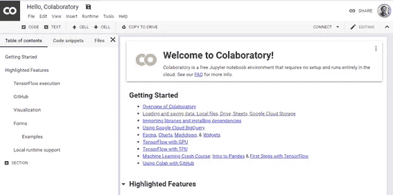

可以创建新的 python 笔记本

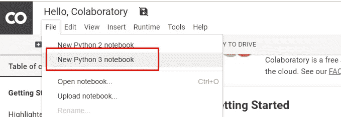

或者可以从 Github 上阅读你的笔记本 Python:

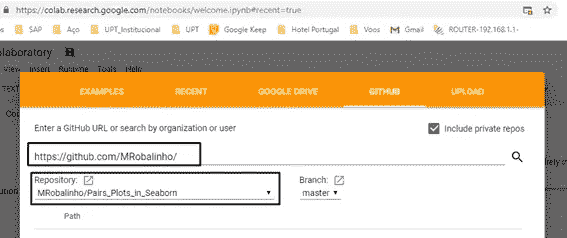

我已经创建了一个新 Python 笔记本，你可以在这里查阅，在 [GitHub](https://github.com/MRobalinho/Using_colab_research_Google) 上。我把它们保存在我的谷歌硬盘里。

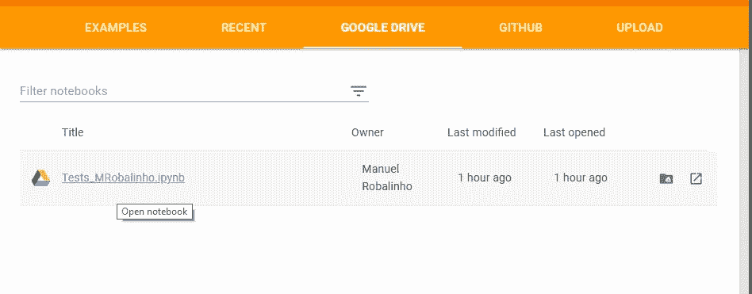

系统自动在我的驱动器上创建了一个新文件夹，名为 Colab Notebooks。

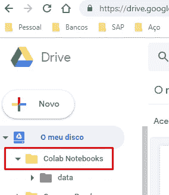

您可以连接到主机，或者在本地机器上。

首先，我与我的驱动器建立了连接，以读取和写入文件。

> 从 google.colab 导入驱动器
> 
> #获得授权以访问您的 Google drive
> drive . mount('/content/g drive ')

我们需要从 google drive 获得授权，读取那个[链接](https://accounts.google.com/o/oauth2/auth?client_id=947318989803-6bn6qk8qdgf4n4g3pfee6491hc0brc4i.apps.googleusercontent.com&redirect_uri=urn%3Aietf%3Awg%3Aoauth%3A2.0%3Aoob&scope=email%20https%3A%2F%2Fwww.googleapis.com%2Fauth%2Fdocs.test%20https%3A%2F%2Fwww.googleapis.com%2Fauth%2Fdrive%20https%3A%2F%2Fwww.googleapis.com%2Fauth%2Fdrive.photos.readonly%20https%3A%2F%2Fwww.googleapis.com%2Fauth%2Fpeopleapi.readonly&response_type=code)中的密钥访问。你复制密钥(CTRL C / CTRL V)到输入授权码，如下图所示。

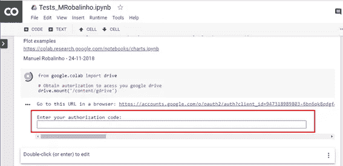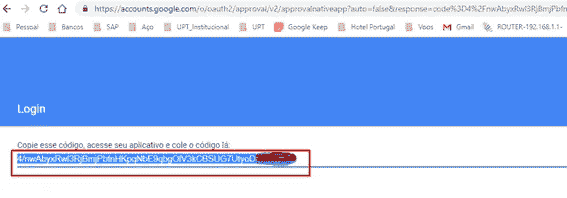

## 从驱动器读取文件。

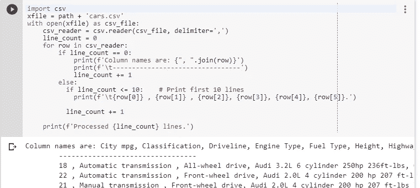

**使用熊猫读取文件**

正如我们看到的，在这里阅读它的形式是一样的，就像我们在 Python 中一样。不同之处在于文件夹名称。

我创建了一个路径变量，用于我所有的文件读取。

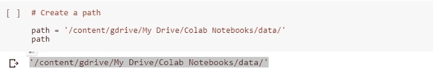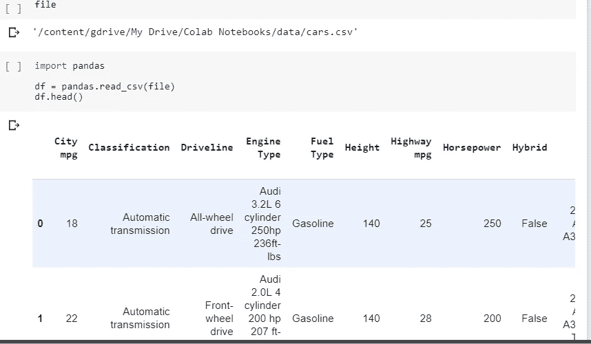

一个有趣的功能是你可以在代码中添加注释。你在谷歌表单中拥有的相同功能，在这里。

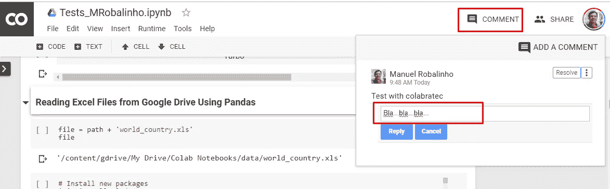

新的软件包可以使用！pip 命令。

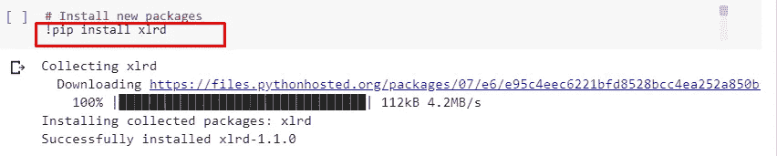

现在让我们做一些图表。首先导入必要的包。

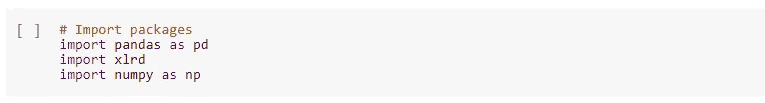

读取文件。我把我的 excel 文件放在我的谷歌硬盘里。文件是[那个。](http://radames.manosso.nom.br/bitabit/planilhas/todos-os-paises-mundo-no-excel/)

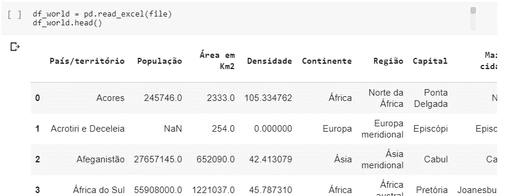

创建一个定义来制作一个条形图。

让我们看看世界上人口最多的地区。

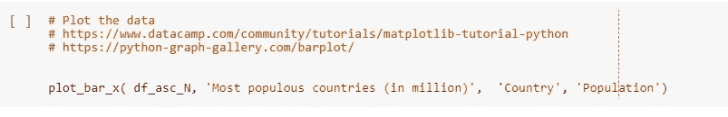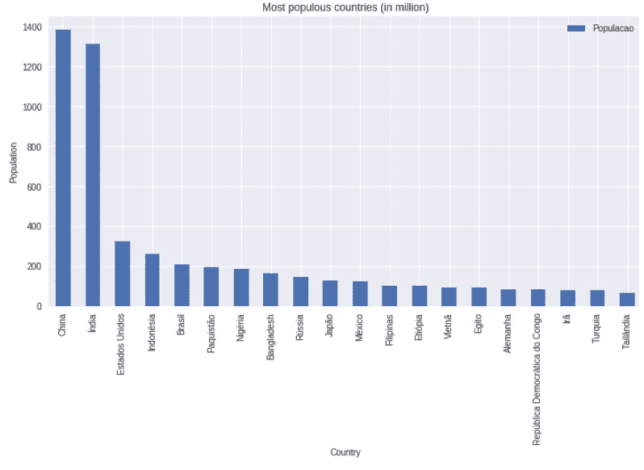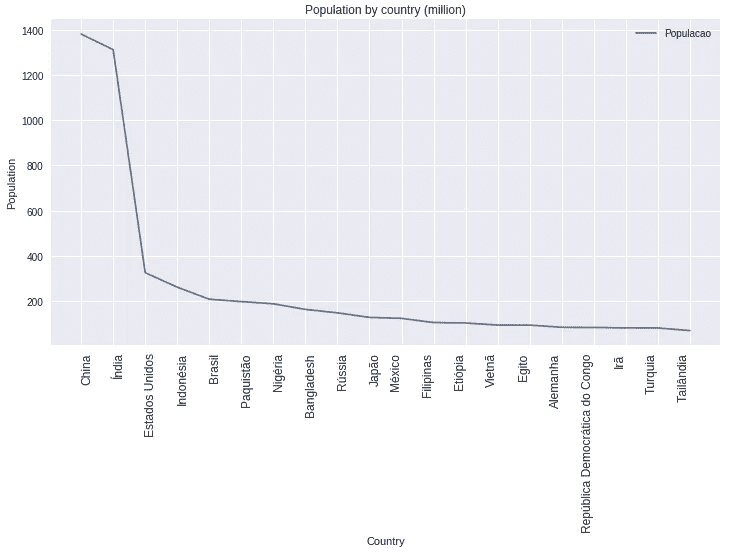

正如我们看到的所有命令都是普通的 Python，就像我们在 Jupyter Notebook 中的 Python 命令行 ou 一样。这很好，因为我们不需要修改代码就能在平台上运行。

让我们看看世界上**人口较少的地区**

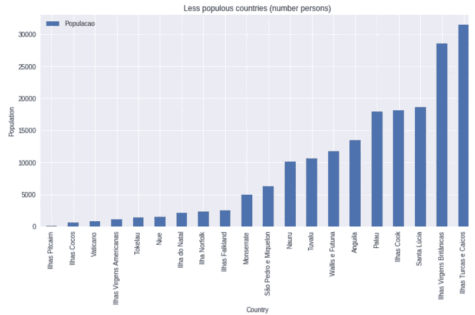

**按地域标绘面积(Km2)。**最大的 30 个 bigs 地区。

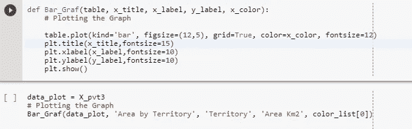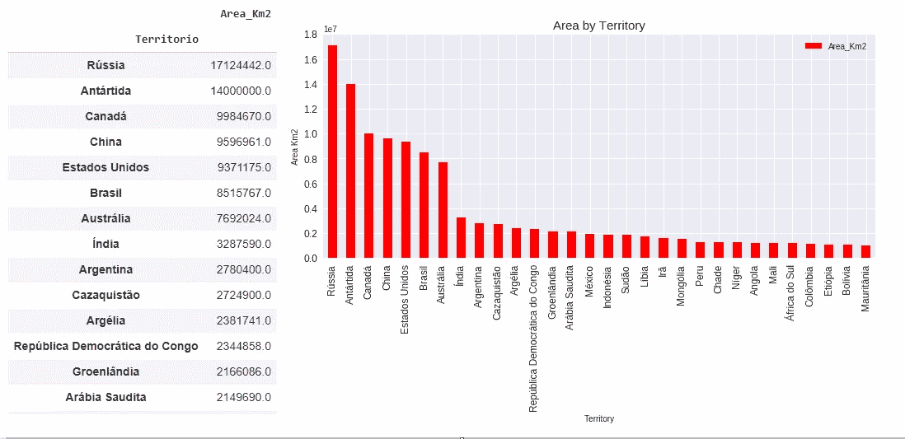

**按地区分析 PIB**

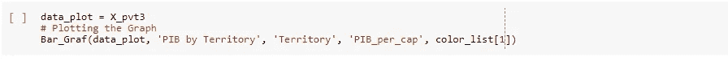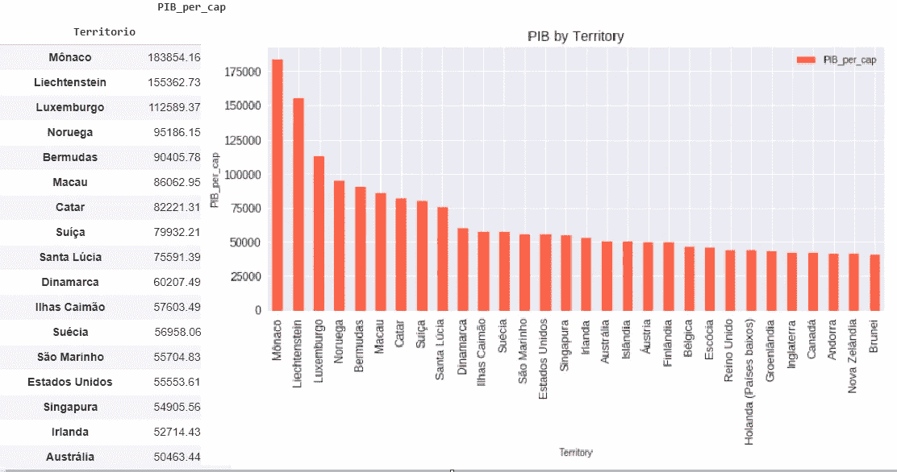

**按地区分析人口**

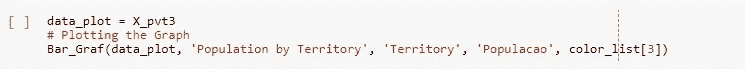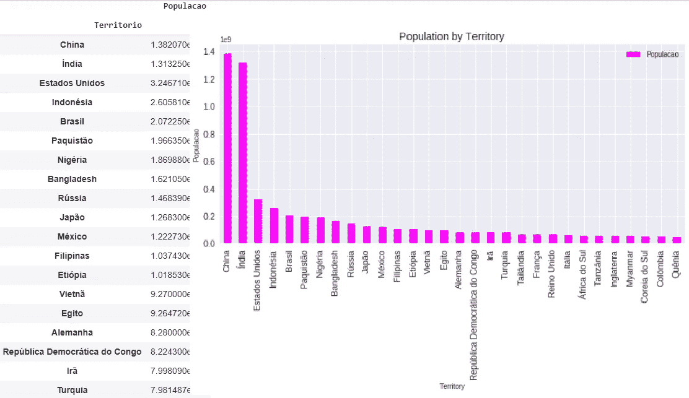

**绘制所有的统计数据**

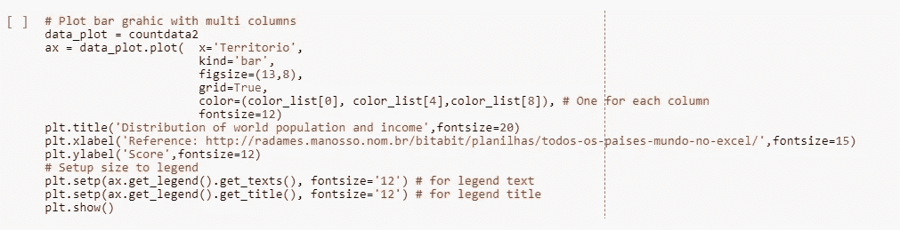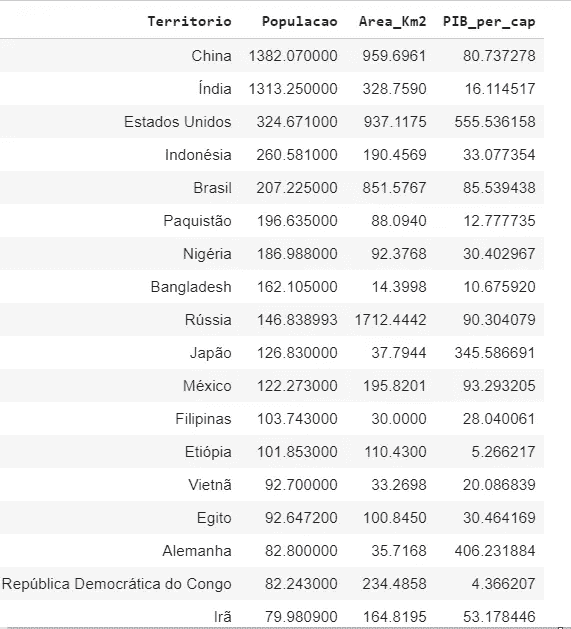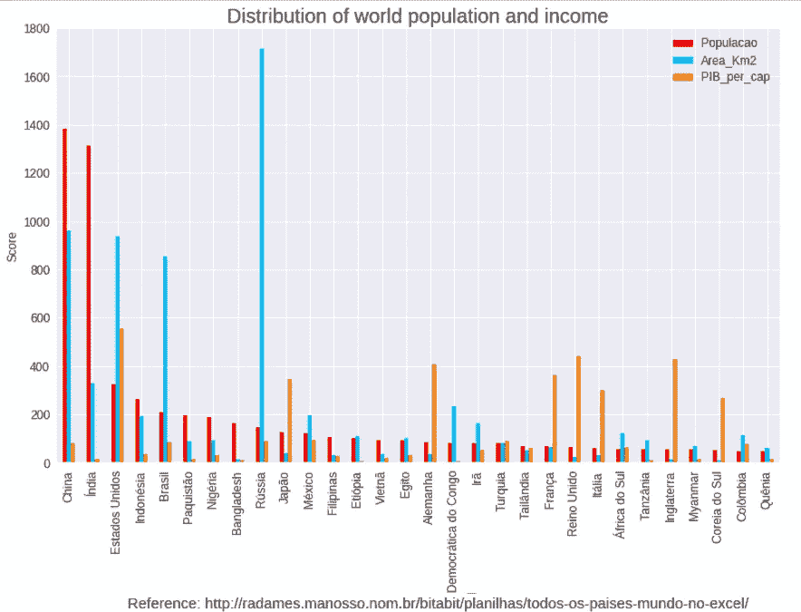

**结论:**该平台是使用 Python 开发你的作品的一个极好的形式，非常一致、快速，并且与我们今天拥有的通用开发工具相集成。简单又免费！

**部分参考文献:**

如何使用 colabratec(谷歌的 GPU 免费机):

[https://colab . research . Google . com/notebooks/welcome . ipynb # recent = true](https://colab.research.google.com/notebooks/welcome.ipynb#recent=true)

如何从 Google drive 读取表格:

[https://colab . research . Google . com/notebooks/io . ipynb # scroll to = F1-NaF VN-NwW](https://colab.research.google.com/notebooks/io.ipynb#scrollTo=F1-nafvN-NwW)
https://www . twilio . com/blog/2017/02/an-easy-way-to-read-and-write-a-Google-spread sheet-in-python . html
剧情举例:
[https://colab.research.google.com/notebooks/charts.ipynb](https://colab.research.google.com/notebooks/charts.ipynb)
关于国家的信息: