# 结合神经网络和分析引导毕加索和布拉克

> 原文：<https://medium.datadriveninvestor.com/channelling-picasso-and-braque-with-a-combination-of-neural-networks-and-analytics-3e0730280651?source=collection_archive---------0----------------------->

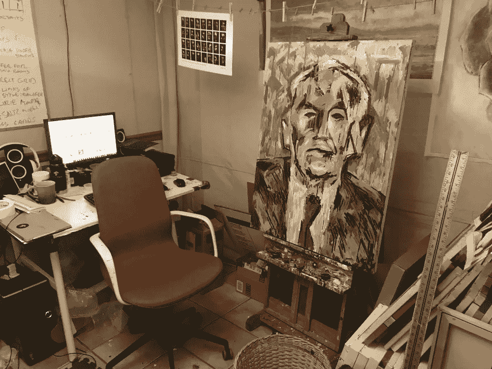

我最近的机器人绘画任务(见上图)开始于一个问题和一个挑战。

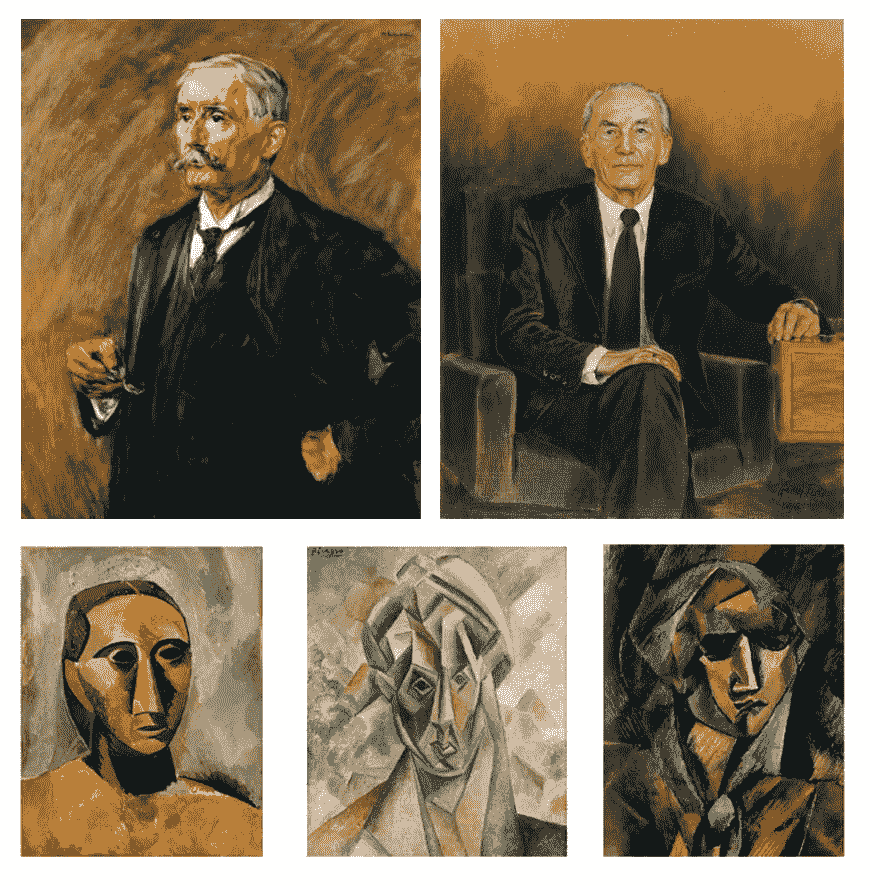

我收到了几张肖像画和几幅立体派作品，并被问及“风格转移是否更好，或者是否有其他方法来训练算法，以类似毕加索和布拉克开始时的方式分析性地重新绘制一幅画(即，将一幅画分割成基本的几何形状，每一轮都变得更抽象，等等)。)."

对我来说，很明显，分析方法会更好，即使仅仅是因为这是最初的艺术家所做的。但是我不确定，而且用这个问题做实验听起来是个很棒的主意，所以我一头扎进了肖像里。我首先使用风格转换来制作一个由神经网络重新成像的肖像网格。

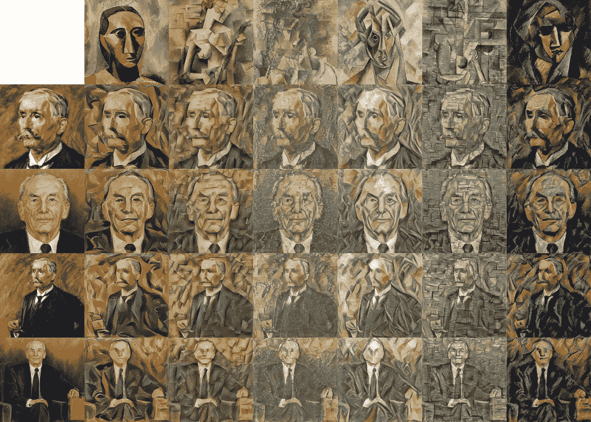

结果是可以预料的，但不管怎样，我总是发现立体派作品非常适合风格的转换。这个过程对某些艺术风格有效，对另一些则完全无效，但我一直发现它特别适合立体派。

完成了几次风格转换后，我开始尝试一种更具分析性的方法。我开始的第一个过程是使用霍夫线试图从原始肖像和神经网络想象的肖像中找到线条和形状。

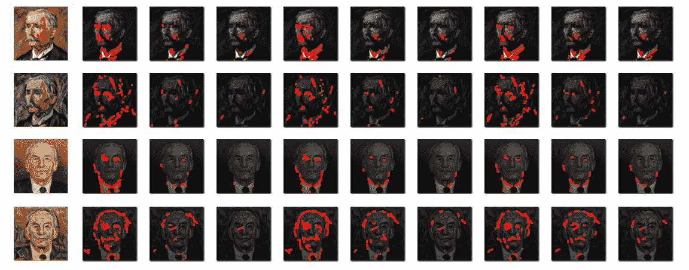

上图展示了在原始肖像和立体派风格转移中寻找和定义线条图案的许多尝试。我期待更好的结果，但信息至少是有用的…

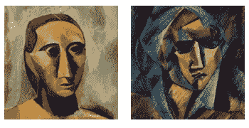

它向我展示了最初的六幅立体派作品中哪一幅具有最清晰的形状和线条(左图)。这也给了我的机器人一个参考框架，让他们在适当的时候画出自己的笔画。

不过，我有点困惑。我期待更好的结果，我的计划是利用这些结果来确定前进的道路。我想我也许可以在图像中找到形状，然后用这些形状画出其他形状来创作抽象肖像。但是这些形状并没有在我的算法中具体化。沮丧和不知道下一步该去哪里，我把这些图像通过我的许多传统人工智能算法，包括 viola-jones 面部检测算法和我自己的一些美丽测量过程。

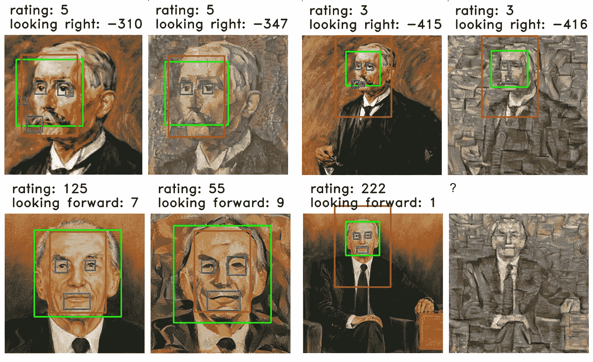

我的机器人用各种标准收集并研究了数百张图像。最后决定采用以下的构图和风格。使用这种组合的主要决定因素是，它发现这是它测试的所有变体中最具美感的。之所以选择这种风格，是因为这种风格能产生最丰富的分析数据。例如，在前面的过程中执行的霍夫线揭示了比任何其他风格转移更多的线条和形状。我希望这在以后的过程中会有用。

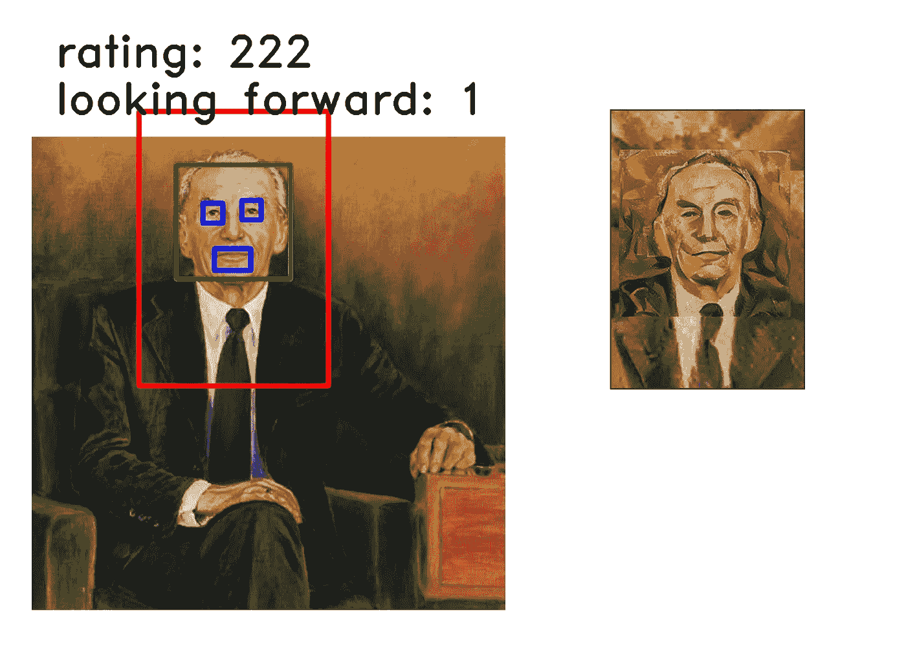

在这一点上，我想继续前进，但仍然不确定如何进行。幸运的是，当艺术家不知道下一步该做什么时，他们有一个由来已久的技巧。我们刚开始画画。所以我把所有的模型都装到我的一个大型机器人上，并让它开始工作。我想下一步该做什么的答案会在画的过程中浮出水面。

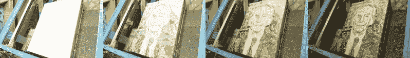

由于机器人画了大约一天，它没有做出很多审美决定。它只是画了肖像的一般纹理和阴影，从霍夫线开始。在我等待这幅素描完成的时候，画像专员提出了第二个建议。有人问我:

“如果我们试图从经典立体派作品的一个面运行一个标准的照片变形过程，并看看这个过程的过渡阶段图片是否可以成为人工智能工作的基础，会怎么样？”

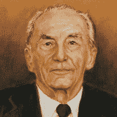

Morphing into a Braque

我以前从来没有这样做过，这是一个有趣的想法，所以我尝试了一下。我发现结果很有趣。此外，在变形过程中看到相似性消失的确切点也很有趣，这张脸变成了一幅布拉克画。

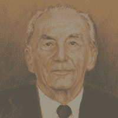

Style Transferring into a Braque

创建变形动画的另一个有趣的方面是，我能够将它与神经网络如何应用风格转移的动画进行比较。为了便于比较，左边可以看到两个动画。

撇开有趣的比较不谈，我有一条前进的道路。我向我的机器人展示了如何使用变形图像。在绘画的第二阶段，他们致力于完成布拉克风格的肖像。

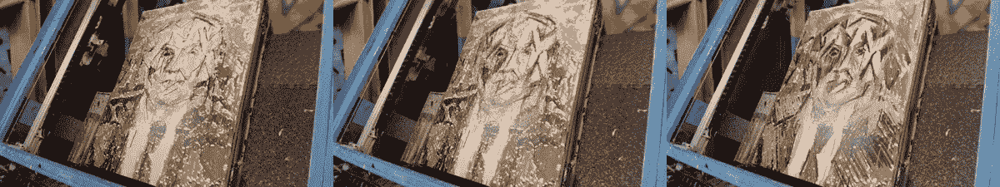

我真的很喜欢这个结果，但是，有一个主要问题。这幅肖像太抽象了。它不再像肖像的主题。它已经失去了相似性，每幅肖像应该做的一件事就是与主体相似，至少有一点。这幅肖像没有，我意识到它需要另一个回合来使肖像回来。

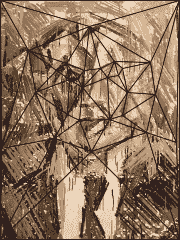

为了做到这一点，我让机器人使用另一轮的风格转换和变形来返回到更像原始肖像的东西。机器人变得太抽象了，所以我告诉它更具代表性。

虽然这个阶段的风格转换是自动的，但是变形需要我的手动输入。我必须定义源抽象图像和样式图像中各种特征的边缘。我试图自动完成这一步，但我的算法都不能充分理解抽象图像。它不知道如何定义诸如背景或眼睛位置之类的东西。我将在未来研究更好的方法，但目前我并不觉得这是我的机器人计算机视觉的一个弱点。

我最大的机器人花了一周时间完成了最终的绘画。下面是它完成的延时视频…

我刚刚给出的关于我的机器人如何制作这个的描述是我的整个生成性人工智能艺术系统的简略轮廓。使用了其他几种算法和计算机视觉系统，虽然我真的只集中在描述风格转换和变形之间的来回。该机器人开始使用神经网络制作立体派毕加索风格的东西，然后将图像变形以模仿布拉克。一旦事情变得过于抽象，它通过使用这两种技术回到一个更具代表性的肖像。一次又一次。

在机器人完成了视频中看到的 12，382 个笔画后，我用手修饰了几分钟，然后涂上了透明清漆。令人欣慰的是，虽然我的机器人可以轻松完成它应用的数千次笔划中的 99.9%，但我仍然需要完成最后的 0.1%。我作为艺术家的工作目前仍然安全。

品达·范·阿尔曼
cloudpainter.com