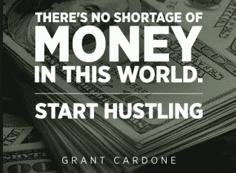

# 第 11 章，我们能从格兰特·卡尔多内和超级富豪身上学到什么

> 原文：<https://medium.datadriveninvestor.com/chapter-11-what-we-can-learn-about-money-from-grant-cardone-and-the-super-wealthy-e8511982bd5a?source=collection_archive---------6----------------------->

我一直认为，你是你最亲密的五个朋友的平均价值。问题是，如果有钱人喜欢和有钱人一起出去玩，你如何在不成为超级富豪的情况下，和百万富翁和亿万富翁交朋友，同时保持真实而不阿谀奉承？没有人想“假装成功，直到成功”，这是绝望的尖叫，自嘲和不知不觉地富有要好得多。思考“T1”如何对整个富足理论产生负面影响，但我的大脑是有逻辑的。我喜欢策略。

上周末，我有幸在伦敦与格兰特·卡尔多内(可以说是世界领先的销售权威)度过了三天，这是他的首次英国之旅。几年前，在读了格兰特的七本纽约畅销书之一《x10 法则》后，我开始关注他。为了让积极的内容充斥我的大脑，我每天都用 audible 听，速度是 x1.2(好像能量不够高)。如果我开始感到沮丧或失去动力，那是因为我不再听格兰特的话了。我把他作为我的个人秘密藏了起来，只告诉了几个密友他惊人的销售策略，但在他第一次出色的英国巡演后，我愿意分享他。

本周末与格兰特共度的时光强化了富人对钱的不同看法。没有人被教导如何建立如此巨大的坚不可摧的财富，以至于任何政治或经济动荡都无法触及。尽管马丁·刘易斯希望我们相信这是为了让我们的财务状况恢复正常，但你不会通过储蓄、数硬币、收集优惠券、牺牲一杯咖啡、关灯、获得更高的个人退休账户利率或投资多样化基金(据说是为了分散风险)而变得如此富有，当然也不会通过积累养老金来实现。

为什么我们会这样想？

有限的思维方式会导致匮乏的感觉，没有足够的钱，而事实上，这个星球上有数万亿的钱。根据格兰特的说法，如果你没有足够的钱，你就有错误的数据。是时候获取正确的数据了。很简单，与其削减开支，不如把重点放在创造更多收入上。这是销售问题，不是费用问题。

你只有通过勇敢和投资才能变得富有。根据与沃伦巴菲特的协议，格兰特只投资不会亏钱的交易。然而，要达到这个水平，有一个要素需要“冒险”你想要保护的东西，钱。记住每一项投资都需要勇气。

根据超级富豪的说法，商业是为房地产提供资金的“乐趣”，而房地产才是真正赚钱的地方。甚至我们对房地产投资的理解也与富有的美国房地产投资者的工作方式完全不同。格兰特有争议但明智的观点是，你不应该拥有自己的房子(相反，你应该出租并投资于产生现金流的房地产)，这总是会让伦敦人感到困惑，因为它违背了我们曾经被建议做的一切。把你的房子算作一项资产(实际上它是银行的一项负债)不是一项产生现金流的投资，也不包括在构成你净资产的资产中。

我们认为房地产投资是买一个新房子，安装一个新的浴室和厨房，然后转手，同时猜测有人会以新价格(由你编造，所有价格都是编造的)购买它。富人投资房地产的方式是在一栋大楼里购买多个 500 套的单元，在出售前产生大量现金流(只要他们愿意，而不是因为他们需要)。

每个人都想变得富有。令人难过的是，我们都在努力尝试，但用的是错误的数据。好消息是，有了正确的数据，这是一个不同的世界。这就像当你在黑暗中坐了几年后，有人打开了电灯开关。虽然你可以错误地致富，但你不能错误地致富。

要创造财富，你需要几个收入流，理想情况下是十个(尽可能多的被动收入)，协同工作，同时接受永远破产的心态，不管你有多富有。一旦你收到任何形式的钱，就把它存入一个你不能动的神圣账户(不是为了长期储蓄，而是为了投资)。当你积累超过 10 万英镑时，把账户清空，投入投资(这不会让你赔钱)。这很可怕，这需要勇气，因为你很快就会再次破产，但这会让你保持饥饿。

为了达到这个阶段，你的目标是存下你全部工资的 40%，税前，而剩下的 20%，税后。虽然在你达到 40 万左右的神奇数字之前很难做到这一点(试着计算一下，以达到你的生活/支出门槛)，但在这一点上，看一看真正的财富是如何产生的就变得容易了。我们一直在关注错误的指标，削减开支而不是创造更多的收入。找到更多的产品和服务来销售，学习成为世界上最好的销售人员，同时不要为你每天的星巴克点击率感到压力。

在第一排看了两天格兰特的表演后(我总是超级热衷)，我在周五的晚餐上见到了他和他的妻子埃琳娜，周日在一个令人难以置信的私人策划小组(是的，这仍然是一个工作日)。富人的想法与普通人(甚至是企业家)完全不同。格兰特对失败真正原因的定义是，一开始就没有足够大的目标。我的目标看起来很大，但在格兰特面前，从 O2 洲际酒店 18 楼的玻璃板上俯瞰伦敦，它们似乎不够大。很难确保我的心态相信我可以实现当前的目标，尝试更大的梦想，现在可能是一个太远的阶段。

要变得富有，我们需要一个有多种收入来源的大视野。即使到了 100 万，我们被告知甚至不要试图购买一辆豪华车，在这个阶段你还不富裕。没人会注意到你有钱，因为你没有。观察你从谁那里得到投资建议(这听起来很明显，但不要从没有钱的人那里得到金钱建议)。大多数告诉你如何赚钱的人都是通过教授这门学科来赚钱的。证据在于一个人的净资产，而不是他们的社交媒体档案。

直到你开始和有钱人交往，你才会发现其中的规律。T2:你周围的人和你从谁那里得到建议非常重要。你知道如果你一直和格兰特在一起，你的生活会变得面目全非。

回到他在 you tube 频道和卡尔多内大学(他令人惊叹的在线销售培训项目)上观看他的节目。

当我给他服用第 15 度旅行补充剂以帮助他适应时差时(尽管在价值 5000 万美元的墨西哥湾流喷气式飞机上这比在商用飞机上问题要小)，我想说‘格兰特，不要回家。伦敦需要你……我需要你。

直到我们在迈阿密再次相遇…

