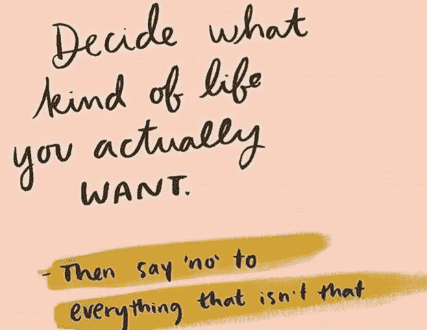

# 第二章，发现初创企业的刺激(习惯于永远不舒服的感觉)

> 原文：<https://medium.datadriveninvestor.com/chapter-2-discovering-the-thrill-of-start-ups-and-getting-used-to-feeling-permanently-5a36cc3248ec?source=collection_archive---------26----------------------->

在另一家没有灵魂的大型投资银行工作了一段时间后，我有机会帮助运营一只对冲基金(第一步，说好，第二步，谷歌“什么是对冲基金？”)我喜欢创业阶段的兴奋，那就像毒品一样。我在压力下茁壮成长，并与有权势和影响力的人一起工作。我最喜欢的是从无到有创造东西并看着它进化的过程。它(最初)规模小、速度快、充满活力，与大型企业投资银行完全相反。

与此同时，我家把农场从埃塞克斯搬到了萨福克。我们的新家有一个婚礼场地，所以我很自然地看到了一个服务于婚礼市场的机会，提供婚礼策划服务和一个名为“婚礼必需品”的电子商务网站，销售婚礼所需的一切(建于 Shopify 和 Squarespace 之前的昂贵时期，与此同时，托特纳姆法院路的五彩纸屑店破产)。我把它作为副业，后来成功地卖了它并获利。

十几岁时，企业家精神就在我的 DNA 里。我用我的零花钱买了科文特花园的陶瓷珠子来制作项链，然后在当地的工艺品商店出售。我热情地将所有利润投入到我在缝纫机上制作的发圈中。我最近读到纯粹的奢华发圈正在回归——是时候让歌手离开阁楼了！

在初创对冲基金公司，我的很大一部分职责是组织路演，让我的老板在世界各地进行复杂的商务旅行，跨越多个时区，进行融资。后勤、成本和会议安排决定了时间表，照顾他们的健康或他们如何应对时差不是我的责任(在第 4 章中保持这种想法，因为它确实成为我的问题)。

在帮助启动了 4 个对冲基金后，甚至我的超高能量也耗尽了。我需要休息一下来思考。是时候休假了，我称之为长假，因为成年间隔年听起来太“中年危机”了，我仍然没有改变对“间隔年”的看法。

我真的不知道我想要我的第三章是什么样子。

我筋疲力尽，但为停下来，甚至是休息一下而感到内疚。我后来发现，因为害怕停滞不前和一事无成，我非常渴望“做”,如果我静静地坐着，什么也不做，什么也不思考(没有负罪感),我会更快地“达到”目标。无论“那里”是哪里，我正以每小时一百万英里的速度奔向那里。

看着人们在训练营里锻炼，我重新爱上了邦迪日出时的健身。我曾经热爱运动；记得 90 年代我穿着锐步健身服去学校的踏板操课上，我总是尴尬的面对相反的方向或者从台阶上掉下来。我会在辛迪·克劳馥进行家庭训练，穿上细长的鞋子(还记得吗？)坐在电视机前，希望不做任何运动就能练出六块腹肌。

工作和社交是如何妨碍我的，十年来我是如何不关注自己的健康的？有多少其他成年人有同样的感受？我有了一个顿悟，我希望每个人都变得超级健康，重新爱上锻炼、健身、户外活动和关心自己的饮食。我要通过锻炼让每个人都感到快乐。

邦迪上的每个人看起来都很开心，那么还会有什么问题呢？

在悉尼阳光明媚的三个月后，我于 2008 年 12 月回到了英国，当时可能是自 1930 年大萧条以来最糟糕的金融时期。很容易理解为什么我们不像澳大利亚人一样是一个热爱户外运动的国家。

天气寒冷，一整天都没有太阳，再加上雷曼兄弟和伍尔沃斯都破产了，而我正在乘坐直升机飞越大堡礁。尽管我母亲每天给我发邮件，告诉我不要花钱，但你怎么能不坐直升机飞越大堡礁呢(我并不后悔，因为如果珊瑚礁真的濒临死亡，这可能是我看到它的唯一机会)？另外，我有一个月的时差。

当我开始新的户外健身业务时，我们很快就会兴奋起来。我让人们在海滩上锻炼，在公园里训练，我开始听起来像丘吉尔的诺曼底登陆演说。除了 BMF，没有训练营，每个人都在健身房锻炼或者根本不锻炼。太棒了。

对我来说，这是改变他人生活的绝佳时机，让我过上有史以来最健康的生活，并通过发展自己的健身帝国赚钱。我想要健康和财富，而不必坐在办公桌前牺牲一个。

在 2018 年阅读这篇文章，真的很难看出这是如何没有按计划进行的。但事实并非如此。

在第三章中找出原因。