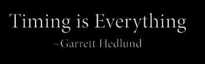

# 第三章，时机是市场的修正器。

> 原文：<https://medium.datadriveninvestor.com/chapter-3-timing-is-the-corrector-of-the-market-place-6e6eda9ee356?source=collection_archive---------22----------------------->

在 2008 年，没有 Instagram，没有拍摄食物或者更糟，你自己做 burpees(为什么有人这样做？)没有主流名人食谱、应用程序或名人私人教练和有影响力的人在公交车上做广告谈论侏儒树(又名西兰花)。在 2008 年，没有足够多的人关心健康。

那时，我意识到我没有为足够多的人解决足够大的问题。我不了解我的目标市场，它是那些喜欢付钱和我一起在黑暗中带着手电筒在雨中绕着公园跑，同时我对他们大喊大叫，说我们有多开心的人。不太像邦迪训练营。

你猜对了，为了启动这个疯狂的计划，我必须训练成为一名私人教练。再次回到学习(这什么时候才能结束？).令我惊讶的是，解剖学课程完全令人着迷，我完全爱上了我们的身体是多么神奇，并变得像福音一样关心我们的健康。随之而来的是痴迷。我记得在一家餐馆里，一位女服务员给我一杯绿茶加糖，我开始大声抱怨糖是如何慢慢杀死我们所有人的。没人在乎，这也没让我成为一个好的用餐伙伴。为了道歉，我不得不给女服务员小费。

恐惧并不总是一个好的营销策略，至少在 2008 年不是。

我本打算雇佣私人教练，这样我就可以专注于发展业务。第一个问题。在 M25 之外，没有足够的有动机、有企业家才能的教练。警钟开始响起，但我选择盲目忽视它们，自己也成为其中一员。无论我如何努力激励，我都找不到足够多的老师来给课堂增添活力，或者帮助我建立自己的企业。所以，是我创造了一个相当于室内体育课的室外课堂，没有音乐，只有自然元素。最后，我找到了一些，并训练他们。我有一个令人敬畏的 6 人团队，但不足以改变世界。

得到正确的公式并不容易，第一个训练计划失败了。我试图效仿莱斯·米尔斯的公式，在推出新的课程之前，在一段时间内反复教授同样的课程。人们不想那样，他们厌倦了。他们希望每一次会议都是不同的，不知道会发生什么，一个惊喜的元素来激励他们出现。

终于，在免费试用后，人们开始注册，而我也不用努力“推销”了。第一个夏天，人数在增加。这很有趣，太阳很热，我们都晒黑了，有点像我心爱的邦迪。然后第一个冬天来了。核心成员“振作起来”,穿上更多的衣服。我觉得我正在慢慢冻伤。令人惊讶的是，我们在第一个冬天的注册人数比夏天多(所以霜冻是值得的)。与在阳光下训练相比，在没膝深的雪和冰冻的条件下进行黑暗训练似乎吸引了更多的人。

原因？

天很黑，所以人们不太担心别人看到他们有多不健康。黑暗打破了任何社会障碍。更奇怪的是当春天来临的时候。我在白天教了 4 个月的第一节课，每个人都能看到他们整个冬天都在和谁一起训练。

第一年，很难出错。除了洛杉矶健身中心，这里没有竞争，也没有其他东西可以提供。我们接受了当地大部分的训练。它成了结识新朋友的绝佳社交场所。作为一个成年人，你还会在哪里结交新朋友？

成员们跳上路虎的后座，上面印着我(非常艾伦·帕特里奇)用现金购买(非常德尔男孩)所有的‘在外面做过吗？’(非常厚脸皮)在黑暗中发光。我意识到我是多么热爱销售，几乎是任何东西。这是唯一让我非常非常兴奋的事情。我不确定有什么能和它竞争。当人们购买你亲手创造的东西时，那就更令人激动了。

我在东安格利亚发展了一群信徒，最亲密的成了朋友。我收到的最奇怪、最讨人喜欢的礼物是一个玻璃感恩罐(在感恩成为潮流之前)，里面有每个成员手写的小纸条，告诉我我对他们有多重要。我还留着它。这是一种 Hay House 会变成一个激励 Gabi Bernstein 产品的东西。

然后其他 PT 看到它看起来有多有趣(还记得我不能用奖金和职业发展诱惑健身房的那些吗？).竞争无处不在，甚至在我谈判(并支付)成为唯一经营者的公园里。甚至我的一些忠实会员也决定尝试所有可用的选项，用 5 英镑购买 10 次团购券。人们喜欢代金券，即使他们不想要代金券提供的东西。

然后它很快就不再有趣了，我每天都在问自己，当初为什么要开始它。

我很快学会了两件事:

1.我喜欢销售，

2.处于充满竞争的红海中会慢慢耗尽你的精力，即使你是一个非常有竞争力的人，想要“赢”。

从根本上说，我没有解决一个足够大的问题，或者我解决了，但在未来太远，无法培养足够大的追随者。我不得不不断改变人们的行为来参加会议，人们很懒，天气也很少对我有利。让每个人都保持动力已经很累了，更别说我自己了。我尝试了每一个大师的营销策略，但它实际上没有什么不同，我没有得到任何更多或更少的成员。我在我们有公园的三个城市都停滞不前，没有足够的人来建立我的帝国。它变成了一种生活方式的生意，这不是我想要实现的。

这是一个非常酷的品牌，领先时代 10 年，但位置不对。伦敦在澳大利亚之前就让我焦头烂额，所以我决定在我的家乡东安格利亚撒点魔法。问题？市场规模不够大，我的宏伟计划无法实现。此时，伦敦的公园里已经挤满了训练营，尤其是克拉彭公共训练营，每晚至少有 500 人在这里训练(同样的比赛问题，不同的地点)。

我的感觉不够独特，不能搬到伦敦，那里也有一个遍布整个城市的训练营。我的独特性是“我”和我现在摇摆不定的无限能量。只有一个巴比隆运气，你到底是怎么衡量的？在线流媒体锻炼还没有上市，即使上市了，我也没有打算成为一名私人教练。

我已经厌倦了训练营，而我们才刚刚开始。我从一开始就做了一切，声称我们是“户外健身”而不是训练营，以防人们想象军队风格的呐喊。但这也伤害了我们。如果你不称自己为训练营，没人知道你是什么。如果你这样做了，你会被归类到所有的竞争者中。

回想起来，有太多的教训…

当我写这篇文章时，我正在重温痛苦的挫折。当我再次尝试创新时，情况变得更糟，这比健康行业又领先了 6 年。在第四章告诉你那些失败(遗憾的学习)。