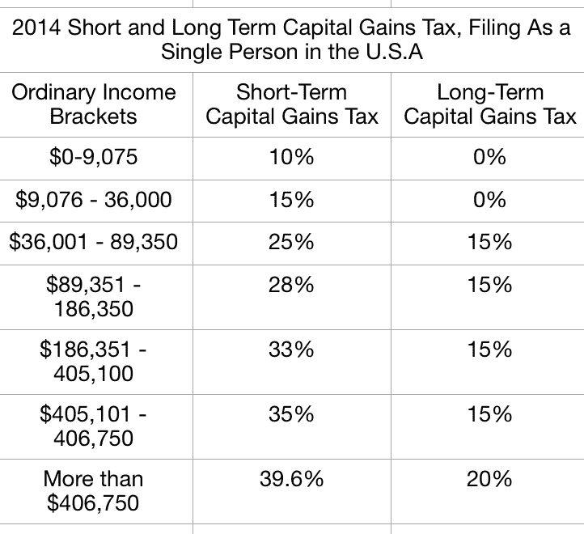
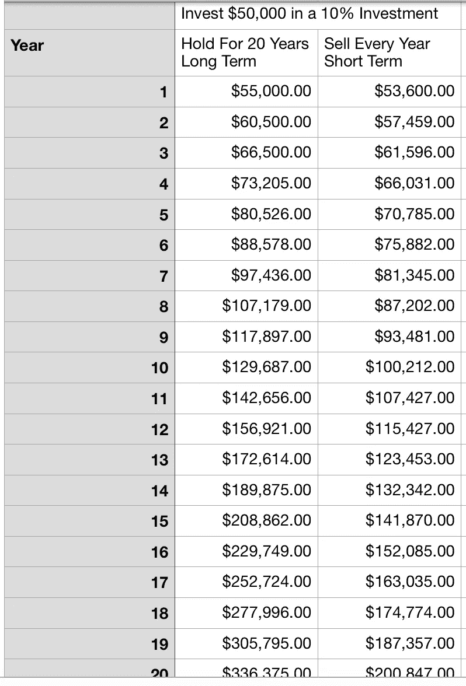
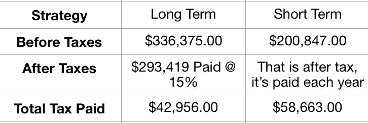

# 第四章——价值投资的原则和规则——第二部分

> 原文：<https://medium.datadriveninvestor.com/chapter-4-the-principles-and-rules-of-value-investing-part-2-9d9d33575d9d?source=collection_archive---------19----------------------->

Photo by [NeONBRAND](https://unsplash.com/@neonbrand?utm_source=medium&utm_medium=referral) on [Unsplash](https://unsplash.com?utm_source=medium&utm_medium=referral)

如果你是第一次读这本书，这是我从斯蒂格·布罗德森和普雷斯顿·皮什所著的《沃伦巴菲特会计》一书中得到的分析和见解。我想学习如何成功投资股票市场，我选择了这本书来帮助我。我很乐意听到反馈和评论，尤其是因为我正在学习，知识非常少。如果你接受我的财务建议，请知道你是在自担风险。

接下来是:

# 原则 2——公司必须有长远的前景

如果你还没有阅读原则 1 [，点击这里](https://medium.com/@kresimir_61514/chapter-4-the-principles-and-rules-of-value-investing-part-1-99bc1921230b)开始阅读

就像原则 1 有 4 条规则一样，原则 2 有两条规则:

## 规则 1 —持久性产品

## 规则 2——尽量减少税收

就像诺查丹玛斯投资一样，都是以某种方式预测未来。你要选择一家从现在起很多年后都相关的公司，而不仅仅是昙花一现的一次性产品创造者。相关性还会帮助你最小化拥有一家公司的税收，因为正如你将看到的那样，短期内买卖股票从长期来看会非常昂贵。

## 规则 1 —持久性产品

iPhone 还是安卓？这是我们今天辩论的一个常见问题。但价值投资者不会问这个问题。价值投资者会问，30 年后 iPhone 还会存在吗？

顺便说一句，这并不意味着苹果在 30 年内不会比以前更好，这只是意味着苹果正在创造的产品与可口可乐这样的公司相比更有可能过时。可口可乐正在全世界被人们饮用，并将继续这样做，它被淘汰或被另一个品牌取代的可能性要小得多。

没有工具可以确定 30 年后哪些产品会被使用，但沃伦巴菲特最喜欢的出发点是这个简单的问题:

**“互联网会改变我们使用产品的方式吗？”**

让我们看看这如何适用于苹果与可口可乐

互联网改变了我们使用手机的方式吗？你打赌。如果没有互联网，苹果甚至不会有 iPhone。可乐呢？互联网改变了我们使用它的方式吗？不，我们仍然打开容器喝它。这就是为什么对沃伦·巴菲特来说，可口可乐是一种更安全、更好的投资，它的可变性和风险更小。

从生理上来说，人类喜欢吃糖，这是不会改变的，我们已经并将继续几代人喝软饮料。另一方面，我们也一直在交流，并将继续这样做，只是不太清楚 30 年后，我们是否还会在苹果的设备上交流。

同样，这并不是说不要投资科技或购买可口可乐，而是用一个例子来发展你的价值投资思维。

## 规则 2——尽量减少税收

致富的公式包括两部分。

我们大多数人都熟悉的第一部分是——赚更多的钱。

第二种我们听说过，但可能更难做到——**花更少的钱。**

说到少花钱，我们会使用一些策略，比如确保关灯，吃冰箱里的所有东西，去特定的商店购物等等。这些都很好，但你最大的支出是你的税收。

如果你想存最多的钱，尽一切可能少缴税是明智的。

关于价值投资(或长期持有投资)的好消息是，随着时间的推移，它利用税收制度来帮助你最小化税收。如果你是日内交易者或者不长期持有投资，你要支付更高的税率。

I haven’t checked but I would bet that the numbers for Canada are higher

20 年后，短期资本收益增加了< one year.

Your tax rate is still determined by your income level. Based on the chart above if you earned $100,000 you would pay 28% if you sold your shares in under a year but only 15% if you held it for more than a year.

The system favours the long term investor and the good news is you only have to pay when you sell your asset. This means you can reap the benefit of your investment compounding and only pay the capital gains tax when you’re ready to sell.

Let’s look at a chart comparing a long term investor vs. a short term one and see how they compare.

Here is a chart summarizing the important information

There are two very important take aways from this chart

1.  The long term value investor paid less tax
2.  The long term value investor, remember they both started with the same amount at the same percent per year, ended up with **92，572** 美元。那是一大笔钱。

# 我的外卖

我以前看过类似的想法。那些提到长期持有期的，它如何帮助你保留更多的钱和支付更少的税。这一想法背后的力量(和节约)真的打动了我，因为我这次重新制作了书中的图表。

我仍然很难理解什么时候应该卖掉他们的股票？我知道这本书提到巴菲特最喜欢的持有期是永远，但你如何赚钱呢？

我希望后面的章节能回答这个问题。

*   K 博士

**PS 一如既往地希望听到您的想法和反馈。**

拿一本沃伦·巴菲特会计

[https://www . Amazon . ca/Warren-Buffett-Accounting-Book-Statements-ebook/DP/b 00k 2 in 8 ig](https://www.amazon.ca/Warren-Buffett-Accounting-Book-Statements-ebook/dp/B00K2IN8IG)

**查看我的视频日志**

[http://www . mylondonontariochiropactor . com/kresimir-jug-vlog/](http://www.mylondonontariochiropractor.com/kresimir-jug-vlog/)

**查看我的播客**

[http://www.mylondonontariochiropractor.com/podcast/](http://www.mylondonontariochiropractor.com/podcast/)