# 第四章——价值投资的原则和规则——第三部分

> 原文：<https://medium.datadriveninvestor.com/chapter-4-the-principles-and-rules-of-value-investing-part-3-8603074690b5?source=collection_archive---------12----------------------->

Photo by [Markus Spiske](https://unsplash.com/@markusspiske?utm_source=medium&utm_medium=referral) on [Unsplash](https://unsplash.com?utm_source=medium&utm_medium=referral)

如果你是第一次读这本书，这是我从斯蒂格·布罗德森和普雷斯顿·皮什所著的《沃伦巴菲特会计》一书中得到的分析和见解。我想学习如何成功投资股票市场，我选择了这本书来帮助我。我很乐意听到反馈和评论，尤其是因为我正在学习，知识非常少。如果你接受我的财务建议，请知道你是在自担风险。

希望你能发现这一切的价值——我知道我会的。我甚至已经开始为自己创建一个小文件夹，我最终会开始与你分享。

# 原则 3——一家公司必须稳定且易于理解

巴菲特的得力助手、亿万富翁查理·芒格(Charlie Munger)写了一本名为[的书，书中的一个核心教训(被反复重复)是“呆在你的能力范围内”，或者像巴菲特喜欢说的那样“如果你参加奥运会的 100 米比赛，你不需要擅长铅球。”](https://www.amazon.ca/Poor-Charlies-Almanack-Expanded-Hardcover/dp/1578645018/ref=sr_1_1?ie=UTF8&qid=1541499447&sr=8-1&keywords=poor+charlie%27s+almanack)

沃伦·巴菲特只投资他了解的稳定的公司。稳定性是他的老师本杰明·格拉哈姆教给他的主要课程，是试图降低风险。

甚至在我这一代，似乎也出现了各种新的‘令人兴奋’的投资机会；2000 年代的网络公司，比特币和区块链，以及现在的大麻公司。沃伦·巴菲特不会碰这些新机会，因为他不了解它们，而且它们还没有被证实。

以下是巴菲特关于稳定性和可理解性的两条规则:

## 规则 1——所有者收益带来稳定的账面价值增长

## 规则 2 —可持续的竞争优势

让我们马上开始，看看我们如何应用这两条规则去收购一些伟大的公司，赚些钱。

## 规则 1——所有者收益带来稳定的账面价值增长

根据 Forbes.com 的数据，每月有 543，000 家新企业成立。这不是很疯狂吗？那么他们都发生了什么呢？他们都失败了。失败是商业的重要组成部分。事实上，即使你的企业规模大到足以在证券交易所交易，也是一项了不起的成就，然而，即使是这些企业也经常失败。严格地说，作为一名企业家，我从来没有一种“我成功了”的感觉。你总是要努力工作。

你可以打赌，沃伦·巴菲特知道我刚才提到的所有事情，这就是为什么他对投机不感兴趣，他感兴趣的是赚钱和安全。

**我们如何衡量一只股票的稳定性？**账面价值(股本)和每股收益。

记住，企业的账面价值或权益实际上是所有者或股东的钱。公司的目标是增加股东的财富，这意味着增加资产或减少负债。

所有这些都必须来自收益。

当一家公司赚到钱时，它可以用这笔钱做三件事。

1.  购买更多资产
2.  清偿其负债或债务
3.  支付其所有者或股东(股息)

让我们回到我们虚构的咖啡店。假设你准备用自己的 1000 美元和从银行借的 500 美元开一家咖啡店。当你开始创业时，你的资产负债表是这样的:

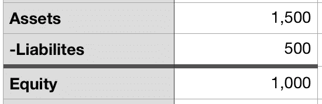

经过 6 个月的经营，你已经努力工作，并取得了 100 美元的利润。你现在有 100 美元的股本回报率，但你打算用这笔钱做什么？

让我们看看，如果你选择买一个更好的咖啡机，或者你选择偿还银行更多的钱，会发生什么。

让我们看看如果你买了新机器会发生什么:

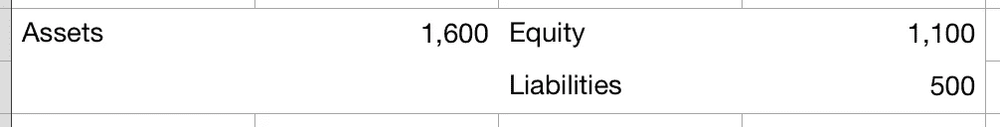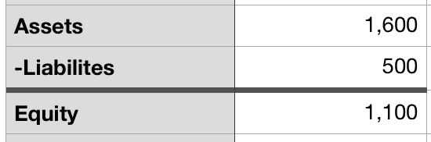

你购买的新设备价值更高，增加了你的资产，因此也增加了公司的股本。

如果你把这些钱用来还债，会发生什么？

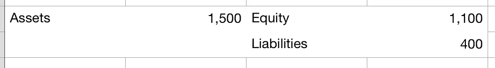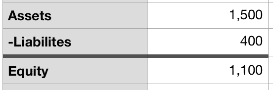

如你所见，选择为公司购买更有价值的东西或偿还债务都会增加股本。

在最后一个场景中，让我们看看当公司向所有者支付股息时会发生什么。股息是以现金支付的形式返还给所有者的收入(或部分收入)。假设这 100 美元中，25 美元作为股息支付，而 75 美元留在企业内部。现在的资产负债表是什么样的？

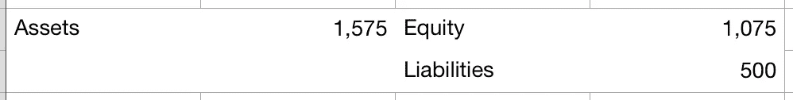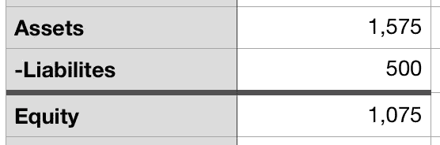

正如你所看到的，股票已经上涨，只是没有达到以前的水平。这就是为什么良好的管理对于运营一家成功且盈利的公司至关重要。年复一年拥有稳定的股本回报率是一回事，在大多数企业中，这已经是一项伟大的成就——知道如何利用这笔钱来进一步增加企业的价值是一项全新的技能。研究公司的历史以及公司的资金用途是很重要的。

那么我们的小咖啡店符合巴菲特的稳定法则吗？

让我们把咖啡店分成 100 股，这样账面价值(实际上就是股本/股份数)就是 1000/100 = 10 美元，记住这是每股的价值。我们还假设该公司已经将其收益进行了再投资，因此它将继续增长。这反映在一段时间内稳定的 EPS(每股收益)增长上。**如果公司保留盈利(应该能够看到账面价值的增长)，未来的盈利增长也应该增加。**

为了确保这种情况发生，检查净资产收益率，确保它是恒定的，甚至是增长的。如果你看下面的图表，你会发现净资产收益率是恒定的，而账面价值和每股收益稳步增长。记住 ROE 是你花钱买的东西。

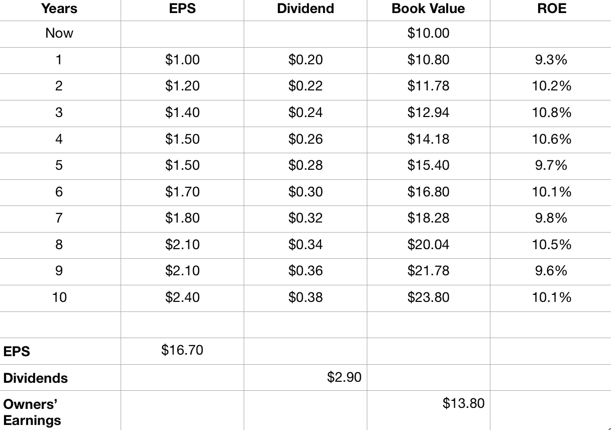

Chart of a 10 year period for the coffee shop

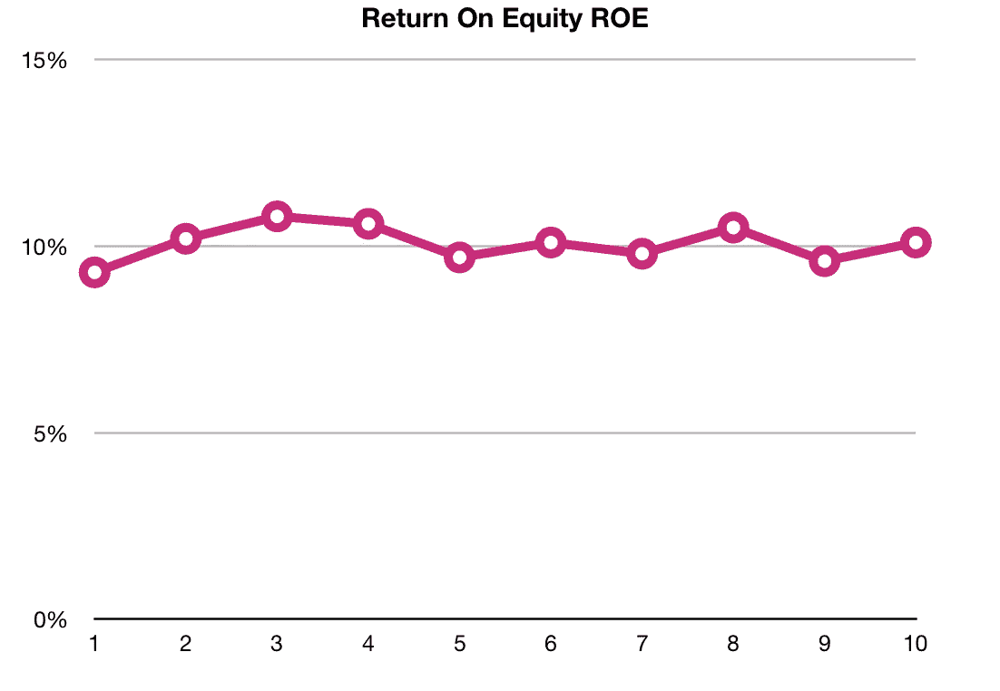

Graphical representation of Return On Equity

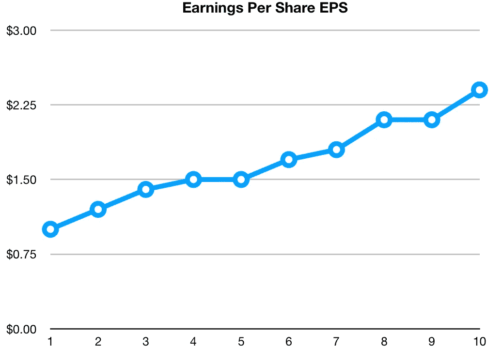

Graphical representation of Earnings Per Share

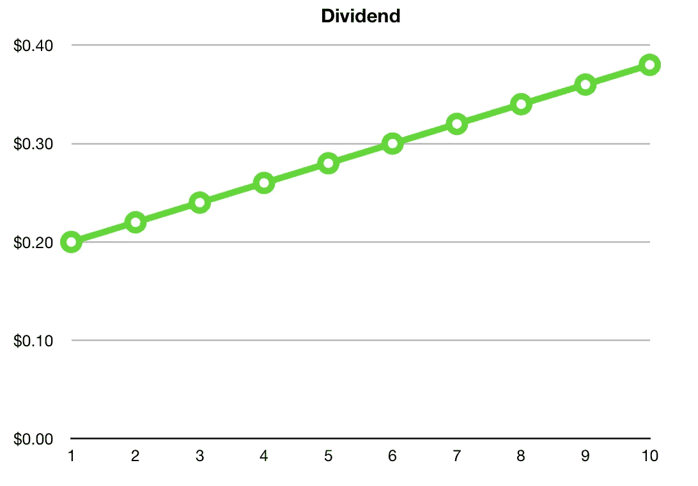

Graphical representation of the Dividend

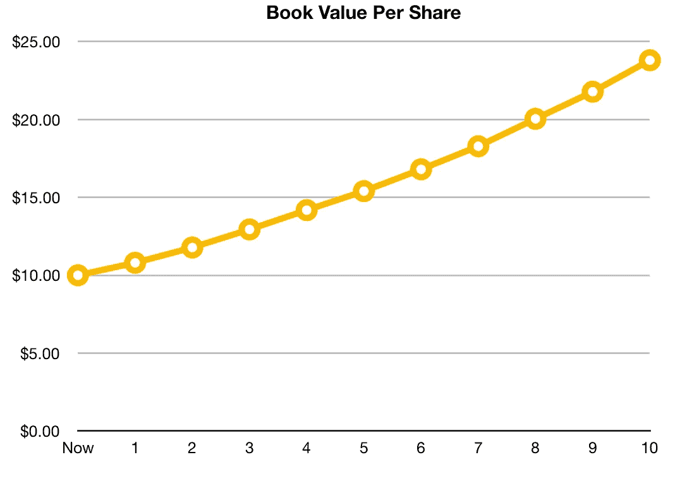

Graphical representation of Book Value

正如你所看到的，当然这是一个非常清晰的例子，但你可以拟合出 10 年来的完美趋势线，作为一个投资者，这就是沃伦·巴菲特所寻求的，稳定而可预测的增长。

当然，历史不会总是重演，正如巴菲特自己的名言

> "如果游戏中只有过去的历史，那么最富有的人应该是图书馆员."

但这是使投资尽可能稳定和风险最小化的基础。

## 规则 2 —可持续的竞争优势

沃伦·巴菲特喜欢谈论竞争优势，就像它是城堡周围的护城河一样。敌人的企业会试图攻击你的企业，但如果你的企业周围有一条宽阔的护城河，他们就不会成功。

创建或测量护城河没有单一的公式，有许多不同的类型:

沃尔玛可以购买如此大量的商品，以至于它的护城河是由他们可以支付的价格创造的，并因此出售给公众

苹果的护城河建立在它的品牌和一切都适合的事实上。

星巴克是一个可以买到高质量咖啡的地方。

如果我要开一家健身房，没有什么能阻止任何人在我旁边开另一家健身房，但如果我要把我的健身房命名为 CrossFit，这将对更多人有意义，他们会选择我的健身房(即使产品可能是一样的)，因为他们认识这个名字。

尽管找到定量方法来测量护城河很有挑战性，但这里有三个需要注意的一般类别:

1.  无形资产。比如品牌和知识产权。想想星巴克、迪士尼、耐克……任何有人看到一个角色或标志，立刻就能认出它，并把它与积极的东西联系在一起的东西。
2.  成本低。我认为没有比沃尔玛或好市多更好的例子了。因为这些公司可以购买如此大量的商品(在我写这篇文章时，沃尔玛仍然是世界上最大的零售商)，他们可以向美国消费者提供更便宜的价格。
3.  高转换成本或粘性。我是苹果迷。虽然，我必须说我发现新的谷歌手机非常有趣。然而，当我听说把所有东西从 iPhone 换成新手机的噩梦时，这巩固了我坚持使用苹果的立场。许多人，包括我自己，都不想转而学习一个新系统。他们觉得这很有挑战性。

# 我的外卖

我很喜欢这一章的第一部分，尤其是关于净资产收益率和企业如何增值的部分。理解收益有多重要以及这些收益的再投资是如何进行的是很有帮助的。

*   K 博士

PS 一如既往地希望听到您的想法和反馈。

拿一本沃伦·巴菲特会计

[https://www . Amazon . ca/Warren-Buffett-Accounting-Book-Statements-ebook/DP/b 00k 2 in 8 ig](https://www.amazon.ca/Warren-Buffett-Accounting-Book-Statements-ebook/dp/B00K2IN8IG)

**查看我的视频日志**

[http://www . mylondonontariochiropactor . com/kresimir-jug-vlog/](http://www.mylondonontariochiropractor.com/kresimir-jug-vlog/)

**看看我的播客**

[http://www.mylondonontariochiropractor.com/podcast/](http://www.mylondonontariochiropractor.com/podcast/)