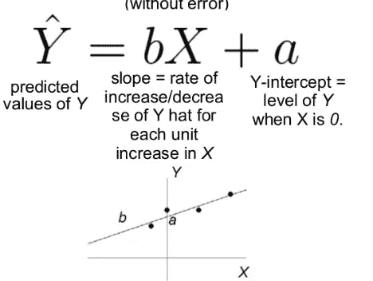
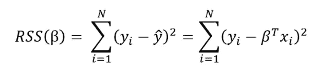
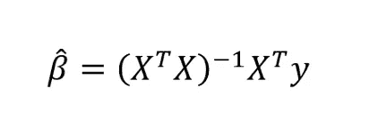
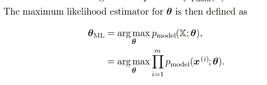
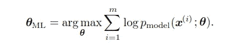
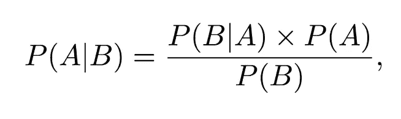
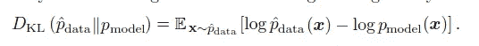

# 频率主义者 vs 贝叶斯辩论

> 原文：<https://medium.datadriveninvestor.com/chapter-5-machine-learning-basics-part2-69721bf70c7f?source=collection_archive---------2----------------------->

这个故事是的续集

 [## 第五章:机器学习基础

### 这个故事是我从伊恩·古德菲勒、约舒阿·本吉奥和亚伦·库维尔的《深度学习》一书中总结出来的直觉

medium.com](https://medium.com/@omaraymanomar/chapter-5-machine-learning-basics-26c64412b42e) 

# 一些统计数据

*   [随机变量(Random variable)](https://en.wikipedia.org/wiki/Random_variable)—在统计学中，随机变量是一个变量，其可能值是随机事件的结果。因此，随机变量的每个可能值都有一定的概率来表示这些值的可能性。
*   [概率分布](https://en.wikipedia.org/wiki/Probability_distribution)——定义随机变量不同结果/值的概率的函数。连续概率分布用概率密度函数来描述，而离散概率分布可以用概率质量函数来表示。
*   [条件概率](https://en.wikipedia.org/wiki/Conditional_probability) —这是一个事件 A 的概率$P(A|B)$的度量，假设另一个事件 B 已经发生。

# 频率主义者 vs 贝叶斯辩论

这两种方法之间最简单的区别在于，频率主义方法仅估计 1 个点，而贝叶斯方法估计模型权重的分布和标签的分布(多于一个点)

## 频繁线性回归

线性回归的 frequentist 观点可能是您在学校中熟悉的观点:该模型假设响应变量(y)是权重乘以一组预测变量(x)的线性组合。完整的公式还包括一个误差项，以说明随机采样噪声。例如，如果我们有两个预测值，等式是:

其中 y 是估计点(标签), x 是数据点，a 是所谓的偏差。

 [## 金融中的机器学习|数据驱动的投资者

### 在我们讲述一些机器学习金融应用之前，我们先来了解一下什么是机器学习。机器…

www.datadriveninvestor.com](https://www.datadriveninvestor.com/2019/02/08/machine-learning-in-finance/) 

从训练数据学习线性模型的目标是找到最好地解释数据的系数β。在 frequentist 线性回归中，最好的解释是指最小化残差平方和(RSS)的系数β。RSS 是已知值(y)和预测模型输出(ŷ，发音为 y-hat，表示估计值)之间的总平方差。残差平方和是模型参数的函数:

对训练集中的 N 个数据点求和，以矩阵形式表示的封闭形式的解是

这种方法基于β的最大似然估计，现在我想给你一个通用公式，适用于任何基于估计最大似然的模型，而不仅仅是线性回归。

考虑从 X0 到 X10 的数据，下面你可以找到估计权重θ的等式

> 由于各种原因，本产品在许多情况下可能会不方便。例如,容易出现数值下溢/上溢，我们观察到，取可能性的对数不会改变其 arg max，但会方便地将乘积转换为 sum

于是方程转化成了这个形式！

因此，我们经常听到模型权重应该最大化某个标签的对数似然性，这就是为什么我们在对话中听到“日志”只是为了缓解值的下溢问题

# 贝叶斯统计

这种方法很简单，因为它不是像前一种方法那样为权重(w)估计一个值，而是我们有一组(分布)权重，我们给出一组(分布)预测的输出，并为这些预测和权重分配一定程度的确定性。

## 贝叶斯思维

想象一下这样一种情况，你的朋友给你一枚新硬币，问你硬币的公平性(或者观察人头的概率)，连硬币都没有抛一次。事实上，你也意识到你的朋友没有让硬币产生偏差。一般来说，你已经看到硬币是公平的，因此你期望观察正面的概率是 0.5 美元。在没有任何此类观察的情况下，你只能利用你过去的经验或对硬币的观察来断言硬币的公平性。

假设你被允许掷硬币 10 次，以确定硬币的公平性。你从实验中观察到的情况属于下列情况之一:

*   **案例 1** :观察 5 美元正面和 5 美元反面。
*   **案例 2** :观察$h$正面和$10-h$反面，其中$h\neq 10-h$。

如果观察到情况 1，你现在更确定这个硬币是公平硬币，你会更有信心地决定观察到正面的概率是 0.5 美元。如果观察到情况 2，您可以:

1.  忽略你先前的信念，因为现在你有了新的数据，仅仅依靠最近的观察来决定观察头的概率是$h/10$。
2.  根据你刚刚观察到的$h$的值来调整你的信念，并用你最近的观察来决定观察头的概率。

第一种方法建议我们使用频率主义方法，在这种方法中，我们在做决定时忽略我们的信念。然而，第二种方法似乎更方便，因为 10 美元硬币不足以确定一枚硬币的公平性。因此，通过结合我们最近的观察和从过去的经历中获得的信念，我们可以做出更好的决定。正是这种思维模式使用了我们最近的观察以及我们的信念或批判性思维的倾向，这就是所谓的贝叶斯思维。

贝叶斯学习现在被广泛用于机器学习模型中，

*   回归模型(如线性、逻辑、泊松)
*   分层回归模型(如[线性混合效应](https://github.com/tensorflow/probability/blob/master/tensorflow_probability/examples/jupyter_notebooks/Linear_Mixed_Effects_Models.ipynb)、[混合/分层回归](https://docs.pymc.io/notebooks/GLM-hierarchical.html)
*   混合模型(例如[高斯混合模型](https://github.com/tensorflow/probability/blob/master/tensorflow_probability/examples/jupyter_notebooks/Bayesian_Gaussian_Mixture_Model.ipynb)
*   深度指数族(例如，深度潜在高斯模型)
*   线性动态系统(例如，状态空间模型、隐马尔可夫模型)

# 贝叶斯定理

在介绍贝叶斯推理之前，有必要了解一下贝叶斯定理。贝叶斯定理真的很酷。它的有用之处在于，它允许我们使用一些我们已经拥有的知识或信念(通常称为*先验*)来帮助我们计算相关事件的概率。例如，如果我们想找出在炎热晴朗的日子里卖冰淇淋的概率，贝叶斯定理为我们提供了工具，让我们利用先验知识来判断在任何其他类型的日子里(下雨、刮风、下雪等)卖冰淇淋的概率。).我们稍后会详细讨论这一点，所以如果你还不明白，请不要担心。

# 数学定义

数学上，贝叶斯定理被定义为:

# 贝叶斯定理是如何让我们整合先验信念的？

上面我提到了贝叶斯定理允许我们整合先验信念，但是仅仅通过上面的等式很难看出它是如何允许我们这样做的。因此，让我们看看如何使用上面的冰淇淋和天气示例来实现这一点。

让 A 代表我们卖冰淇淋的事件，B 代表天气的事件。然后我们可能会问*在给定的天气类型下，某一天卖出冰淇淋的可能性有多大？数学上，这被写成 P(A =冰淇淋销售额| B =天气类型),相当于等式的左边。*

右手边的 P(A)是被称为**先验的表达式。**在我们的示例中，这是 P(A =冰淇淋销售额)，即不管外面的天气类型如何，销售冰淇淋的(边际)概率。P(A)被称为先验，因为我们可能已经知道冰淇淋销售的边际概率。例如，我可以查看这样的数据:潜在的 100 人中有 30 人实际上在某个地方的某个商店购买了冰淇淋。所以我的 P(A =冰淇淋销售额)= 30/100 = 0.3，*在我对天气*一无所知之前。这就是贝叶斯定理允许我们整合先验信息的方式。

# 对分布使用贝叶斯定理

到目前为止，我上面给出的例子都是用一个数字来表示贝叶斯定理方程中的每一项。这意味着我们得到的答案也是个位数。但是，也可能有单个数字不合适的时候。

回到机器学习，以卖冰淇淋的概率为例，给定一个先验知识，在晴天卖冰淇淋的概率= 0.3，但如果这只是最好的猜测呢，如果有一个介于 0.25 到 0.3 之间的估计裕量呢，这就是我所说的，只要给每个估计一个分布裕量，它在线性回归中也有效，还记得这个等式吗？y = bx + c，如果我们的模型估计 b 在 0.4 到 0.6 的范围内，这将我们引向预测范围，那么我为什么要使用这个，让我告诉你，当一个领域专家有一个数据，他认为他理解得足够了，这就是所谓的先验知识，所以给他一个最佳权重范围和最佳预测范围，他现在可以选择他所面临的问题的最佳参数(权重)，这在机器学习中被广泛使用。贝叶斯模型平均是一种常见的监督学习算法。朴素贝叶斯分类器在分类任务中很常见。贝叶斯最近被用于深度学习，它允许深度学习算法从小数据集学习。

## 将经典频率主义线性模型转化为贝叶斯模型

这里的不同之处在于，现在每个变量都有自己的分布(一组值)，而不是用一个值来表示每个变量

1.  b—正态分布
2.  a —正态分布

## 学问

它只是最小化数据分布和任何模型的默认高斯分布的差异。实际上，这种不同是通过 KL 散度来衡量的

再次记录实际上使用对数很有帮助，可以缓解我们之前讨论的问题，所以这里的散度只是数据分布和模型之间的差异。如果你需要更多关于 KL divergence 的信息，查看这个博客

 [## 揭开 KL 分歧的神秘面纱

### KL 代表什么？它是一种距离度量吗？衡量两个概率的相似性是什么意思…

medium.com](https://medium.com/activating-robotic-minds/demystifying-kl-divergence-7ebe4317ee68) 

在下一篇博客中，我们将探索使用 Python 语言和 [PyMC3](http://docs.pymc.io/) 概率编程框架实现基于贝叶斯推理的模型。

这一章将在另一个故事中完成，我将从内部谈论监督和非监督算法！

谢谢

## 信用

 [## 贝叶斯线性回归简介

### 解释线性建模的贝叶斯方法

towardsdatascience.com](https://towardsdatascience.com/introduction-to-bayesian-linear-regression-e66e60791ea7)  [## 机器学习的贝叶斯学习:第二部分——线性回归

### 本系列文章的第一部分介绍了贝叶斯学习。基于这种理解，我们将继续…

wso2.com](https://wso2.com/blog/research/part-two-linear-regression)