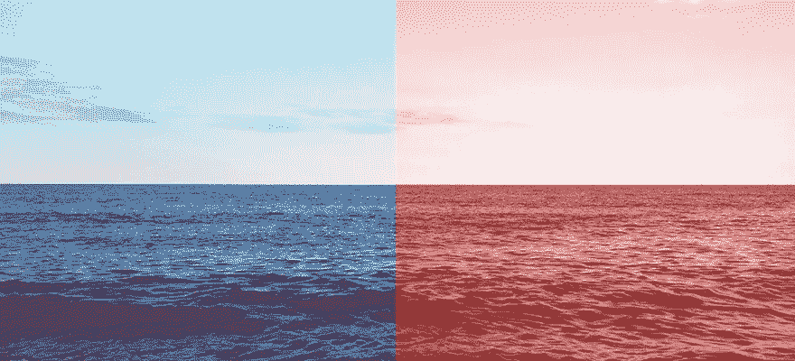

# 第七章，创新走出红海

> 原文：<https://medium.datadriveninvestor.com/chapter-7-innovating-your-way-out-of-a-red-ocean-7b2ce235e1ff?source=collection_archive---------23----------------------->

最后，我被一个新的问题困扰着。即使以我的标准来看，我的意思是我完全沉迷于史诗般的比例。在过去的两年里，时差一直是我谈论和思考的话题。这是我醒来时想到的第一件事，也是入睡前想到的最后一件事。我真的梦到过。事后看来，从制造业和监管的角度来看，我选择了最难启动的初创企业之一。和大多数事情一样，我很欣慰我当时不知道我现在知道的事情，否则我可能永远不会开始。你必须热爱创业之旅！

为什么要倒时差？我记得在我早期的职业生涯中，我曾让银行家们环游世界，进行为期数周的融资路演。现在我想知道他们在旅途中的健康状况。在我为他们安排的紧张日程下，他们的精神和身体表现如何？几年后，我的私人训练客户努力在旅途中保持健康。有一个真正的问题需要解决。公路战士需要我的帮助。

我预计一个新的健康利基——旅行健康——将在两到三年后出现。我可以清楚地看到它的到来，但这个世界还没有准备好。时差是一个基本问题，但奇怪的是，旅行者还没有准备好采取解决方案。为什么？因为他们不相信有。他们认为时差是旅行的副产品。我需要创新的航空公司来帮助塑造这个类别，以展示健康旅行的可能性。

没有旅行者愿意浪费时间感到疲劳，但休闲旅行者没有像商务旅行者那样的紧迫感去进行认知活动。在更高的层次上为压力重重的出差族服务，使我能够深入到一片非常蓝的海洋中，这片海洋源于拥挤的红海——健康产业。这是一个小众但很大的市场，有一个很强的痛点。商务旅行市场规模庞大，一个非常现实的问题每年让英国企业损失 2.41 亿英镑。

我发现了一个真正的问题，但我需要更深入地了解和体验这种痛苦，而不仅仅是凭记忆。我不相信你不先经历问题就能创新解决问题的方案。我不得不回到问题的源头，企业界，去“忍受痛苦”。这将是痛苦的，但却是有目的的，所以也是可以忍受的。

在一家全球顶级高管猎头公司，我遇到了许多首席执行官，他们向我讲述了他们的旅行健康问题，包括他们的生理节奏、睡眠模式、疲劳、压力，最重要的是，时差如何影响他们回国后的家庭生活。我打开了一个巨大的蠕虫罐头。有许多问题，和往常一样，我有太多的想法。

维珍航空友好地让我在他们的希思罗俱乐部休息室呆了 3 天，在那里我随意地聊天和采访常旅客，以了解他们在旅途中的健康问题，并找出我如何能帮助他们。喷气机乘客，尤其是男人，很乐意交谈。

我开始检查首席执行官的旅行日程。我建议什么时候醒着和睡着，乘坐什么航班来减少时差，什么时候，在哪里以及如何锻炼。我会直接和厨师谈，为客户的晚餐安排具体的食物，他们的房间是一个睡眠实验。我会在他们的迷你酒吧里放上健康的零食，帮助睡眠，增加能量和认知功能。我会安排在他们的浴室里安装维生素 C 淋浴器，PT 会带着亲手送来的蛋白奶昔和他们在纽约中央公园训练。这是礼宾、个人培训、健康指导和个人助理工作的高级组合。

当我的客户到达时，酒店期望版税。结果很好。客户们经历了有史以来最棒的商务旅行，他们说他们的精神和身体都比以往任何时候都要强壮。但这很费时间，需要几天时间来证明一个时间表是健康的，然后它会在最后一分钟改变。我需要来自世界各地的航空健康专家的帮助。无法扩展，虽然技术可能会有所帮助，但会消除服务的个人化、个性化，我无法同时为多名游客提供服务。

我有很多缓解时差的方法，我必须选一个。考虑到全球可扩展性，我选择创新一个可消费的产品系列。我雇佣了一个航空医学专家团队，由伊恩·佩里博士领导，他与国王学院的航空医学系(国王学院再次令人放心地出现)、营养学家和认知专家有联系。我们一起从生理上确定了在高海拔地区会发生什么。在营养学家的帮助下，这项科学推动了我们消费品的创造。我们的 USP 一直是只使用对旅行中的身体有益的成分。虽然这听起来很明显，但许多旅行尺寸的健康产品并不适合这一目的，它们只是被倒入较小的旅行友好型包装中。

最初，我试图创造一个类似于赫斯顿·布鲁门塔尔为君主航空公司创造的情绪食品盒的概念。虽然它被奇怪地定位在经济舱而不是商务舱，并在他们破产的那个星期推出，但从概念上讲，它是合理的。

整个夏天，我和我的营养师都在尝试制作健康的零食，其中含有对旅行中的身体有益的成分。东西在不应该融化的时候融化了，面筋(魔鬼)需要将配料粘合在一起，尝起来美味的东西看起来肯定不好吃。似乎什么都不管用。赫斯顿是如何阻止他的木炭、椰子冰淇淋在高海拔融化的？也许他有我们没有的特殊烹饪能力。根据记录，创造一种健康的高原友好型零食是一个相当大的挑战，更不用说一盒 6 个了。我不得不重新思考。如果我们将含有矿物质和维生素的成分混合到一个更有利于旅行的机制中会怎么样？辅食！

新的主张是创造一个补充产品系列，以帮助缓解旅行疲劳，重点是长途旅行中失调的 6 种健康功能。它被命名为 15 度，因为地球每小时旋转 15 度经度，这是一个时区的测量值(大多数喷气式飞机在 15 度的仰角起飞)。在佩里博士的悉心指导下，我正在成为一名航空迷。

市场上已经有一些廉价的大众市场的非自然时差饮料(不要让我开始谈论这些，那是另一篇博文)。没有什么能真正帮助总是在旅途中、要求高质量结果的有眼光的旅行者。

我很兴奋。我又觉得自己是一个成功的企业家了。我把自己从一个充满鲨鱼的令人沮丧的血腥的红色海洋中导航出来，进入一个充满海豚的蓝色海洋，更重要的是，希望和机会。我的新使命与我最初的使命相差不远，那就是让人们健康，只是这一次，当他们在旅行的时候。这是一个新的领域，一个我发现没有太多竞争的领域。我这么说是轻率的，但是项目进行了 18 个月，我知道缺乏竞争，因为大多数人现在已经放弃了。谢天谢地，我太痴迷了。我面临的每一个挑战都在精神上把我推向极限，这只是给一个非常有动力和决心的企业家火上浇油。毕竟，这并不容易。

我不想成为第一个上市的公司，否则我会再次冒险过早上市。我需要市场跟上。我需要竞争，否则我会因为时机不对而再次失败。

宇宙永远支持你。这个世界还没有为我的创新做好准备，所以为了防止我失败和过早推出，我花了 18 个月的时间将我的想法付诸实践。制造之旅极具挑战性，但它阻止了我更快进入市场。

这是另一场无情的斗争，但也是一次迷人的旅程。我每天都在蜕皮，更不用说一个星期了，为了把这个产品推向市场，我需要成为这样的人。

和我一起踏上旅程，看看接下来发生了什么。