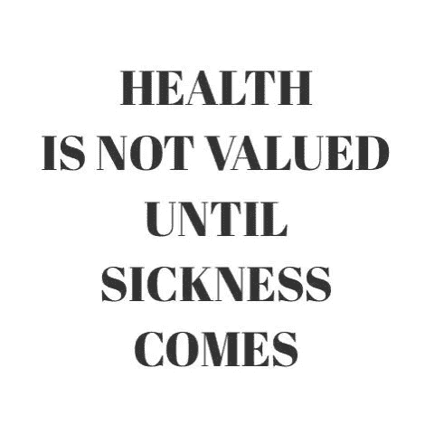

# 第 8 章，健康企业家不是不可战胜的

> 原文：<https://medium.datadriveninvestor.com/chapter-8-wellness-entrepreneurs-are-not-invincible-ed15b513f930?source=collection_archive---------22----------------------->

我开始觉得有点不舒服。如果你生病了，并且在健康行业工作，人们喜欢强调讽刺。可悲的是，我们不是不可战胜的。时机令人恼火。我刚刚构思出下一次创业的新想法，我不想被任何人打断。企业家从来没有时间生病，他们不能证明放慢速度的时间是正当的。

这一切都是从持续的喉咙痛开始的，后来发展成非常沙哑的 Mariella Frostrup 声音。几个月来，包括一系列草药疗法和博姿出售的所有东西都没有用，我被迫去看耳鼻喉科专家。为了削减成本，我好几次差点取消了我的私人医疗保险。不情愿地，我意识到这实际上不是一种奢侈品，并保留了它，感谢上帝我这样做了，因为接下来要发生的事情花费了一大笔钱。

喉咙痛持续存在。奇怪的是，到了午饭时间，我的声音又出现了。几个月来每天都是这样。在我心爱的巴里训练营的一个午餐时间，我真的从跑步机上摔了下来，再也跑不动了。我离开了教室，躺在红色房间外的长椅上，主要是因为我错过了一堂昂贵的 20 英镑的课。我真的什么都做不了，不仅仅是我的声音，我觉得我正在失去我的超能力，我的能量。

我去看了更多的耳鼻喉科专家(他成了我的新男友)，用摄像机在我的鼻子和喉咙里做了很多测试(这很痛苦)，我们终于有了诊断。**无声的胃酸倒流，GERD** 。

什么？

我从来没有消化不良或胃灼热。除了声音问题，我没有任何症状。我一生中从未抽过烟，也从未吸过毒。我超级健康，有腹肌为证。我对我的食物有些神经质，我过去不喝酒，现在也不喝酒(好吧，我整个 20 岁都是醉醺醺的，但每个人不都是这样吗？).我是，或者至少我认为我是，有史以来最健康的，那么为什么会发生这种情况呢？

我傲慢地告诉伦敦最好的耳鼻喉科专家之一，他错了。但是无声反流仅仅意味着，你不需要经历消化不良或胃灼热就有这种情况。我不同意认为我知道得更多。我决定通过调整我的脉轮(我不好意思写这个)和改变我的营养来自然治愈自己。

几个月后，我还是生病了，事实上更糟了。我带着一盒巧克力和一张手写的便条回到我的耳鼻喉科医生那里，向他深深道歉，并表示他知道得最清楚。他让我做什么我就做什么。现在怎么办？

我被安排住进了玛丽波恩的格蕾丝公主医院。这一次，我连续 24 小时进行测试，以测量从我的胃流入我的食管的 pH 值(或酸的量)。我不得不躺下，坐起来，试着吃东西，所有这些都是在我的喉咙里有一个摄像头。没有麻醉剂。我很痛苦，但更沮丧的是不能工作。当摄像机进入我的食道时，当我呕吐时，红灯开始闪烁，机器开始发出哔哔声。

连我都知道这不好。从上下文来看，正常的食管 pH 值被认为接近 pH 值 **7.0** 。几秒钟之内，我的就测到了 **66。**

当我面临问题时，我想要解决方案，并且喜欢立即采取行动。这一次也不例外。测试显示我的食道底部没有括约肌(你的身体需要它来阻止酸回到你的喉咙里)。这导致我失声，尤其是在早上我躺下睡觉后，胃酸会回流到我的喉咙里。谁知道呢？

不是一个好的结果，但是让我们尽快解决这个问题，这样我就可以回去工作了。

后来发现我一直都有这个问题，一次误诊导致我在 20 岁的时候切除了扁桃体，但这并不是解决问题的办法。现在我 40 岁了，在不知不觉中，我一生都在默默地面对这个问题。可怕的是，这可能会造成相当大的损害，即**巴雷特食管**，这是一种有时会发展成下食管癌的情况。

为了确定我是否患有巴雷特氏症，我必须对我的食管进行活检。压力很大(我没有认真阅读文件)，我从萨福克开车到伦敦，想着在“快速”测试后开车回克拉彭的家。

我很生气，因为它占用了我更多的时间。我的胃外科医生意识到了这一点，所以为了让我平静下来，他让我告诉他所有关于时差的事情。太好了，我终于可以工作了。我开始漫无边际地谈论时区变化和免疫系统，一分钟前我还醒着，一分钟后我就不醒了。我什么都不记得了，只记得在另一个房间醒来，他抚摸着我的胳膊告诉我，幸运且令人惊讶的是，我没有得巴雷特综合症。

我坐着哭了。我当然没有，我是幸运的。真是如释重负。现在我可以回去工作了吗？

我很困惑，松了口气，显然 24 小时不允许开车(我不得不找个朋友来救我)。一个星期后，我变得咄咄逼人，我觉得很烦人，因为我想知道接下来会发生什么。我坐在哈利街，看着我的外科医生画胃的示意图，并解释说只有两种方法可以解决这个问题。

首先，我可以服用质子泵抑制剂来阻止我胃里的胃酸分泌。它们是减少酸产生的最有效的药物，但我不想减少我的酸，因为那有其他副作用。我希望我的胃酸水平保持不变，我只是希望它保持在正确的位置，即我的胃，而不是我的喉咙。显然，这是行不通的。我恼火地打消了这个想法，没让他说完，这不是答案。很快，我需要他告诉我第二个选择，因为这是我剩下的一切。不管我喜不喜欢，第二种选择正在发生。

一个**基金化操作**。提示大量的图表需要，因为我不明白。

令人惊讶的是，你的身体有不需要的多余部分。在这个手术中，他会把我胃的上部(胃底)包在我食道的底部(就像衬衫的领子一样),然后松散地缝合在适当的位置，使神经末梢能够打开和关闭它。这并不是说我的括约肌松开了，这是可能发生的，我从来没有过，所以我不得不再次学习进食和吞咽。我还得了食道裂孔疝，我的胃一直向上进入我的胸腔，所以他也会把这些都推回去。任务完成。

太棒了，这就是解决方案，现在我们多快能完成？这是周三下午晚些时候，手术是每周五进行。他问我什么时候觉得自己在“心理上”做好了接受手术的准备。我马上回答‘这个星期五怎么样’？

他警告我要花更多的时间考虑，以确保我确信这是一个正确的决定。我有什么选择？我说服了他，如果我答应认真考虑这件事的话，就在下周五给我预约。

那是圣诞节前的一个月。我牺牲了圣诞午餐，换来了类似婴儿食品泥的东西，但至少我会在新年伊始把这个问题从待办事项清单上划掉。事后看来，我并没有完全理解其中的复杂性。我本可以花更多的时间研究和心理准备，但这怎么能改变现状呢？这就像蹦极和创业一样，增加时间要么增加恐惧，要么推迟行动。两者都不积极。

所以我们在 11 月 15 日出发。没有什么比让你的大脑制造恐惧更好的了。麻醉师会让我完全麻醉吗？如果我在整个手术过程中一直醒着，却不能告诉他们，我会醒过来吗？我还能见到我的家人吗？

我很害怕(我通常不会表现出这种情绪)。我开始哭了。当泪水顺着我的脸颊流下时，我的外科医生(他很了解我)说:

“来吧，幸运小姐，告诉我所有关于时差的事情，我需要知道该怎么做，因为我将在几周内旅行，只有你能帮助我”..我又要走了…

然后我醒了，一切都结束了。不可否认，手术后大约 4 周，我都是蹲着，不能站直。我的胃看起来像一个射击驱动器，因为这都是由关键的整个手术。

但至少已经完成了。

生活就是这么奇怪。此刻的痛苦会被归档，不带任何情感，作为未来的记忆。当今天的恐惧结束时，它们甚至不会进入你未来的想法。

我一直认为没有什么比你的健康更重要，没有健康就什么都不是，但大多数人只有在冒着失去健康的风险时才会珍惜它。医生和外科医生是最了不起的人，他们技术高超，聪明绝顶，我对他们都心存敬畏，并学会了不与他们争论。

恢复花了很长时间。现在，我只是庆幸自己熬过来了。

多么奇怪的一年结束了..